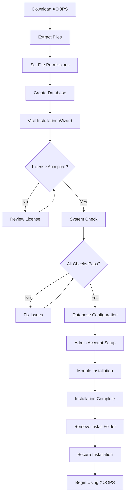

# Hướng dẫn cài đặt XOOPS hoàn chỉnh

Hướng dẫn này cung cấp hướng dẫn toàn diện để cài đặt XOOPS từ đầu bằng trình hướng dẫn cài đặt.

## Điều kiện tiên quyết

Trước khi bắt đầu cài đặt, hãy đảm bảo bạn có:

- Truy cập vào máy chủ web của bạn thông qua FTP hoặc SSH
- Quyền truy cập của quản trị viên vào máy chủ cơ sở dữ liệu của bạn
- Một tên miền đã đăng ký
- Yêu cầu máy chủ đã được xác minh
- Có sẵn công cụ sao lưu

## Quá trình cài đặt



## Cài đặt từng bước

### Bước 1: Tải XOOPS

Tải xuống phiên bản mới nhất từ [https://xoops.org/](https://xoops.org/):

```bash
# Using wget
wget https://xoops.org/download/xoops-2.5.8.zip

# Using curl
curl -O https://xoops.org/download/xoops-2.5.8.zip
```

### Bước 2: Giải nén tập tin

Giải nén kho lưu trữ XOOPS vào web root của bạn:

```bash
# Navigate to web root
cd /var/www/html

# Extract XOOPS
unzip xoops-2.5.8.zip

# Rename folder (optional, but recommended)
mv xoops-2.5.8 xoops
cd xoops
```

### Bước 3: Đặt quyền cho tệp

Đặt quyền thích hợp cho các thư mục XOOPS:

```bash
# Make directories writable (755 for dirs, 644 for files)
find . -type d -exec chmod 755 {} \;
find . -type f -exec chmod 644 {} \;

# Make specific directories writable by web server
chmod 777 uploads/
chmod 777 templates_c/
chmod 777 var/
chmod 777 cache/

# Secure mainfile.php after installation
chmod 644 mainfile.php
```

### Bước 4: Tạo cơ sở dữ liệu

Tạo cơ sở dữ liệu mới cho XOOPS bằng MySQL:

```sql
-- Create database
CREATE DATABASE xoops_db CHARACTER SET utf8mb4 COLLATE utf8mb4_unicode_ci;

-- Create user
CREATE USER 'xoops_user'@'localhost' IDENTIFIED BY 'secure_password_here';

-- Grant privileges
GRANT ALL PRIVILEGES ON xoops_db.* TO 'xoops_user'@'localhost';
FLUSH PRIVILEGES;
```

Hoặc sử dụng phpMyAdmin:

1. Đăng nhập vào phpMyAdmin
2. Nhấp vào tab "Cơ sở dữ liệu"
3. Nhập tên cơ sở dữ liệu: `xoops_db`
4. Chọn đối chiếu "utf8mb4_unicode_ci"
5. Nhấp vào "Tạo"
6. Tạo người dùng có cùng tên với cơ sở dữ liệu
7. Cấp mọi đặc quyền

### Bước 5: Chạy Wizard cài đặt

Mở trình duyệt của bạn và điều hướng đến:

```
http://your-domain.com/xoops/install/
```

#### Giai đoạn kiểm tra hệ thống

Trình hướng dẫn kiểm tra cấu hình máy chủ của bạn:

- Phiên bản PHP >= 5.6.0
- Có sẵn MySQL/MariaDB
- Các phần mở rộng PHP bắt buộc (GD, PDO, v.v.)
- Quyền thư mục
- Kết nối cơ sở dữ liệu

**Nếu kiểm tra không thành công:**

Xem phần #Các vấn đề về cài đặt thông thường để biết giải pháp.

#### Cấu hình cơ sở dữ liệu

Nhập thông tin xác thực cơ sở dữ liệu của bạn:

```
Database Host: localhost
Database Name: xoops_db
Database User: xoops_user
Database Password: [your_secure_password]
Table Prefix: xoops_
```

**Lưu ý quan trọng:**
- Nếu máy chủ cơ sở dữ liệu của bạn khác với localhost (ví dụ: máy chủ từ xa), hãy nhập tên máy chủ chính xác
- Tiền tố bảng sẽ giúp ích nếu chạy nhiều phiên bản XOOPS trong một cơ sở dữ liệu
- Sử dụng mật khẩu mạnh, kết hợp cả chữ, số và ký hiệu

#### Thiết lập tài khoản quản trị viên

Tạo tài khoản administrator của bạn:

```
Admin Username: admin (or choose custom)
Admin Email: admin@your-domain.com
Admin Password: [strong_unique_password]
Confirm Password: [repeat_password]
```

**Các phương pháp hay nhất:**
- Sử dụng tên người dùng duy nhất, không phải "admin"
- Sử dụng mật khẩu có trên 16 ký tự
- Lưu trữ thông tin đăng nhập trong trình quản lý mật khẩu an toàn
- Không bao giờ chia sẻ thông tin xác thực admin

#### Cài đặt mô-đun

Chọn modules mặc định để cài đặt:

- **Mô-đun hệ thống** (bắt buộc) - Chức năng Core XOOPS
- **Mô-đun người dùng** (bắt buộc) - Quản lý người dùng
- **Mô-đun hồ sơ** (được khuyến nghị) - Hồ sơ người dùng
- **Mô-đun PM (Tin nhắn riêng)** (được khuyến nghị) - Nhắn tin nội bộ
- **Mô-đun kênh WF** (tùy chọn) - Quản lý nội dung

Chọn tất cả modules được đề xuất để cài đặt hoàn chỉnh.

### Bước 6: Hoàn tất cài đặt

Sau tất cả các bước, bạn sẽ thấy màn hình xác nhận:

```
Installation Complete!

Your XOOPS installation is ready to use.
Admin Panel: http://your-domain.com/xoops/admin/
User Panel: http://your-domain.com/xoops/
```

### Bước 7: Bảo mật cài đặt của bạn

#### Xóa thư mục cài đặt

```bash
# Remove the install directory (CRITICAL for security)
rm -rf /var/www/html/xoops/install/

# Or rename it
mv /var/www/html/xoops/install/ /var/www/html/xoops/install.bak
```

**CẢNH BÁO:** Không bao giờ để thư mục cài đặt có thể truy cập được trong quá trình sản xuất!

#### Bảo mật mainfile.php

```bash
# Make mainfile.php read-only
chmod 644 /var/www/html/xoops/mainfile.php

# Set ownership
chown www-data:www-data /var/www/html/xoops/mainfile.php
```

#### Đặt quyền cho tệp thích hợp

```bash
# Recommended production permissions
find . -type f -name "*.php" -exec chmod 644 {} \;
find . -type d -exec chmod 755 {} \;

# Writable directories for web server
chmod 777 uploads/ var/ cache/ templates_c/
```

#### Kích hoạt HTTPS/SSL

Định cấu hình SSL trong máy chủ web của bạn (nginx hoặc Apache).

**Đối với Apache:**
```apache
<VirtualHost *:443>
    ServerName your-domain.com
    DocumentRoot /var/www/html/xoops

    SSLEngine on
    SSLCertificateFile /etc/ssl/certs/your-cert.crt
    SSLCertificateKeyFile /etc/ssl/private/your-key.key

    # Force HTTPS redirect
    <IfModule mod_rewrite.c>
        RewriteEngine On
        RewriteCond %{HTTPS} off
        RewriteRule ^(.*)$ https://%{HTTP_HOST}%{REQUEST_URI} [L,R=301]
    </IfModule>
</VirtualHost>
```

## Cấu hình sau khi cài đặt

### 1. Truy cập Bảng quản trị

Điều hướng đến:
```
http://your-domain.com/xoops/admin/
```Đăng nhập bằng thông tin đăng nhập admin của bạn.

### 2. Cấu hình các cài đặt cơ bản

Cấu hình như sau:

- Tên trang web và mô tả
- Địa chỉ email của quản trị viên
- Định dạng múi giờ và ngày
- Tối ưu hóa công cụ tìm kiếm

### 3. Cài đặt thử nghiệm

- [ ] Truy cập trang chủ
- [ ] Kiểm tra tải modules
- [] Xác minh đăng ký người dùng hoạt động
- [ ] Kiểm tra chức năng của bảng điều khiển admin
- [ ] Xác nhận SSL/HTTPS hoạt động

### 4. Lên lịch sao lưu

Thiết lập sao lưu tự động:

```bash
# Create backup script (backup.sh)
#!/bin/bash
DATE=$(date +%Y%m%d_%H%M%S)
BACKUP_DIR="/backups/xoops"
XOOPS_DIR="/var/www/html/xoops"

# Backup database
mysqldump -u xoops_user -p[password] xoops_db > $BACKUP_DIR/db_$DATE.sql

# Backup files
tar -czf $BACKUP_DIR/files_$DATE.tar.gz $XOOPS_DIR

echo "Backup completed: $DATE"
```

Lên lịch với cron:
```bash
# Daily backup at 2 AM
0 2 * * * /usr/local/bin/backup.sh
```

## Các vấn đề cài đặt thường gặp

### Vấn đề: Lỗi bị từ chối quyền

**Triệu chứng:** "Quyền bị từ chối" khi tải lên hoặc tạo tệp

**Giải pháp:**
```bash
# Check web server user
ps aux | grep apache  # For Apache
ps aux | grep nginx   # For Nginx

# Fix permissions (replace www-data with your web server user)
chown -R www-data:www-data /var/www/html/xoops
chmod -R 755 /var/www/html/xoops
chmod 777 uploads/ var/ cache/ templates_c/
```

### Vấn đề: Kết nối cơ sở dữ liệu không thành công

**Triệu chứng:** "Không thể kết nối với máy chủ cơ sở dữ liệu"

**Giải pháp:**
1. Xác minh thông tin xác thực cơ sở dữ liệu trong trình hướng dẫn cài đặt
2. Kiểm tra MySQL/MariaDB đang chạy:
   
```bash
   service mysql status  # or mariadb
   
```
3. Xác minh cơ sở dữ liệu tồn tại:
   
```sql
   SHOW DATABASES;
   
```
4. Kiểm tra kết nối từ dòng lệnh:
   
```bash
   mysql -h localhost -u xoops_user -p xoops_db
   
```

### Vấn đề: Màn hình trắng trống

**Triệu chứng:** Truy cập XOOPS hiển thị trang trống

**Giải pháp:**
1. Kiểm tra nhật ký lỗi PHP:
   
```bash
   tail -f /var/log/apache2/error.log
   
```
2. Kích hoạt chế độ gỡ lỗi trong mainfile.php:
   
```php
   define('XOOPS_DEBUG', 1);
   
```
3. Kiểm tra quyền truy cập tệp trên mainfile.php và tệp cấu hình
4. Xác minh tiện ích mở rộng PHP-MySQL đã được cài đặt

### Vấn đề: Không thể ghi vào thư mục tải lên

**Triệu chứng:** Tính năng tải lên không thành công, "Không thể ghi vào uploads/"

**Giải pháp:**
```bash
# Check current permissions
ls -la uploads/

# Fix permissions
chmod 777 uploads/
chown www-data:www-data uploads/

# For specific files
chmod 644 uploads/*
```

### Sự cố: Thiếu tiện ích mở rộng PHP

**Triệu chứng:** Kiểm tra hệ thống không thành công với các tiện ích mở rộng bị thiếu (GD, MySQL, v.v.)

**Giải pháp (Ubuntu/Debian):**
```bash
# Install PHP GD library
apt-get install php-gd

# Install PHP MySQL support
apt-get install php-mysql

# Restart web server
systemctl restart apache2  # or nginx
```

**Giải pháp (CentOS/RHEL):**
```bash
# Install PHP GD library
yum install php-gd

# Install PHP MySQL support
yum install php-mysql

# Restart web server
systemctl restart httpd
```

### Vấn đề: Quá trình cài đặt chậm

**Triệu chứng:** Trình hướng dẫn cài đặt hết thời gian chờ hoặc chạy rất chậm

**Giải pháp:**
1. Tăng thời gian chờ PHP trong php.ini:
   
```ini
   max_execution_time = 300  # 5 minutes
   
```
2. Tăng MySQL max_allowed_packet:
   
```sql
   SET GLOBAL max_allowed_packet = 256M;
   
```
3. Kiểm tra tài nguyên máy chủ:
   
```bash
   free -h  # Check RAM
   df -h    # Check disk space
   
```

### Vấn đề: Bảng quản trị không thể truy cập được

**Triệu chứng:** Không thể truy cập bảng admin sau khi cài đặt

**Giải pháp:**
1. Xác minh người dùng admin tồn tại trong cơ sở dữ liệu:
   
```sql
   SELECT * FROM xoops_users WHERE uid = 1;
   
```
2. Xóa bộ nhớ cache và cookie của trình duyệt
3. Kiểm tra xem thư mục phiên có thể ghi được không:
   
```bash
   chmod 777 var/
   
```
4. Xác minh quy tắc htaccess không chặn quyền truy cập admin

## Danh sách kiểm tra xác minh

Sau khi cài đặt, hãy xác minh:

- [x] Trang chủ XOOPS tải chính xác
- [x] Bảng quản trị có thể truy cập được tại /xoops/admin/
- [x] SSL/HTTPS đang hoạt động
- [x] Thư mục cài đặt bị xóa hoặc không thể truy cập được
- [x] Quyền của tệp được bảo mật (644 đối với tệp, 755 đối với thư mục)
- [x] Sao lưu cơ sở dữ liệu được lên lịch
- [x] Mô-đun tải không có lỗi
- [x] Hệ thống đăng ký người dùng hoạt động
- [x] Chức năng tải file lên hoạt động
- [x] Thông báo email được gửi đúng cách

## Các bước tiếp theo

Sau khi cài đặt hoàn tất:

1. Đọc hướng dẫn cấu hình cơ bản
2. Bảo mật cài đặt của bạn
3. Khám phá bảng điều khiển admin
4. Cài đặt thêm modules
5. Thiết lập nhóm người dùng và quyền

---

**Tags:** #installation #setup #getstarted #troubleshooting

**Bài viết liên quan:**
- Yêu cầu máy chủ
- Đang nâng cấp-XOOPS
- ../Configuration/Security-Cấu hình