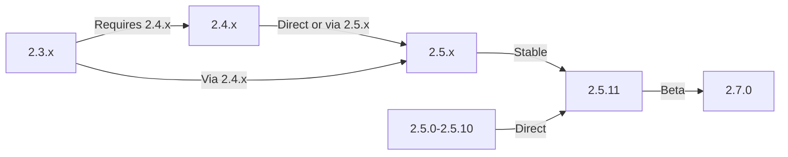

Hướng dẫn này bao gồm việc nâng cấp XOOPS từ phiên bản cũ lên bản phát hành mới nhất trong khi vẫn bảo toàn dữ liệu và các tùy chỉnh của bạn.

> **Thông tin phiên bản**
> - **Ổn định:** XOOPS 2.5.11
> - **Beta:** XOOPS 2.7.0 (thử nghiệm)
> - **Tương lai:** XOOPS 4.0 (đang phát triển - xem Lộ trình)

## Danh sách kiểm tra trước khi nâng cấp

Trước khi bắt đầu nâng cấp, hãy xác minh:

- [ ] Phiên bản XOOPS hiện tại đã được ghi lại
- [ ] Đã xác định được phiên bản Target XOOPS
- [ ] Sao lưu toàn bộ hệ thống đã hoàn tất
- [] Đã xác minh sao lưu cơ sở dữ liệu
- [ ] Đã ghi lại danh sách modules đã cài đặt
- [ ] Các sửa đổi tùy chỉnh được ghi lại
- [ ] Môi trường thử nghiệm có sẵn
- [ ] Đường dẫn nâng cấp đã được kiểm tra (một số phiên bản bỏ qua các bản phát hành trung gian)
- [ ] Tài nguyên máy chủ đã được xác minh (đủ dung lượng ổ đĩa, bộ nhớ)
- [ ] Đã bật chế độ bảo trì

## Hướng dẫn đường dẫn nâng cấp

Đường dẫn nâng cấp khác nhau tùy thuộc vào phiên bản hiện tại:



**Quan trọng:** Không bao giờ bỏ qua các phiên bản chính. Nếu nâng cấp từ 2.3.x, trước tiên hãy nâng cấp lên 2.4.x, sau đó lên 2.5.x.

## Bước 1: Hoàn tất sao lưu hệ thống

### Sao lưu cơ sở dữ liệu

Sử dụng mysqldump để sao lưu cơ sở dữ liệu:

```bash
# Full database backup
mysqldump -u xoops_user -p xoops_db > /backups/xoops_db_backup_$(date +%Y%m%d_%H%M%S).sql

# Compressed backup
mysqldump -u xoops_user -p xoops_db | gzip > /backups/xoops_db_backup_$(date +%Y%m%d_%H%M%S).sql.gz
```

Hoặc sử dụng phpMyAdmin:

1. Chọn cơ sở dữ liệu XOOPS của bạn
2. Nhấp vào tab "Xuất"
3. Chọn định dạng "SQL"
4. Chọn "Lưu dưới dạng tệp"
5. Nhấp vào "Đi"

Xác minh tập tin sao lưu:

```bash
# Check backup size
ls -lh /backups/xoops_db_backup*.sql

# Verify backup integrity (uncompressed)
head -20 /backups/xoops_db_backup_*.sql

# Verify compressed backup
zcat /backups/xoops_db_backup_*.sql.gz | head -20
```

### Sao lưu hệ thống tệp

Sao lưu tất cả các tệp XOOPS:

```bash
# Compressed file backup
tar -czf /backups/xoops_files_$(date +%Y%m%d_%H%M%S).tar.gz /var/www/html/xoops

# Uncompressed (faster, requires more disk space)
tar -cf /backups/xoops_files_$(date +%Y%m%d_%H%M%S).tar /var/www/html/xoops

# Show backup progress
tar -czf /backups/xoops_files_$(date +%Y%m%d_%H%M%S).tar.gz --verbose /var/www/html/xoops | tail
```

Lưu trữ các bản sao lưu một cách an toàn:

```bash
# Secure backup storage
chmod 600 /backups/xoops_*
ls -lah /backups/

# Optional: Copy to remote storage
scp /backups/xoops_* user@backup-server:/secure/backups/
```

### Kiểm tra quá trình khôi phục sao lưu

**TUYỆT VỜI:** Luôn kiểm tra hoạt động sao lưu của bạn:

```bash
# Verify tar archive contents
tar -tzf /backups/xoops_files_*.tar.gz | head -20

# Extract to test location
mkdir /tmp/restore_test
cd /tmp/restore_test
tar -xzf /backups/xoops_files_*.tar.gz

# Verify key files exist
ls -la xoops/mainfile.php
ls -la xoops/install/
```

## Bước 2: Kích hoạt Chế độ bảo trì

Ngăn người dùng truy cập trang web trong quá trình nâng cấp:

### Tùy chọn 1: Bảng quản trị XOOPS

1. Đăng nhập vào bảng admin
2. Vào Hệ thống > Bảo trì
3. Kích hoạt "Chế độ bảo trì trang web"
4. Đặt thông báo bảo trì
5. Lưu

### Phương án 2: Chế độ bảo trì thủ công

Tạo một tập tin bảo trì tại web root:

```html
<!-- /var/www/html/maintenance.html -->
<!DOCTYPE html>
<html>
<head>
    <title>Under Maintenance</title>
    <style>
        body { font-family: Arial; text-align: center; padding: 50px; }
        h1 { color: #333; }
        p { color: #666; margin: 20px 0; }
    </style>
</head>
<body>
    <h1>Site Under Maintenance</h1>
    <p>We're currently upgrading our site.</p>
    <p>Expected time: approximately 30 minutes.</p>
    <p>Thank you for your patience!</p>
</body>
</html>
```

Định cấu hình Apache để hiển thị trang bảo trì:

```apache
# In .htaccess or vhost config
ErrorDocument 503 /maintenance.html

# Redirect all traffic to maintenance page
<IfModule mod_rewrite.c>
    RewriteEngine On
    RewriteCond %{REMOTE_ADDR} !^192\.168\.1\.100$  # Your IP
    RewriteRule ^(.*)$ - [R=503,L]
</IfModule>
```

## Bước 3: Tải phiên bản mới

Tải xuống XOOPS từ trang web chính thức:

```bash
# Download latest version
cd /tmp
wget https://xoops.org/download/xoops-2.5.8.zip

# Verify checksum (if provided)
sha256sum xoops-2.5.8.zip
# Compare with official SHA256 hash

# Extract to temporary location
unzip xoops-2.5.8.zip
cd xoops-2.5.8
```

## Bước 4: Chuẩn bị trước khi nâng cấp file

### Xác định các sửa đổi tùy chỉnh

Kiểm tra các tập tin cốt lõi tùy chỉnh:

```bash
# Look for modified files (files with newer mtime)
find /var/www/html/xoops -type f -newer /var/www/html/xoops/install.php

# Check for custom themes
ls /var/www/html/xoops/themes/
# Note any custom themes

# Check for custom modules
ls /var/www/html/xoops/modules/
# Note any custom modules created by you
```

### Trạng thái hiện tại của tài liệu

Tạo báo cáo nâng cấp:

```bash
cat > /tmp/upgrade_report.txt << EOF
=== XOOPS Upgrade Report ===
Date: $(date)
Current Version: 2.5.6
Target Version: 2.5.8

=== Installed Modules ===
$(ls /var/www/html/xoops/modules/)

=== Custom Modifications ===
[Document any custom theme or module modifications]

=== Themes ===
$(ls /var/www/html/xoops/themes/)

=== Plugin Status ===
[List any custom code modifications]

EOF
```

## Bước 5: Hợp nhất các file mới với cài đặt hiện tại

### Chiến lược: Bảo toàn các tập tin tùy chỉnh

Thay thế các tệp lõi XOOPS nhưng giữ nguyên:
- `mainfile.php` (cấu hình cơ sở dữ liệu của bạn)
- themes tùy chỉnh trong `themes/`
- modules tùy chỉnh trong `modules/`
- Người dùng uploads trong `uploads/`
- Dữ liệu trang web trong `var/`

### Quá trình hợp nhất thủ công

```bash
# Set variables
XOOPS_OLD="/var/www/html/xoops"
XOOPS_NEW="/tmp/xoops-2.5.8"
BACKUP="/backups/pre-upgrade"

# Create pre-upgrade backup in place
mkdir -p $BACKUP
cp -r $XOOPS_OLD/* $BACKUP/

# Copy new files (but preserve sensitive files)
# Copy everything except protected directories
rsync -av --exclude='mainfile.php' \
    --exclude='modules/custom*' \
    --exclude='themes/custom*' \
    --exclude='uploads' \
    --exclude='var' \
    --exclude='cache' \
    --exclude='templates_c' \
    $XOOPS_NEW/ $XOOPS_OLD/

# Verify critical files preserved
ls -la $XOOPS_OLD/mainfile.php
```

### Sử dụng nâng cấp.php (If Available)

Một số phiên bản XOOPS include script nâng cấp tự động:

```bash
# Copy new files with installer
cp -r /tmp/xoops-2.5.8/* /var/www/html/xoops/

# Run upgrade wizard
# Visit: http://your-domain.com/xoops/upgrade/
```

### Quyền của tệp sau khi hợp nhất

Khôi phục quyền thích hợp:

```bash
# Set ownership
chown -R www-data:www-data /var/www/html/xoops

# Set directory permissions
find /var/www/html/xoops -type d -exec chmod 755 {} \;

# Set file permissions
find /var/www/html/xoops -type f -exec chmod 644 {} \;

# Make writable directories
chmod 777 /var/www/html/xoops/cache
chmod 777 /var/www/html/xoops/templates_c
chmod 777 /var/www/html/xoops/uploads
chmod 777 /var/www/html/xoops/var

# Secure mainfile.php
chmod 644 /var/www/html/xoops/mainfile.php
```

## Bước 6: Di chuyển cơ sở dữ liệu

### Xem lại các thay đổi của cơ sở dữ liệu

Kiểm tra ghi chú phát hành XOOPS để biết các thay đổi về cấu trúc cơ sở dữ liệu:

```bash
# Extract and review SQL migration files
find /tmp/xoops-2.5.8 -name "*.sql" -type f
# Document all .sql files found
```

### Chạy cập nhật cơ sở dữ liệu

### Tùy chọn 1: Cập nhật tự động (nếu có)

Sử dụng bảng admin:1. Đăng nhập vào admin
2. Đi tới **Hệ thống > Cơ sở dữ liệu**
3. Nhấp vào "Kiểm tra cập nhật"
4. Xem lại các thay đổi đang chờ xử lý
5. Nhấp vào "Áp dụng cập nhật"

### Tùy chọn 2: Cập nhật cơ sở dữ liệu thủ công

Thực thi di chuyển các tệp SQL:

```bash
# Connect to database
mysql -u xoops_user -p xoops_db

# View pending changes (varies by version)
SELECT * FROM xoops_config WHERE conf_name LIKE '%version%';

# Run migration scripts manually if needed
SOURCE /tmp/xoops-2.5.8/migrate_2.5.6_to_2.5.8.sql;
```

### Xác minh cơ sở dữ liệu

Xác minh tính toàn vẹn của cơ sở dữ liệu sau khi cập nhật:

```sql
-- Check database consistency
REPAIR TABLE xoops_users;
OPTIMIZE TABLE xoops_users;

-- Verify key tables exist
SHOW TABLES LIKE 'xoops_%';

-- Check row counts (should increase or stay same)
SELECT COUNT(*) FROM xoops_users;
SELECT COUNT(*) FROM xoops_posts;
```

## Bước 7: Xác minh nâng cấp

### Kiểm tra trang chủ

Truy cập trang chủ XOOPS của bạn:

```
http://your-domain.com/xoops/
```

Dự kiến: Trang tải không có lỗi, hiển thị chính xác

### Kiểm tra bảng quản trị

Truy cập admin:

```
http://your-domain.com/xoops/admin/
```

Xác minh:
- [ ] Tải bảng quản trị
- [ ] Điều hướng hoạt động
- [ ] Bảng điều khiển hiển thị đúng
- [] Không có lỗi cơ sở dữ liệu trong nhật ký

### Xác minh mô-đun

Kiểm tra modules đã cài đặt:

1. Đi tới **Mô-đun > Mô-đun** trong admin
2. Xác minh tất cả modules vẫn được cài đặt
3. Kiểm tra xem có thông báo lỗi nào không
4. Kích hoạt mọi modules đã bị tắt

### Kiểm tra tệp nhật ký

Xem lại nhật ký hệ thống để tìm lỗi:

```bash
# Check web server error log
tail -50 /var/log/apache2/error.log

# Check PHP error log
tail -50 /var/log/php_errors.log

# Check XOOPS system log (if available)
# In admin panel: System > Logs
```

### Kiểm tra các chức năng cốt lõi

- [] Đăng nhập/đăng xuất của người dùng hoạt động
- [ ] Đăng ký người dùng hoạt động
- [] Chức năng tải tập tin lên
- [ ] Gửi thông báo qua email
- [] Chức năng tìm kiếm hoạt động
- [ ] Chức năng quản trị hoạt động
- [] Chức năng mô-đun còn nguyên vẹn

## Bước 8: Dọn dẹp sau nâng cấp

### Xóa các tập tin tạm thời

```bash
# Remove extraction directory
rm -rf /tmp/xoops-2.5.8

# Clear template cache (safe to delete)
rm -rf /var/www/html/xoops/templates_c/*

# Clear site cache
rm -rf /var/www/html/xoops/cache/*
```

### Xóa chế độ bảo trì

Kích hoạt lại quyền truy cập trang web bình thường:

```apache
# Remove maintenance mode redirect from .htaccess
# Or delete maintenance.html file
rm /var/www/html/maintenance.html
```

### Cập nhật tài liệu

Cập nhật ghi chú nâng cấp của bạn:

```bash
# Document successful upgrade
cat >> /tmp/upgrade_report.txt << EOF

=== Upgrade Results ===
Status: SUCCESS
Upgrade Date: $(date)
New Version: 2.5.8
Duration: [time in minutes]

Post-Upgrade Tests:
- [x] Homepage loads
- [x] Admin panel accessible
- [x] Modules functional
- [x] User registration works
- [x] Database optimized

EOF
```

## Khắc phục sự cố nâng cấp

### Vấn đề: Màn hình trắng trống sau khi nâng cấp

**Triệu chứng:** Trang chủ không hiển thị gì

**Giải pháp:**
```bash
# Check PHP errors
tail -f /var/log/apache2/error.log

# Enable debug mode temporarily
echo "define('XOOPS_DEBUG', 1);" >> /var/www/html/xoops/mainfile.php

# Check file permissions
ls -la /var/www/html/xoops/mainfile.php

# Restore from backup if needed
cp /backups/xoops_files_*.tar.gz /tmp/
cd /tmp && tar -xzf xoops_files_*.tar.gz
```

### Vấn đề: Lỗi kết nối cơ sở dữ liệu

**Triệu chứng:** Thông báo "Không thể kết nối với cơ sở dữ liệu"

**Giải pháp:**
```bash
# Verify database credentials in mainfile.php
grep -i "database\|host\|user" /var/www/html/xoops/mainfile.php

# Test connection
mysql -h localhost -u xoops_user -p xoops_db -e "SELECT 1"

# Check MySQL status
systemctl status mysql

# Verify database still exists
mysql -u xoops_user -p -e "SHOW DATABASES" | grep xoops
```

### Vấn đề: Bảng quản trị không thể truy cập được

**Triệu chứng:** Không thể truy cập /xoops/admin/

**Giải pháp:**
```bash
# Check .htaccess rules
cat /var/www/html/xoops/.htaccess

# Verify admin files exist
ls -la /var/www/html/xoops/admin/

# Check mod_rewrite enabled
apache2ctl -M | grep rewrite

# Restart web server
systemctl restart apache2
```

### Vấn đề: Mô-đun không tải

**Triệu chứng:** Các mô-đun hiển thị lỗi hoặc bị vô hiệu hóa

**Giải pháp:**
```bash
# Verify module files exist
ls /var/www/html/xoops/modules/

# Check module permissions
ls -la /var/www/html/xoops/modules/*/

# Check module configuration in database
mysql -u xoops_user -p xoops_db -e "SELECT * FROM xoops_modules WHERE module_status = 0"

# Reactivate modules in admin panel
# System > Modules > Click module > Update Status
```

### Vấn đề: Lỗi bị từ chối quyền

**Triệu chứng:** "Quyền bị từ chối" khi tải lên hoặc lưu

**Giải pháp:**
```bash
# Check file ownership
ls -la /var/www/html/xoops/ | head -20

# Fix ownership
chown -R www-data:www-data /var/www/html/xoops

# Fix directory permissions
find /var/www/html/xoops -type d -exec chmod 755 {} \;

# Make cache/uploads writable
chmod 777 /var/www/html/xoops/cache
chmod 777 /var/www/html/xoops/templates_c
chmod 777 /var/www/html/xoops/uploads
chmod 777 /var/www/html/xoops/var
```

### Vấn đề: Tải trang chậm

**Triệu chứng:** Trang tải rất chậm sau khi nâng cấp

**Giải pháp:**
```bash
# Clear all caches
rm -rf /var/www/html/xoops/cache/*
rm -rf /var/www/html/xoops/templates_c/*

# Optimize database
mysql -u xoops_user -p xoops_db << EOF
OPTIMIZE TABLE xoops_users;
OPTIMIZE TABLE xoops_posts;
OPTIMIZE TABLE xoops_config;
ANALYZE TABLE xoops_users;
EOF

# Check PHP error log for warnings
grep -i "deprecated\|warning" /var/log/php_errors.log | tail -20

# Increase PHP memory/execution time temporarily
# Edit php.ini:
memory_limit = 256M
max_execution_time = 300
```

## Thủ tục khôi phục

Nếu nâng cấp thất bại nghiêm trọng, hãy khôi phục từ bản sao lưu:

### Khôi phục cơ sở dữ liệu

```bash
# Restore from backup
mysql -u xoops_user -p xoops_db < /backups/xoops_db_backup_YYYYMMDD_HHMMSS.sql

# Or from compressed backup
gunzip < /backups/xoops_db_backup_YYYYMMDD_HHMMSS.sql.gz | mysql -u xoops_user -p xoops_db

# Verify restoration
mysql -u xoops_user -p xoops_db -e "SELECT COUNT(*) FROM xoops_users"
```

### Khôi phục hệ thống tập tin

```bash
# Stop web server
systemctl stop apache2

# Remove current installation
rm -rf /var/www/html/xoops/*

# Extract backup
cd /var/www/html
tar -xzf /backups/xoops_files_YYYYMMDD_HHMMSS.tar.gz

# Fix permissions
chown -R www-data:www-data xoops/
find xoops -type d -exec chmod 755 {} \;
find xoops -type f -exec chmod 644 {} \;
chmod 777 xoops/cache xoops/templates_c xoops/uploads xoops/var

# Start web server
systemctl start apache2

# Verify restoration
# Visit http://your-domain.com/xoops/
```

## Danh sách kiểm tra xác minh nâng cấp

Sau khi hoàn tất nâng cấp, hãy xác minh:

- [ ] Đã cập nhật phiên bản XOOPS (kiểm tra admin > Thông tin hệ thống)
- [ ] Trang chủ tải không có lỗi
- [ ] Tất cả chức năng modules
- [] Đăng nhập của người dùng hoạt động
- [] Bảng quản trị có thể truy cập được
- [] Tệp uploads hoạt động
- [] Chức năng thông báo qua email
- [] Đã xác minh tính toàn vẹn của cơ sở dữ liệu
- [] Quyền của tệp đúng
- [] Đã xóa chế độ bảo trì
- [ ] Sao lưu được bảo mật và thử nghiệm
- [ ] Hiệu suất chấp nhận được
- [] SSL/HTTPS đang hoạt động
- [] Không có thông báo lỗi trong nhật ký

## Các bước tiếp theo

Sau khi nâng cấp thành công:

1. Cập nhật mọi modules tùy chỉnh lên phiên bản mới nhất
2. Xem lại ghi chú phát hành cho các tính năng không được dùng nữa
3. Cân nhắc tối ưu hóa hiệu suất
4. Cập nhật cài đặt bảo mật
5. Kiểm tra kỹ lưỡng mọi chức năng
6. Giữ an toàn cho các tập tin sao lưu

---

**Tags:** #upgrade #maintenance #backup #database-migration**Bài viết liên quan:**
- ../../06-Publisher-Module/Hướng dẫn sử dụng/Cài đặt
- Yêu cầu máy chủ
- ../Configuration/Cấu hình cơ bản
- ../Configuration/Security-Cấu hình