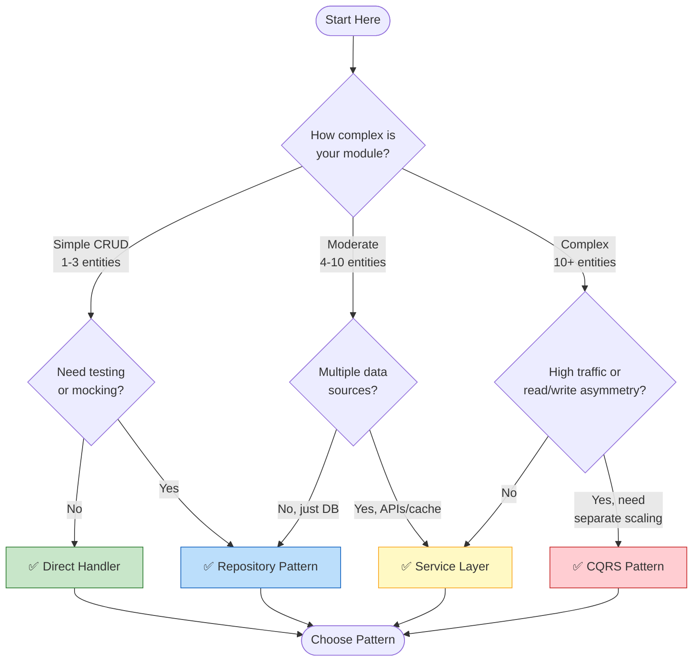
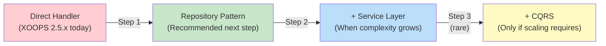

<span class="version-badge version-25x">2.5.x ✅</span> <span class="version-badge version-40x">4.0.x ✅</span>

> **Tôi nên sử dụng mẫu nào?** Cây quyết định này giúp bạn lựa chọn giữa các trình xử lý trực tiếp, Mẫu Kho lưu trữ, Lớp Dịch vụ và CQRS.

---

## Cây quyết định nhanh



---

## So sánh mẫu

| Tiêu chí | Người xử lý trực tiếp | Kho lưu trữ | Lớp dịch vụ | CQRS |
|---|---|---|---|---|
| **Độ phức tạp** | ⭐ | ⭐⭐ | ⭐⭐⭐ | ⭐⭐⭐⭐⭐ |
| **Khả năng kiểm tra** | ❌ Khó | ✅ Tốt | ✅ Tuyệt vời | ✅ Tuyệt vời |
| **Tính linh hoạt** | ❌ Thấp | ✅ Trung bình | ✅ Cao | ✅ Rất cao |
| **XOOPS 2.5.x** | ✅ Bản địa | ✅ Hoạt động | ✅ Hoạt động | ⚠️ Phức tạp |
| **XOOPS 4.0** | ⚠️ Không dùng nữa | ✅ Được đề xuất | ✅ Được đề xuất | ✅ Dành cho quy mô |
| **Quy mô nhóm** | 1 nhà phát triển | 1-3 nhà phát triển | 2-5 nhà phát triển | 5+ nhà phát triển |
| **Bảo trì** | ❌ Cao hơn | ✅ Vừa phải | ✅ Hạ | ⚠️ Yêu cầu chuyên môn |

---

## Khi nào nên sử dụng từng mẫu

### ✅ Trình xử lý trực tiếp (`XoopsPersistableObjectHandler`)

**Tốt nhất cho:** modules đơn giản, tạo nguyên mẫu nhanh, học XOOPS

```php
// Simple and direct - good for small modules
$handler = xoops_getModuleHandler('article', 'news');
$articles = $handler->getObjects(new Criteria('status', 1));
```

**Chọn mục này khi:**
- Xây dựng một module đơn giản với 1-3 bảng cơ sở dữ liệu
- Tạo một nguyên mẫu nhanh chóng
- Bạn là nhà phát triển duy nhất và không cần kiểm tra
- Mô-đun sẽ không tăng trưởng đáng kể

**Hạn chế:**
- Khó kiểm tra đơn vị (phụ thuộc toàn cầu)
- Khớp nối chặt chẽ với lớp cơ sở dữ liệu XOOPS
- Logic nghiệp vụ có xu hướng rò rỉ vào bộ điều khiển

---

### ✅ Mẫu kho lưu trữ

**Tốt nhất cho:** Hầu hết modules, các nhóm muốn có khả năng kiểm tra

```php
// Abstraction allows mocking for tests
interface ArticleRepositoryInterface {
    public function findPublished(): array;
    public function save(Article $article): void;
}

class XoopsArticleRepository implements ArticleRepositoryInterface {
    private $handler;

    public function __construct() {
        $this->handler = xoops_getModuleHandler('article', 'news');
    }

    public function findPublished(): array {
        return $this->handler->getObjects(new Criteria('status', 1));
    }
}
```

**Chọn mục này khi:**
- Bạn muốn viết bài kiểm tra đơn vị
- Bạn có thể thay đổi nguồn dữ liệu sau (DB → API)
- Làm việc với hơn 2 nhà phát triển
- Tòa nhà modules để phân phối

**Đường dẫn nâng cấp:** Đây là mẫu được đề xuất để chuẩn bị XOOPS 4.0.

---

### ✅ Lớp dịch vụ

**Tốt nhất cho:** Mô-đun có logic nghiệp vụ phức tạp

```php
// Service coordinates multiple repositories and contains business rules
class ArticlePublicationService {
    public function __construct(
        private ArticleRepositoryInterface $articles,
        private NotificationServiceInterface $notifications,
        private CacheInterface $cache
    ) {}

    public function publish(int $articleId): void {
        $article = $this->articles->find($articleId);
        $article->setStatus('published');
        $article->setPublishedAt(new DateTime());

        $this->articles->save($article);
        $this->notifications->notifySubscribers($article);
        $this->cache->invalidate("article:{$articleId}");
    }
}
```

**Chọn mục này khi:**
- Hoạt động trải rộng trên nhiều nguồn dữ liệu
- Quy tắc kinh doanh rất phức tạp
- Bạn cần quản lý giao dịch
- Nhiều phần của ứng dụng làm điều tương tự

**Đường dẫn nâng cấp:** Kết hợp với Kho lưu trữ để có kiến trúc mạnh mẽ.

---

### ⚠️ CQRS (Phân chia trách nhiệm truy vấn lệnh)

**Tốt nhất cho:** modules quy mô cao với tính năng đọc/ghi không đối xứng

```php
// Commands modify state
class PublishArticleCommand {
    public function __construct(
        public readonly int $articleId,
        public readonly int $publisherId
    ) {}
}

// Queries read state (can use denormalized read models)
class GetPublishedArticlesQuery {
    public function __construct(
        public readonly int $limit = 10
    ) {}
}
```

**Chọn mục này khi:**
- Số lần đọc nhiều hơn số lần ghi (100:1 trở lên)
- Bạn cần chia tỷ lệ khác nhau cho việc đọc và ghi
- Yêu cầu báo cáo/phân tích phức tạp
- Tìm nguồn cung ứng sự kiện sẽ có lợi cho miền của bạn

**Cảnh báo:** CQRS tăng thêm độ phức tạp đáng kể. Hầu hết XOOPS modules không cần nó.

---

## Đường dẫn nâng cấp được đề xuất



### Bước 1: Gói Handler vào Repositories (2-4 giờ)

1. Tạo giao diện cho nhu cầu truy cập dữ liệu của bạn
2. Triển khai nó bằng trình xử lý hiện có
3. Chèn kho lưu trữ thay vì gọi trực tiếp `xoops_getModuleHandler()`

### Bước 2: Thêm lớp dịch vụ khi cần (1-2 ngày)

1. Khi logic nghiệp vụ xuất hiện trong bộ điều khiển, hãy trích xuất vào Dịch vụ
2. Dịch vụ sử dụng kho lưu trữ, không phải trình xử lý trực tiếp
3. Bộ điều khiển ngày càng mỏng (tuyến đường → dịch vụ → phản hồi)

### Bước 3: Chỉ xem xét CQRS nếu (hiếm)1. Bạn có hàng triệu lượt đọc mỗi ngày
2. Mô hình đọc và ghi có sự khác biệt đáng kể
3. Bạn cần tìm nguồn cung ứng sự kiện cho các quá trình kiểm tra
4. Bạn có một đội ngũ có kinh nghiệm về CQRS

---

## Thẻ tham khảo nhanh

| Câu hỏi | Trả lời |
|----------|--------|
| **"Tôi chỉ cần lưu/tải dữ liệu"** | Người xử lý trực tiếp |
| **"Tôi muốn viết bài kiểm tra"** | Mẫu lưu trữ |
| **"Tôi có các quy tắc kinh doanh phức tạp"** | Lớp dịch vụ |
| **"Tôi cần chia tỷ lệ đọc riêng"** | CQRS |
| **"Tôi đang chuẩn bị cho XOOPS 4.0"** | Kho lưu trữ + Lớp dịch vụ |

---

## Tài liệu liên quan

- [Hướng dẫn mẫu kho lưu trữ](Patterns/Repository-Pattern.md)
- [Hướng dẫn mẫu lớp dịch vụ](Patterns/Service-Layer-Pattern.md)
- [Hướng dẫn mẫu CQRS](../07-XOOPS-4.0/Implementation-Guides/CQRS-Pattern-Guide.md) *(nâng cao)*
- [Hợp đồng chế độ kết hợp](../07-XOOPS-4.0/Specifications/Hybrid-Mode-Contract.md)

---

#patterns #data-access #decision-tree #best-practices #xoops