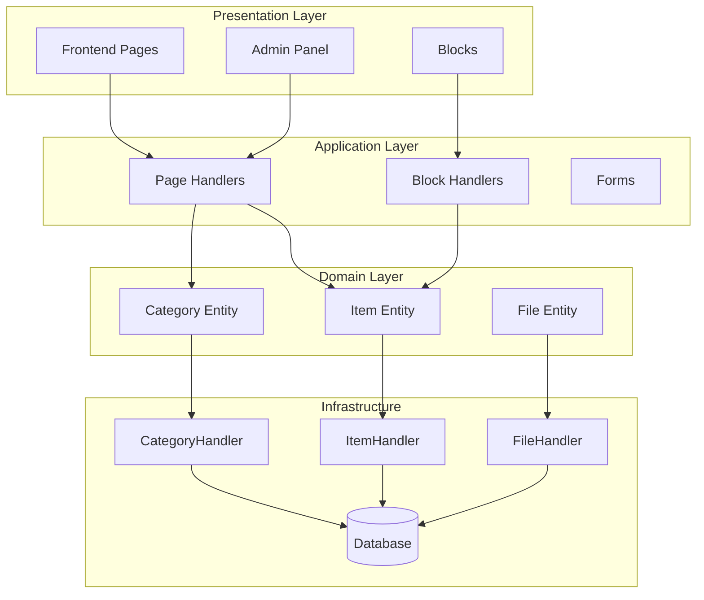
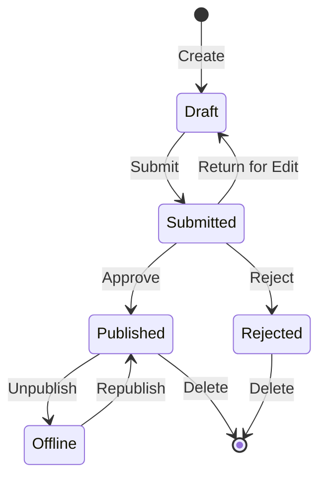

## Tổng quan

Tài liệu này cung cấp phân tích kỹ thuật về kiến trúc, mẫu và chi tiết triển khai mô-đun Nhà xuất bản. Sử dụng tài liệu này làm tài liệu tham khảo để hiểu cách cấu trúc mô-đun XOOPS chất lượng sản xuất.

## Tổng quan về kiến trúc



## Cấu trúc thư mục

```
publisher/
├── admin/
│   ├── index.php           # Admin dashboard
│   ├── item.php            # Article management
│   ├── category.php        # Category management
│   ├── permission.php      # Permissions
│   ├── file.php            # File manager
│   └── menu.php            # Admin menu
├── assets/
│   ├── css/
│   ├── js/
│   └── images/
├── class/
│   ├── Category.php        # Category entity
│   ├── CategoryHandler.php # Category data access
│   ├── Item.php            # Article entity
│   ├── ItemHandler.php     # Article data access
│   ├── File.php            # File attachment
│   ├── FileHandler.php     # File data access
│   ├── Form/               # Form classes
│   ├── Common/             # Utilities
│   └── Helper.php          # Module helper
├── include/
│   ├── common.php          # Initialization
│   ├── functions.php       # Utility functions
│   ├── oninstall.php       # Install hooks
│   ├── onupdate.php        # Update hooks
│   └── search.php          # Search integration
├── language/
├── templates/
├── sql/
└── xoops_version.php
```

## Phân tích thực thể

### Thực thể Mục (Bài viết)

```php
class Item extends \XoopsObject
{
    // Fields
    public function initVar(): void
    {
        $this->initVar('itemid', XOBJ_DTYPE_INT, null, false);
        $this->initVar('categoryid', XOBJ_DTYPE_INT, 0, false);
        $this->initVar('title', XOBJ_DTYPE_TXTBOX, '', true);
        $this->initVar('subtitle', XOBJ_DTYPE_TXTBOX, '');
        $this->initVar('summary', XOBJ_DTYPE_TXTAREA, '');
        $this->initVar('body', XOBJ_DTYPE_TXTAREA, '', true);
        $this->initVar('uid', XOBJ_DTYPE_INT, 0);
        $this->initVar('status', XOBJ_DTYPE_INT, 0);
        $this->initVar('datesub', XOBJ_DTYPE_INT, time());
        // ... more fields
    }

    // Business methods
    public function isPublished(): bool
    {
        return $this->getVar('status') == _PUBLISHER_STATUS_PUBLISHED;
    }

    public function canEdit(int $userId): bool
    {
        return $this->getVar('uid') == $userId
            || $this->isAdmin($userId);
    }
}
```

### Mẫu trình xử lý

```php
class ItemHandler extends \XoopsPersistableObjectHandler
{
    public function __construct(\XoopsDatabase $db)
    {
        parent::__construct(
            $db,
            'publisher_items',
            Item::class,
            'itemid',
            'title'
        );
    }

    public function getPublishedItems(int $limit = 10): array
    {
        $criteria = new \CriteriaCompo();
        $criteria->add(new \Criteria('status', _PUBLISHER_STATUS_PUBLISHED));
        $criteria->setSort('datesub');
        $criteria->setOrder('DESC');
        $criteria->setLimit($limit);

        return $this->getObjects($criteria);
    }
}
```

## Hệ thống cấp phép

### Các loại quyền

| Giấy phép | Mô tả |
|---|---|
| `publisher_view` | Xem danh mục/bài viết |
| `publisher_submit` | Gửi bài viết mới |
| `publisher_approve` | Tự động phê duyệt bài nộp |
| `publisher_moderate` | Xem lại các bài viết đang chờ xử lý |
| `publisher_global` | Quyền mô-đun toàn cầu |

### Kiểm tra quyền

```php
class PermissionHandler
{
    public function isGranted(string $permission, int $categoryId): bool
    {
        $userId = $GLOBALS['xoopsUser']?->uid() ?? 0;
        $groups = $this->getUserGroups($userId);

        return $this->grouppermHandler->checkRight(
            $permission,
            $categoryId,
            $groups,
            $this->helper->getModule()->mid()
        );
    }
}
```

## Trạng thái quy trình làm việc



## Cấu trúc mẫu

### Mẫu giao diện người dùng

| Mẫu | Mục đích |
|----------|----------|
| `publisher_index.tpl` | Trang chủ mô-đun |
| `publisher_item.tpl` | Bài viết đơn |
| `publisher_category.tpl` | Danh sách danh mục |
| `publisher_submit.tpl` | Nộp hồ sơ |
| `publisher_search.tpl` | Kết quả tìm kiếm |

### Mẫu khối

| Mẫu | Mục đích |
|----------|----------|
| `publisher_block_latest.tpl` | Các bài viết gần đây |
| `publisher_block_spotlight.tpl` | Bài viết nổi bật |
| `publisher_block_category.tpl` | Thực đơn danh mục |

## Các mẫu chính được sử dụng

1. **Mẫu trình xử lý** - Đóng gói truy cập dữ liệu
2. **Đối tượng giá trị** - Hằng trạng thái
3. **Phương pháp mẫu** - Tạo biểu mẫu
4. **Chiến lược** - Các chế độ hiển thị khác nhau
5. **Người quan sát** - Thông báo về các sự kiện

## Bài học phát triển mô-đun

1. Sử dụng XoopsPersistableObjectHandler cho CRUD
2. Triển khai các quyền chi tiết
3. Tách cách trình bày khỏi logic
4. Sử dụng Tiêu chí cho truy vấn
5. Hỗ trợ nhiều trạng thái nội dung
6. Tích hợp với hệ thống thông báo XOOPS

## Tài liệu liên quan

- Tạo bài viết - Quản lý bài viết
- Quản lý-Danh mục - Hệ thống danh mục
- Quyền-Cài đặt - Cấu hình quyền
- Hướng dẫn dành cho nhà phát triển/Móc và sự kiện - Điểm mở rộng