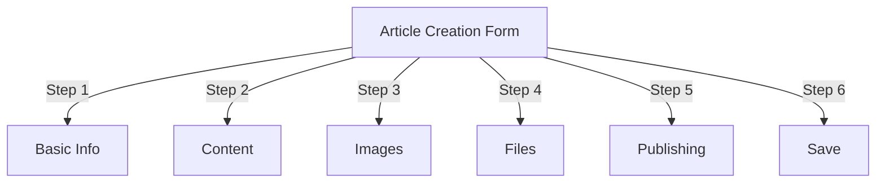
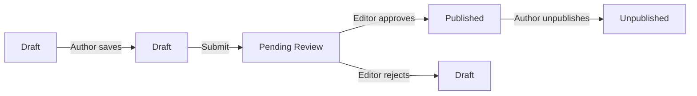
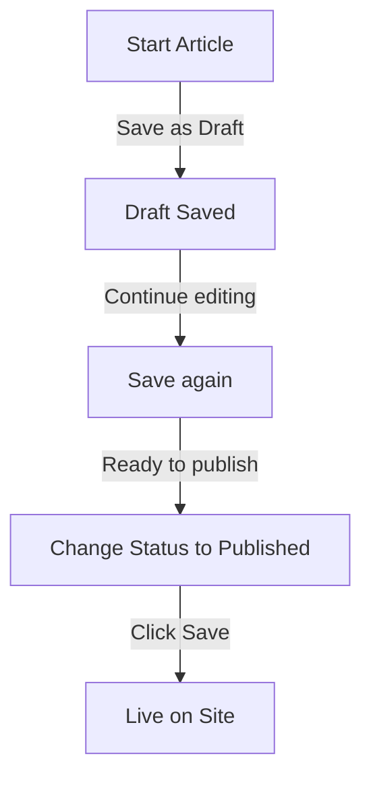

# Tạo bài viết trong Nhà xuất bản

> Hướng dẫn từng bước để tạo, chỉnh sửa, định dạng và xuất bản bài viết trong mô-đun Nhà xuất bản.

---

## Truy cập Quản lý bài viết

### Điều hướng bảng quản trị

```
Admin Panel
└── Modules
    └── Publisher
        └── Articles
            ├── Create New
            ├── Edit
            ├── Delete
            └── Publish
```

### Đường dẫn nhanh nhất

1. Đăng nhập với tư cách **Quản trị viên**
2. Nhấp vào **Mô-đun** trong thanh admin
3. Tìm **Nhà xuất bản**
4. Nhấp vào liên kết **Quản trị**
5. Nhấp vào **Bài viết** ở menu bên trái
6. Nhấp vào nút **Thêm bài viết**

---

## Mẫu tạo bài viết

### Thông tin cơ bản

Khi tạo một bài viết mới, hãy điền vào các phần sau:



---

## Bước 1: Thông tin cơ bản

### Trường bắt buộc

#### Tiêu đề bài viết

```
Field: Title
Type: Text input (required)
Max length: 255 characters
Example: "Top 5 Tips for Better Photography"
```

**Hướng dẫn:**
- Miêu tả và cụ thể
- Bao gồm các từ khóa cho SEO
- Tránh TẤT CẢ VIẾT HOA
- Giữ dưới 60 ký tự để hiển thị tốt nhất

#### Chọn danh mục

```
Field: Category
Type: Dropdown (required)
Options: List of created categories
Example: Photography > Tutorials
```

**Mẹo:**
- Có sẵn các danh mục chính và phụ
- Chọn danh mục phù hợp nhất
- Mỗi bài viết chỉ có một danh mục
- Có thể thay đổi sau

#### Phụ đề bài viết (Tùy chọn)

```
Field: Subtitle
Type: Text input (optional)
Max length: 255 characters
Example: "Learn photography fundamentals in 5 easy steps"
```

**Sử dụng cho:**
- Tiêu đề tóm tắt
- Văn bản giới thiệu
- Tiêu đề mở rộng

### Mô tả bài viết

#### Mô tả ngắn

```
Field: Short Description
Type: Textarea (optional)
Max length: 500 characters
```

**Mục đích:**
- Văn bản xem trước bài viết
- Hiển thị trong danh sách danh mục
- Được sử dụng trong kết quả tìm kiếm
- Mô tả meta cho SEO

**Ví dụ:**
```
"Discover essential photography techniques that will transform your photos
from ordinary to extraordinary. This comprehensive guide covers composition,
lighting, and exposure settings."
```

#### Nội dung đầy đủ

```
Field: Article Body
Type: WYSIWYG Editor (required)
Max length: Unlimited
Format: HTML
```

Khu vực nội dung bài viết chính với tính năng chỉnh sửa văn bản phong phú.

---

## Bước 2: Định dạng nội dung

### Sử dụng Trình soạn thảo WYSIWYG

#### Định dạng văn bản

```
Bold:           Ctrl+B or click [B] button
Italic:         Ctrl+I or click [I] button
Underline:      Ctrl+U or click [U] button
Strikethrough:  Alt+Shift+D or click [S] button
Subscript:      Ctrl+, (comma)
Superscript:    Ctrl+. (period)
```

#### Cấu trúc tiêu đề

Tạo hệ thống phân cấp tài liệu thích hợp:

```html
<h1>Article Title</h1>      <!-- Use once at top -->
<h2>Main Section</h2>        <!-- For major sections -->
<h3>Subsection</h3>          <!-- For subtopics -->
<h4>Sub-subsection</h4>      <!-- For details -->
```

**Trong trình chỉnh sửa:**
- Nhấp vào trình đơn thả xuống **Định dạng**
- Chọn cấp độ tiêu đề (H1-H6)
- Nhập tiêu đề của bạn

#### Danh sách

**Danh sách không có thứ tự (Dấu đầu dòng):**

```markdown
• Point one
• Point two
• Point three
```

Các bước trong trình chỉnh sửa:
1. Nhấp vào nút [≡] Danh sách dấu đầu dòng
2. Gõ từng điểm
3. Nhấn Enter để đến mục tiếp theo
4. Nhấn Backspace hai lần để kết thúc danh sách

**Danh sách thứ tự (được đánh số):**

```markdown
1. First step
2. Second step
3. Third step
```

Các bước trong trình chỉnh sửa:
1. Nhấp vào nút [1.] Danh sách được đánh số
2. Nhập từng mục
3. Nhấn Enter để tiếp theo
4. Nhấn Backspace hai lần để kết thúc

**Danh sách lồng nhau:**

```markdown
1. Main point
   a. Sub-point
   b. Sub-point
2. Next point
```

Các bước:
1. Tạo danh sách đầu tiên
2. Nhấn Tab để thụt lề
3. Tạo các mục lồng nhau
4. Nhấn Shift+Tab để lùi dòng

#### Liên kết

**Thêm siêu liên kết:**

1. Chọn văn bản cần liên kết
2. Nhấp vào nút **[🔗] Liên kết**
3. Nhập URL: `https://example.com`
4. Tùy chọn: Thêm tiêu đề/mục tiêu
5. Nhấp vào **Chèn liên kết**

**Xóa liên kết:**

1. Nhấp vào trong văn bản được liên kết
2. Nhấp vào nút **[🔗] Xóa liên kết**

#### Mã & Báo giá

**Trích dẫn khối:**

```
"This is an important quote from an expert"
- Attribution
```

Các bước:
1. Gõ văn bản trích dẫn
2. Nhấp vào nút **[❝] Blockquote**
3. Văn bản được thụt lề và tạo kiểu

**Khối mã:**

```python
def hello_world():
    print("Hello, World!")
```

Các bước:
1. Nhấp vào **Định dạng → Mã**
2. Dán mã
3. Chọn language (tùy chọn)
4. Mã hiển thị có tô sáng cú pháp

---

## Bước 3: Thêm hình ảnh

### Ảnh nổi bật (Hình ảnh anh hùng)

```
Field: Featured Image / Main Image
Type: Image upload
Format: JPG, PNG, GIF, WebP
Max size: 5 MB
Recommended: 600x400 px
```

**Để tải lên:**

1. Nhấp vào nút **Tải hình ảnh lên**
2. Chọn ảnh từ máy tính
3. Cắt/thay đổi kích thước nếu cần
4. Nhấp vào **Sử dụng hình ảnh này**

**Vị trí hình ảnh:**
- Hiển thị ở đầu bài viết
- Được sử dụng trong danh sách danh mục
- Hiển thị trong kho lưu trữ
- Được sử dụng để chia sẻ xã hội

### Hình ảnh nội tuyến

Chèn hình ảnh vào nội dung bài viết:1. Định vị con trỏ trong trình chỉnh sửa nơi hình ảnh sẽ xuất hiện
2. Nhấp vào nút **[🖼️] Hình ảnh** trên thanh công cụ
3. Chọn tùy chọn tải lên:
   - Tải lên hình ảnh mới
   - Chọn từ thư viện
   - Nhập ảnh URL
4. Cấu hình:
   
```
   Image Size:
   - Width: 300-600 px
   - Height: Auto (maintains ratio)
   - Alignment: Left/Center/Right
   
```
5. Nhấp vào **Chèn hình ảnh**

**Bọc văn bản xung quanh hình ảnh:**

Trong trình chỉnh sửa sau khi chèn:

```html
<!-- Image floats left, text wraps around -->

```

### Thư viện hình ảnh

Tạo thư viện nhiều hình ảnh:

1. Nhấp vào nút **Thư viện** (nếu có)
2. Tải lên nhiều hình ảnh:
   - Một cú nhấp chuột: Thêm một
   - Kéo và thả: Thêm nhiều
3. Sắp xếp thứ tự bằng cách kéo
4. Đặt chú thích cho từng hình ảnh
5. Nhấp vào **Tạo thư viện**

---

## Bước 4: Đính kèm File

### Thêm tệp đính kèm

```
Field: File Attachments
Type: File upload (multiple allowed)
Supported: PDF, DOC, XLS, ZIP, etc.
Max per file: 10 MB
Max per article: 5 files
```

**Để đính kèm:**

1. Nhấp vào nút **Thêm tệp**
2. Chọn file từ máy tính
3. Tùy chọn: Thêm mô tả tệp
4. Nhấp vào **Đính kèm tệp**
5. Lặp lại cho nhiều file

**Ví dụ về tệp:**
- Hướng dẫn PDF
- Bảng tính Excel
- Tài liệu Word
- Lưu trữ ZIP
- Mã nguồn

### Quản lý tập tin đính kèm

**Chỉnh sửa tập tin:**

1. Nhấp vào tên tệp
2. Chỉnh sửa mô tả
3. Nhấp vào **Lưu**

**Xóa tệp:**

1. Tìm tập tin trong danh sách
2. Nhấp vào biểu tượng **[×] Xóa**
3. Xác nhận xóa

---

## Bước 5: Xuất bản & Trạng thái

### Trạng thái bài viết

```
Field: Status
Type: Dropdown
Options:
  - Draft: Not published, only author sees
  - Pending: Waiting for approval
  - Published: Live on site
  - Archived: Old content
  - Unpublished: Was published, now hidden
```

**Quy trình làm việc theo trạng thái:**



### Tùy chọn xuất bản

#### Xuất bản ngay lập tức

```
Status: Published
Start Date: Today (auto-filled)
End Date: (leave blank for no expiration)
```

#### Lên lịch sau

```
Status: Scheduled
Start Date: Future date/time
Example: February 15, 2024 at 9:00 AM
```

Bài viết sẽ tự động xuất bản vào thời gian quy định.

#### Đặt ngày hết hạn

```
Enable Expiration: Yes
Expiration Date: Future date
Action: Archive/Hide/Delete
Example: April 1, 2024 (article auto-archives)
```

### Tùy chọn hiển thị

```yaml
Show Article:
  - Display on front page: Yes/No
  - Show in category: Yes/No
  - Include in search: Yes/No
  - Include in recent articles: Yes/No

Featured Article:
  - Mark as featured: Yes/No
  - Featured section position: (number)
```

---

## Bước 6: SEO & Siêu dữ liệu

### Cài đặt SEO

```
Field: SEO Settings (Expand section)
```

#### Mô tả Meta

```
Field: Meta Description
Type: Text (160 characters recommended)
Used by: Search engines, social media

Example:
"Learn photography fundamentals in 5 easy steps.
Discover composition, lighting, and exposure techniques."
```

#### Từ khóa meta

```
Field: Meta Keywords
Type: Comma-separated list
Max: 5-10 keywords

Example: Photography, Tutorial, Composition, Lighting, Exposure
```

#### Sên URL

```
Field: URL Slug (auto-generated from title)
Type: Text
Format: lowercase, hyphens, no spaces

Auto: "top-5-tips-for-better-photography"
Edit: Change before publishing
```

#### Thẻ đồ thị mở

Tự động tạo từ thông tin bài viết:
- Tiêu đề
- Mô tả
- Hình ảnh nổi bật
- Điều URL
- Ngày xuất bản

Được sử dụng bởi Facebook, LinkedIn, WhatsApp, v.v.

---

## Bước 7: Bình Luận & Tương Tác

### Cài đặt bình luận

```yaml
Allow Comments:
  - Enable: Yes/No
  - Default: Inherit from preferences
  - Override: Specific to this article

Moderate Comments:
  - Require approval: Yes/No
  - Default: Inherit from preferences
```

### Cài đặt xếp hạng

```yaml
Allow Ratings:
  - Enable: Yes/No
  - Scale: 5 stars (default)
  - Show average: Yes/No
  - Show count: Yes/No
```

---

## Bước 8: Tùy chọn nâng cao

### Tác giả & Byline

```
Field: Author
Type: Dropdown
Default: Current user
Options: All users with author permission

Display:
  - Show author name: Yes/No
  - Show author bio: Yes/No
  - Show author avatar: Yes/No
```

### Chỉnh sửa khóa

```
Field: Edit Lock
Purpose: Prevent accidental changes

Lock Article:
  - Locked: Yes/No
  - Lock reason: "Final version"
  - Unlock date: (optional)
```

### Lịch sử sửa đổi

Phiên bản tự động lưu của bài viết:

```
View Revisions:
  - Click "Revision History"
  - Shows all saved versions
  - Compare versions
  - Restore previous version
```

---

## Lưu & Xuất bản

### Lưu quy trình làm việc



### Lưu bài viết

**Tự động lưu:**
- Kích hoạt cứ sau 60 giây
- Tự động lưu dưới dạng bản nháp
- Hiển thị "Đã lưu lần cuối: 2 phút trước"

**Lưu thủ công:**
- Bấm **Save & Continue** để tiếp tục chỉnh sửa
- Bấm vào **Save & View** để xem phiên bản đã xuất bản
- Bấm **Save** để lưu và đóng

### Xuất bản bài viết

1. Đặt **Trạng thái**: Đã xuất bản
2. Đặt **Ngày bắt đầu**: Bây giờ (hoặc ngày trong tương lai)
3. Nhấp vào **Lưu** hoặc **Xuất bản**
4. Thông báo xác nhận xuất hiện
5. Bài viết đang trực tiếp (hoặc được lên lịch)

---

## Chỉnh sửa bài viết hiện có

### Truy cập Trình chỉnh sửa bài viết

1. Đi tới **Quản trị viên → Nhà xuất bản → Bài viết**
2. Tìm bài viết trong danh sách
3. Nhấp vào biểu tượng/nút **Chỉnh sửa**
4. Thực hiện thay đổi
5. Nhấp vào **Lưu**

### Chỉnh sửa hàng loạt

Chỉnh sửa nhiều bài viết cùng một lúc:

```
1. Go to Articles list
2. Select articles (checkboxes)
3. Choose "Bulk Edit" from dropdown
4. Change selected field
5. Click "Update All"

Available for:
  - Status
  - Category
  - Featured (Yes/No)
  - Author
```

### Xem trước bài viết

Trước khi xuất bản:

1. Nhấp vào nút **Xem trước**
2. Xem như người đọc sẽ thấy
3. Kiểm tra định dạng
4. Kiểm tra liên kết
5. Quay lại trình chỉnh sửa để điều chỉnh

---

## Quản lý bài viết

### Xem tất cả bài viết

**Chế độ xem danh sách bài viết:**

```
Admin → Publisher → Articles

Columns:
  - Title
  - Category
  - Author
  - Status
  - Created date
  - Modified date
  - Actions (Edit, Delete, Preview)

Sorting:
  - By title (A-Z)
  - By date (newest/oldest)
  - By status (Published/Draft)
  - By category
```

### Lọc bài viết

```
Filter Options:
  - By category
  - By status
  - By author
  - By date range
  - Search by title

Example: Show all "Draft" articles by "John" in "News" category
```

### Xóa bài viết

**Xóa mềm (Khuyến nghị):**1. Thay đổi **Trạng thái**: Chưa công bố
2. Nhấp vào **Lưu**
3. Bài viết bị ẩn nhưng không bị xóa
4. Có thể khôi phục sau

**Xóa cứng:**

1. Chọn bài viết trong danh sách
2. Nhấp vào nút **Xóa**
3. Xác nhận xóa
4. Bài viết bị xóa vĩnh viễn

---

## Các phương pháp hay nhất về nội dung

### Viết bài chất lượng

```
Structure:
  ✓ Compelling title
  ✓ Clear subtitle/description
  ✓ Engaging opening paragraph
  ✓ Logical sections with headers
  ✓ Supporting visuals
  ✓ Conclusion/summary
  ✓ Call-to-action

Length:
  - Blog posts: 500-2000 words
  - News: 300-800 words
  - Guides: 2000-5000 words
  - Minimum: 300 words
```

### Tối ưu hóa SEO

```
Title Optimization:
  ✓ Include primary keyword
  ✓ Keep under 60 characters
  ✓ Put keyword near beginning
  ✓ Be descriptive and specific

Content Optimization:
  ✓ Use headings (H1, H2, H3)
  ✓ Include keyword in heading
  ✓ Use bold for important terms
  ✓ Add descriptive links
  ✓ Include images with alt text

Meta Description:
  ✓ Include primary keyword
  ✓ 155-160 characters
  ✓ Action-oriented
  ✓ Unique per article
```

### Mẹo định dạng

```
Readability:
  ✓ Short paragraphs (2-4 sentences)
  ✓ Bullet points for lists
  ✓ Subheadings every 300 words
  ✓ Generous whitespace
  ✓ Line breaks between sections

Visual Appeal:
  ✓ Featured image at top
  ✓ Inline images in content
  ✓ Alt text on all images
  ✓ Code blocks for technical
  ✓ Blockquotes for emphasis
```

---

## Phím tắt

### Phím tắt của trình soạn thảo

```
Bold:               Ctrl+B
Italic:             Ctrl+I
Underline:          Ctrl+U
Link:               Ctrl+K
Save Draft:         Ctrl+S
```

### Phím tắt văn bản

```
-- →  (dash to em dash)
... → … (three dots to ellipsis)
(c) → © (copyright)
(r) → ® (registered)
(tm) → ™ (trademark)
```

---

## Nhiệm vụ chung

### Sao chép bài viết

1. Mở bài viết
2. Nhấp vào nút **Sao chép** hoặc **Sao chép**
3. Bài viết được sao chép dưới dạng bản nháp
4. Chỉnh sửa tiêu đề và nội dung
5. Xuất bản

### Lên lịch bài viết

1. Tạo bài viết
2. Đặt **Ngày bắt đầu**: Ngày/giờ trong tương lai
3. Đặt **Trạng thái**: Đã xuất bản
4. Nhấp vào **Lưu**
5. Bài viết tự động xuất bản

### Xuất bản hàng loạt

1. Tạo bài viết dưới dạng bản nháp
2. Đặt ngày xuất bản
3. Bài viết tự động đăng vào thời gian đã định
4. Giám sát từ chế độ xem "Đã lên lịch"

### Di chuyển giữa các danh mục

1. Chỉnh sửa bài viết
2. Thay đổi trình đơn thả xuống **Danh mục**
3. Nhấp vào **Lưu**
4. Bài viết xuất hiện trong chuyên mục mới

---

## Khắc phục sự cố

### Vấn đề: Không lưu được bài viết

**Giải pháp:**
```
1. Check form for required fields
2. Verify category is selected
3. Check PHP memory limit
4. Try saving as draft first
5. Clear browser cache
```

### Vấn đề: Hình ảnh không hiển thị

**Giải pháp:**
```
1. Verify image upload succeeded
2. Check image file format (JPG, PNG)
3. Verify image path in database
4. Check upload directory permissions
5. Try re-uploading image
```

### Vấn đề: Thanh công cụ soạn thảo không hiển thị

**Giải pháp:**
```
1. Clear browser cache
2. Try different browser
3. Disable browser extensions
4. Check JavaScript console for errors
5. Verify editor plugin installed
```

### Vấn đề: Bài viết không được xuất bản

**Giải pháp:**
```
1. Verify Status = "Published"
2. Check Start Date is today or earlier
3. Verify permissions allow publishing
4. Check category is published
5. Clear module cache
```

---

## Hướng dẫn liên quan

- Hướng dẫn cấu hình
- Quản lý danh mục
- Thiết lập quyền
- Mẫu tùy chỉnh

---

## Các bước tiếp theo

- Tạo bài viết đầu tiên của bạn
- Thiết lập danh mục
- Cấu hình quyền
- Xem lại tùy chỉnh mẫu

---

#nhà xuất bản #bài viết #nội dung #sáng tạo #định dạng #chỉnh sửa #xoops