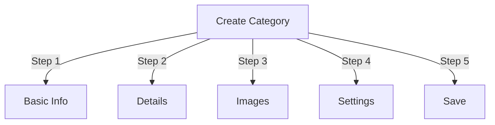

# Quản lý danh mục trong Nhà xuất bản

> Hướng dẫn đầy đủ về cách tạo, tổ chức phân cấp và quản lý danh mục trong mô-đun Nhà xuất bản.

---

## Thông tin cơ bản về danh mục

### Danh mục là gì?

Danh mục sắp xếp bài viết thành các nhóm hợp lý:

```
Example Structure:

  News (Main Category)
    ├── Technology
    ├── Sports
    └── Entertainment

  Tutorials (Main Category)
    ├── Photography
    │   ├── Basics
    │   └── Advanced
    └── Writing
        └── Blogging
```

### Lợi ích của Cấu trúc Danh mục Tốt

```
✓ Better user navigation
✓ Organized content
✓ Improved SEO
✓ Easier content management
✓ Better editorial workflow
```

---

## Truy cập quản lý danh mục

### Điều hướng bảng quản trị

```
Admin Panel
└── Modules
    └── Publisher
        └── Categories
            ├── Create New
            ├── Edit
            ├── Delete
            ├── Permissions
            └── Organize
```

### Truy cập nhanh

1. Đăng nhập với tư cách **Quản trị viên**
2. Đi tới **Quản trị viên → Mô-đun**
3. Nhấp vào **Nhà xuất bản → Quản trị viên**
4. Nhấp vào **Danh mục** ở menu bên trái

---

## Tạo danh mục

### Biểu mẫu tạo danh mục



### Bước 1: Thông tin cơ bản

#### Tên danh mục

```
Field: Category Name
Type: Text input (required)
Max length: 100 characters
Uniqueness: Should be unique
Example: "Photography"
```

**Hướng dẫn:**
- Mô tả và số ít hoặc số nhiều một cách nhất quán
- Viết hoa đúng cách
- Tránh các ký tự đặc biệt
- Viết ngắn hợp lý

#### Mô tả danh mục

```
Field: Description
Type: Textarea (optional)
Max length: 500 characters
Used in: Category listing pages, category blocks
```

**Mục đích:**
- Giải thích nội dung chuyên mục
- Xuất hiện ở trên danh mục bài viết
- Giúp người dùng hiểu phạm vi
- Được sử dụng cho mô tả meta SEO

**Ví dụ:**
```
"Photography tips, tutorials, and inspiration for
all skill levels. From composition basics to advanced
lighting techniques, master your craft."
```

### Bước 2: Danh mục gốc

#### Tạo hệ thống phân cấp

```
Field: Parent Category
Type: Dropdown
Options: None (root), or existing categories
```

**Ví dụ về hệ thống phân cấp:**

```
Flat Structure:
  News
  Tutorials
  Reviews

Nested Structure:
  News
    Technology
    Business
    Sports
  Tutorials
    Photography
      Basics
      Advanced
    Writing
```

**Tạo danh mục con:**

1. Nhấp vào trình đơn thả xuống **Danh mục chính**
2. Chọn phụ huynh (ví dụ: "Tin tức")
3. Điền tên danh mục
4. Lưu
5. Danh mục mới xuất hiện dưới dạng con

### Bước 3: Danh mục hình ảnh

#### Tải lên hình ảnh danh mục

```
Field: Category Image
Type: Image upload (optional)
Format: JPG, PNG, GIF, WebP
Max size: 5 MB
Recommended: 300x200 px (or your theme size)
```

**Để tải lên:**

1. Nhấp vào nút **Tải hình ảnh lên**
2. Chọn ảnh từ máy tính
3. Cắt/thay đổi kích thước nếu cần
4. Nhấp vào **Sử dụng hình ảnh này**

**Nơi sử dụng:**
- Trang danh sách danh mục
- Tiêu đề khối danh mục
- Breadcrumb (một số themes)
- Chia sẻ phương tiện truyền thông xã hội

### Bước 4: Cài đặt danh mục

#### Cài đặt hiển thị

```yaml
Status:
  - Enabled: Yes/No
  - Hidden: Yes/No (hidden from menus, still accessible)

Display Options:
  - Show description: Yes/No
  - Show image: Yes/No
  - Show article count: Yes/No
  - Show subcategories: Yes/No

Layout:
  - Items per page: 10-50
  - Display order: Date/Title/Author
  - Display direction: Ascending/Descending
```

#### Quyền của danh mục

```yaml
Who Can View:
  - Anonymous: Yes/No
  - Registered: Yes/No
  - Specific groups: Configure per group

Who Can Submit:
  - Registered: Yes/No
  - Specific groups: Configure per group
  - Author must have: "submit articles" permission
```

### Bước 5: Cài đặt SEO

#### Thẻ meta

```
Field: Meta Description
Type: Text (160 characters)
Purpose: Search engine description

Field: Meta Keywords
Type: Comma-separated list
Example: photography, tutorials, tips, techniques
```

#### Cấu hình URL

```
Field: URL Slug
Type: Text
Auto-generated from category name
Example: "photography" from "Photography"
Can be customized before saving
```

### Lưu danh mục

1. Điền vào tất cả các trường bắt buộc:
   - Tên danh mục ✓
   - Mô tả (khuyên dùng)
2. Tùy chọn: Upload hình ảnh, cài đặt SEO
3. Nhấp vào **Lưu danh mục**
4. Thông báo xác nhận xuất hiện
5. Danh mục hiện có sẵn

---

## Phân cấp danh mục

### Tạo cấu trúc lồng nhau

```
Step-by-step example: Create News → Technology subcategory

1. Go to Categories admin
2. Click "Add Category"
3. Name: "News"
4. Parent: (leave blank - this is root)
5. Save
6. Click "Add Category" again
7. Name: "Technology"
8. Parent: "News" (select from dropdown)
9. Save
```

### Xem cây phân cấp

```
Categories view shows tree structure:

📁 News
  📄 Technology
  📄 Sports
  📄 Entertainment
📁 Tutorials
  📄 Photography
    📄 Basics
    📄 Advanced
  📄 Writing
```

Nhấp vào mũi tên mở rộng để hiển thị/ẩn các danh mục phụ.

### Sắp xếp lại danh mục

#### Di chuyển danh mục

1. Vào danh sách Danh mục
2. Nhấp vào **Chỉnh sửa** trên danh mục
3. Thay đổi **Danh mục gốc**
4. Nhấp vào **Lưu**
5. Chuyên mục được chuyển sang vị trí mới

#### Sắp xếp lại danh mục

Nếu có, hãy sử dụng kéo và thả:

1. Vào danh sách Danh mục
2. Nhấp và kéo danh mục
3. Thả ở vị trí mới
4. Tự động lưu đơn hàng

#### Xóa danh mục

**Tùy chọn 1: Xóa mềm (Ẩn)**

1. Chỉnh sửa danh mục
2. Đặt **Trạng thái**: Đã tắt
3. Nhấp vào **Lưu**
4. Danh mục ẩn nhưng không bị xóa

**Tùy chọn 2: Xóa cứng**

1. Vào danh sách Danh mục
2. Nhấp vào **Xóa** trên danh mục
3. Chọn hành động cho bài viết:
   
```
   ☐ Move articles to parent category
   ☐ Move articles to root (News)
   ☐ Delete all articles in category
   
```
4. Xác nhận xóa

---

## Hoạt động danh mục

### Chỉnh sửa danh mục

1. Đi tới **Quản trị viên → Nhà xuất bản → Danh mục**
2. Nhấp vào **Chỉnh sửa** trên danh mục
3. Sửa đổi các trường:
   - Tên
   - Mô tả
   - Danh mục phụ huynh
   - Hình ảnh
   - Cài đặt
4. Nhấp vào **Lưu**

### Chỉnh sửa quyền danh mục

1. Vào Danh mục
2. Nhấp vào **Quyền** trên danh mục (hoặc nhấp vào danh mục rồi nhấp vào Quyền)
3. Cấu hình nhóm:

```
For each group:
  ☐ View articles in this category
  ☐ Submit articles to this category
  ☐ Edit own articles
  ☐ Edit all articles
  ☐ Approve/Moderate articles
  ☐ Manage category
```4. Nhấp vào **Lưu quyền**

### Đặt hình ảnh danh mục

**Tải lên hình ảnh mới:**

1. Chỉnh sửa danh mục
2. Nhấp vào **Thay đổi hình ảnh**
3. Tải lên hoặc chọn hình ảnh
4. Cắt/thay đổi kích thước
5. Nhấp vào **Sử dụng hình ảnh**
6. Nhấp vào **Lưu danh mục**

**Xóa hình ảnh:**

1. Chỉnh sửa danh mục
2. Nhấp vào **Xóa hình ảnh** (nếu có)
3. Nhấp vào **Lưu danh mục**

---

## Quyền của danh mục

### Ma trận quyền

```
                 Anonymous  Registered  Editor  Admin
View category        ✓         ✓         ✓       ✓
Submit article       ✗         ✓         ✓       ✓
Edit own article     ✗         ✓         ✓       ✓
Edit all articles    ✗         ✗         ✓       ✓
Moderate articles    ✗         ✗         ✓       ✓
Manage category      ✗         ✗         ✗       ✓
```

### Đặt quyền cấp danh mục

#### Kiểm soát truy cập theo danh mục

1. Vào danh sách **Danh mục**
2. Chọn danh mục
3. Nhấp vào **Quyền**
4. Đối với mỗi nhóm, chọn quyền:

```
Example: News category
  Anonymous:   View only
  Registered:  Submit articles
  Editors:     Approve articles
  Admins:      Full control
```

5. Nhấp vào **Lưu**

#### Quyền cấp trường

Kiểm soát những trường biểu mẫu mà người dùng có thể xem/chỉnh sửa:

```
Example: Limit field visibility for Registered users

Registered users can see/edit:
  ✓ Title
  ✓ Description
  ✓ Content
  ✗ Author (auto-set to current user)
  ✗ Scheduled date (only editors)
  ✗ Featured (only admins)
```

**Cấu hình trong:**
- Quyền danh mục
- Tìm phần “Field Visibility”

---

## Các phương pháp hay nhất cho danh mục

### Cấu trúc danh mục

```
✓ Keep hierarchy 2-3 levels deep
✗ Don't create too many top-level categories
✗ Don't create categories with one article

✓ Use consistent naming (plural or singular)
✗ Don't use vague names ("Stuff", "Other")

✓ Create categories for articles that exist
✗ Don't create empty categories in advance
```

### Hướng dẫn đặt tên

```
Good names:
  "Photography"
  "Web Development"
  "Travel Tips"
  "Business News"

Avoid:
  "Articles" (too vague)
  "Content" (redundant)
  "News&Updates" (inconsistent)
  "PHOTOGRAPHY STUFF" (formatting)
```

### Mẹo tổ chức

```
By Topic:
  News
    Technology
    Sports
    Entertainment

By Type:
  Tutorials
    Video
    Text
    Interactive

By Audience:
  For Beginners
  For Experts
  Case Studies

Geographic:
  North America
    United States
    Canada
  Europe
```

---

## Khối danh mục

### Khối danh mục nhà xuất bản

Hiển thị danh sách danh mục trên trang web của bạn:

1. Đi tới **Quản trị viên → Chặn**
2. Tìm **Nhà xuất bản - Danh mục**
3. Nhấp vào **Chỉnh sửa**
4. Cấu hình:

```
Block Title: "News Categories"
Show subcategories: Yes/No
Show article count: Yes/No
Height: (pixels or auto)
```

5. Nhấp vào **Lưu**

### Khối bài viết chuyên mục

Hiển thị các bài viết mới nhất từ danh mục cụ thể:

1. Đi tới **Quản trị viên → Chặn**
2. Tìm **Nhà xuất bản - Bài viết chuyên mục**
3. Nhấp vào **Chỉnh sửa**
4. Chọn:

```
Category: News (or specific category)
Number of articles: 5
Show images: Yes/No
Show description: Yes/No
```

5. Nhấp vào **Lưu**

---

## Phân tích danh mục

### Xem thống kê danh mục

Từ Danh mục admin:

```
Each category shows:
  - Total articles: 45
  - Published: 42
  - Draft: 2
  - Pending approval: 1
  - Total views: 5,234
  - Latest article: 2 hours ago
```

### Xem danh mục lưu lượng truy cập

Nếu phân tích được bật:

1. Nhấp vào tên danh mục
2. Nhấp vào tab **Thống kê**
3. Xem:
   - Lượt xem trang
   - Bài viết phổ biến
   - Xu hướng giao thông
   - Thuật ngữ tìm kiếm được sử dụng

---

## Mẫu danh mục

### Tùy chỉnh hiển thị danh mục

Nếu sử dụng templates tùy chỉnh, mỗi danh mục có thể ghi đè:

```
publisher_category.tpl
  ├── Category header
  ├── Category description
  ├── Category image
  ├── Article listing
  └── Pagination
```

**Để tùy chỉnh:**

1. Sao chép tập tin mẫu
2. Sửa đổi HTML/CSS
3. Gán vào danh mục trong admin
4. Danh mục sử dụng mẫu tùy chỉnh

---

## Nhiệm vụ chung

### Tạo hệ thống phân cấp tin tức

```
Admin → Publisher → Categories
1. Create "News" (parent)
2. Create "Technology" (parent: News)
3. Create "Sports" (parent: News)
4. Create "Entertainment" (parent: News)
```

### Di chuyển bài viết giữa các danh mục

1. Đi tới **Bài viết** admin
2. Chọn bài viết (hộp kiểm)
3. Chọn **"Thay đổi danh mục"** từ danh sách thả xuống hành động hàng loạt
4. Chọn danh mục mới
5. Nhấp vào **Cập nhật tất cả**

### Ẩn danh mục mà không xóa

1. Chỉnh sửa danh mục
2. Đặt **Trạng thái**: Tắt/Ẩn
3. Lưu
4. Danh mục không được hiển thị trong menu (vẫn có thể truy cập qua URL)

### Tạo danh mục cho bản nháp

```
Best Practice:

Create "In Review" category
  ├── Purpose: Articles awaiting approval
  ├── Permissions: Hidden from public
  ├── Only admins/editors can see
  ├── Move articles here until approved
  └── Move to "News" when published
```

---

## Danh mục Xuất/Nhập

### Xuất danh mục

Nếu có sẵn:

1. Vào **Danh mục** admin
2. Nhấp vào **Xuất**
3. Chọn định dạng: CSV/JSON/XML
4. Tải tập tin
5. Đã lưu bản sao lưu

### Nhập danh mục

Nếu có sẵn:

1. Chuẩn bị file theo danh mục
2. Đi tới **Danh mục** admin
3. Nhấp vào **Nhập**
4. Tải tập tin lên
5. Chọn chiến lược cập nhật:
   - Chỉ tạo mới
   - Cập nhật hiện có
   - Thay thế toàn bộ
6. Nhấp vào **Nhập**

---

## Danh mục khắc phục sự cố

### Vấn đề: Danh mục phụ không hiển thị

**Giải pháp:**
```
1. Verify parent category status is "Enabled"
2. Check permissions allow viewing
3. Verify subcategories have status "Enabled"
4. Clear cache: Admin → Tools → Clear Cache
5. Check theme shows subcategories
```

### Vấn đề: Không thể xóa danh mục

**Giải pháp:**
```
1. Category must have no articles
2. Move or delete articles first:
   Admin → Articles
   Select articles in category
   Change category to another
3. Then delete empty category
4. Or choose "move articles" option when deleting
```

### Vấn đề: Không hiển thị hình ảnh danh mục

**Giải pháp:**
```
1. Verify image uploaded successfully
2. Check image file format (JPG, PNG)
3. Verify upload directory permissions
4. Check theme displays category images
5. Try re-uploading image
6. Clear browser cache
```

### Vấn đề: Quyền không có hiệu lực

**Giải pháp:**
```
1. Check group permissions in Category
2. Check global Publisher permissions
3. Check user belongs to configured group
4. Clear session cache
5. Log out and log back in
6. Check permission modules installed
```

---

## Danh sách kiểm tra các phương pháp hay nhất của danh mụcTrước khi triển khai các danh mục:

- [ ] Hệ thống phân cấp sâu 2-3 cấp
- [ ] Mỗi chuyên mục có trên 5 bài viết
- [] Tên danh mục nhất quán
- [ ] Quyền phù hợp
- [ ] Hình ảnh danh mục được tối ưu hóa
- [ ] Mô tả đã hoàn tất
- [] Đã điền siêu dữ liệu SEO
- [ ] URL rất thân thiện
- [ ] Các danh mục đã được thử nghiệm ở mặt trước
- [] Đã cập nhật tài liệu

---

## Hướng dẫn liên quan

- Tạo bài viết
- Quản lý quyền
- Cấu hình mô-đun
- Hướng dẫn cài đặt

---

## Các bước tiếp theo

- Tạo bài viết theo chuyên mục
- Cấu hình quyền
- Tùy chỉnh với Mẫu tùy chỉnh

---

#nhà xuất bản #danh mục #tổ chức #phân cấp #quản lý #xoops