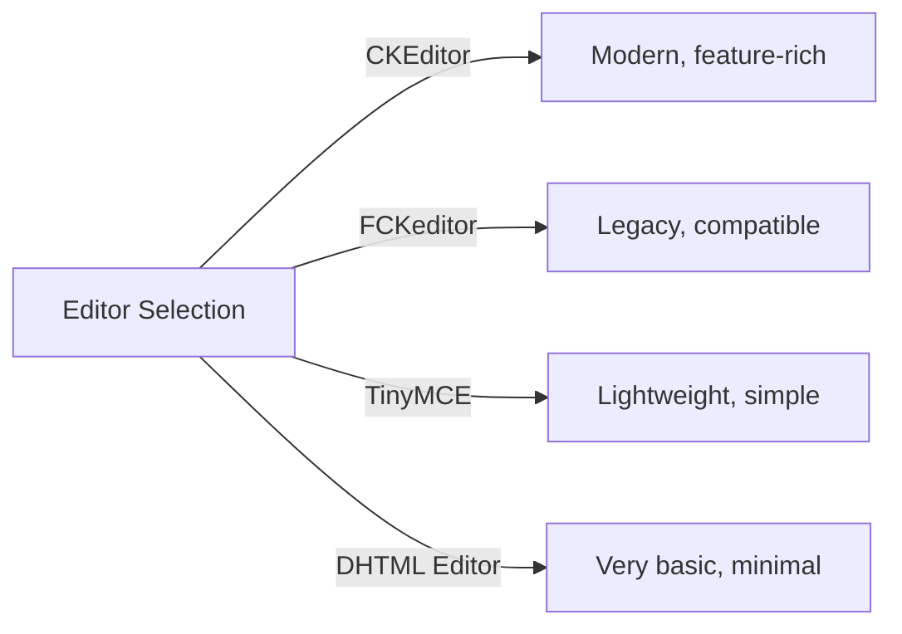
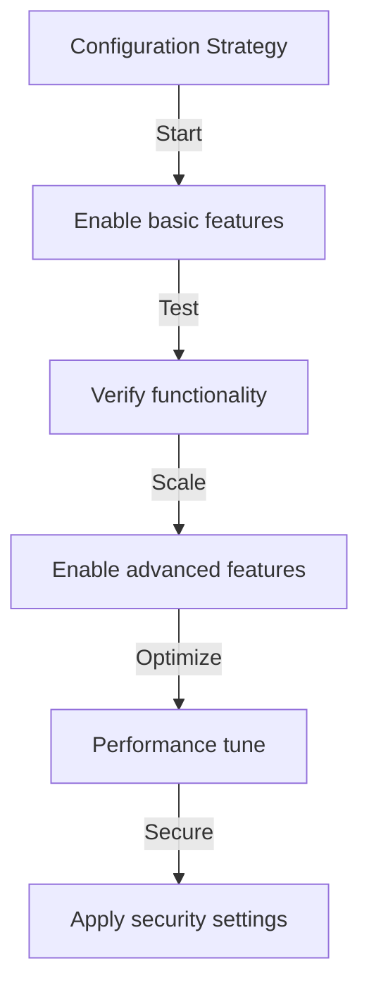

# Cấu hình cơ bản của nhà xuất bản

> Định cấu hình cài đặt, tùy chọn và tùy chọn chung của mô-đun Nhà xuất bản cho bản cài đặt XOOPS của bạn.

---

## Truy cập cấu hình

### Điều hướng bảng quản trị

```
XOOPS Admin Panel
└── Modules
    └── Publisher
        ├── Preferences
        ├── Settings
        └── Configuration
```

1. Đăng nhập với tư cách **Quản trị viên**
2. Đi tới **Bảng quản trị → Mô-đun**
3. Tìm mô-đun **Nhà xuất bản**
4. Nhấp vào liên kết **Preferences** hoặc **Admin**

---

## Cài đặt chung

### Cấu hình truy cập

```
Admin Panel → Modules → Publisher
```

Nhấp vào **biểu tượng bánh răng** hoặc **Cài đặt** để có các tùy chọn sau:

#### Tùy chọn hiển thị

| Cài đặt | Tùy chọn | Mặc định | Mô tả |
|----------|----------|---------|--------------|
| **Các mục trên mỗi trang** | 5-50 | 10 | Các bài viết được hiển thị trong danh sách |
| **Hiển thị đường dẫn** | Có/Không | Có | Hiển thị đường dẫn hướng |
| **Sử dụng phân trang** | Có/Không | Có | Phân trang danh sách dài |
| **Ngày chiếu** | Có/Không | Có | Hiển thị ngày bài viết |
| **Hiển thị danh mục** | Có/Không | Có | Hiển thị danh mục bài viết |
| **Hiển thị tác giả** | Có/Không | Có | Hiển thị tác giả bài viết |
| **Hiển thị lượt xem** | Có/Không | Có | Hiển thị số lượt xem bài viết |

**Cấu hình ví dụ:**

```yaml
Items Per Page: 15
Show Breadcrumb: Yes
Use Paging: Yes
Show Date: Yes
Show Category: Yes
Show Author: Yes
Show Views: Yes
```

#### Tùy chọn tác giả

| Cài đặt | Mặc định | Mô tả |
|----------|----------|-------------|
| **Hiển thị tên tác giả** | Có | Hiển thị tên thật hoặc tên người dùng |
| **Sử dụng tên người dùng** | Không | Hiển thị tên người dùng thay vì tên |
| **Hiển thị email tác giả** | Không | Hiển thị email liên hệ của tác giả |
| **Hiển thị hình đại diện của tác giả** | Có | Hiển thị hình đại diện người dùng |

---

## Cấu hình trình soạn thảo

### Chọn Trình soạn thảo WYSIWYG

Nhà xuất bản hỗ trợ nhiều biên tập viên:

#### Trình chỉnh sửa có sẵn



### CKEditor (Được khuyến nghị)

**Tốt nhất cho:** Hầu hết người dùng, trình duyệt hiện đại, đầy đủ tính năng

1. Đi tới **Tùy chọn**
2. Đặt **Trình chỉnh sửa**: CKEditor
3. Tùy chọn cấu hình:

```
Editor: CKEditor 4.x
Toolbar: Full
Height: 400px
Width: 100%
Remove plugins: []
Add plugins: [mathjax, codesnippet]
```

### FCKeditor

**Tốt nhất cho:** Khả năng tương thích, hệ thống cũ hơn

```
Editor: FCKeditor
Toolbar: Default
Custom config: (optional)
```

### TinyMCE

**Tốt nhất cho:** Dung lượng tối thiểu, chỉnh sửa cơ bản

```
Editor: TinyMCE
Plugins: [paste, table, link, image]
Toolbar: minimal
```

---

## Cài đặt tệp và tải lên

### Định cấu hình thư mục tải lên

```
Admin → Publisher → Preferences → Upload Settings
```

#### Cài đặt loại tệp

```yaml
Allowed File Types:
  Images:
    - jpg
    - jpeg
    - gif
    - png
    - webp
  Documents:
    - pdf
    - doc
    - docx
    - xls
    - xlsx
    - ppt
    - pptx
  Archives:
    - zip
    - rar
    - 7z
  Media:
    - mp3
    - mp4
    - webm
    - mov
```

#### Giới hạn kích thước tệp

| Loại tệp | Kích thước tối đa | Ghi chú |
|----------|----------|-------|
| **Hình ảnh** | 5 MB | Mỗi tệp hình ảnh |
| **Tài liệu** | 10 MB | Tệp PDF, Office |
| **Truyền thông** | 50 MB | Tệp video/âm thanh |
| **Tất cả các tệp** | 100 MB | Tổng số mỗi lần tải lên |

**Cấu hình:**

```
Max Image Upload Size: 5 MB
Max Document Upload Size: 10 MB
Max Media Upload Size: 50 MB
Total Upload Size: 100 MB
Max Files per Article: 5
```

### Thay đổi kích thước hình ảnh

Nhà xuất bản tự động thay đổi kích thước hình ảnh để nhất quán:

```yaml
Thumbnail Size:
  Width: 150
  Height: 150
  Mode: Crop/Resize

Category Image Size:
  Width: 300
  Height: 200
  Mode: Resize

Article Featured Image:
  Width: 600
  Height: 400
  Mode: Resize
```

---

## Cài đặt bình luận và tương tác

### Cấu hình bình luận

```
Preferences → Comments Section
```

#### Tùy chọn bình luận

```yaml
Allow Comments:
  - Enabled: Yes/No
  - Default: Yes
  - Per-article override: Yes

Comment Moderation:
  - Moderate comments: Yes/No
  - Moderate guest comments only: Yes/No
  - Spam filter: Enabled
  - Max comments per day: (unlimited)

Comment Display:
  - Display format: Threaded/Flat
  - Comments per page: 10
  - Date format: Full date/Time ago
  - Show comment count: Yes/No
```

### Cấu hình xếp hạng

```yaml
Allow Ratings:
  - Enabled: Yes/No
  - Default: Yes
  - Per-article override: Yes

Rating Options:
  - Rating scale: 5 stars (default)
  - Allow user to rate own: No
  - Show average rating: Yes
  - Show rating count: Yes
```

---

## Cài đặt SEO & URL

### Tối ưu hóa công cụ tìm kiếm

```
Preferences → SEO Settings
```

#### Cấu hình URL

```yaml
SEO URLs:
  - Enabled: No (set to Yes for SEO URLs)
  - URL rewriting: None/Apache mod_rewrite/IIS rewrite

URL Format:
  - Category: /category/news
  - Article: /article/welcome-to-site
  - Archive: /archive/2024/01

Meta Description:
  - Auto-generate: Yes
  - Max length: 160 characters

Meta Keywords:
  - Auto-generate: Yes
  - From: Article tags, title
```

### Kích hoạt URL SEO (Nâng cao)

**Điều kiện tiên quyết:**
- Đã bật Apache với `mod_rewrite`
- Đã bật hỗ trợ `.htaccess`

**Các bước cấu hình:**

1. Đi tới **Tùy chọn → Cài đặt SEO**
2. Đặt **SEO URL**: Có
3. Đặt **URL Viết lại**: Apache mod_rewrite
4. Xác minh tệp `.htaccess` tồn tại trong thư mục Nhà xuất bản

**Cấu hình .htaccess:**

```apache
<IfModule mod_rewrite.c>
    RewriteEngine On
    RewriteBase /modules/publisher/

    # Category rewrites
    RewriteRule ^category/([0-9]+)-(.*)\.html$ index.php?op=showcategory&categoryid=$1 [L,QSA]

    # Article rewrites
    RewriteRule ^article/([0-9]+)-(.*)\.html$ index.php?op=showitem&itemid=$1 [L,QSA]

    # Archive rewrites
    RewriteRule ^archive/([0-9]+)/([0-9]+)/$ index.php?op=archive&year=$1&month=$2 [L,QSA]
</IfModule>
```

---

## Bộ nhớ đệm & Hiệu suất

### Cấu hình bộ nhớ đệm

```
Preferences → Cache Settings
```

```yaml
Enable Caching:
  - Enabled: Yes
  - Cache type: File (or Memcache)

Cache Lifetime:
  - Category lists: 3600 seconds (1 hour)
  - Article lists: 1800 seconds (30 minutes)
  - Single article: 7200 seconds (2 hours)
  - Recent articles block: 900 seconds (15 minutes)

Cache Clear:
  - Manual clear: Available in admin
  - Auto-clear on article save: Yes
  - Clear on category change: Yes
```

### Xóa bộ nhớ đệm

**Xóa bộ nhớ đệm thủ công:**1. Đi tới **Quản trị viên → Nhà xuất bản → Công cụ**
2. Nhấp vào **Xóa bộ nhớ cache**
3. Chọn loại bộ đệm để xóa:
   - [] Bộ đệm danh mục
   - [ ] Bộ nhớ đệm bài viết
   - [] Chặn bộ đệm
   - [] Tất cả bộ đệm
4. Nhấp vào **Xóa đã chọn**

**Dòng lệnh:**

```bash
# Clear all Publisher cache
php /path/to/xoops/admin/cache_manage.php publisher

# Or directly delete cache files
rm -rf /path/to/xoops/var/cache/publisher/*
```

---

## Thông báo & Quy trình làm việc

### Thông báo qua email

```
Preferences → Notifications
```

```yaml
Notify Admin on New Article:
  - Enabled: Yes
  - Recipient: Admin email
  - Include summary: Yes

Notify Moderators:
  - Enabled: Yes
  - On new submission: Yes
  - On pending articles: Yes

Notify Author:
  - On approval: Yes
  - On rejection: Yes
  - On comment: No (optional)
```

### Quy trình gửi bài

```yaml
Require Approval:
  - Enabled: Yes
  - Editor approval: Yes
  - Admin approval: No

Draft Save:
  - Auto-save interval: 60 seconds
  - Save local versions: Yes
  - Revision history: Last 5 versions
```

---

## Cài đặt nội dung

### Mặc định xuất bản

```
Preferences → Content Settings
```

```yaml
Default Article Status:
  - Draft/Published: Draft
  - Featured by default: No
  - Auto-publish time: None

Default Visibility:
  - Public/Private: Public
  - Show on front page: Yes
  - Show in categories: Yes

Scheduled Publishing:
  - Enabled: Yes
  - Allow per-article: Yes

Content Expiration:
  - Enabled: No
  - Auto-archive old: No
  - Archive after days: (unlimited)
```

### Tùy chọn nội dung WYSIWYG

```yaml
Allow HTML:
  - In articles: Yes
  - In comments: No

Allow Embedded Media:
  - Videos (iframe): Yes
  - Images: Yes
  - Plugins: No

Content Filtering:
  - Strip tags: No
  - XSS filter: Yes (recommended)
```

---

## Cài đặt công cụ tìm kiếm

### Định cấu hình Tích hợp tìm kiếm

```
Preferences → Search Settings
```

```yaml
Enable Article Indexing:
  - Include in site search: Yes
  - Index type: Full text/Title only

Search Options:
  - Search in titles: Yes
  - Search in content: Yes
  - Search in comments: Yes

Meta Tags:
  - Auto generate: Yes
  - OG tags (social): Yes
  - Twitter cards: Yes
```

---

## Cài đặt nâng cao

### Chế độ gỡ lỗi (Chỉ dành cho nhà phát triển)

```
Preferences → Advanced
```

```yaml
Debug Mode:
  - Enabled: No (only for development!)

Development Features:
  - Show SQL queries: No
  - Log errors: Yes
  - Error email: admin@example.com
```

### Tối ưu hóa cơ sở dữ liệu

```
Admin → Tools → Optimize Database
```

```bash
# Manual optimization
mysql> OPTIMIZE TABLE publisher_items;
mysql> OPTIMIZE TABLE publisher_categories;
mysql> OPTIMIZE TABLE publisher_comments;
```

---

## Tùy chỉnh mô-đun

### Mẫu chủ đề

```
Preferences → Display → Templates
```

Chọn bộ mẫu:
- Mặc định
- Cổ điển
- Hiện đại
- Tối
- Tùy chỉnh

Mỗi mẫu điều khiển:
- Bố cục bài viết
- Danh sách danh mục
- Hiển thị lưu trữ
- Hiển thị bình luận

---

## Mẹo cấu hình

### Các phương pháp hay nhất



1. **Bắt đầu đơn giản** - Trước tiên hãy bật các tính năng cốt lõi
2. **Kiểm tra từng thay đổi** - Xác minh trước khi tiếp tục
3. **Bật bộ nhớ đệm** - Cải thiện hiệu suất
4. **Sao lưu trước** - Xuất cài đặt trước những thay đổi lớn
5. **Nhật ký giám sát** - Kiểm tra nhật ký lỗi thường xuyên

### Tối ưu hóa hiệu suất

```yaml
For Better Performance:
  - Enable caching: Yes
  - Cache lifetime: 3600 seconds
  - Limit items per page: 10-15
  - Compress images: Yes
  - Minify CSS/JS: Yes (if available)
```

### Tăng cường bảo mật

```yaml
For Better Security:
  - Moderate comments: Yes
  - Disable HTML in comments: Yes
  - XSS filtering: Yes
  - File type whitelist: Strict
  - Max upload size: Reasonable limit
```

---

## Cài đặt xuất/nhập

### Cấu hình sao lưu

```
Admin → Tools → Export Settings
```

**Để sao lưu cấu hình hiện tại:**

1. Nhấp vào **Xuất cấu hình**
2. Lưu tệp `.cfg` đã tải xuống
3. Bảo quản ở nơi an toàn

**Để khôi phục:**

1. Nhấp vào **Nhập cấu hình**
2. Chọn tệp `.cfg`
3. Nhấp vào **Khôi phục**

---

## Hướng dẫn cấu hình liên quan

- Quản lý danh mục
- Tạo bài viết
- Cấu hình quyền
- Hướng dẫn cài đặt

---

## Khắc phục sự cố cấu hình

### Cài đặt sẽ không lưu

**Giải pháp:**
1. Kiểm tra quyền truy cập thư mục trên `/var/config/`
2. Xác minh quyền truy cập ghi PHP
3. Kiểm tra nhật ký lỗi PHP để tìm sự cố
4. Xóa bộ nhớ đệm của trình duyệt và thử lại

### Trình chỉnh sửa không xuất hiện

**Giải pháp:**
1. Xác minh plugin trình soạn thảo đã được cài đặt
2. Kiểm tra cấu hình trình soạn thảo XOOPS
3. Thử tùy chọn trình soạn thảo khác
4. Kiểm tra bảng điều khiển trình duyệt để tìm lỗi JavaScript

### Vấn đề về hiệu suất

**Giải pháp:**
1. Kích hoạt bộ nhớ đệm
2. Giảm số mục trên mỗi trang
3. Nén hình ảnh
4. Kiểm tra tối ưu hóa cơ sở dữ liệu
5. Xem lại nhật ký truy vấn chậm

---

## Các bước tiếp theo

- Cấu hình quyền nhóm
- Tạo bài viết đầu tiên của bạn
- Thiết lập danh mục
- Xem lại mẫu tùy chỉnh

---

#publisher #configuration #preferences #settings #xoops