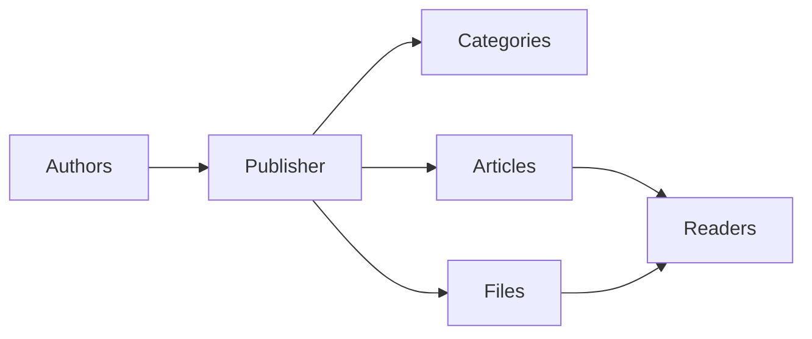
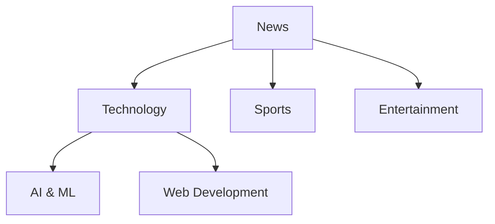
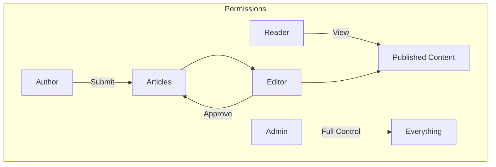
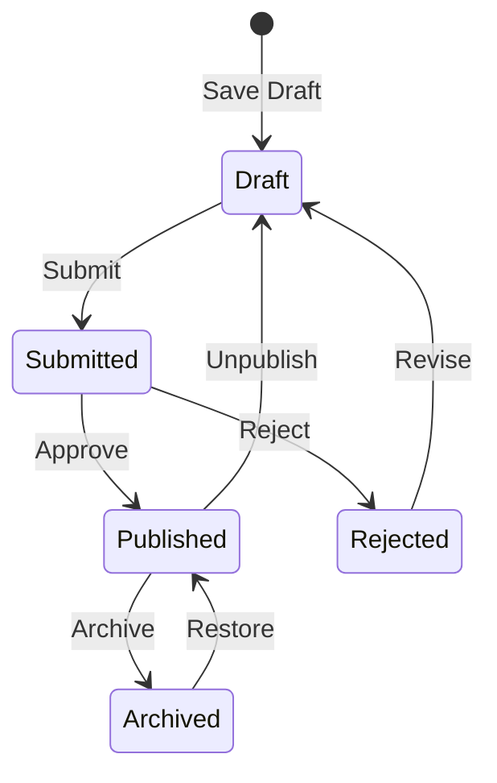

# Bắt đầu với Nhà xuất bản

> Hướng dẫn từng bước cách thiết lập và sử dụng mô-đun blog/tin tức Nhà xuất bản.

---

## Nhà xuất bản là gì?

Nhà xuất bản là mô-đun quản lý nội dung hàng đầu dành cho XOOPS, được thiết kế cho:

- **Trang tin tức** - Xuất bản bài viết theo danh mục
- **Blog** - Viết blog cá nhân hoặc nhiều tác giả``
- **Tài liệu** - Cơ sở kiến thức được tổ chức
- **Cổng nội dung** - Nội dung đa phương tiện



---

## Thiết lập nhanh

### Bước 1: Cài đặt Nhà xuất bản

1. Tải xuống từ [GitHub](https://github.com/XoopsModules25x/publisher)
2. Tải lên `modules/publisher/`
3. Vào Quản trị → Mô-đun → Cài đặt

### Bước 2: Tạo danh mục



1. Quản trị → Nhà xuất bản → Danh mục
2. Nhấp vào "Thêm danh mục"
3. Điền vào:
   - **Tên**: Tên danh mục
   - **Mô tả**: Danh mục này chứa những gì
   - **Hình ảnh**: Hình ảnh danh mục tùy chọn
4. Đặt quyền (ai có thể gửi/xem)
5. Lưu

### Bước 3: Cấu hình cài đặt

1. Quản trị viên → Nhà xuất bản → Tùy chọn
2. Các thiết lập chính cần cấu hình:

| Cài đặt | Được đề xuất | Mô tả |
|----------|-------------|-------------|
| Các mục trên mỗi trang | 10-20 | Các bài viết trên chỉ mục |
| Biên tập viên | TinyMCE/CKEditor | Trình soạn thảo văn bản phong phú |
| Cho phép xếp hạng | Có | Phản hồi của độc giả |
| Cho phép bình luận | Có | Thảo luận |
| Tự động phê duyệt | Không | Kiểm soát biên tập |

### Bước 4: Tạo bài viết đầu tiên của bạn

1. Menu chính → Nhà xuất bản → Gửi bài viết
2. Điền vào mẫu:
   - **Tiêu đề**: Tiêu đề bài viết
   - **Danh mục**: Nơi nó thuộc về
   - **Tóm tắt**: Mô tả ngắn gọn
   - **Nội dung**: Toàn bộ nội dung bài viết
3. Thêm các yếu tố tùy chọn:
   - Hình ảnh nổi bật
   - Tập tin đính kèm
   - Cài đặt SEO
4. Gửi để xem xét hoặc xuất bản

---

## Vai trò của người dùng



### Người đọc
- Xem các bài viết đã xuất bản
- Đánh giá và nhận xét
- Tìm kiếm nội dung

### Tác giả
- Gửi bài viết mới
- Chỉnh sửa bài viết riêng
- Đính kèm tập tin

### Biên tập viên
- Phê duyệt/từ chối bài nộp
- Chỉnh sửa bất kỳ bài viết
- Quản lý danh mục

### Quản trị viên
- Kiểm soát mô-đun đầy đủ
- Cấu hình cài đặt
- Quản lý quyền

---

## Viết bài

### Người biên tập bài viết

```
┌─────────────────────────────────────────────────────┐
│ Title: [Your Article Title                        ] │
├─────────────────────────────────────────────────────┤
│ Category: [Select Category          ▼]              │
├─────────────────────────────────────────────────────┤
│ Summary:                                            │
│ ┌─────────────────────────────────────────────────┐ │
│ │ Brief description shown in listings...          │ │
│ └─────────────────────────────────────────────────┘ │
├─────────────────────────────────────────────────────┤
│ Body:                                               │
│ ┌─────────────────────────────────────────────────┐ │
│ │ [B] [I] [U] [Link] [Image] [Code]               │ │
│ ├─────────────────────────────────────────────────┤ │
│ │                                                  │ │
│ │ Full article content goes here...               │ │
│ │                                                  │ │
│ └─────────────────────────────────────────────────┘ │
├─────────────────────────────────────────────────────┤
│ [Submit] [Preview] [Save Draft]                     │
└─────────────────────────────────────────────────────┘
```

### Các phương pháp hay nhất

1. **Tiêu đề hấp dẫn** - Tiêu đề rõ ràng, hấp dẫn
2. **Tóm tắt hay** - Lôi kéo người đọc click vào
3. **Nội dung có cấu trúc** - Sử dụng tiêu đề, danh sách, hình ảnh
4. **Phân loại phù hợp** - Giúp người đọc tìm thấy nội dung
5. **Tối ưu hóa SEO** - Từ khóa trong tiêu đề và nội dung

---

## Quản lý nội dung

### Luồng trạng thái bài viết



### Mô tả trạng thái

| Trạng thái | Mô tả |
|--------|-------------|
| Bản nháp | Công việc đang được tiến hành |
| Đã gửi | Đang chờ xem xét |
| Đã xuất bản | Trực tiếp trên trang web |
| Đã hết hạn | Ngày hết hạn đã qua |
| Bị từ chối | Cần sửa đổi |
| Đã lưu trữ | Đã xóa khỏi danh sách |

---

## Điều hướng

### Truy cập Nhà xuất bản

- **Menu chính** → Nhà xuất bản
- **URL trực tiếp**: `yoursite.com/modules/publisher/`

### Các trang chính

| Trang | URL | Mục đích |
|------|------|----------|
| Chỉ mục | `/modules/publisher/` | Danh sách bài viết |
| Danh mục | `/modules/publisher/category.php?id=X` | Chuyên mục bài viết |
| Bài viết | `/modules/publisher/item.php?itemid=X` | Bài viết đơn |
| Gửi | `/modules/publisher/submit.php` | Bài viết mới |
| Tìm kiếm | `/modules/publisher/search.php` | Tìm bài viết |

---

## Khối

Nhà xuất bản cung cấp một số khối cho trang web của bạn:

### Bài viết gần đây
Hiển thị các bài viết được xuất bản mới nhất

### Thực đơn danh mục
Điều hướng theo danh mục

### Bài viết phổ biến
Nội dung được xem nhiều nhất### Bài viết ngẫu nhiên
Hiển thị nội dung ngẫu nhiên

### Tiêu điểm
Bài viết nổi bật

---

## Tài liệu liên quan

- Tạo và chỉnh sửa bài viết
- Quản lý danh mục
- Mở rộng nhà xuất bản

---

#xoops #publisher #hướng dẫn sử dụng #bắt đầu #cms