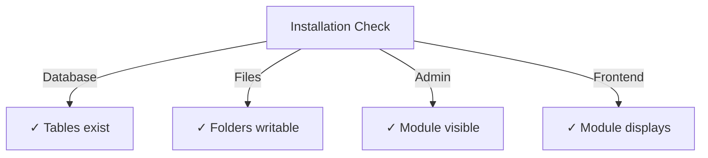

# Hướng dẫn cài đặt nhà xuất bản

> Hướng dẫn đầy đủ về cài đặt và cấu hình mô-đun Nhà xuất bản cho XOOPS CMS.

---

## Yêu cầu hệ thống

### Yêu cầu tối thiểu

| Yêu cầu | Phiên bản | Ghi chú |
|-------------|----------|-------|
| XOOPS | 2.5.10+ | Nền tảng CMS cốt lõi |
| PHP | 7.1+ | Khuyến nghị PHP 8.x |
| MySQL | 5,7+ | Máy chủ cơ sở dữ liệu |
| Máy chủ Web | Apache/Nginx | Với sự hỗ trợ viết lại |

### Tiện ích mở rộng PHP

```
- PDO (PHP Data Objects)
- pdo_mysql or mysqli
- mb_string (multibyte strings)
- curl (for external content)
- json
- gd (image processing)
```

### Dung lượng đĩa

- **Tệp mô-đun**: ~5 MB
- **Thư mục bộ đệm**: Khuyến nghị trên 50 MB
- **Thư mục tải lên**: Theo nội dung cần thiết

---

## Danh sách kiểm tra trước khi cài đặt

Trước khi cài đặt Nhà xuất bản, hãy xác minh:

- [ ] Đã cài đặt và chạy lõi XOOPS
- [] Tài khoản quản trị viên có quyền quản lý mô-đun
- [] Đã tạo bản sao lưu cơ sở dữ liệu
- [ ] Quyền truy cập tệp cho phép truy cập ghi vào thư mục `/modules/`
- [ ] Giới hạn bộ nhớ PHP tối thiểu là 128 MB
- [ ] Giới hạn kích thước tải lên tệp phù hợp (tối thiểu 10 MB)

---

## Các bước cài đặt

### Bước 1: Tải Nhà xuất bản

#### Tùy chọn A: Từ GitHub (Được khuyến nghị)

```bash
# Navigate to modules directory
cd /path/to/xoops/htdocs/modules/

# Clone the repository
git clone https://github.com/XoopsModules25x/publisher.git

# Verify download
ls -la publisher/
```

#### Tùy chọn B: Tải xuống thủ công

1. Truy cập [Bản phát hành của nhà xuất bản GitHub](https://github.com/XoopsModules25x/publisher/releases)
2. Tải xuống tệp `.zip` mới nhất
3. Giải nén vào `modules/publisher/`

### Bước 2: Đặt quyền cho tệp

```bash
# Set proper ownership
chown -R www-data:www-data /path/to/xoops/htdocs/modules/publisher

# Set directory permissions (755)
find publisher -type d -exec chmod 755 {} \;

# Set file permissions (644)
find publisher -type f -exec chmod 644 {} \;

# Make scripts executable
chmod 755 publisher/admin/index.php
chmod 755 publisher/index.php
```

### Bước 3: Cài đặt qua XOOPS Admin

1. Đăng nhập vào **Bảng quản trị XOOPS** với tên administrator
2. Điều hướng đến **Hệ thống → Mô-đun**
3. Nhấp vào **Cài đặt mô-đun**
4. Tìm **Nhà xuất bản** trong danh sách
5. Nhấp vào nút **Cài đặt**
6. Đợi quá trình cài đặt hoàn tất (hiển thị các bảng cơ sở dữ liệu đã được tạo)

```
Installation Progress:
✓ Tables created
✓ Configuration initialized
✓ Permissions set
✓ Cache cleared
Installation Complete!
```

---

## Thiết lập ban đầu

### Bước 1: Truy cập Quản trị viên Nhà xuất bản

1. Đi tới **Bảng quản trị → Mô-đun**
2. Tìm mô-đun **Nhà xuất bản**
3. Nhấp vào liên kết **Quản trị**
4. Bạn hiện đang ở Quản trị nhà xuất bản

### Bước 2: Cấu hình tùy chọn mô-đun

1. Nhấp vào **Tùy chọn** ở menu bên trái
2. Cấu hình các cài đặt cơ bản:

```
General Settings:
- Editor: Select your WYSIWYG editor
- Items per page: 10
- Show breadcrumb: Yes
- Allow comments: Yes
- Allow ratings: Yes

SEO Settings:
- SEO URLs: No (enable later if needed)
- URL rewriting: None

Upload Settings:
- Max upload size: 5 MB
- Allowed file types: jpg, png, gif, pdf, doc, docx
```

3. Nhấp vào **Lưu cài đặt**

### Bước 3: Tạo danh mục đầu tiên

1. Nhấp vào **Danh mục** ở menu bên trái
2. Nhấp vào **Thêm danh mục**
3. Điền vào mẫu:

```
Category Name: News
Description: Latest news and updates
Image: (optional) Upload category image
Parent Category: (leave blank for top-level)
Status: Enabled
```

4. Nhấp vào **Lưu danh mục**

### Bước 4: Xác minh cài đặt

Kiểm tra các chỉ số này:



#### Kiểm tra cơ sở dữ liệu

```bash
mysql -u xoops_user -p xoops_database
mysql> SHOW TABLES LIKE 'publisher%';

# Should show tables:
# - publisher_categories
# - publisher_items
# - publisher_comments
# - publisher_files
```

#### Kiểm tra giao diện người dùng

1. Truy cập trang chủ XOOPS của bạn
2. Tìm khối **Nhà xuất bản** hoặc **Tin tức**
3. Nên hiển thị các bài viết gần đây

---

## Cấu hình sau khi cài đặt

### Lựa chọn trình soạn thảo

Nhà xuất bản hỗ trợ nhiều trình soạn thảo WYSIWYG:

| Biên tập viên | Ưu điểm | Nhược điểm |
|--------|------|------|
| FCKeditor | Giàu tính năng | Cũ hơn, lớn hơn |
| CKEditor | Tiêu chuẩn hiện đại | Cấu hình phức tạp |
| TinyMCE | Nhẹ | Tính năng hạn chế |
| Trình soạn thảo DHTML | Cơ bản | Rất cơ bản |

**Để thay đổi trình chỉnh sửa:**

1. Đi tới **Tùy chọn**
2. Di chuyển đến cài đặt **Trình chỉnh sửa**
3. Chọn từ danh sách thả xuống
4. Lưu và kiểm tra

### Thiết lập thư mục tải lên

```bash
# Create upload directories
mkdir -p /path/to/xoops/uploads/publisher/
mkdir -p /path/to/xoops/uploads/publisher/categories/
mkdir -p /path/to/xoops/uploads/publisher/images/
mkdir -p /path/to/xoops/uploads/publisher/files/

# Set permissions
chmod 755 /path/to/xoops/uploads/publisher/
chmod 755 /path/to/xoops/uploads/publisher/*
```

### Định cấu hình kích thước hình ảnh

Trong Tùy chọn, đặt kích thước hình thu nhỏ:

```
Category image size: 300 x 200 px
Article image size: 600 x 400 px
Thumbnail size: 150 x 100 px
```

---

## Các bước sau khi cài đặt

### 1. Đặt quyền cho nhóm1. Đi tới **Quyền** trong menu admin
2. Cấu hình quyền truy cập cho các nhóm:
   - Ẩn danh: Chỉ xem
   - Người dùng đã đăng ký: Gửi bài viết
   - Biên tập viên: Phê duyệt/chỉnh sửa bài viết
   - Quản trị viên: Toàn quyền truy cập

### 2. Định cấu hình khả năng hiển thị của mô-đun

1. Đi tới **Khối** trong XOOPS admin
2. Tìm khối Nhà xuất bản:
   - Nhà xuất bản - Bài viết mới nhất
   - Nhà xuất bản - Thể loại
   - Nhà xuất bản - Lưu trữ
3. Định cấu hình khả năng hiển thị khối trên mỗi trang

### 3. Nhập nội dung kiểm tra (Tùy chọn)

Để thử nghiệm, hãy nhập các bài viết mẫu:

1. Đi tới **Quản trị viên nhà xuất bản → Nhập**
2. Chọn **Nội dung mẫu**
3. Nhấp vào **Nhập**

### 4. Kích hoạt URL SEO (Tùy chọn)

Đối với các URL thân thiện với tìm kiếm:

1. Đi tới **Tùy chọn**
2. Đặt **SEO URL**: Có
3. Kích hoạt tính năng viết lại **.htaccess**
4. Xác minh tệp `.htaccess` tồn tại trong thư mục Nhà xuất bản

```apache
# .htaccess example
<IfModule mod_rewrite.c>
    RewriteEngine On
    RewriteBase /modules/publisher/
    RewriteRule ^category/([0-9]+)-(.*)\.html$ index.php?op=showcategory&categoryid=$1 [L]
    RewriteRule ^article/([0-9]+)-(.*)\.html$ index.php?op=showitem&itemid=$1 [L]
</IfModule>
```

---

## Khắc phục sự cố cài đặt

### Vấn đề: Mô-đun không xuất hiện trong admin

**Giải pháp:**
```bash
# Check file permissions
ls -la /path/to/xoops/modules/publisher/

# Check xoops_version.php exists
ls /path/to/xoops/modules/publisher/xoops_version.php

# Verify PHP syntax
php -l /path/to/xoops/modules/publisher/xoops_version.php
```

### Vấn đề: Bảng cơ sở dữ liệu không được tạo

**Giải pháp:**
1. Kiểm tra xem người dùng MySQL có đặc quyền CREATE TABLE
2. Kiểm tra nhật ký lỗi cơ sở dữ liệu:
   
```bash
   mysql> SHOW WARNINGS;
   
```
3. Nhập thủ công SQL:
   
```bash
   mysql -u user -p database < modules/publisher/sql/mysql.sql
   
```

### Vấn đề: Tải file lên không thành công

**Giải pháp:**
```bash
# Check directory exists and is writable
stat /path/to/xoops/uploads/publisher/

# Fix permissions
chmod 777 /path/to/xoops/uploads/publisher/

# Verify PHP settings
php -i | grep upload_max_filesize
```

### Vấn đề: Lỗi "Không tìm thấy trang"

**Giải pháp:**
1. Kiểm tra xem có tệp `.htaccess` không
2. Xác minh Apache `mod_rewrite` đã được bật:
   
```bash
   a2enmod rewrite
   systemctl restart apache2
   
```
3. Kiểm tra `AllowOverride All` trong cấu hình Apache

---

## Nâng cấp từ các phiên bản trước

### Từ Nhà xuất bản 1.x đến 2.x

1. **Cài đặt dự phòng hiện tại:**
   
```bash
   cp -r modules/publisher/ modules/publisher-backup/
   mysqldump -u user -p database > publisher-backup.sql
   
```

2. **Tải xuống Nhà xuất bản 2.x**

3. **Ghi đè tập tin:**
   
```bash
   rm -rf modules/publisher/
   unzip publisher-2.0.zip -d modules/
   
```

4. **Chạy cập nhật:**
   - Vào **Quản trị viên → Nhà xuất bản → Cập nhật**
   - Nhấp vào **Cập nhật cơ sở dữ liệu**
   - Chờ hoàn thành

5. **Xác minh:**
   - Kiểm tra tất cả các bài viết hiển thị chính xác
   - Xác minh quyền còn nguyên vẹn
   - Tệp thử nghiệm uploads

---

## Cân nhắc về bảo mật

### Quyền đối với tệp

```
- Core files: 644 (readable by web server)
- Directories: 755 (browseable by web server)
- Upload directories: 755 or 777
- Config files: 600 (not readable by web)
```

### Vô hiệu hóa quyền truy cập trực tiếp vào các tệp nhạy cảm

Tạo `.htaccess` trong thư mục tải lên:

```apache
<FilesMatch "\.(php|phtml|php3|php4|php5|phtml)$">
    Deny from all
</FilesMatch>
```

### Bảo mật cơ sở dữ liệu

```bash
# Use strong password
ALTER USER 'publisher_user'@'localhost' IDENTIFIED BY 'strong_password_here';

# Grant minimal permissions
GRANT SELECT, INSERT, UPDATE, DELETE ON publisher_db.* TO 'publisher_user'@'localhost';
FLUSH PRIVILEGES;
```

---

## Danh sách kiểm tra xác minh

Sau khi cài đặt, hãy xác minh:

- [ ] Mô-đun xuất hiện trong danh sách admin modules
- [ ] Có thể truy cập phần Nhà xuất bản admin
- [] Có thể tạo danh mục
- [ ] Có thể tạo bài viết
- [ ] Bài viết hiển thị ở front-end
- [] Tệp uploads hoạt động
- [ ] Hình ảnh hiển thị chính xác
- [ ] Quyền được áp dụng chính xác
- [] Đã tạo bảng cơ sở dữ liệu
- [] Thư mục bộ đệm có thể ghi

---

## Các bước tiếp theo

Sau khi cài đặt thành công:

1. Đọc Hướng dẫn cấu hình cơ bản
2. Tạo bài viết đầu tiên của bạn
3. Thiết lập quyền nhóm
4. Đánh giá quản lý danh mục

---

## Hỗ trợ & Tài nguyên

- **Vấn đề về GitHub**: [Vấn đề về nhà xuất bản](https://github.com/XoopsModules25x/publisher/issues)
- **Diễn đàn XOOPS**: [Hỗ trợ cộng đồng](https://www.xoops.org/modules/newbb/)
- **GitHub Wiki**: [Trợ giúp cài đặt](https://github.com/XoopsModules25x/publisher/wiki)

---

#publisher #installation #setup #xoops #module #configuration