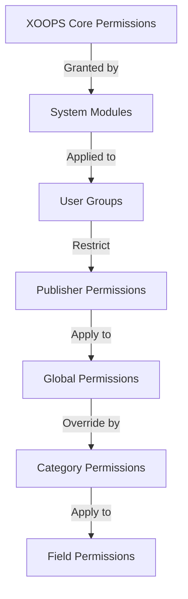

# Thiết lập quyền của nhà xuất bản

> Hướng dẫn đầy đủ về cách định cấu hình quyền của nhóm, kiểm soát quyền truy cập và quản lý quyền truy cập của người dùng trong Nhà xuất bản.

---

## Thông tin cơ bản về quyền

### Quyền là gì?

Quyền kiểm soát những gì các nhóm người dùng khác nhau có thể thực hiện trong Nhà xuất bản:

```
Who can:
  - View articles
  - Submit articles
  - Edit articles
  - Approve articles
  - Manage categories
  - Configure settings
```

### Cấp phép

```
Anonymous
  └── View published articles only

Registered Users
  ├── View articles
  ├── Submit articles (pending approval)
  └── Edit own articles

Editors/Moderators
  ├── All registered permissions
  ├── Approve articles
  ├── Edit all articles
  └── Manage some categories

Administrators
  └── Full access to everything
```

---

## Quản lý quyền truy cập

### Điều hướng đến Quyền

```
Admin Panel
└── Modules
    └── Publisher
        ├── Permissions
        ├── Category Permissions
        └── Group Management
```

### Truy cập nhanh

1. Đăng nhập với tư cách **Quản trị viên**
2. Đi tới **Quản trị viên → Mô-đun**
3. Nhấp vào **Nhà xuất bản → Quản trị viên**
4. Nhấp vào **Quyền** ở menu bên trái

---

## Quyền toàn cầu

### Quyền cấp mô-đun

Kiểm soát quyền truy cập vào mô-đun và tính năng của Nhà xuất bản:

```
Permissions configuration view:
┌─────────────────────────────────────┐
│ Permission             │ Anon │ Reg │ Editor │ Admin │
├────────────────────────┼──────┼─────┼────────┼───────┤
│ View articles          │  ✓   │  ✓  │   ✓    │  ✓   │
│ Submit articles        │  ✗   │  ✓  │   ✓    │  ✓   │
│ Edit own articles      │  ✗   │  ✓  │   ✓    │  ✓   │
│ Edit all articles      │  ✗   │  ✗  │   ✓    │  ✓   │
│ Approve articles       │  ✗   │  ✗  │   ✓    │  ✓   │
│ Manage categories      │  ✗   │  ✗  │   ✗    │  ✓   │
│ Access admin panel     │  ✗   │  ✗  │   ✓    │  ✓   │
└─────────────────────────────────────┘
```

### Mô tả quyền

| Giấy phép | Người dùng | Hiệu ứng |
|---|---|---|
| **Xem bài viết** | Tất cả các nhóm | Có thể xem các bài viết đã đăng trên front-end |
| **Gửi bài viết** | Đã đăng ký+ | Có thể tạo bài viết mới (đang chờ phê duyệt) |
| **Chỉnh sửa bài viết của riêng** | Đã đăng ký+ | Có thể chỉnh sửa/xóa bài viết của chính mình |
| **Chỉnh sửa tất cả bài viết** | Biên tập viên+ | Có thể chỉnh sửa bài viết của bất kỳ người dùng nào |
| **Xóa bài viết của chính** | Đã đăng ký+ | Có thể xóa các bài viết chưa được xuất bản của riêng mình |
| **Xóa tất cả bài viết** | Biên tập viên+ | Có thể xóa bất kỳ bài viết nào |
| **Phê duyệt bài viết** | Biên tập viên+ | Có thể xuất bản các bài viết đang chờ xử lý |
| **Quản lý danh mục** | Quản trị viên | Tạo, chỉnh sửa, xóa danh mục |
| **Quyền truy cập của quản trị viên** | Biên tập viên+ | Truy cập giao diện admin |

---

## Định cấu hình quyền chung

### Bước 1: Truy cập cài đặt quyền

1. Đi tới **Quản trị viên → Mô-đun**
2. Tìm **Nhà xuất bản**
3. Nhấp vào **Quyền** (hoặc liên kết Quản trị rồi đến Quyền)
4. Bạn thấy ma trận quyền

### Bước 2: Đặt quyền cho nhóm

Đối với mỗi nhóm, hãy định cấu hình những gì họ có thể làm:

#### Người dùng ẩn danh

```yaml
Anonymous Group Permissions:
  View articles: ✓ YES
  Submit articles: ✗ NO
  Edit articles: ✗ NO
  Delete articles: ✗ NO
  Approve articles: ✗ NO
  Manage categories: ✗ NO
  Admin access: ✗ NO

Result: Anonymous users can only view published content
```

#### Người dùng đã đăng ký

```yaml
Registered Group Permissions:
  View articles: ✓ YES
  Submit articles: ✓ YES (with approval required)
  Edit own articles: ✓ YES
  Edit all articles: ✗ NO
  Delete own articles: ✓ YES (drafts only)
  Delete all articles: ✗ NO
  Approve articles: ✗ NO
  Manage categories: ✗ NO
  Admin access: ✗ NO

Result: Registered users can contribute content after approval
```

#### Nhóm biên tập

```yaml
Editors Group Permissions:
  View articles: ✓ YES
  Submit articles: ✓ YES
  Edit own articles: ✓ YES
  Edit all articles: ✓ YES
  Delete own articles: ✓ YES
  Delete all articles: ✓ YES
  Approve articles: ✓ YES
  Manage categories: ✓ LIMITED
  Admin access: ✓ YES
  Configure settings: ✗ NO

Result: Editors manage content but not settings
```

#### Quản trị viên

```yaml
Admins Group Permissions:
  ✓ FULL ACCESS to all features

  - All editor permissions
  - Manage all categories
  - Configure all settings
  - Manage permissions
  - Install/uninstall
```

### Bước 3: Lưu quyền

1. Cấu hình quyền của từng nhóm
2. Chọn hộp cho các hành động được phép
3. Bỏ chọn các hộp cho các hành động bị từ chối
4. Nhấp vào **Lưu quyền**
5. Thông báo xác nhận xuất hiện

---

## Quyền cấp danh mục

### Đặt quyền truy cập danh mục

Kiểm soát ai có thể xem/gửi các danh mục cụ thể:

```
Admin → Publisher → Categories
→ Select category → Permissions
```

### Ma trận cấp phép danh mục

```
                 Anonymous  Registered  Editor  Admin
View category        ✓         ✓         ✓       ✓
Submit to category   ✗         ✓         ✓       ✓
Edit own in category ✗         ✓         ✓       ✓
Edit all in category ✗         ✗         ✓       ✓
Approve in category  ✗         ✗         ✓       ✓
Manage category      ✗         ✗         ✗       ✓
```

### Định cấu hình quyền của danh mục

1. Đi tới **Danh mục** admin
2. Tìm danh mục
3. Nhấp vào nút **Quyền**
4. Với mỗi nhóm, chọn:
   - [ ] Xem danh mục này
   - [ ] Gửi bài viết
   - [ ] Chỉnh sửa bài viết riêng
   - [ ] Chỉnh sửa tất cả bài viết
   - [ ] Phê duyệt bài viết
   - [ ] Quản lý danh mục
5. Nhấp vào **Lưu**

### Ví dụ về quyền của danh mục

#### Chuyên mục tin công khai

```
Anonymous: View only
Registered: View + Submit (pending approval)
Editors: Approve + Edit
Admins: Full control
```

#### Danh mục cập nhật nội bộ

```
Anonymous: No access
Registered: View only
Editors: Submit + Approve
Admins: Full control
```

#### Danh mục Blog của Khách

```
Anonymous: View only
Registered: Submit (pending approval)
Editors: Approve
Admins: Full control
```

---

## Quyền cấp trường

### Khả năng hiển thị trường biểu mẫu điều khiển

Hạn chế những trường biểu mẫu mà người dùng có thể xem/chỉnh sửa:

```
Admin → Publisher → Permissions → Fields
```

### Tùy chọn trường

```yaml
Visible Fields for Registered Users:
  ✓ Title
  ✓ Description
  ✓ Content (body)
  ✓ Featured image
  ✓ Category
  ✓ Tags
  ✗ Author (auto-set)
  ✗ Publication date (editors only)
  ✗ Scheduled date (editors only)
  ✗ Featured flag (editors only)
  ✗ Permissions (admins only)
```

### Ví dụ

#### Gửi có giới hạn dành cho người đã đăng ký

Người dùng đã đăng ký sẽ thấy ít tùy chọn hơn:

```
Available fields:
  - Title ✓
  - Description ✓
  - Content ✓
  - Featured image ✓
  - Category ✓

Hidden fields:
  - Author (auto-current user)
  - Publication date (editors decide)
  - Scheduled date (admins only)
  - Featured status (editors choose)
```

#### Mẫu đầy đủ dành cho biên tập viên

Người chỉnh sửa xem tất cả các tùy chọn:

```
Available fields:
  - All basic fields
  - All metadata
  - Author selection ✓
  - Publication date/time ✓
  - Scheduled date ✓
  - Featured status ✓
  - Expiration date ✓
  - Permissions ✓
```

---

## Cấu hình nhóm người dùng

### Tạo nhóm tùy chỉnh

1. Đi tới **Quản trị viên → Người dùng → Nhóm**
2. Nhấp vào **Tạo nhóm**
3. Nhập chi tiết nhóm:

```
Group Name: "Community Bloggers"
Group Description: "Users who contribute blog content"
Type: Regular group
```4. Nhấp vào **Lưu nhóm**
5. Quay lại quyền của Nhà xuất bản
6. Đặt quyền cho nhóm mới

### Ví dụ về nhóm

```
Suggested Groups for Publisher:

Group: Contributors
  - Regular members who submit articles
  - Can edit own articles
  - Cannot approve articles

Group: Reviewers
  - Can see submitted articles
  - Can approve/reject articles
  - Cannot delete others' articles

Group: Editors
  - Can edit any article
  - Can approve articles
  - Can moderate comments
  - Can manage some categories

Group: Publishers
  - Can edit any article
  - Can publish directly (no approval)
  - Can manage all categories
  - Can configure settings
```

---

## Phân cấp quyền

### Luồng quyền



### Kế thừa quyền

```
Base: Global module permissions
  ↓
Category: Overrides for specific categories
  ↓
Field: Further restricts available fields
  ↓
User: Has permission if ALL levels allow
```

**Ví dụ:**

```
User wants to edit article:
1. User group must have "edit articles" permission (global)
2. Category must allow editing (category level)
3. Field restrictions must allow (if applicable)
4. User must be author OR editor (for own vs all)

If ANY level denies → Permission denied
```

---

## Quyền phê duyệt quy trình làm việc

### Định cấu hình phê duyệt gửi bài

Kiểm soát xem bài viết có cần phê duyệt hay không:

```
Admin → Publisher → Preferences → Workflow
```

#### Tùy chọn phê duyệt

```yaml
Submission Workflow:
  Require Approval: Yes

  For Registered Users:
    - New articles: Draft (pending approval)
    - Editors must approve
    - User can edit while pending
    - After approval: User can still edit

  For Editors:
    - New articles: Publish directly (optional)
    - Skip approval queue
    - Or always require approval
```

#### Định cấu hình cho mỗi nhóm

1. Đi tới Tùy chọn
2. Tìm "Quy trình gửi bài"
3. Với mỗi nhóm, đặt:

```
Group: Registered Users
  Require approval: ✓ YES
  Default status: Draft
  Can modify while pending: ✓ YES

Group: Editors
  Require approval: ✗ NO
  Default status: Published
  Can modify published: ✓ YES
```

4. Nhấp vào **Lưu**

---

## Bài viết vừa phải

### Phê duyệt các bài viết đang chờ xử lý

Đối với người dùng có quyền "phê duyệt bài viết":

1. Đi tới **Quản trị viên → Nhà xuất bản → Bài viết**
2. Lọc theo **Trạng thái**: Đang chờ xử lý
3. Bấm vào bài viết để xem lại
4. Kiểm tra chất lượng nội dung
5. Đặt **Trạng thái**: Đã xuất bản
6. Tùy chọn: Thêm ghi chú biên tập
7. Nhấp vào **Lưu**

### Từ chối bài viết

Nếu bài viết không đạt tiêu chuẩn:

1. Mở bài viết
2. Đặt **Trạng thái**: Bản nháp
3. Thêm lý do từ chối (trong bình luận hoặc email)
4. Nhấp vào **Lưu**
5. Gửi tin nhắn cho tác giả giải thích việc từ chối

### Bình luận vừa phải

Nếu kiểm duyệt bình luận:

1. Đi tới **Quản trị viên → Nhà xuất bản → Nhận xét**
2. Lọc theo **Trạng thái**: Đang chờ xử lý
3. Xem lại bình luận
4. Tùy chọn:
   - Phê duyệt: Bấm vào **Phê duyệt**
   - Từ chối: Nhấp vào **Xóa**
   - Chỉnh sửa: Bấm **Chỉnh sửa**, sửa, lưu
5. Nhấp vào **Lưu**

---

## Quản lý quyền truy cập của người dùng

### Xem nhóm người dùng

Xem người dùng nào thuộc nhóm:

```
Admin → Users → User Groups

For each user:
  - Primary group (one)
  - Secondary groups (multiple)

Permissions apply from all groups (union)
```

### Thêm người dùng vào nhóm

1. Đi tới **Quản trị viên → Người dùng**
2. Tìm người dùng
3. Nhấp vào **Chỉnh sửa**
4. Trong **Nhóm**, chọn nhóm để thêm
5. Nhấp vào **Lưu**

### Thay đổi quyền của người dùng

Đối với người dùng cá nhân (nếu được hỗ trợ):

1. Chuyển đến Người dùng admin
2. Tìm người dùng
3. Nhấp vào **Chỉnh sửa**
4. Tìm ghi đè quyền riêng lẻ
5. Cấu hình khi cần thiết
6. Nhấp vào **Lưu**

---

## Các kịch bản cấp phép phổ biến

### Kịch bản 1: Mở Blog

Cho phép bất cứ ai gửi:

```
Anonymous: View
Registered: Submit, edit own, delete own
Editors: Approve, edit all, delete all
Admins: Full control

Result: Open community blog
```

### Tình huống 2: Trang tin tức được kiểm duyệt

Quy trình phê duyệt nghiêm ngặt:

```
Anonymous: View only
Registered: Cannot submit
Editors: Submit, approve others
Admins: Full control

Result: Only approved professionals publish
```

### Tình huống 3: Blog nhân viên

Nhân viên có thể đóng góp:

```
Create group: "Staff"
Anonymous: View
Registered: View only (non-staff)
Staff: Submit, edit own, publish directly
Admins: Full control

Result: Staff-authored blog
```

### Kịch bản 4: Nhiều danh mục với các biên tập viên khác nhau

Các trình soạn thảo khác nhau cho các danh mục khác nhau:

```
News category:
  Editors group A: Full control

Reviews category:
  Editors group B: Full control

Tutorials category:
  Editors group C: Full control

Result: Decentralized editorial control
```

---

## Kiểm tra quyền

### Xác minh quyền hoạt động

1. Tạo người dùng thử nghiệm trong mỗi nhóm
2. Đăng nhập với tư cách từng người dùng thử nghiệm
3. Cố gắng:
   - Xem bài viết
   - Gửi bài viết (nên tạo bản nháp nếu được phép)
   - Chỉnh sửa bài viết (của riêng và của người khác)
   - Xóa bài viết
   - Truy cập bảng điều khiển admin
   - Truy cập danh mục

4. Xác minh kết quả phù hợp với quyền dự kiến

### Các trường hợp thử nghiệm phổ biến

```
Test Case 1: Anonymous user
  [ ] Can view published articles: ✓
  [ ] Cannot submit articles: ✓
  [ ] Cannot access admin: ✓

Test Case 2: Registered user
  [ ] Can submit articles: ✓
  [ ] Articles go to Draft: ✓
  [ ] Can edit own article: ✓
  [ ] Cannot edit others: ✓
  [ ] Cannot access admin: ✓

Test Case 3: Editor
  [ ] Can approve articles: ✓
  [ ] Can edit any article: ✓
  [ ] Can access admin: ✓
  [ ] Cannot delete all: ✓ (or ✓ if allowed)

Test Case 4: Admin
  [ ] Can do everything: ✓
```

---

## Quyền khắc phục sự cố

### Vấn đề: Người dùng không thể gửi bài viết

**Kiểm tra:**
```
1. User group has "submit articles" permission
   Admin → Publisher → Permissions

2. User belongs to allowed group
   Admin → Users → Edit user → Groups

3. Category allows submission from user's group
   Admin → Publisher → Categories → Permissions

4. User is registered (not anonymous)
```

**Giải pháp:**
```bash
1. Verify registered user group has submission permission
2. Add user to appropriate group
3. Check category permissions
4. Clear user session cache
```

### Vấn đề: Biên tập viên không thể phê duyệt bài viết

**Kiểm tra:**
```
1. Editor group has "approve articles" permission
2. Articles exist with "Pending" status
3. Editor is in correct group
4. Category allows approval from editor's group
```

**Giải pháp:**
```bash
1. Go to Permissions, check "approve articles" is checked for editor group
2. Create test article, set to Draft
3. Try to approve as editor
4. Check error messages in system log
```

### Vấn đề: Có thể xem bài viết nhưng không thể truy cập danh mục

**Kiểm tra:**
```
1. Category is not disabled/hidden
2. Category permissions allow viewing
3. User's group is permitted to view category
4. Category is published
```

**Giải pháp:**
```bash
1. Go to Categories, check category status is "Enabled"
2. Check category permissions are set
3. Add user's group to category view permission
```

### Vấn đề: Quyền đã thay đổi nhưng không có hiệu lực

**Giải pháp:**
```bash
1. Clear cache: Admin → Tools → Clear Cache
2. Clear session: Logout and login again
3. Check system log for errors
4. Verify permissions actually saved
5. Try different browser/incognito window
```

---

## Quyền sao lưu và xuất

### Quyền xuất khẩu

Một số hệ thống cho phép xuất:

1. Đi tới **Quản trị viên → Nhà xuất bản → Công cụ**
2. Nhấp vào **Quyền xuất**
3. Lưu tệp `.xml` hoặc `.json`
4. Giữ làm bản sao lưu### Quyền nhập khẩu

Khôi phục từ bản sao lưu:

1. Đi tới **Quản trị viên → Nhà xuất bản → Công cụ**
2. Nhấp vào **Quyền nhập**
3. Chọn tập tin sao lưu
4. Xem lại các thay đổi
5. Nhấp vào **Nhập**

---

## Các phương pháp hay nhất

### Danh sách kiểm tra cấu hình quyền

- [ ] Quyết định nhóm người dùng
- [ ] Gán tên rõ ràng cho các nhóm
- [] Đặt quyền cơ bản cho từng nhóm
- [ ] Kiểm tra từng cấp độ quyền
- [ ] Cấu trúc phân quyền tài liệu
- [ ] Tạo quy trình phê duyệt
- [ ] Đào tạo các biên tập viên một cách có chừng mực
- [] Giám sát việc sử dụng quyền
- [ ] Xem xét quyền hàng quý
- [] Cài đặt quyền sao lưu

### Các phương pháp bảo mật tốt nhất

```
✓ Principle of Least Privilege
  - Grant minimum necessary permissions

✓ Role-Based Access
  - Use groups for roles (editor, moderator, etc)

✓ Audit Permissions
  - Review who has what access

✓ Separate Duties
  - Submitter, approver, publisher are different

✓ Regular Review
  - Check permissions quarterly
  - Remove access when users leave
  - Update for new requirements
```

---

## Hướng dẫn liên quan

- Tạo bài viết
- Quản lý danh mục
- Cấu hình cơ bản
- Cài đặt

---

## Các bước tiếp theo

- Thiết lập quyền cho quy trình làm việc của bạn
- Tạo bài viết với sự cho phép thích hợp
- Cấu hình Danh mục có quyền
- Đào tạo người dùng về cách tạo bài viết

---

#publisher #permissions #groups #access-control #security #moderation #xoops