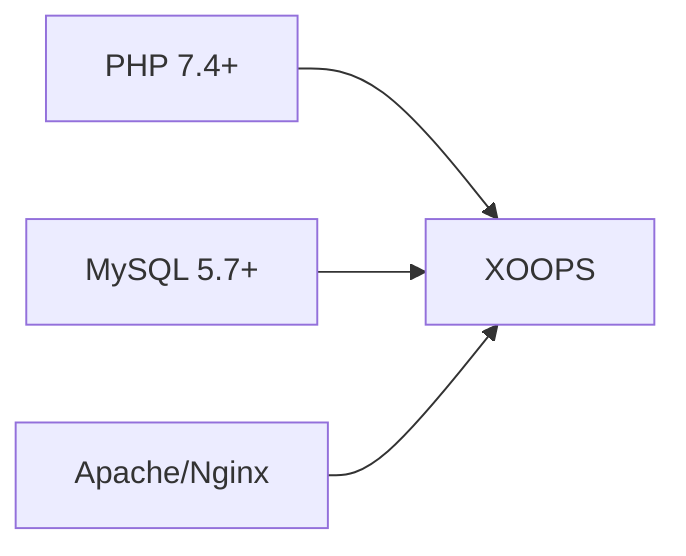
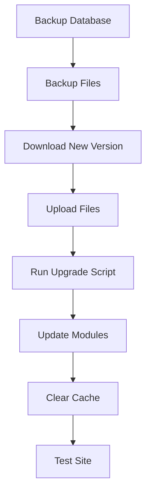

> Các câu hỏi và giải đáp thường gặp khi cài đặt XOOPS.

---

## Cài đặt trước

### Hỏi: Yêu cầu máy chủ tối thiểu là gì?

**Đ:** XOOPS 2.5.x yêu cầu:
- PHP 7.4 trở lên (khuyên dùng PHP 8.x)
- MySQL 5.7+ hoặc MariaDB 10.3+
- Apache với mod_rewrite hoặc Nginx
- Giới hạn bộ nhớ ít nhất 64 MB PHP (khuyên dùng 128 MB+)



### Hỏi: Tôi có thể cài đặt XOOPS trên Shared Hosting không?

**Đ:** Có, XOOPS hoạt động tốt trên hầu hết dịch vụ lưu trữ chia sẻ đáp ứng yêu cầu. Kiểm tra xem máy chủ của bạn có cung cấp:
- PHP với các phần mở rộng cần thiết (mysqli, gd, Curl, json, mbstring)
- Truy cập cơ sở dữ liệu MySQL
- Khả năng tải lên tập tin
- Hỗ trợ .htaccess (cho Apache)

### Hỏi: Những tiện ích mở rộng PHP nào được yêu cầu?

**A:** Tiện ích mở rộng bắt buộc:
- `mysqli` - Kết nối cơ sở dữ liệu
- `gd` - Xử lý ảnh
- `json` - Xử lý JSON
- `mbstring` - Hỗ trợ chuỗi nhiều byte

Khuyến nghị:
- `curl` - Cuộc gọi API bên ngoài
- `zip` - Cài đặt mô-đun
- `intl` - Quốc tế hóa

---

## Quá trình cài đặt

### Hỏi: Trình hướng dẫn cài đặt hiển thị một trang trống

**A:** Đây thường là lỗi PHP. Hãy thử:

1. Kích hoạt tạm thời hiển thị lỗi:
```php
// Add to htdocs/install/index.php at the top
error_reporting(E_ALL);
ini_set('display_errors', 1);
```

2. Kiểm tra nhật ký lỗi PHP
3. Xác minh tính tương thích của phiên bản PHP
4. Đảm bảo tất cả các tiện ích mở rộng cần thiết đã được tải

### Hỏi: Tôi nhận được "Không thể ghi vào mainfile.php"

**A:** Đặt quyền ghi trước khi cài đặt:

```bash
chmod 666 mainfile.php
# After installation, secure it:
chmod 444 mainfile.php
```

### Hỏi: Bảng cơ sở dữ liệu chưa được tạo

**Đ:** Kiểm tra:

1. Người dùng MySQL có đặc quyền TẠO BẢNG:
```sql
GRANT ALL PRIVILEGES ON xoopsdb.* TO 'xoopsuser'@'localhost';
FLUSH PRIVILEGES;
```

2. Cơ sở dữ liệu tồn tại:
```sql
CREATE DATABASE xoopsdb CHARACTER SET utf8mb4 COLLATE utf8mb4_unicode_ci;
```

3. Thông tin xác thực trong cài đặt cơ sở dữ liệu phù hợp với trình hướng dẫn

### Hỏi: Quá trình cài đặt hoàn tất nhưng trang web hiển thị lỗi

**A:** Các bản sửa lỗi phổ biến sau khi cài đặt:

1. Xóa hoặc đổi tên thư mục cài đặt:
```bash
mv htdocs/install htdocs/install.bak
```

2. Đặt quyền thích hợp:
```bash
chmod -R 755 htdocs/
chmod -R 777 xoops_data/
chmod 444 mainfile.php
```

3. Xóa bộ nhớ đệm:
```bash
rm -rf xoops_data/caches/smarty_cache/*
rm -rf xoops_data/caches/smarty_compile/*
```

---

## Cấu hình

### Hỏi: File cấu hình ở đâu?

**A:** Cấu hình chính nằm trong `mainfile.php` trong thư mục gốc XOOPS. Cài đặt chính:

```php
define('XOOPS_ROOT_PATH', '/path/to/htdocs');
define('XOOPS_VAR_PATH', '/path/to/xoops_data');
define('XOOPS_URL', 'https://yoursite.com');
define('XOOPS_DB_HOST', 'localhost');
define('XOOPS_DB_USER', 'username');
define('XOOPS_DB_PASS', 'password');
define('XOOPS_DB_NAME', 'database');
define('XOOPS_DB_PREFIX', 'xoops');
```

### Hỏi: Làm cách nào để thay đổi trang URL?

**Đ:** Chỉnh sửa `mainfile.php`:

```php
define('XOOPS_URL', 'https://newdomain.com');
```

Sau đó xóa bộ nhớ cache và cập nhật mọi URL được mã hóa cứng trong cơ sở dữ liệu.

### Hỏi: Làm cách nào để di chuyển XOOPS sang một thư mục khác?

**Đ:**

1. Di chuyển file đến vị trí mới
2. Cập nhật đường dẫn trong `mainfile.php`:
```php
define('XOOPS_ROOT_PATH', '/new/path/to/htdocs');
define('XOOPS_VAR_PATH', '/new/path/to/xoops_data');
```
3. Cập nhật cơ sở dữ liệu nếu cần
4. Xóa tất cả bộ nhớ đệm

---

## Nâng cấp

### Hỏi: Làm cách nào để nâng cấp XOOPS?

**Đ:**



1. **Sao lưu mọi thứ** (cơ sở dữ liệu + tệp)
2. Tải phiên bản XOOPS mới
3. Tải file lên (không ghi đè lên `mainfile.php`)
4. Chạy `htdocs/upgrade/` nếu được cung cấp
5. Cập nhật modules qua bảng admin
6. Xóa tất cả bộ nhớ đệm
7. Kiểm tra kỹ lưỡng

### Hỏi: Tôi có thể bỏ qua các phiên bản khi nâng cấp không?

**Đ:** Nói chung là không. Nâng cấp tuần tự thông qua các phiên bản chính để đảm bảo quá trình di chuyển cơ sở dữ liệu diễn ra chính xác. Kiểm tra ghi chú phát hành để được hướng dẫn cụ thể.

### Hỏi: modules của tôi ngừng hoạt động sau khi nâng cấp

**Đ:**1. Kiểm tra tính tương thích của mô-đun với phiên bản XOOPS mới
2. Cập nhật modules lên phiên bản mới nhất
3. Tạo lại templates: Quản trị viên → Hệ thống → Bảo trì → Mẫu
4. Xóa tất cả bộ nhớ đệm
5. Kiểm tra nhật ký lỗi PHP để biết các lỗi cụ thể

---

## Khắc phục sự cố

### Hỏi: Tôi quên mật khẩu admin

**A:** Đặt lại qua cơ sở dữ liệu:

```sql
-- Generate new password hash
UPDATE xoops_users
SET pass = MD5('newpassword')
WHERE uname = 'admin';
```

Hoặc sử dụng tính năng đặt lại mật khẩu nếu email được cấu hình.

### Hỏi: Trang web rất chậm sau khi cài đặt

**Đ:**

1. Kích hoạt bộ nhớ đệm trong Quản trị → Hệ thống → Tùy chọn
2. Tối ưu hóa cơ sở dữ liệu:
```sql
OPTIMIZE TABLE xoops_session;
OPTIMIZE TABLE xoops_online;
```
3. Kiểm tra các truy vấn chậm trong chế độ gỡ lỗi
4. Kích hoạt PHP OpCache

### Hỏi: Hình ảnh/CSS không tải

**Đ:**

1. Kiểm tra quyền của tệp (644 đối với tệp, 755 đối với thư mục)
2. Xác minh `XOOPS_URL` là chính xác trong `mainfile.php`
3. Kiểm tra .htaccess xem có xung đột khi viết lại không
4. Kiểm tra bảng điều khiển trình duyệt để tìm lỗi 404

---

## Tài liệu liên quan

- Hướng dẫn cài đặt
- Cấu hình cơ bản
- Màn hình trắng chết chóc

---

#xoops #faq #cài đặt #xử lý sự cố