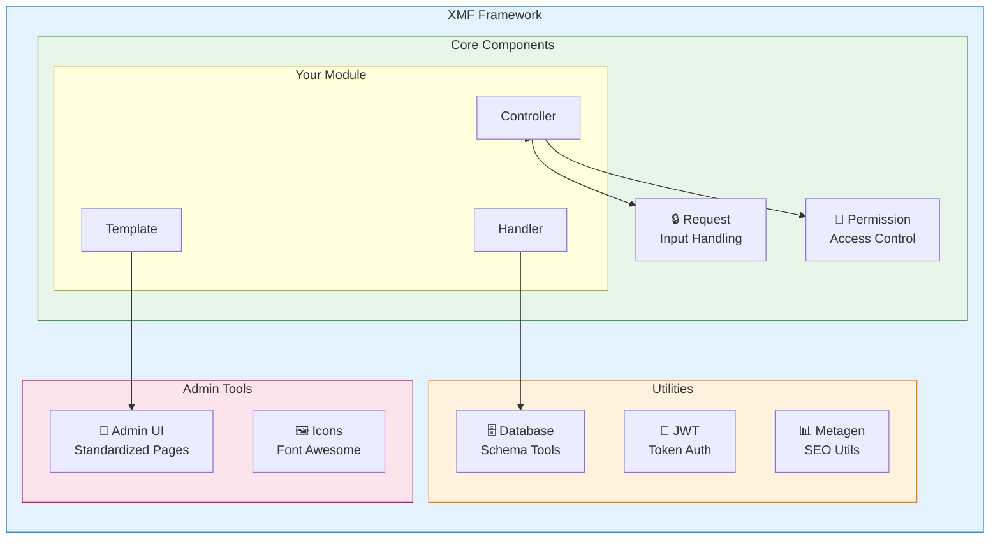
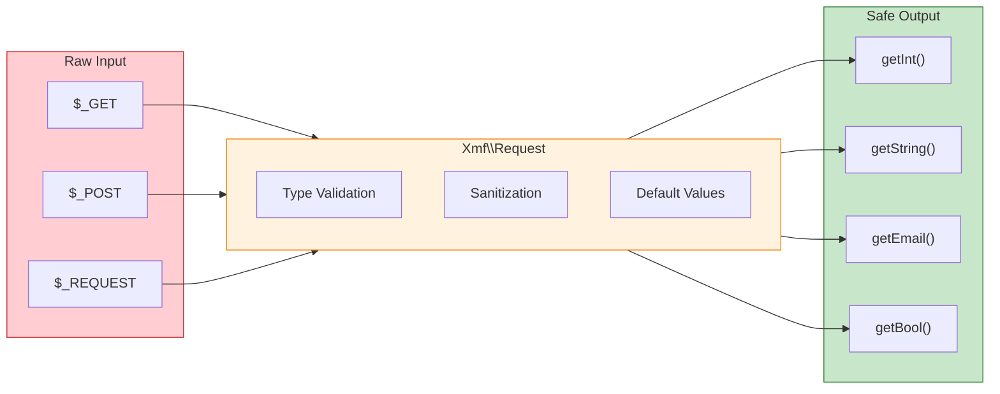

<span class="version-badge version-25x">2.5.x ✅</span> <span class="version-badge version-40x">4.0.x ✅</span>

:::tip[Cầu nối tới XOOPS hiện đại]
XMF hoạt động trong **cả XOOPS 2.5.x và XOOPS 4.0.x**. Đó là cách được khuyên dùng để hiện đại hóa modules của bạn ngay hôm nay trong khi chuẩn bị cho XOOPS 4.0. XMF cung cấp tính năng tự động tải, không gian tên và trình trợ giúp PSR-4 giúp quá trình chuyển đổi diễn ra suôn sẻ.
:::

**XOOPS Module Framework (XMF)** là một thư viện mạnh mẽ được thiết kế để đơn giản hóa và tiêu chuẩn hóa việc phát triển mô-đun XOOPS. XMF cung cấp các phương pháp thực hành PHP hiện đại bao gồm không gian tên, tải tự động và một bộ trợ giúp toàn diện classes giúp giảm mã soạn sẵn và cải thiện khả năng bảo trì.

## XMF là gì?

XMF là tập hợp classes và các tiện ích cung cấp:

- **Hỗ trợ PHP hiện đại** - Hỗ trợ không gian tên đầy đủ với tính năng tự động tải PSR-4
- **Xử lý yêu cầu** - Xác thực và dọn dẹp đầu vào an toàn
- **Trình trợ giúp mô-đun** - Truy cập đơn giản vào cấu hình và đối tượng mô-đun
- **Hệ thống cấp phép** - Quản lý cấp phép dễ sử dụng
- **Tiện ích cơ sở dữ liệu** - Công cụ quản lý bảng và di chuyển lược đồ
- **Hỗ trợ JWT** - Triển khai Mã thông báo Web JSON để xác thực an toàn
- **Tạo siêu dữ liệu** - Tiện ích SEO và trích xuất nội dung
- **Giao diện quản trị** - Các trang administration của mô-đun được tiêu chuẩn hóa

### Tổng quan về thành phần XMF



## Tính năng chính

### Không gian tên và Tự động tải

Tất cả XMF classes đều nằm trong không gian tên `Xmf`. Các lớp được tải tự động khi được tham chiếu - không yêu cầu includes thủ công.

```php
use Xmf\Request;
use Xmf\Module\Helper;

// Classes load automatically when used
$input = Request::getString('input', '');
$helper = Helper::getHelper('mymodule');
```

### Xử lý yêu cầu an toàn

[Request class](../05-XMF-Framework/Basics/XMF-Request.md) cung cấp quyền truy cập an toàn theo loại vào dữ liệu yêu cầu HTTP với khả năng dọn dẹp tích hợp:



```php
use Xmf\Request;

$id = Request::getInt('id', 0);
$name = Request::getString('name', '');
$email = Request::getEmail('email', '');
```

### Hệ thống trợ giúp mô-đun

[Trình trợ giúp mô-đun](../05-XMF-Framework/Basics/XMF-Module-Helper.md) cung cấp quyền truy cập thuận tiện vào chức năng liên quan đến mô-đun:

```php
$helper = \Xmf\Module\Helper::getHelper('mymodule');

// Access module configuration
$configValue = $helper->getConfig('setting_name', 'default');

// Get module object
$module = $helper->getModule();

// Access handlers
$handler = $helper->getHandler('items');
```

### Quản lý quyền

[Permission-Helper](../05-XMF-Framework/Recipes/Permission-Helper.md) đơn giản hóa việc xử lý quyền XOOPS:

```php
$permHelper = new \Xmf\Module\Helper\Permission();

// Check user permission
if ($permHelper->checkPermission('view', $itemId)) {
    // User has permission
}
```

## Cấu trúc tài liệu

### Cơ bản

- [Bắt đầu với-XMF](../05-XMF-Framework/Basics/Getting-Started-with-XMF.md) - Cài đặt và sử dụng cơ bản
- [XMF-Request](../05-XMF-Framework/Basics/XMF-Request.md) - Xử lý yêu cầu và xác thực đầu vào
- [XMF-Module-Helper](../05-XMF-Framework/Basics/XMF-Module-Helper.md) - Cách sử dụng trình trợ giúp mô-đun class

### Công thức nấu ăn

- [Permission-Helper](../05-XMF-Framework/Recipes/Permission-Helper.md) - Làm việc với các quyền
- [Module-Admin-Pages](../05-XMF-Framework/Recipes/Module-Admin-Pages.md) - Tạo giao diện admin được tiêu chuẩn hóa

### Tham khảo

- [JWT](../05-XMF-Framework/Reference/JWT.md) - Triển khai mã thông báo web JSON
- [Database](../05-XMF-Framework/Reference/Database.md) - Tiện ích cơ sở dữ liệu và quản lý lược đồ
- [Metagen](Reference/Metagen.md) - Tiện ích siêu dữ liệu và SEO

## Yêu cầu

- XOOPS 2.5.8 trở lên
- PHP 7.2 trở lên (khuyên dùng PHP 8.x)

## Cài đặtXMF là included với XOOPS 2.5.8 và các phiên bản mới hơn. Đối với các phiên bản cũ hơn hoặc cài đặt thủ công:

1. Tải xuống gói XMF từ kho XOOPS
2. Giải nén vào thư mục XOOPS `/class/xmf/` của bạn
3. Trình tải tự động sẽ tự động xử lý việc tải class

## Ví dụ bắt đầu nhanh

Dưới đây là một ví dụ hoàn chỉnh hiển thị các kiểu sử dụng XMF phổ biến:

```php
<?php
use Xmf\Request;
use Xmf\Module\Helper;
use Xmf\Module\Helper\Permission;

// Get module helper
$helper = Helper::getHelper('mymodule');

// Get configuration values
$itemsPerPage = $helper->getConfig('items_per_page', 10);

// Handle request input
$op = Request::getCmd('op', 'list');
$id = Request::getInt('id', 0);

// Check permissions
$permHelper = new Permission();
if (!$permHelper->checkPermission('view', $id)) {
    redirect_header('index.php', 3, 'Access denied');
}

// Process based on operation
switch ($op) {
    case 'view':
        $handler = $helper->getHandler('items');
        $item = $handler->get($id);
        // ... display item
        break;
    case 'list':
    default:
        // ... list items
        break;
}
```

## Tài nguyên

- [Kho lưu trữ GitHub XMF] (https://github.com/XOOPS/XMF)
- [Trang web dự án XOOPS](https://xoops.org)

---

#xmf #xoops #framework #php #module-development