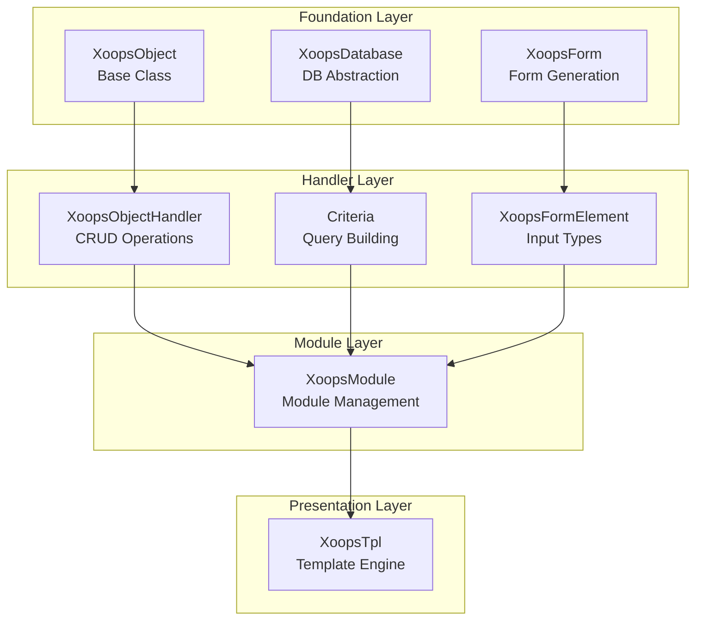
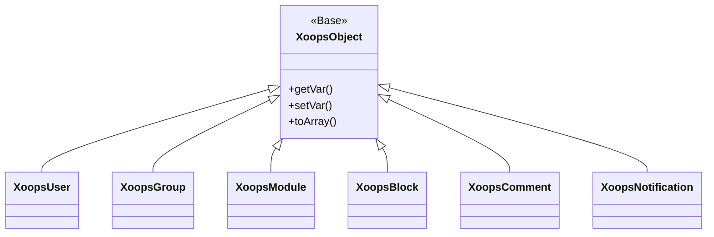
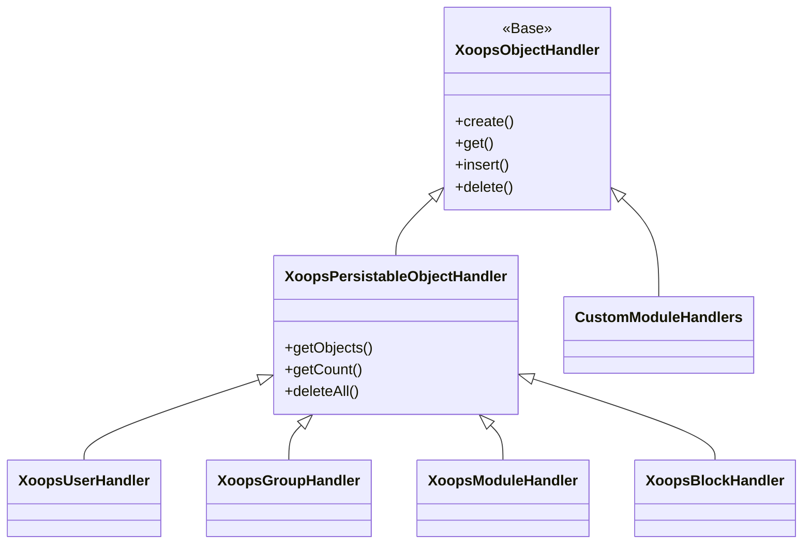
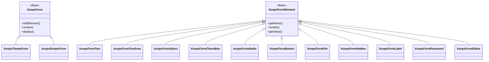

欢迎使用全面的 XOOPS API 参考文档。本节提供构成 XOOPS 内容管理系统的所有核心类、方法和系统的详细文档。

## 概述

XOOPS API 被组织成几个主要子系统，每个子系统负责CMS 功能的特定方面。了解这些 API 对于开发 XOOPS 的模区块、主题和扩展至关重要。

## API 部分

### 核心课程

所有其他 XOOPS 组件构建的基础类。

|文档 |描述 |
|--------------|-------------|
| XOOPS对象 | XOOPS | 中所有数据对象的基类
| XOOPSObjectHandler | CRUD 操作的处理程序模式 |

### 数据库层

数据库抽象和查询构建实用程序。

|文档 |描述 |
|--------------|-------------|
| XOOPS数据库|数据库抽象层|
|标准体系|查询标准及条件 |
|查询生成器 |现代流畅的查询构建 |

### 表单系统

HTML 表单生成和验证。

|文档 |描述 |
|--------------|-------------|
| XOOPSForm |表单容器和渲染 |
|表单元素|所有可用的表单元素类型 |

### 内核类

核心系统组件和服务。

|文档 |描述 |
|--------------|-------------|
|内核类 |系统内核及核心组件|

### 模区块系统

模区块管理和生命周期。

|文档 |描述 |
|--------------|-------------|
|模区块系统|模区块加载、安装与管理|

### 模板系统

Smarty模板集成。

|文档 |描述 |
|--------------|-------------|
|模板系统| Smarty集成和模板管理|

### 用户系统

用户管理和身份验证。

|文档 |描述 |
|--------------|-------------|
|用户系统|用户帐户、组和权限 |

## 架构概述



## 类层次结构

### 对象模型



### 处理程序模型



### 表单模型



## 设计模式

XOOPS API 实现了多种良好的-known 设计模式：

### 单例模式
用于数据库连接和容器实例等全局服务。

```php
$db = XoopsDatabase::getInstance();
$container = XoopsContainer::getInstance();
```

### 工厂模式
对象处理程序一致地创建域对象。

```php
$handler = xoops_getHandler('user');
$user = $handler->create();
```

### 复合模式
表单包含多个表单元素； criteria 可以包含嵌套条件。

```php
$criteria = new CriteriaCompo();
$criteria->add(new Criteria('status', 1));
$criteria->add(new CriteriaCompo(...)); // Nested
```

### 观察者模式
事件系统允许模区块之间松散耦合。

```php
$dispatcher->addListener('module.news.article_published', $callback);
```

## 快速入门示例

### 创建并保存对象

```php
// Get the handler
$handler = xoops_getHandler('user');

// Create a new object
$user = $handler->create();
$user->setVar('uname', 'newuser');
$user->setVar('email', 'user@example.com');

// Save to database
$handler->insert($user);
```

### 使用条件查询

```php
// Build criteria
$criteria = new CriteriaCompo();
$criteria->add(new Criteria('level', 0, '>'));
$criteria->setSort('uname');
$criteria->setOrder('ASC');
$criteria->setLimit(10);

// Get objects
$handler = xoops_getHandler('user');
$users = $handler->getObjects($criteria);
```

### 创建表单

```php
$form = new XoopsThemeForm('User Profile', 'userform', 'save.php', 'post', true);
$form->addElement(new XoopsFormText('Username', 'uname', 50, 255, $user->getVar('uname')));
$form->addElement(new XoopsFormTextArea('Bio', 'bio', $user->getVar('bio')));
$form->addElement(new XoopsFormButton('', 'submit', _SUBMIT, 'submit'));
echo $form->render();
```

## API 约定

### 命名约定

|类型 |大会|示例|
|------|------------|---------|
|课程 |帕斯卡案例 | `XOOPSUser`、`CriteriaCompo`|
|方法 |驼峰式 | `getVar()`、`setVar()`|
|属性 |驼峰式命名法（受保护）| `$_vars`、`$_handler`|
|常数| UPPER_SNAKE_CASE | `XOBJ_DTYPE_INT` |
|数据库表|蛇箱 | `users`、`groups_users_link`|

### 数据类型

XOOPS定义了对象变量的标准数据类型：|恒定|类型 |描述 |
|----------|------|-------------|
| `XOBJ_DTYPE_TXTBOX` |字符串|文本输入（已清理）|
| `XOBJ_DTYPE_TXTAREA` |字符串|文本区域内容 |
| `XOBJ_DTYPE_INT` |整数 |数值|
| `XOBJ_DTYPE_URL` |字符串| URL验证|
| `XOBJ_DTYPE_EMAIL` |字符串|电子邮件验证 |
| `XOBJ_DTYPE_ARRAY`|数组|序列化数组 |
| `XOBJ_DTYPE_OTHER` |混合|定制处理|
| `XOBJ_DTYPE_SOURCE` |字符串|源代码（最少的清理）|
| `XOBJ_DTYPE_STIME` |整数 |短时间戳 |
| `XOBJ_DTYPE_MTIME` |整数 |中等时间戳 |
| `XOBJ_DTYPE_LTIME` |整数 |长时间戳|

## 验证方法

API支持多种身份验证方法：

### API 密钥认证
```
X-API-Key: your-api-key
```

### OAuth 不记名令牌
```
Authorization: Bearer your-oauth-token
```

### 会话-Based 身份验证
登录时使用现有的XOOPS会话。

## REST API 端点

当RESTAPI启用时：

|端点|方法|描述 |
|----------|--------|-------------|
| `/api.php/rest/users` | GET |列出用户|
| `/api.php/rest/users/{id}` | GET|通过ID获取用户|
| `/api.php/rest/users` | POST |创建用户 |
| `/api.php/rest/users/{id}` | PUT|更新用户 |
| `/api.php/rest/users/{id}` | DELETE|删除用户|
| `/api.php/rest/modules`| GET |列出模区块 |

## 相关文档

- 模区块开发指南
- 主题开发指南
- 系统配置
- 安全最佳实践

## 版本历史

|版本 |变化|
|---------|---------|
| 11.2.5 |当前稳定版本 |
| 2.5.10 |添加了 GraphQL API 支持 |
| 2.5.9 | 2.5.9增强的标准系统|
| 2.5.8 | PSR-4 自动加载支持 |

---

*本文档是 XOOPS 知识库的一部分。有关最新更新，请访问 [XOOPS GitHub repository](https://github.com/XOOPS).*