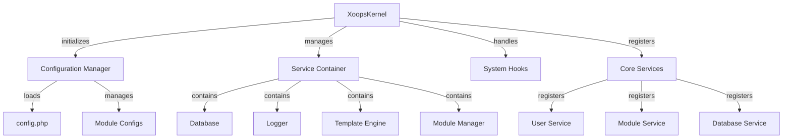

XOOPS内核提供了用于引导系统、管理配置、处理系统事件和提供核心实用程序的基础框架。这些类构成了 XOOPS 应用程序的主干。

## 系统架构



## XOOPSKernel 类

初始化和管理XOOPS系统的主内核类。

### 班级概览

```php
namespace Xoops;

class XoopsKernel
{
    private static ?XoopsKernel $instance = null;
    protected ServiceContainer $services;
    protected ConfigurationManager $config;
    protected array $modules = [];
    protected bool $isLoaded = false;
}
```

### 构造函数

```php
private function __construct()
```

私有构造函数强制执行单例模式。

### 获取实例

检索单例内核实例。

```php
public static function getInstance(): XoopsKernel
```

**返回：** `XOOPSKernel` - 单例内核实例

**示例：**
```php
$kernel = XoopsKernel::getInstance();
```

### 启动过程

内核启动过程遵循以下步骤：

1. **初始化** - 设置错误处理程序，定义常量
2. **配置** - 加载配置文件
3. **服务注册** - 注册核心服务
4. **模区块检测** - 扫描并识别活动模区块
5. **数据库初始化** - 连接数据库
6. **清理** - 准备请求处理

```php
public function boot(): void
```

**示例：**
```php
$kernel = XoopsKernel::getInstance();
$kernel->boot();
```

### 服务容器方法

#### 注册服务

在服务容器中注册服务。

```php
public function registerService(
    string $name,
    callable|object $definition
): void
```

**参数：**

|参数|类型 |描述 |
|------------|------|-------------|
| `$name` |字符串|服务标识符 |
| `$definition` |可调用\|对象|服务工厂或实例|

**示例：**
```php
$kernel->registerService('custom.handler', function($c) {
    return new CustomHandler();
});
```

#### 获取服务

检索已注册的服务。

```php
public function getService(string $name): mixed
```

**参数：**

|参数|类型 |描述 |
|------------|------|-------------|
| `$name` |字符串|服务标识符 |

**返回：** `mixed` - 请求的服务

**示例：**
```php
$database = $kernel->getService('database');
$logger = $kernel->getService('logger');
```

#### 有服务

检查服务是否已注册。

```php
public function hasService(string $name): bool
```

**示例：**
```php
if ($kernel->hasService('cache')) {
    $cache = $kernel->getService('cache');
}
```

## 配置管理器

管理应用程序配置和模区块设置。

### 班级概览

```php
namespace Xoops\Core;

class ConfigurationManager
{
    protected array $config = [];
    protected array $defaults = [];
    protected string $configPath;
}
```

### 方法

####负载

从文件或数组加载配置。

```php
public function load(string|array $source): void
```

**参数：**

|参数|类型 |描述 |
|------------|------|-------------|
| `$source` |字符串\|数组|配置文件路径或数组 |

**示例：**
```php
$config = $kernel->getService('config');
$config->load(XOOPS_ROOT_PATH . '/include/config.php');
$config->load(['sitename' => 'My Site', 'admin_email' => 'admin@example.com']);
```

####得到

检索配置值。

```php
public function get(string $key, mixed $default = null): mixed
```

**参数：**

|参数|类型 |描述 |
|------------|------|-------------|
| `$key`|字符串|配置键（点符号）|
| `$default` |混合 |如果没有找到默认值 |

**返回：** `mixed` - 配置值

**示例：**
```php
$siteName = $config->get('sitename');
$adminEmail = $config->get('admin.email', 'admin@example.com');
```

####设置

设置配置值。

```php
public function set(string $key, mixed $value): void
```

**参数：**

|参数|类型 |描述 |
|------------|------|-------------|
| `$key` |字符串|配置键|
| `$value` |混合 |配置值|

**示例：**
```php
$config->set('sitename', 'New Site Name');
$config->set('features.cache_enabled', true);
```

#### 获取模区块配置

获取特定模区块的配置。

```php
public function getModuleConfig(
    string $moduleName
): array
```

**参数：**

|参数|类型 |描述 |
|------------|------|-------------|
| `$moduleName` |字符串|模区块目录名称|

**返回：** `array` - 模区块配置数组

**示例：**
```php
$publisherConfig = $config->getModuleConfig('publisher');
```

## 系统挂钩

系统挂钩允许模区块和插件在应用程序生命周期的特定点执行代码。

### HookManager 类

```php
namespace Xoops\Core;

class HookManager
{
    protected array $hooks = [];
    protected array $listeners = [];
}
```

### 方法

#### 添加钩子

注册一个钩子点。

```php
public function addHook(string $name): void
```

**参数：**

|参数|类型 |描述 |
|------------|------|-------------|
| `$name` |字符串|钩子标识符 |

**示例：**
```php
$hooks = $kernel->getService('hooks');
$hooks->addHook('system.startup');
$hooks->addHook('user.login');
$hooks->addHook('module.install');
```

####听

将侦听器附加到挂钩。

```php
public function listen(
    string $hookName,
    callable $callback,
    int $priority = 10
): void
```

**参数：**

|参数|类型 |描述 |
|------------|------|-------------|
| `$hookName` |字符串|钩子标识符 |
| `$callback` |可调用|要执行的函数 |
| `$priority` |整数 |执行优先级（较高的先运行）|

**示例：**
```php
$hooks->listen('user.login', function($user) {
    error_log('User ' . $user->uname . ' logged in');
}, 10);

$hooks->listen('module.install', function($module) {
    // Custom module installation logic
    echo "Installing " . $module->getName();
}, 5);
```

#### 触发器执行钩子的所有侦听器。

```php
public function trigger(
    string $hookName,
    mixed $arguments = null
): array
```

**参数：**

|参数|类型 |描述 |
|------------|------|-------------|
| `$hookName` |字符串|钩子标识符 |
| `$arguments` |混合 |传递给侦听器的数据 |

**返回：** `array` - 所有听众的结果

**示例：**
```php
$results = $hooks->trigger('system.startup');
$results = $hooks->trigger('user.created', $newUser);
```

## 核心服务概述

内核在启动过程中注册了几个核心服务：

|服务 |班级 |目的|
|--------|--------|---------|
| `database` | XOOPS数据库|数据库抽象层|
| `config` |配置管理器|配置管理|
| `logger` |记录仪|应用程序日志记录 |
| `template`| XOOPSTpl |模板引擎|
| `user` |用户管理器 |用户管理服务|
| `module` |模区块管理器 |模区块管理 |
| `cache` |缓存管理器 |缓存层|
| `hooks`|钩子管理器 |系统事件挂钩|

## 完整的使用示例

```php
<?php
/**
 * Custom module boot process utilizing kernel
 */

// Get kernel instance
$kernel = XoopsKernel::getInstance();

// Boot the system
$kernel->boot();

// Get services
$config = $kernel->getService('config');
$database = $kernel->getService('database');
$logger = $kernel->getService('logger');
$hooks = $kernel->getService('hooks');

// Access configuration
$siteName = $config->get('sitename');
$adminEmail = $config->get('admin.email');

// Register module-specific hooks
$hooks->listen('user.login', function($user) {
    // Log user login
    $logger->info('User login: ' . $user->uname);

    // Track in database
    $database->query(
        'INSERT INTO ' . $database->prefix('event_log') .
        ' (type, user_id, message, timestamp) VALUES (?, ?, ?, ?)',
        ['login', $user->uid(), 'User login', time()]
    );
});

$hooks->listen('module.install', function($module) {
    $logger->info('Module installed: ' . $module->getName());
});

// Trigger hooks
$hooks->trigger('system.startup');

// Use database service
$result = $database->query(
    'SELECT * FROM ' . $database->prefix('users') .
    ' LIMIT 10'
);

while ($row = $database->fetchArray($result)) {
    echo "User: " . htmlspecialchars($row['uname']) . "\n";
}

// Register custom service
$kernel->registerService('custom.repository', function($c) {
    return new CustomRepository($c->getService('database'));
});

// Later access custom service
$repo = $kernel->getService('custom.repository');
```

## 核心常量

内核在启动过程中定义了几个重要的常量：

```php
// System paths
define('XOOPS_ROOT_PATH', '/var/www/xoops');
define('XOOPS_HTDOCS_PATH', XOOPS_ROOT_PATH . '/htdocs');
define('XOOPS_MODULES_PATH', XOOPS_ROOT_PATH . '/htdocs/modules');
define('XOOPS_THEMES_PATH', XOOPS_ROOT_PATH . '/htdocs/themes');

// Web paths
define('XOOPS_URL', 'http://example.com');
define('XOOPS_HTDOCS_URL', XOOPS_URL . '/htdocs');

// Database
define('XOOPS_DB_PREFIX', 'xoops_');
```

## 错误处理

内核在启动期间设置错误处理程序：

```php
// Set custom error handler
set_error_handler(function($errno, $errstr, $errfile, $errline) {
    $kernel->getService('logger')->error(
        "Error: $errstr in $errfile:$errline"
    );
});

// Set exception handler
set_exception_handler(function($exception) {
    $kernel->getService('logger')->critical(
        "Exception: " . $exception->getMessage()
    );
});
```

## 最佳实践

1. **单次启动** - 在应用程序启动期间仅调用 `boot()` 一次
2. **使用服务容器** - 通过内核注册和检索服务
3. **Handle Hooks Early** - 在触发钩子监听器之前注册它们
4. **记录重要事件** - 使用记录器服务进行调试
5. **缓存配置** - 加载配置一次并重复使用
6. **错误处理** - 在处理请求之前始终设置错误处理程序

## 相关文档

- ../Module/Module-System - 模区块系统和生命周期
- ../Template/Template-System - 模板引擎集成
- ../User/User-System - 用户身份验证和管理
- ../Database/XOOPSDatabase - 数据库层

---

*另见：[XOOPS Kernel Source](https://github.com/XOOPS/XOOPSCore27/tree/master/htdocs/class)*