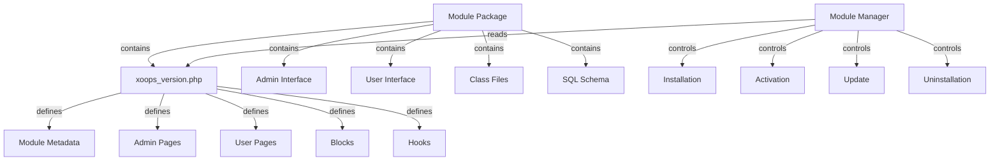

XOOPS模区块系统提供了用于开发、安装、管理和扩展模区块功能的完整框架。模区块是自我-contained包，通过附加特性和功能扩展XOOPS。

## 模区块架构



## 模区块结构

标准XOOPS模区块目录结构：

```
mymodule/
├── xoops_version.php          # Module manifest and configuration
├── admin.php                  # Admin main page
├── index.php                  # User main page
├── admin/                     # Admin pages directory
│   ├── main.php
│   ├── manage.php
│   └── settings.php
├── class/                     # Module classes
│   ├── Handler/
│   │   ├── ItemHandler.php
│   │   └── CategoryHandler.php
│   └── Objects/
│       ├── Item.php
│       └── Category.php
├── sql/                       # Database schemas
│   ├── mysql.sql
│   └── postgres.sql
├── include/                   # Include files
│   ├── common.inc.php
│   └── functions.php
├── templates/                 # Module templates
│   ├── admin/
│   │   └── main.tpl
│   └── user/
│       ├── index.tpl
│       └── item.tpl
├── blocks/                    # Module blocks
│   └── blocks.php
├── tests/                     # Unit tests
├── language/                  # Language files
│   ├── english/
│   │   └── main.php
│   └── spanish/
│       └── main.php
└── docs/                      # Documentation
```

## XOOPSModule 类

XOOPSModule 类表示已安装的XOOPS 模区块。

### 班级概览

```php
namespace Xoops\Core\Module;

class XoopsModule extends XoopsObject
{
    protected int $moduleid = 0;
    protected string $name = '';
    protected string $dirname = '';
    protected string $version = '';
    protected string $description = '';
    protected array $config = [];
    protected array $blocks = [];
    protected array $adminPages = [];
    protected array $userPages = [];
}
```

### 属性

|物业 |类型 |描述 |
|----------|------|-------------|
| `$moduleid`|整数 |唯一的模区块ID |
| `$name` |字符串|模区块显示名称 |
| `$dirname` |字符串|模区块目录名称|
| `$version` |字符串|当前模区块版本 |
| `$description` |字符串|模区块说明 |
| `$config` |数组|模区块配置|
| `$blocks` |数组|模区块区块|
| `$adminPages` |数组|管理面板页面 |
| `$userPages` |数组|用户-facing页面|

### 构造函数

```php
public function __construct()
```

创建一个新的模区块实例并初始化变量。

### 核心方法

#### 获取名称

获取模区块的显示名称。

```php
public function getName(): string
```

**返回：** `string` - 模区块显示名称

**示例：**
```php
$module = new XoopsModule();
$module->setVar('name', 'Publisher');
echo $module->getName(); // "Publisher"
```

#### 获取目录名

获取模区块的目录名称。

```php
public function getDirname(): string
```

**返回：** `string` - 模区块目录名称

**示例：**
```php
echo $module->getDirname(); // "publisher"
```

#### 获取版本

获取当前模区块版本。

```php
public function getVersion(): string
```

**返回：** `string` - 版本字符串

**示例：**
```php
echo $module->getVersion(); // "2.1.0"
```

#### 获取描述

获取模区块描述。

```php
public function getDescription(): string
```

**返回：** `string` - 模区块描述

**示例：**
```php
$desc = $module->getDescription();
```

#### 获取配置

检索模区块配置。

```php
public function getConfig(string $key = null): mixed
```

**参数：**

|参数|类型 |描述 |
|------------|------|-------------|
| `$key` |字符串|配置键（全部为空）|

**返回：** `mixed` - 配置值或数组

**示例：**
```php
$config = $module->getConfig();
$itemsPerPage = $module->getConfig('items_per_page');
```

#### 设置配置

设置模区块配置。

```php
public function setConfig(string $key, mixed $value): void
```

**参数：**

|参数|类型 |描述 |
|------------|------|-------------|
| `$key` |字符串|配置键|
| `$value` |混合 |配置值|

**示例：**
```php
$module->setConfig('items_per_page', 20);
$module->setConfig('enable_cache', true);
```

#### 获取路径

获取模区块的完整文件系统路径。

```php
public function getPath(): string
```

**返回：** `string` - 绝对模区块目录路径

**示例：**
```php
$path = $module->getPath(); // "/var/www/xoops/modules/publisher"
$classPath = $module->getPath() . '/class';
```

#### 获取网址

获取模区块的URL。

```php
public function getUrl(): string
```

**返回：** `string` - 模区块URL

**示例：**
```php
$url = $module->getUrl(); // "http://example.com/modules/publisher"
```

## 模区块安装过程

### XOOPS_module_install 函数

`XOOPS_version.php`中定义的模区块安装函数：

```php
function xoops_module_install_modulename($module)
{
    // $module is an XoopsModule instance

    // Create database tables
    // Initialize default configuration
    // Create default folders
    // Set up file permissions

    return true; // Success
}
```

**参数：**

|参数|类型 |描述 |
|------------|------|-------------|
| `$module` | XOOPS 模区块 |正在安装的模区块 |

**返回：** `bool` - 成功时为真，失败时为假

**示例：**
```php
function xoops_module_install_publisher($module)
{
    // Get module path
    $modulePath = $module->getPath();

    // Create uploads directory
    $uploadsPath = XOOPS_ROOT_PATH . '/uploads/publisher';
    if (!is_dir($uploadsPath)) {
        mkdir($uploadsPath, 0755, true);
    }

    // Get database connection
    global $xoopsDB;

    // Execute SQL installation script
    $sqlFile = $modulePath . '/sql/mysql.sql';
    if (file_exists($sqlFile)) {
        $sqlQueries = file_get_contents($sqlFile);
        // Execute queries (simplified)
        $xoopsDB->queryFromFile($sqlFile);
    }

    // Set default configuration
    $module->setConfig('items_per_page', 10);
    $module->setConfig('enable_comments', true);

    return true;
}
```

### XOOPS_module_uninstall 函数

模区块卸载功能：

```php
function xoops_module_uninstall_modulename($module)
{
    // Drop database tables
    // Remove uploaded files
    // Clean up configuration

    return true;
}
```

**示例：**
```php
function xoops_module_uninstall_publisher($module)
{
    global $xoopsDB;

    // Drop tables
    $tables = ['publisher_items', 'publisher_categories', 'publisher_comments'];
    foreach ($tables as $table) {
        $xoopsDB->query('DROP TABLE IF EXISTS ' . $xoopsDB->prefix($table));
    }

    // Remove upload folder
    $uploadsPath = XOOPS_ROOT_PATH . '/uploads/publisher';
    if (is_dir($uploadsPath)) {
        // Recursive directory deletion
        $this->recursiveRemoveDir($uploadsPath);
    }

    return true;
}
```

## 模区块挂钩

模区块挂钩允许模区块与其他模区块和系统集成。

### 钩子声明

在`XOOPS_version.php`中：

```php
$modversion['hooks'] = [
    'system.page.footer' => [
        'function' => 'publisher_page_footer'
    ],
    'user.profile.view' => [
        'function' => 'publisher_user_articles'
    ],
];
```

### 钩子实现

```php
// In a module file (e.g., include/hooks.php)

function publisher_page_footer()
{
    // Return HTML for footer
    return '<div class="publisher-footer">Publisher Footer Content</div>';
}

function publisher_user_articles($user_id)
{
    global $xoopsDB;

    // Get user's articles
    $result = $xoopsDB->query(
        'SELECT * FROM ' . $xoopsDB->prefix('publisher_articles') .
        ' WHERE author_id = ? ORDER BY published DESC LIMIT 5',
        [$user_id]
    );

    $articles = [];
    while ($row = $xoopsDB->fetchAssoc($result)) {
        $articles[] = $row;
    }

    return $articles;
}
```

### 可用的系统挂钩

|钩|参数|描述 |
|------|------------|-------------|
| `system.page.header` |无 |页眉输出 |
| `system.page.footer` |无 |页脚输出 |
| `user.login.success`| $user对象|用户登录后 |
| `user.logout` | $user对象|用户注销后 |
| `user.profile.view` | $user_id |查看用户个人资料 |
| `module.install` | $module对象|模区块安装|
| `module.uninstall` | $module对象|模区块卸载 |

## 模区块管理器服务

ModuleManager 服务处理模区块操作。

### 方法

#### 获取模区块

按名称检索模区块。

```php
public function getModule(string $dirname): ?XoopsModule
```

**参数：**|参数|类型 |描述 |
|------------|------|-------------|
| `$dirname` |字符串|模区块目录名称|

**返回：** `?XOOPSModule` - 模区块实例或 null

**示例：**
```php
$moduleManager = $kernel->getService('module');
$publisher = $moduleManager->getModule('publisher');
if ($publisher) {
    echo $publisher->getName();
}
```

#### 获取所有模区块

获取所有已安装的模区块。

```php
public function getAllModules(bool $activeOnly = true): array
```

**参数：**

|参数|类型 |描述 |
|------------|------|-------------|
| `$activeOnly` |布尔 |只返回活动模区块 |

**返回：** `array` - XOOPSModule 对象数组

**示例：**
```php
$activeModules = $moduleManager->getAllModules(true);
foreach ($activeModules as $module) {
    echo $module->getName() . " - " . $module->getVersion() . "\n";
}
```

#### isModuleActive

检查模区块是否处于活动状态。

```php
public function isModuleActive(string $dirname): bool
```

**示例：**
```php
if ($moduleManager->isModuleActive('publisher')) {
    // Publisher module is active
}
```

#### 激活模区块

激活一个模区块。

```php
public function activateModule(string $dirname): bool
```

**示例：**
```php
if ($moduleManager->activateModule('publisher')) {
    echo "Publisher activated";
}
```

#### 停用模区块

停用模区块。

```php
public function deactivateModule(string $dirname): bool
```

**示例：**
```php
if ($moduleManager->deactivateModule('publisher')) {
    echo "Publisher deactivated";
}
```

## 模区块配置（XOOPS_version.php）

完整的模区块清单示例：

```php
<?php
/**
 * Module manifest for Publisher
 */

$modversion = [
    'name' => 'Publisher',
    'version' => '2.1.0',
    'description' => 'Professional content publishing module',
    'author' => 'XOOPS Community',
    'credits' => 'Based on original work by...',
    'license' => 'GPL v2',
    'official' => 1,
    'image' => 'images/logo.png',
    'dirname' => 'publisher',
    'onInstall' => 'xoops_module_install_publisher',
    'onUpdate' => 'xoops_module_update_publisher',
    'onUninstall' => 'xoops_module_uninstall_publisher',

    // Admin pages
    'hasAdmin' => 1,
    'adminindex' => 'admin/main.php',
    'adminmenu' => [
        [
            'title' => 'Dashboard',
            'link' => 'admin/main.php',
            'icon' => 'dashboard.png'
        ],
        [
            'title' => 'Manage Items',
            'link' => 'admin/items.php',
            'icon' => 'items.png'
        ],
        [
            'title' => 'Settings',
            'link' => 'admin/settings.php',
            'icon' => 'settings.png'
        ]
    ],

    // User pages
    'hasMain' => 1,
    'main_file' => 'index.php',

    // Blocks
    'blocks' => [
        [
            'file' => 'blocks/recent.php',
            'name' => 'Recent Articles',
            'description' => 'Display recent published articles',
            'show_func' => 'publisher_recent_show',
            'edit_func' => 'publisher_recent_edit',
            'options' => '5|0|0',
            'template' => 'publisher_block_recent.tpl'
        ],
        [
            'file' => 'blocks/featured.php',
            'name' => 'Featured Articles',
            'description' => 'Display featured articles',
            'show_func' => 'publisher_featured_show',
            'edit_func' => 'publisher_featured_edit'
        ]
    ],

    // Module hooks
    'hooks' => [
        'system.page.footer' => [
            'function' => 'publisher_page_footer'
        ],
        'user.profile.view' => [
            'function' => 'publisher_user_articles'
        ]
    ],

    // Configuration items
    'config' => [
        [
            'name' => 'items_per_page',
            'title' => '_MI_PUBLISHER_ITEMS_PER_PAGE',
            'description' => '_MI_PUBLISHER_ITEMS_PER_PAGE_DESC',
            'formtype' => 'text',
            'valuetype' => 'int',
            'default' => '10'
        ],
        [
            'name' => 'enable_comments',
            'title' => '_MI_PUBLISHER_ENABLE_COMMENTS',
            'description' => '_MI_PUBLISHER_ENABLE_COMMENTS_DESC',
            'formtype' => 'yesno',
            'valuetype' => 'int',
            'default' => '1'
        ]
    ]
];

function xoops_module_install_publisher($module)
{
    // Installation logic
    return true;
}

function xoops_module_update_publisher($module)
{
    // Update logic
    return true;
}

function xoops_module_uninstall_publisher($module)
{
    // Uninstallation logic
    return true;
}
```

## 最佳实践

1. **您的类的命名空间** - 使用模区块-specific命名空间以避免冲突

2. **使用处理程序** - 始终使用处理程序类进行数据库操作

3. **国际化内容** - 对所有用户-facing字符串使用语言常量

4. **创建安装脚本** - 为数据库表提供SQL模式

5. **文档挂钩** - 清楚地记录您的模区块提供的挂钩

6. **对模区块进行版本控制** - 随着版本的发布而增加版本号

7. **测试安装** - 彻底测试install/uninstall流程

8. **处理权限** - 在允许操作之前检查用户权限

## 完整模区块示例

```php
<?php
/**
 * Custom Article Module Main Page
 */

include __DIR__ . '/include/common.inc.php';

// Get module instance
$module = xoops_getModuleByDirname('mymodule');

// Check if module is active
if (!$module) {
    die('Module not found');
}

// Get module configuration
$itemsPerPage = $module->getConfig('items_per_page');

// Get item handler
$itemHandler = xoops_getModuleHandler('item', 'mymodule');

// Fetch items with pagination
$criteria = new CriteriaCompo();
$criteria->add(new Criteria('status', 1));
$items = $itemHandler->getObjects($criteria, $itemsPerPage);

// Prepare template
$xoopsTpl->assign('items', $items);
$xoopsTpl->assign('module_name', $module->getName());
$xoopsTpl->display($module->getPath() . '/templates/user/index.tpl');
```

## 相关文档

- ../Kernel/Kernel-Classes - 内核初始化和核心服务
- ../Template/Template-System - 模区块模板和主题集成
- ../Database/QueryBuilder - 数据库查询构建
- ../Core/XOOPSObject - 基础对象类

---

*另见：[XOOPS Module Development Guide](https://github.com/XOOPS/XOOPSCore27/wiki/Module-Development)*