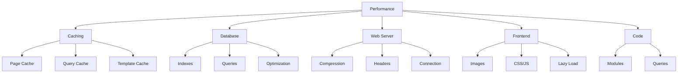

---
title：“性能优化”
description：“XOOPS的速度优化指南，包括缓存、数据库优化、CDN集成和性能监控”
---

# XOOPS 性能优化

优化XOOPS以获得最大速度和效率的综合指南。

## 性能优化概述



## 缓存配置

缓存是提高性能最快的方法。

### 页面-Level 缓存

在XOOPS中启用全页缓存：

**管理面板 > 系统 > 首选项 > 缓存设置**

```
Enable Caching: Yes
Cache Type: File Cache (or APCu/Memcache)
Cache Lifetime: 3600 seconds (1 hour)
Cache Module Lists: Yes
Cache Configuration: Yes
Cache Search Results: Yes
```

### 文件-Based 缓存

配置文件缓存位置：

```bash
# Create cache directory outside web root (more secure)
mkdir -p /var/cache/xoops
chown www-data:www-data /var/cache/xoops
chmod 755 /var/cache/xoops

# Edit mainfile.php
define('XOOPS_CACHE_PATH', '/var/cache/xoops/');
```

### APCu 缓存

APCu 提供-memory 缓存（非常快）：

```bash
# Install APCu
apt-get install php-apcu

# Verify installation
php -m | grep apcu

# Configure in php.ini
apc.enabled = 1
apc.memory_size = 128M
apc.ttl = 0
apc.user_ttl = 3600
apc.shm_size = 128
```

在XOOPS中启用：

**管理面板 > 系统 > 首选项 > 缓存设置**

```
Cache Type: APCu
```

### Memcache/Redis 缓存

高-traffic站点的分布式缓存：

**安装内存缓存：**

```bash
# Install Memcache server
apt-get install memcached

# Start service
systemctl start memcached
systemctl enable memcached

# Verify running
netstat -tlnp | grep memcached
# Should show listening on port 11211
```

**在XOOPS中配置：**

编辑主文件。php：

```php
// Memcache configuration
define('XOOPS_CACHE_TYPE', 'memcache');
define('XOOPS_CACHE_HOST', 'localhost');
define('XOOPS_CACHE_PORT', 11211);
define('XOOPS_CACHE_TIMEOUT', 0);
```

或者在管理面板中：

```
Cache Type: Memcache
Memcache Host: localhost:11211
```

### 模板缓存

编译并缓存XOOPS模板：

```bash
# Ensure templates_c is writable
chmod 777 /var/www/html/xoops/templates_c/

# Clear old cached templates
rm -rf /var/www/html/xoops/templates_c/*
```

在主题中配置：

```html
<!-- In theme xoops_version.php -->
{smarty.const.XOOPS_VAR_PATH|constant}
<{$xoops_meta}>

<!-- Templates use caching -->
{cache}
    [Cached content here]
{/cache}
```

## 数据库优化

### 添加数据库索引

正确索引的数据库查询速度要快得多。

```sql
-- Check current indexes
SHOW INDEXES FROM xoops_users;

-- Common indexes to add
ALTER TABLE xoops_users ADD INDEX idx_uname (uname);
ALTER TABLE xoops_users ADD INDEX idx_email (email);
ALTER TABLE xoops_users ADD INDEX idx_uid_active (uid, user_actkey);

-- Add indexes to posts/content tables
ALTER TABLE xoops_posts ADD INDEX idx_post_published (post_published);
ALTER TABLE xoops_posts ADD INDEX idx_post_uid (post_uid);
ALTER TABLE xoops_posts ADD INDEX idx_post_created (post_created);

-- Verify indexes created
SHOW INDEXES FROM xoops_users\G
```

### 优化表

定期表优化可提高性能：

```sql
-- Optimize all tables
OPTIMIZE TABLE xoops_users;
OPTIMIZE TABLE xoops_posts;
OPTIMIZE TABLE xoops_config;
OPTIMIZE TABLE xoops_comments;

-- Or optimize all at once
REPAIR TABLE xoops_users;
OPTIMIZE TABLE xoops_users;
REPAIR TABLE xoops_posts;
OPTIMIZE TABLE xoops_posts;
```

创建自动优化脚本：

```bash
#!/bin/bash
# Database optimization script

echo "Optimizing XOOPS database..."

mysql -u xoops_user -p xoops_db << EOF
-- Optimize all tables
OPTIMIZE TABLE xoops_users;
OPTIMIZE TABLE xoops_posts;
OPTIMIZE TABLE xoops_config;
OPTIMIZE TABLE xoops_comments;
OPTIMIZE TABLE xoops_users_online;

-- Show database size
SELECT table_schema,
       ROUND(SUM(data_length + index_length) / 1024 / 1024, 2) as total_mb
FROM information_schema.tables
WHERE table_schema = 'xoops_db'
GROUP BY table_schema;
EOF

echo "Database optimization completed!"
```

使用 cron 进行计划：

```bash
# Weekly optimization
crontab -e
# Add: 0 3 * * 0 /usr/local/bin/optimize-xoops-db.sh
```

### 查询优化

回顾一下慢查询：

```sql
-- Enable slow query log
SET GLOBAL slow_query_log = 'ON';
SET GLOBAL long_query_time = 2;

-- View slow queries
SELECT * FROM mysql.slow_log;

-- Or check slow log file
tail -100 /var/log/mysql/slow.log
```

常见的优化技巧：

```php
// SLOW - Avoid unnecessary queries in loops
foreach ($users as $user) {
    $profile = getUserProfile($user['uid']);  // Query in loop!
    echo $profile['name'];
}

// FAST - Get all data at once
$profiles = getAllUserProfiles($user_ids);
foreach ($users as $user) {
    echo $profiles[$user['uid']]['name'];
}
```

### 增加缓冲池

配置MySQL以获得更好的缓存：

编辑`/etc/mysql/mysql.conf.d/mysqld.cnf`：

```ini
# InnoDB Buffer Pool (50-80% of system RAM)
innodb_buffer_pool_size = 1G

# Query Cache (optional, can be disabled in MySQL 5.7+)
query_cache_size = 64M
query_cache_type = 1

# Max Connections
max_connections = 500

# Max Allowed Packet
max_allowed_packet = 256M

# Connection timeout
connect_timeout = 10
```

重新启动MySQL：

```bash
systemctl restart mysql
```

## Web 服务器优化

### 启用 Gzip 压缩

压缩响应以减少带宽：

**阿帕奇配置：**

```apache
<IfModule mod_deflate.c>
    AddOutputFilterByType DEFLATE text/html text/plain text/xml text/css text/javascript application/javascript application/json

    # Don't compress images and already compressed files
    SetEnvIfNoCase Request_URI \.(jpg|jpeg|png|gif|zip|gzip)$ no-gzip dont-vary

    # Log compressed responses
    DeflateBufferSize 8096
</IfModule>
```

**Nginx 配置：**

```nginx
gzip on;
gzip_types text/html text/plain text/css text/javascript application/javascript application/json;
gzip_min_length 1000;
gzip_vary on;
gzip_comp_level 6;

# Don't compress already compressed formats
gzip_disable "msie6";
```

验证压缩：

```bash
# Check if response is gzipped
curl -I -H "Accept-Encoding: gzip" http://your-domain.com/xoops/

# Should show:
# Content-Encoding: gzip
```

### 浏览器缓存标头

设置静态资源的缓存过期时间：

**阿帕奇：**

```apache
<IfModule mod_expires.c>
    ExpiresActive On

    # Cache images for 30 days
    ExpiresByType image/jpeg "access plus 30 days"
    ExpiresByType image/gif "access plus 30 days"
    ExpiresByType image/png "access plus 30 days"
    ExpiresByType image/svg+xml "access plus 30 days"

    # Cache CSS/JS for 30 days
    ExpiresByType text/css "access plus 30 days"
    ExpiresByType application/javascript "access plus 30 days"
    ExpiresByType text/javascript "access plus 30 days"

    # Cache fonts for 1 year
    ExpiresByType font/eot "access plus 1 year"
    ExpiresByType font/ttf "access plus 1 year"
    ExpiresByType font/woff "access plus 1 year"
    ExpiresByType font/woff2 "access plus 1 year"

    # Don't cache HTML
    ExpiresByType text/html "access plus 1 hour"
</IfModule>
```

**Nginx：**

```nginx
location ~* \.(jpg|jpeg|png|gif|ico|svg|woff|woff2|ttf|eot)$ {
    expires 30d;
    add_header Cache-Control "public, immutable";
}

location ~* \.(css|js)$ {
    expires 30d;
    add_header Cache-Control "public";
}

location ~ \.html$ {
    expires 1h;
    add_header Cache-Control "public";
}
```

### 连接保持-Alive

启用持久HTTP连接：

**阿帕奇：**

```apache
<IfModule mod_http.c>
    KeepAlive On
    KeepAliveTimeout 15
    MaxKeepAliveRequests 100
</IfModule>
```

**Nginx：**

```nginx
keepalive_timeout 15s;
keepalive_requests 100;
```

## 前端优化

### 优化图像

减小图像文件大小：

```bash
# Batch compress JPEG images
for img in *.jpg; do
    convert "$img" -quality 85 "optimized_$img"
done

# Batch compress PNG images
for img in *.png; do
    optipng -o2 "$img"
done

# Or use imagemin CLI
npm install -g imagemin-cli
imagemin images/ --out-dir=images-optimized
```

### 缩小 CSS 和 JavaScript

减少 CSS/JS 文件大小：

**使用Node.js工具：**

```bash
# Install minifiers
npm install -g uglify-js clean-css-cli

# Minify JavaScript
uglifyjs script.js -o script.min.js

# Minify CSS
cleancss style.css -o style.min.css
```

**使用在线工具：**
- CSS缩小器：https://cssminifier.com/
- JavaScript缩小器：https://www.minifycode.com/javascript-minifier/

### 延迟加载图像

仅在需要时加载图像：

```html
<!-- Add loading="lazy" attribute -->


<!-- Or use JavaScript library for older browsers -->


<script src="https://cdnjs.cloudflare.com/ajax/libs/vanilla-lazyload/17.1.2/lazyload.min.js"></script>
<script>
    var lazyLoad = new LazyLoad({
        elements_selector: ".lazy"
    });
</script>
```

### 减少渲染-Blocking资源

策略性地加载CSS/JS：

```html
<!-- Load critical CSS inline -->
<style>
    /* Critical styles for above-the-fold */
</style>

<!-- Defer non-critical CSS -->
<link rel="stylesheet" href="style.css" media="print" onload="this.media='all'">

<!-- Defer JavaScript -->
<script src="script.js" defer></script>

<!-- Or use async for non-critical scripts -->
<script src="analytics.js" async></script>
```

## CDN 集成

使用内容交付网络实现更快的全球访问。

### 流行的 CDN

| CDN|成本|特点|
|---|---|---|
|云耀 | Free/Paid| DDoS，DNS，缓存，分析 |
| AWSCloudFront |付费|高性能，全球 |
|兔子CDN |价格实惠 |存储、视频、缓存 |
| jsDelivr |免费| JavaScript图书馆|
| cdnjs |免费|热门图书馆 |

### Cloudflare 设置

1. 在https://www.cloudflare.com/处注册
2. 添加您的域名
3. 使用 Cloudflare 更新域名服务器
4. 启用缓存选项：
   - 缓存级别：激进
   - 缓存所有内容：开
   - 浏览器缓存TTL：1个月

5. 在 XOOPS 中，更新您的域以使用 Cloudflare DNS

### 在 XOOPS 中配置 CDN

将图像 URL 更新为 CDN：

编辑主题模板：

```html
<!-- Original -->


<!-- With CDN -->

```

或者在PHP中设置：

```php
// In mainfile.php or config
define('XOOPS_CDN_URL', 'https://cdn.your-domain.com');

// In template

```

## 性能监控

### PageSpeed 洞察测试

测试您的网站性能：

1. 访问 Google PageSpeed Insights：https://pagespeed.web.dev/
2. 输入您的 XOOPS URL
3. 审查建议
4. 实施建议的改进

### 服务器性能监控

监控真实的-time服务器指标：

```bash
# Install monitoring tools
apt-get install htop iotop nethogs

# Monitor CPU and memory
htop

# Monitor disk I/O
iotop

# Monitor network
nethogs
```

### PHP 性能分析

识别缓慢的PHP代码：

```php
<?php
// Use Xdebug for profiling
xdebug_start_trace('profile');

// Your code here
$result = someExpensiveFunction();

xdebug_stop_trace();
?>
```

### MySQL 查询监控

跟踪慢速查询：

```bash
# Enable query logging
mysql -u root -p

SET GLOBAL general_log = 'ON';
SET GLOBAL log_output = 'FILE';
SET GLOBAL general_log_file = '/var/log/mysql/query.log';

# Review slow queries
tail -f /var/log/mysql/slow.log

# Analyze query with EXPLAIN
EXPLAIN SELECT * FROM xoops_users WHERE uid = 1\G
```## 性能优化清单

实施这些以获得最佳性能：

- [ ] **缓存：** 启用 file/APCu/Memcache 缓存
- [ ] **数据库：** 添加索引，优化表
- [ ] **压缩：** 启用 Gzip 压缩
- [ ] **浏览器缓存：** 设置缓存标头
- [ ] **图像：** 优化和压缩
- [ ] **CSS/JS:** 缩小文件
- [ ] **延迟加载：** 图像实现
- [ ] **CDN:** 用于静态资源
- [ ] **保留-Alive:** 启用持久连接
- [ ] **模块：** 禁用未使用的模块
- [ ] **主题：** 使用轻量级、优化的主题
- [ ] **监控：** 跟踪性能指标
- [ ] **定期维护：** 清除缓存，优化数据库

## 性能优化脚本

自动优化：

```bash
#!/bin/bash
# Performance optimization script

echo "=== XOOPS Performance Optimization ==="

# Clear cache
echo "Clearing cache..."
rm -rf /var/www/html/xoops/cache/*
rm -rf /var/www/html/xoops/templates_c/*

# Optimize database
echo "Optimizing database..."
mysql -u xoops_user -p xoops_db << EOF
OPTIMIZE TABLE xoops_users;
OPTIMIZE TABLE xoops_posts;
OPTIMIZE TABLE xoops_config;
OPTIMIZE TABLE xoops_comments;
EOF

# Check file permissions
echo "Verifying file permissions..."
find /var/www/html/xoops -type f -exec chmod 644 {} \;
find /var/www/html/xoops -type d -exec chmod 755 {} \;
chmod 777 /var/www/html/xoops/cache
chmod 777 /var/www/html/xoops/templates_c
chmod 777 /var/www/html/xoops/uploads
chmod 777 /var/www/html/xoops/var

# Generate performance report
echo "Performance Optimization Complete!"
echo ""
echo "Next steps:"
echo "1. Test site at https://pagespeed.web.dev/"
echo "2. Monitor performance in admin panel"
echo "3. Consider CDN for static assets"
echo "4. Review slow queries in MySQL"
```

## 之前和之后的指标

轨道改进：

```
Before Optimization:
- Page Load Time: 3.5 seconds
- Database Queries: 45
- Cache Hit Rate: 0%
- Database Size: 250MB

After Optimization:
- Page Load Time: 0.8 seconds (77% faster)
- Database Queries: 8 (cached)
- Cache Hit Rate: 85%
- Database Size: 120MB (optimized)
```

## 后续步骤

1.查看基本配置
2. 确保安全措施
3. 实现缓存
4. 使用工具监控性能
5. 根据指标进行调整

---

**标签：** #性能 #优化 #缓存 #数据库 #cdn

**相关文章：**
- ../../06-Publisher-Module/User-Guide/Basic-Configuration
- 系统-Settings
- 安全-Configuration
- ../Installation/Server-Requirements