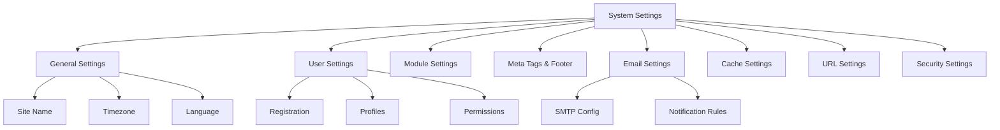

---
title：“系统设置”
description：“XOOPS管理系统设置、配置选项和首选项层次结构的综合指南”
---

#XOOPS系统设置

本指南涵盖了 XOOPS 管理面板中提供的完整系统设置（按类别组织）。

## 系统设置架构



## 访问系统设置

### 地点

**管理面板 > 系统 > 首选项**

或者直接导航：

```
http://your-domain.com/xoops/admin/index.php?fct=preferences
```

### 权限要求

- 只有管理员（网站管理员）可以访问系统设置
- 更改会影响整个网站
- 大多数更改立即生效

## 常规设置

XOOPS 安装的基本配置。

### 基本信息

```
Site Name: [Your Site Name]
Default Description: [Brief description of your site]
Site Slogan: [Catchy slogan]
Admin Email: admin@your-domain.com
Webmaster Name: Administrator Name
Webmaster Email: admin@your-domain.com
```

### 外观设置

```
Default Theme: [Select theme]
Default Language: English (or preferred language)
Items Per Page: 15 (typically 10-25)
Words in Snippet: 25 (for search results)
Theme Upload Permission: Disabled (security)
```

### 区域设置

```
Default Timezone: [Your timezone]
Date Format: %Y-%m-%d (YYYY-MM-DD format)
Time Format: %H:%M:%S (HH:MM:SS format)
Daylight Saving Time: [Auto/Manual/None]
```

**时区格式表：**

|地区 |时区 | UTC偏移|
|---|---|---|
|美国东部航空 | America/New_York| -5 / -4 |
|美国中部 | America/Chicago | -6 / -5 |
|美国山| America/Denver | -7 / -6 |
|美国太平洋 | America/Los_Angeles | -8 / -7 |
| UK/London | Europe/London | 0 / +1 |
| France/Germany | Europe/Paris | +1 / +2 |
|日本 | Asia/Tokyo| +9 |
|中国 | Asia/Shanghai | +8 |
| Australia/Sydney| Australia/Sydney| +10 / +11 |

### 搜索配置

```
Enable Search: Yes
Search Admin Pages: Yes/No
Search Archives: Yes
Default Search Type: All / Pages only
Words Excluded from Search: [Comma-separated list]
```

**常见排除词：** the、a、an、and、or、but、in、on、at、by、to、from

## 用户设置

控制用户帐户行为和注册过程。

### 用户注册

```
Allow User Registration: Yes/No
Registration Type:
  ☐ Auto-activate (Instant access)
  ☐ Admin approval (Admin must approve)
  ☐ Email verification (User must verify email)

Notification to Users: Yes/No
User Email Verification: Required/Optional
```

### 新用户配置

```
Auto-login New Users: Yes/No
Assign Default User Group: Yes
Default User Group: [Select group]
Create User Avatar: Yes/No
Initial User Avatar: [Select default]
```

### 用户配置文件设置

```
Allow User Profiles: Yes
Show Member List: Yes
Show User Statistics: Yes
Show Last Online Time: Yes
Allow User Avatar: Yes
Avatar Max File Size: 100KB
Avatar Dimensions: 100x100 pixels
```

### 用户电子邮件设置

```
Allow Users to Hide Email: Yes
Show Email on Profile: Yes
Notification Email Interval: Immediately/Daily/Weekly/Never
```

### 用户活动跟踪

```
Track User Activity: Yes
Log User Logins: Yes
Log Failed Logins: Yes
Track IP Address: Yes
Clear Activity Logs Older Than: 90 days
```

### 账户限制

```
Allow Duplicate Email: No
Minimum Username Length: 3 characters
Maximum Username Length: 15 characters
Minimum Password Length: 6 characters
Require Special Characters: Yes
Require Numbers: Yes
Password Expiration: 90 days (or Never)
Accounts Inactive Days to Delete: 365 days
```

## 模区块设置

配置各个模区块的行为。

### 通用模区块选项

对于每个已安装的模区块，您可以设置：

```
Module Status: Active/Inactive
Display in Menu: Yes/No
Module Weight: [1-999] (higher = lower in display)
Homepage Default: This module shows when visiting /
Admin Access: [Allowed user groups]
User Access: [Allowed user groups]
```

### 系统模区块设置

```
Show Homepage as: Portal / Module / Static Page
Default Homepage Module: [Select module]
Show Footer Menu: Yes
Footer Color: [Color selector]
Show System Stats: Yes
Show Memory Usage: Yes
```

### 每个模区块的配置

每个模区块可以有模区块-specific设置：

**示例 - 页面模区块：**
```
Enable Comments: Yes/No
Moderate Comments: Yes/No
Comments Per Page: 10
Enable Ratings: Yes
Allow Anonymous Ratings: Yes
```

**示例 - 用户模区块：**
```
Avatar Upload Folder: ./uploads/
Maximum Upload Size: 100KB
Allow File Upload: Yes
Allowed File Types: jpg, gif, png
```

访问模区块-specific设置：
- **管理 > 模区块 > [模区块名称] > 首选项**

## 元标签和SEO设置

配置元标记以进行搜索引擎优化。

### 全局元标签

```
Meta Keywords: xoops, cms, content management system
Meta Description: A powerful content management system for building dynamic websites
Meta Author: Your Name
Meta Copyright: Copyright 2025, Your Company
Meta Robots: index, follow
Meta Revisit: 30 days
```

### 元标记最佳实践

|标签 |目的|推荐|
|---|---|---|
|关键词|搜索词| 5-10 个相关关键字，逗号-separated |
|描述 |搜索列表 | 150-160 个字符 |
|作者 |页面创建者 |您的姓名或公司 |
|版权所有 |法律 |您的版权声明 |
|机器人 |爬虫使用说明|索引，跟随（允许索引）|

### 页脚设置

```
Show Footer: Yes
Footer Color: Dark/Light
Footer Background: [Color code]
Footer Text: [HTML allowed]
Additional Footer Links: [URL and text pairs]
```

**页脚示例 HTML:**
```html
<p>Copyright &copy; 2025 Your Company. All rights reserved.</p>
<p><a href="/privacy">Privacy Policy</a> | <a href="/terms">Terms of Use</a></p>
```

### 社交元标签（开放图谱）

```
Enable Open Graph: Yes
Facebook App ID: [App ID]
Twitter Card Type: summary / summary_large_image / player
Default Share Image: [Image URL]
```

## 电子邮件设置

配置电子邮件发送和通知系统。

### 电子邮件发送方式

```
Use SMTP: Yes/No

If SMTP:
  SMTP Host: smtp.gmail.com
  SMTP Port: 587 (TLS) or 465 (SSL)
  SMTP Security: TLS / SSL / None
  SMTP Username: [email@example.com]
  SMTP Password: [password]
  SMTP Authentication: Yes/No
  SMTP Timeout: 10 seconds

If PHP mail():
  Sendmail Path: /usr/sbin/sendmail -t -i
```

### 电子邮件配置

```
From Address: noreply@your-domain.com
From Name: Your Site Name
Reply-To Address: support@your-domain.com
BCC Admin Emails: Yes/No
```

### 通知设置

```
Send Welcome Email: Yes/No
Welcome Email Subject: Welcome to [Site Name]
Welcome Email Body: [Custom message]

Send Password Reset Email: Yes/No
Include Random Password: Yes/No
Token Expiration: 24 hours
```

### 管理员通知

```
Notify Admin on Registration: Yes
Notify Admin on Comments: Yes
Notify Admin on Submissions: Yes
Notify Admin on Errors: Yes
```

### 用户通知

```
Notify User on Registration: Yes
Notify User on Comments: Yes
Notify User on Private Messages: Yes
Allow Users to Disable Notifications: Yes
Default Notification Frequency: Immediately
```

### 电子邮件模板

在管理面板中自定义通知电子邮件：

**路径：**系统 > 电子邮件模板

可用模板：
- 用户注册
- 密码重置
- 评论通知
- 私人讯息
- 系统警报
- 模区块-specific电子邮件

## 缓存设置

通过缓存优化性能。

### 缓存配置

```
Enable Caching: Yes/No
Cache Type:
  ☐ File Cache
  ☐ APCu (Alternative PHP Cache)
  ☐ Memcache (Distributed caching)
  ☐ Redis (Advanced caching)

Cache Lifetime: 3600 seconds (1 hour)
```

### 按类型划分的缓存选项

**文件缓存：**
```
Cache Directory: /var/www/html/xoops/cache/
Clear Interval: Daily
Maximum Cache Files: 1000
```

**APCu 缓存：**
```
Memory Allocation: 128MB
Fragmentation Level: Low
```

**Memcache/Redis:**
```
Server Host: localhost
Server Port: 11211 (Memcache) / 6379 (Redis)
Persistent Connection: Yes
```

### 缓存什么

```
Cache Module Lists: Yes
Cache Configuration Data: Yes
Cache Template Data: Yes
Cache User Session Data: Yes
Cache Search Results: Yes
Cache Database Queries: Yes
Cache RSS Feeds: Yes
Cache Images: Yes
```

## URL 设置

配置URL重写和格式化。

### 友好URL设置

```
Enable Friendly URLs: Yes/No
Friendly URL Type:
  ☐ Path Info: /page/about
  ☐ Query String: /index.php?p=about

Trailing Slash: Include / Omit
URL Case: Lower case / Case sensitive
```

### URL重写规则

```
.htaccess Rules: [Display current]
Nginx Rules: [Display current if Nginx]
IIS Rules: [Display current if IIS]
```

## 安全设置

控制安全-related配置。

### 密码安全

```
Password Policy:
  ☐ Require uppercase letters
  ☐ Require lowercase letters
  ☐ Require numbers
  ☐ Require special characters

Minimum Password Length: 8 characters
Password Expiration: 90 days
Password History: Remember last 5 passwords
Force Password Change: On next login
```

### 登录安全

```
Lock Account After Failed Attempts: 5 attempts
Lock Duration: 15 minutes
Log All Login Attempts: Yes
Log Failed Logins: Yes
Admin Login Alert: Send email on admin login
Two-Factor Authentication: Disabled/Enabled
```

### 文件上传安全

```
Allow File Uploads: Yes/No
Maximum File Size: 128MB
Allowed File Types: jpg, gif, png, pdf, zip, doc, docx
Scan Uploads for Malware: Yes (if available)
Quarantine Suspicious Files: Yes
```

### 会话安全

```
Session Management: Database/Files
Session Timeout: 1800 seconds (30 min)
Session Cookie Lifetime: 0 (until browser closes)
Secure Cookie: Yes (HTTPS only)
HTTP Only Cookie: Yes (prevent JavaScript access)
```

### CORS 设置

```
Allow Cross-Origin Requests: No
Allowed Origins: [List domains]
Allow Credentials: No
Allowed Methods: GET, POST
```

## 高级设置

高级用户的附加配置选项。### 调试模式

```
Debug Mode: Disabled/Enabled
Log Level: Error / Warning / Info / Debug
Debug Log File: /var/log/xoops_debug.log
Display Errors: Disabled (production)
```

### 性能调整

```
Optimize Database Queries: Yes
Use Query Cache: Yes
Compress Output: Yes
Minify CSS/JavaScript: Yes
Lazy Load Images: Yes
```

### 内容设置

```
Allow HTML in Posts: Yes/No
Allowed HTML Tags: [Configure]
Strip Harmful Code: Yes
Allow Embed: Yes/No
Content Moderation: Automatic/Manual
Spam Detection: Yes
```

## 设置Export/Import

### 备份设置

导出当前设置：

**管理面板 > 系统 > 工具 > 导出设置**

```bash
# Settings exported as JSON file
# Download and store securely
```

### 恢复设置

导入之前导出的设置：

**管理面板 > 系统 > 工具 > 导入设置**

```bash
# Upload JSON file
# Verify changes before confirming
```

## 配置层次结构

XOOPS设置层次结构（从上到下 - 第一场比赛获胜）：

```
1. mainfile.php (Constants)
2. Module-specific config
3. Admin System Settings
4. Theme configuration
5. User preferences (for user-specific settings)
```

## 设置备份脚本

创建当前设置的备份：

```php
<?php
// Backup script: /var/www/html/xoops/backup-settings.php
require_once __DIR__ . '/mainfile.php';

$config_handler = xoops_getHandler('config');
$configs = $config_handler->getConfigs();

$backup = [
    'exported_date' => date('Y-m-d H:i:s'),
    'xoops_version' => XOOPS_VERSION,
    'php_version' => PHP_VERSION,
    'settings' => []
];

foreach ($configs as $config) {
    $backup['settings'][$config->getVar('conf_name')] = [
        'value' => $config->getVar('conf_value'),
        'description' => $config->getVar('conf_desc'),
        'type' => $config->getVar('conf_type'),
    ];
}

// Save to JSON file
file_put_contents(
    '/backups/xoops_settings_' . date('YmdHis') . '.json',
    json_encode($backup, JSON_PRETTY_PRINT)
);

echo "Settings backed up successfully!";
?>
```

## 常见设置更改

### 更改站点名称

1. 管理 > 系统 > 首选项 > 常规设置
2.修改“站点名称”
3. 点击“保存”

### Enable/Disable 注册

1. 管理 > 系统 > 首选项 > 用户设置
2. 切换“允许用户注册”
3.选择注册类型
4. 点击“保存”

### 更改默认主题

1. 管理 > 系统 > 首选项 > 常规设置
2.选择“默认主题”
3. 点击“保存”
4. 清除缓存以使更改生效

### 更新联系电子邮件

1. 管理 > 系统 > 首选项 > 常规设置
2.修改“管理员邮箱”
3.修改“站长邮箱”
4. 点击“保存”

## 验证清单

配置系统设置后，验证：

- [ ] 站点名称正确显示
- [ ] 时区显示正确时间
- [ ] 电子邮件通知正确发送
- [ ] 用户注册按配置进行
- [ ] 主页显示选定的默认值
- [ ] 搜索功能有效
- [ ] 缓存提高了页面加载时间
- [ ] 友好 URL 有效（如果启用）
- [ ] 元标记出现在页面源代码中
- [ ] 收到管理员通知
- [ ] 强制执行安全设置

## 故障排除设置

### 设置未保存

**解决方案：**
```bash
# Check file permissions on config directory
chmod 755 /var/www/html/xoops/var/

# Verify database writable
# Try saving again in admin panel
```

### 更改未生效

**解决方案：**
```bash
# Clear cache
rm -rf /var/www/html/xoops/cache/*
rm -rf /var/www/html/xoops/templates_c/*

# If still not working, restart web server
systemctl restart apache2
```

### 电子邮件未发送

**解决方案：**
1. 验证电子邮件设置中的 SMTP 凭据
2. 使用“发送测试电子邮件”按钮进行测试
3.检查错误日志
4. 尝试使用 PHP mail() 代替 SMTP

## 后续步骤

系统设置配置后：

1. 配置安全设置
2、优化性能
3.探索管理面板功能
4. 设置用户管理

---

**标签：** #system-settings #configuration #preferences #admin-panel

**相关文章：**
- ../../06-Publisher-Module/User-Guide/Basic-Configuration
- 安全-Configuration
- 性能-Optimization
- ../First-Steps/Admin-Panel-Overview