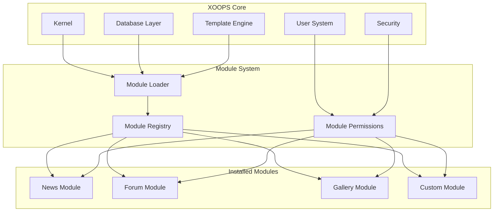
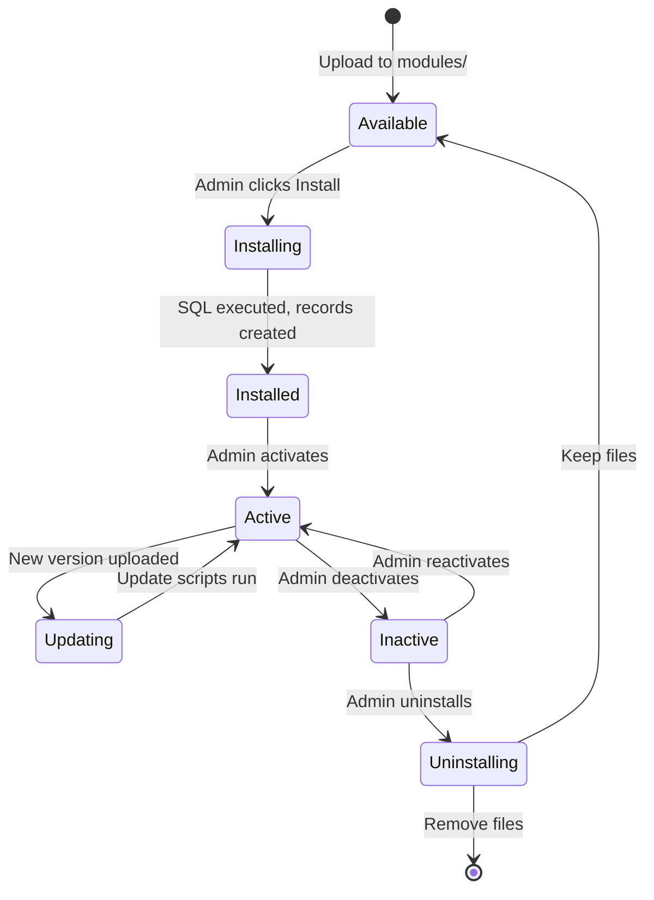

---
title：“ADR-001 - 模区块化架构”
description：“XOOPS模区块化设计的架构决策记录”
---

# ADR-001：模区块化架构

> XOOPS 核心模区块化设计理念的架构决策记录。

---

## 状态

**已接受** - 自 XOOPS 启动以来的基本决定

---

## 上下文

XOOPS（可扩展对象-Oriented门户系统）需要一个架构：

1.允许第三方-party开发者扩展功能
2. 使站点管理员无需编码即可进行自定义
3.支持自主开发和更新
4. 提供不同功能之间的隔离
5.从简单的博客扩展到复杂的门户

2000 年代初的CMS 环境提供了难以定制和扩展的整体系统。

---

## 决策图



---

## 决定

我们将实现一个**模区块化架构**，其中：

### 1. 核心提供基础设施
- 数据库抽象
- 用户身份验证和权限
- 模板渲染（Smarty）
- 安全实用程序
- 表格生成
- 常用公用设施

### 2. 模区块是自我的-Contained
各模区块：
- 有自己的目录结构
- 包含自己的类、模板，SQL
- 定义自己的配置
- 可以独立地installed/uninstalled
- 有版本跟踪

### 3. 标准模区块结构
```
modules/modulename/
├── admin/                  # Admin interface
│   ├── index.php
│   └── menu.php
├── class/                  # PHP classes
├── include/                # Include files
├── language/               # Translations
├── sql/                    # Database schema
├── templates/              # Smarty templates
├── blocks/                 # Block definitions
├── xoops_version.php       # Module manifest
├── index.php               # Entry point
└── header.php              # Module bootstrap
```

### 4. 模区块清单 (XOOPS_version.php)
```php
<?php
$modversion['name']        = 'Module Name';
$modversion['version']     = '1.0.0';
$modversion['description'] = 'Module description';
$modversion['dirname']     = basename(__DIR__);
$modversion['hasMain']     = 1;
$modversion['hasAdmin']    = 1;
$modversion['sqlfile']['mysql'] = 'sql/mysql.sql';
$modversion['tables']      = ['modulename_table1'];
$modversion['templates']   = [...];
$modversion['config']      = [...];
$modversion['blocks']      = [...];
```

### 5.模区块通讯
- 通过核心 API（处理程序、事件）
- 数据库关系
- 预载挂钩
- 共享服务

---

## 模区块生命周期



---

## 后果

### 积极

1. **可扩展性**：社区创建的数千个模区块
2. **独立性**：模区块可以单独开发
3. **灵活性**：网站可以混合和匹配功能
4. **可维护性**：更新不影响其他模区块
5. **市场**：模区块生态系统出现
6. **学习曲线**：开发人员学习一种模式

### 负面

1. **开销**：每个模区块都有引导成本
2. **重复**：公共代码可能重复
3. **集成**：跨-module功能需要精心设计
4. **版本控制**：需要模区块兼容性管理
5. **质量差异**：第三-party模区块质量不同

### 中性

1. **数据库**：每个模区块管理自己的表
2. **模板**：主题必须容纳各种模区块
3. **更新**：核心和模区块独立更新

---

## 考虑的替代方案

### 1. 整体架构
**拒绝** - 过于僵化，难以定制

### 2. 插件架构 (WordPress-style)
**部分采用** - 区块和预加载在模区块内提供插件-like挂钩

### 3. 组件架构 (Joomla-style)
**被拒绝** - 更复杂，开发人员更少-friendly

### 4.微服务
**不适用** - 对于共享托管时代来说太复杂

---

## 相关决定

- ADR-002：对象-Oriented数据库访问
- ADR-003：Smarty模板引擎
- ADR-005：权限系统

---

## 参考文献

- XOOPS项目历史
- PHP应用程序架构模式
- CMS比较研究（2001-2005）

---

#XOOPS #architecture #adr #modules #design-decision