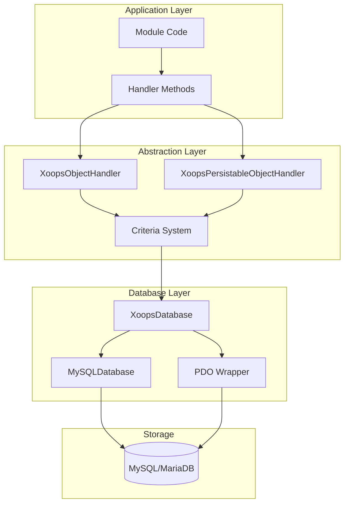
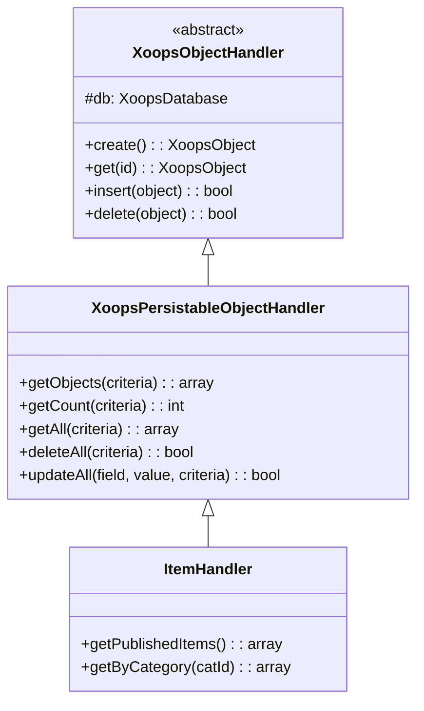
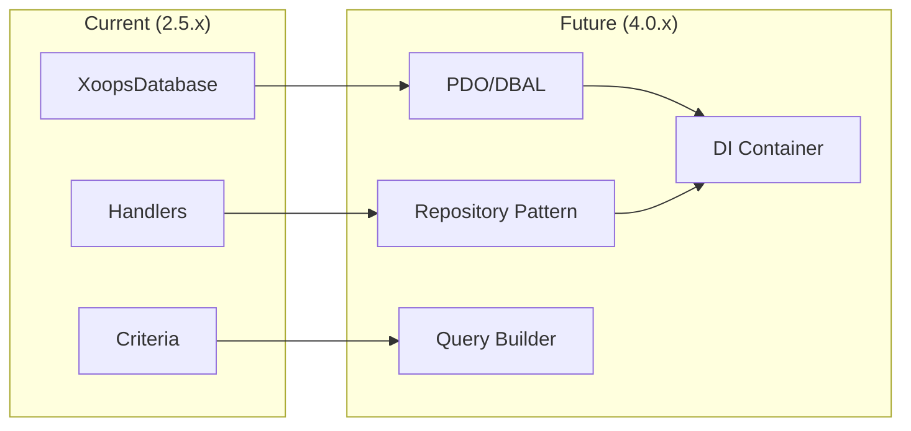

# ADR-002：数据库抽象

> XOOPS 对象-oriented 数据库访问模式的架构决策记录。

---

## 状态

**已接受** - 自 XOOPS 2.0 起的核心模式

---

## 上下文

XOOPS 需要一个数据库交互策略：

1.抽象数据库-specificSQL语法
2. 跨所有模区块提供一致的CRUD操作
3.启用自动数据清理和转义
4.支持未来数据库引擎的变更
5、简化开发者常用操作

替代方案是：
- 整个代码库中的原始SQL
- 完整ORM（教义，雄辩）
- 自定义轻量级抽象

---

## 决策图



---

## 决定

我们将通过以下方式实现 **处理程序模式**：

### 1.XOOPSObject - 数据容器

每个数据实体都扩展 XOOPSObject：

```php
class Item extends XoopsObject
{
    public function __construct()
    {
        $this->initVar('id', XOBJ_DTYPE_INT, null, false);
        $this->initVar('title', XOBJ_DTYPE_TXTBOX, '', true, 255);
        $this->initVar('content', XOBJ_DTYPE_TXTAREA, '', false);
        $this->initVar('status', XOBJ_DTYPE_INT, 0, false);
    }
}
```

### 2. Handler - 运营经理

每个对象都有一个对应的处理程序：

```php
class ItemHandler extends XoopsPersistableObjectHandler
{
    public function __construct($db)
    {
        parent::__construct($db, 'mymodule_items', Item::class, 'id', 'title');
    }

    // CRUD methods inherited:
    // - create(), get(), insert(), delete()
    // - getObjects(), getCount(), getAll()
}
```

### 3. 标准 - 查询生成器

对象-oriented查询条件：

```php
$criteria = new CriteriaCompo();
$criteria->add(new Criteria('status', 1));
$criteria->add(new Criteria('created', time() - 86400, '>='));
$criteria->setSort('created');
$criteria->setOrder('DESC');
$criteria->setLimit(10);

$items = $handler->getObjects($criteria);
```

---

## 数据类型常量

```php
// Variable types with automatic sanitization
XOBJ_DTYPE_INT       // Integer
XOBJ_DTYPE_TXTBOX    // Single-line text (escaped)
XOBJ_DTYPE_TXTAREA   // Multi-line text (escaped)
XOBJ_DTYPE_EMAIL     // Email validation
XOBJ_DTYPE_URL       // URL validation
XOBJ_DTYPE_ARRAY     // Serialized array
XOBJ_DTYPE_OTHER     // No processing
XOBJ_DTYPE_FLOAT     // Floating point
```

---

## 处理程序继承



---

## 后果

### 积极

1. **一致性**：所有模区块使用相同的模式
2. **安全**：自动转义防止SQL注入
3. **简单**：常用操作需要最少的代码
4. **可维护性**：数据库层的更改不会影响模区块
5. **可测试性**：可以模拟处理程序以进行测试

### 负面

1. **性能**：额外的抽象开销
2. **复杂性**：新开发人员的学习曲线
3. **限制**：复杂查询可能需要原始SQL
4. **N+1问题**：未构建-in急切加载

### 缓解措施

- **性能**：缓存经常访问的对象
- **复杂查询**：需要时允许原始SQL
- **N+1**：按照适当的标准使用getAll()

---

## 演变为 XOOPS 4.0



XOOPS 4.0 计划：
- 数据库抽象的原则DBAL
- 存储库模式替换处理程序
- 用于复杂查询的查询构建器
- 完整的PSR-11容器集成

---

## 代码示例

### 基本CRUD

```php
$helper = Helper::getInstance();
$handler = $helper->getHandler('Item');

// Create
$item = $handler->create();
$item->setVar('title', 'New Item');
$handler->insert($item);

// Read
$item = $handler->get($id);
$title = $item->getVar('title');

// Update
$item->setVar('title', 'Updated Title');
$handler->insert($item);

// Delete
$handler->delete($item);
```

### 复杂查询

```php
$criteria = new CriteriaCompo();
$criteria->add(new Criteria('status', 'published'));
$criteria->add(new Criteria('category_id', '(1,2,3)', 'IN'));
$criteria->add(new Criteria('created', strtotime('-30 days'), '>='));
$criteria->setSort('views');
$criteria->setOrder('DESC');
$criteria->setLimit(10);
$criteria->setStart(0);

$items = $handler->getObjects($criteria);
$total = $handler->getCount($criteria);
```

---

## 相关决定

- ADR-001：模区块化架构
- ADR-003：Smarty模板引擎

---

## 参考文献

- Martin Fowler - 企业应用程序架构模式
- 领域-Driven设计理念
- Active Record 与 Data Mapper 模式

---

#XOOPS #architecture #adr #database #handler #design-decision