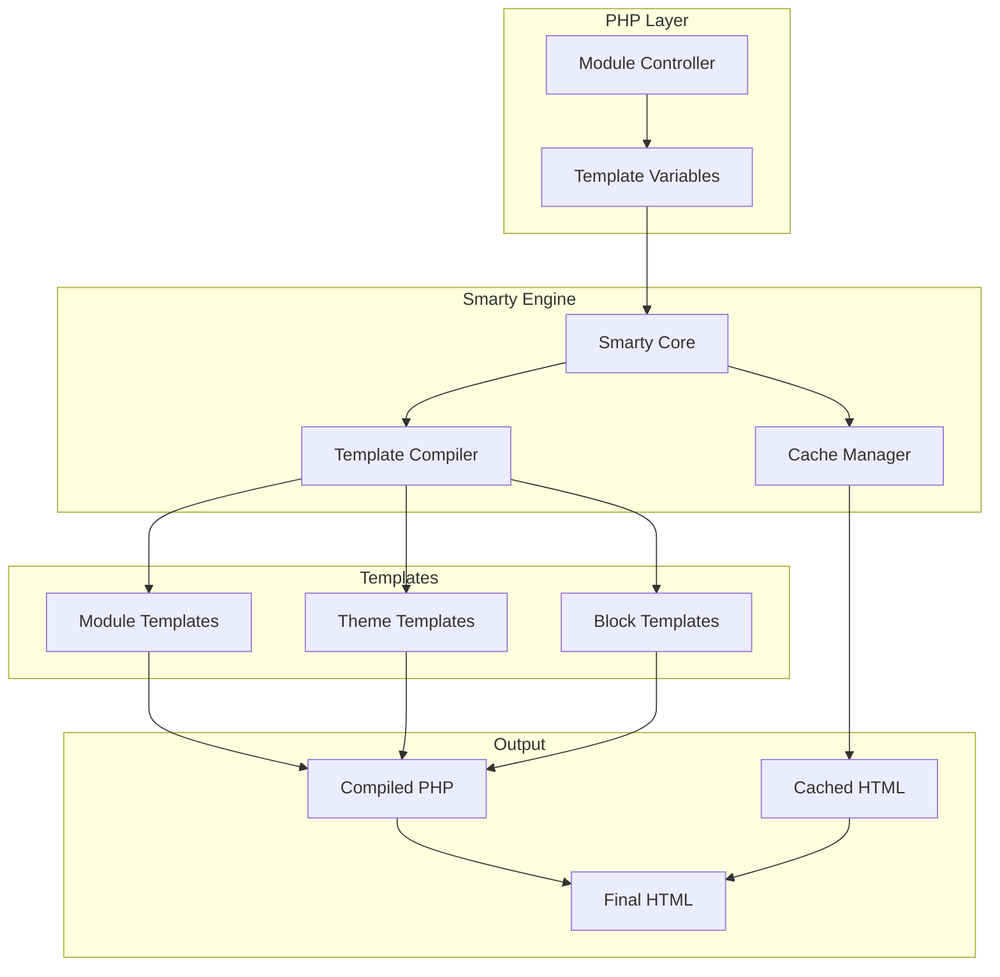
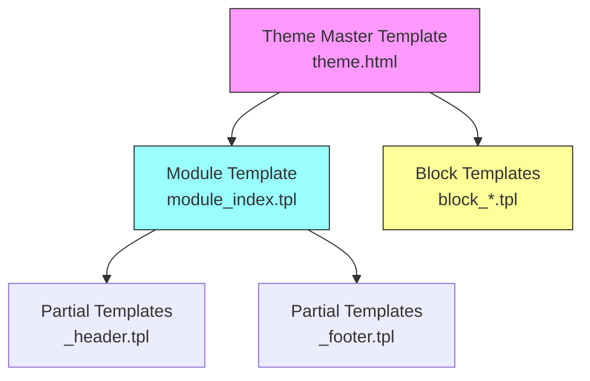
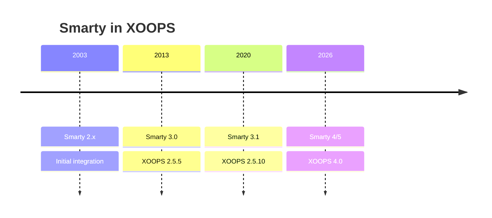

# ADR-003：模板引擎 (Smarty)

> XOOPS 采用Smarty 模板引擎的架构决策记录。

---

## 状态

**已接受** - 自 XOOPS 2.0 起的核心决定

**不断发展** - 计划在 XOOPS 4.0 中迁移至 Smarty 4/5

---

## 上下文

XOOPS 需要一个模板解决方案来：

1. 表现与业务逻辑分离
2.允许主题设计者在没有PHP知识的情况下工作
3.支持模板继承和包含
4. 提供缓存以提高性能
5.启用用户-customizable模板
6. 支持国际化

---

## 决策图



---

## 决定

我们将使用 **Smarty** 作为模板引擎，因为：

### 1. 关注点分离

```php
// PHP (Controller) - Business logic
$items = $itemHandler->getPublishedItems();
$xoopsTpl->assign('items', $items);

// Smarty (View) - Presentation
// templates/items.tpl
```

```smarty
{* Smarty template - No PHP logic *}
<{foreach item=item from=$items}>
    <article>
        <h2><{$item.title}></h2>
        <p><{$item.summary}></p>
    </article>
<{/foreach}>
```

### 2. XOOPS 分隔符

XOOPS 使用 `<{` 和 `}>` 代替标准 `{` `}`：

```smarty
{* Standard Smarty *}
{$variable}

{* XOOPS Smarty - Avoids JavaScript conflicts *}
<{$variable}>
```

### 3. 模板层次结构



### 4. 模板存储

- **数据库**：存储用于恢复功能的自定义模板
- **文件系统**：模区块目录中的原始模板
- **缓存**：编译模板以提高性能

---

## Smarty 配置

```php
// XOOPS Smarty initialization
$xoopsTpl = new XoopsTpl();

// Custom delimiters
$xoopsTpl->left_delim = '<{';
$xoopsTpl->right_delim = '}>';

// Caching
$xoopsTpl->caching = XOOPS_TEMPLATE_CACHE;
$xoopsTpl->cache_lifetime = 3600;

// Security
$xoopsTpl->security_policy = new Smarty_Security($xoopsTpl);
$xoopsTpl->security_policy->php_functions = [];
$xoopsTpl->security_policy->php_modifiers = ['escape', 'count'];
```

---

## 使用的模板功能

### 变量

```smarty
{* Simple variable *}
<{$title}>

{* Object property *}
<{$item.title}>

{* With modifier *}
<{$content|truncate:200:'...'}>

{* Escaped output *}
<{$userInput|escape:'html'}>
```

### 控制结构

```smarty
{* Conditional *}
<{if $isAdmin}>
    <a href="admin.php">Admin</a>
<{elseif $isUser}>
    <a href="profile.php">Profile</a>
<{else}>
    <a href="login.php">Login</a>
<{/if}>

{* Loop *}
<{foreach item=item from=$items name=itemloop}>
    <{$smarty.foreach.itemloop.index}>: <{$item.title}>
<{/foreach}>
```

### 包括

```smarty
{* Include another template *}
<{include file="db:mymodule_header.tpl"}>

{* Include with variables *}
<{include file="db:mymodule_item.tpl" item=$currentItem}>

{* Include from theme *}
<{include file="file:$theme_path/partials/sidebar.tpl"}>
```

---

## 后果

### 积极

1. **设计器-friendly**：HTML-like语法
2. **缓存**：内置-in模板缓存
3. **安全性**：PHP代码隔离
4. **灵活性**：修饰符、函数、插件
5. **定制**：用户可以修改模板
6. **社区**：大型Smarty生态系统

### 负面

1. **学习曲线**：Smarty-specific语法
2. **开销**：需要编译步骤
3. **调试**：模板错误可能很神秘
4. **版本问题**：版本之间的重大更改

### 缓解措施

- **学习**：综合文档
- **性能**：积极的缓存
- **调试**：调试控制台，清除错误信息
- **版本**：XOOPS中的兼容层

---

## 版本历史



---

## 迁移：Smarty 3 至 4/5

### 重大变化

```smarty
{* Smarty 3 - Deprecated *}
<{php}>echo date('Y');<{/php}>

{* Smarty 4+ - Use modifiers or assign from PHP *}
<{$current_year}>

{* Smarty 3 - {section} deprecated *}
<{section name=i loop=$items}>
    <{$items[i].title}>
<{/section}>

{* Smarty 4+ - Use {foreach} *}
<{foreach $items as $item}>
    <{$item.title}>
<{/foreach}>
```

### 兼容层

XOOPS 提供了平滑过渡的兼容层：

```php
// XoopsTpl extends Smarty with compatibility methods
class XoopsTpl extends Smarty
{
    public function assign($tpl_var, $value = null)
    {
        // Handles both Smarty 3 and 4 syntax
        return parent::assign($tpl_var, $value);
    }
}
```

---

## 考虑的替代方案

### 1.树枝
**优点**：现代的 Symfony 生态系统
**缺点**：语法不同，迁移工作量大
**决定**：XOOPS 3.x 未来可能的选择

### 2. 刀片 (Laravel)
**优点**：语法简洁，流行
**缺点**：Laravel-specific
**决定**：不适合独立使用

### 3. 原生PHP模板
**优点**：没有学习曲线，速度快
**缺点**：安全风险，没有分离
**决定**：因可维护性而被拒绝

---

## 相关决定

- ADR-001：模区块化架构
- ADR-002：数据库抽象

---

## 参考文献

- Smarty文档：https://www.smarty.net/docs/en/
- XOOPS模板系统指南
- MVC Web 应用程序中的模式

---

#XOOPS #architecture #adr #smarty #templates #design-decision