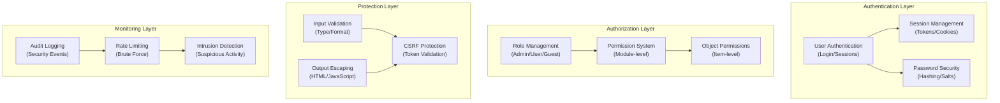

# ADR-004：安全系统架构

> XOOPS CMS 的全面安全架构，可防御现代威胁。

---

## 状态

**已接受** - 自 XOOPS 2.5 起的核心安全层

---

## 上下文

### 问题陈述

XOOPS需要一个强大的安全系统：

1. **防范常见网络漏洞**（OWASP 前 10 名）
2. **提供跨模区块的精细权限控制**
3. **采用现代标准实现安全的用户身份验证**
4. **防止数据泄露**和未经授权的访问
5. **支持多-level访问控制**（管理员、主持人、用户、访客）
6. **与所有模区块无缝集成**

### 当前的威胁

现代网络攻击包括：

- **SQL 注入** - 用户输入中的恶意SQL
- **XSS（跨-Site脚本）** - 在页面中注入JavaScript
- **CSRF（交叉-Site请求伪造）** - 未经授权的表单提交
- **身份验证绕过** - session/password处理能力弱
- **授权绕过** - 权限升级
- **数据暴露** - URL、日志或缓存中的敏感数据

### XOOPS 安全要求

1. 用户认证和会话管理
2.角色-based访问控制（RBAC）
3. 模区块和对象的权限系统
4. 输入验证和输出转义
5. 常见攻击防护
6.安全事件审计日志记录
7. 安全密码处理
8. CSRF代币保护

---

## 决定

### 核心安全架构



---

## 安全组件

### 1. 认证系统

**用户登录流程：**

```php
<?php
// 1. Validate credentials
$user = $userHandler->findByLogin($username);
if (!$user || !password_verify($password, $user->getVar('pass'))) {
    throw new AuthenticationException('Invalid credentials');
}

// 2. Check if account is active
if (!$user->getVar('uactive')) {
    throw new AuthenticationException('Account inactive');
}

// 3. Create secure session
session_regenerate_id(true);
$_SESSION['uid'] = $user->getVar('uid');
$_SESSION['token'] = bin2hex(random_bytes(32));
$_SESSION['created'] = time();

// 4. Log the login
$this->auditLog('USER_LOGIN', $user->getVar('uid'));
```

**密码安全：**

```php
<?php
// Use password_hash (not MD5 or SHA1)
$hashed = password_hash($password, PASSWORD_BCRYPT, [
    'cost' => 12, // High cost = slow brute force
]);

// Verify password
if (!password_verify($inputPassword, $hashed)) {
    throw new Exception('Invalid password');
}

// Rehash if algorithm or cost changed
if (password_needs_rehash($hashed, PASSWORD_BCRYPT, ['cost' => 12])) {
    $newHash = password_hash($password, PASSWORD_BCRYPT, ['cost' => 12]);
    $user->setVar('pass', $newHash);
    $userHandler->insert($user);
}
```

### 2. 会话管理

**安全会话处理：**

```php
<?php
// Session configuration
ini_set('session.cookie_httponly', true);  // No JS access
ini_set('session.cookie_secure', true);     // HTTPS only
ini_set('session.cookie_samesite', 'Strict'); // CSRF protection
ini_set('session.gc_maxlifetime', 3600);   // 1 hour timeout
ini_set('session.sid_length', 64);         // 64-char session ID

// Validate session
function validateSession() {
    // Check timeout
    if (time() - $_SESSION['created'] > 3600) {
        session_destroy();
        throw new SessionExpiredException();
    }

    // Validate user agent (prevent session hijacking)
    if ($_SESSION['user_agent'] !== $_SERVER['HTTP_USER_AGENT']) {
        throw new SessionInvalidException();
    }

    // Validate IP (optional, can be too strict)
    if (!in_array($_SERVER['REMOTE_ADDR'], $_SESSION['ips'])) {
        $_SESSION['ips'][] = $_SERVER['REMOTE_ADDR'];
    }
}
```

### 3. 授权 (RBAC)

**角色-Based访问控制：**

```php
<?php
class XoopsUser {
    public function hasPermission(string $permissionName): bool
    {
        // Get user groups
        $groups = $this->getGroups();

        // Check if any group has permission
        foreach ($groups as $groupId) {
            if ($this->checkGroupPermission($groupId, $permissionName)) {
                return true;
            }
        }

        return false;
    }

    /**
     * User groups and their permissions
     * Admin: Full access
     * Moderator: Content management
     * User: Create own content
     * Guest: Read-only access
     */
    private function checkGroupPermission(int $groupId, string $permission): bool
    {
        $permissions = [
            1 => ['admin_access'],                 // Admin group
            2 => ['moderate_content', 'edit_own'], // Moderator group
            3 => ['create_content', 'edit_own'],   // User group
            4 => [],                               // Guest group (no permissions)
        ];

        return in_array($permission, $permissions[$groupId] ?? []);
    }
}
```

### 4. 输入验证

**防止 SQL 注入和类型错误：**

```php
<?php
// Always use prepared statements
$sql = 'SELECT * FROM users WHERE id = ?';
$result = $db->query($sql, [$userId]); // ✅ Safe

// Input validation
function validateUserInput(array $data): array
{
    return [
        'email' => filter_var($data['email'] ?? '', FILTER_VALIDATE_EMAIL),
        'age' => filter_var($data['age'] ?? 0, FILTER_VALIDATE_INT),
        'website' => filter_var($data['website'] ?? '', FILTER_VALIDATE_URL),
        'title' => substr(trim($data['title'] ?? ''), 0, 255),
    ];
}

// XOOPS Safe Input class
$safe = \Xmf\Request::getHtmlRequest('var_name', '');
$int = \Xmf\Request::getInt('page', 1);
```

### 5. 输出转义

**防止 XSS 攻击：**

```php
<?php
// In PHP templates
echo htmlspecialchars($userInput, ENT_QUOTES, 'UTF-8');

// In Smarty templates (automatic escaping)
<{$user_input}>  {* Escaped by default *}
<{$html|escape:false}>  {* Only when needed *}

// JavaScript context
<script>
var message = "<{$userMessage|escape:'javascript'}>";
</script>

// URL context
<a href="<{$url|escape:'url'}>">Link</a>
```

### 6. CSRF 保护

**交叉-Site请求防伪造：**

```php
<?php
// Generate CSRF token
session_start();
if (empty($_SESSION['csrf_token'])) {
    $_SESSION['csrf_token'] = bin2hex(random_bytes(32));
}

// In forms
<form method="POST">
    <input type="hidden" name="csrf_token" value="<{$csrf_token}>">
    <button type="submit">Submit</button>
</form>

// Validate token
if ($_SERVER['REQUEST_METHOD'] === 'POST') {
    if (hash_equals($_SESSION['csrf_token'], $_POST['csrf_token'] ?? '')) {
        // Process form
    } else {
        throw new InvalidTokenException('CSRF token invalid');
    }
}
```

---

## 后果

### 积极影响

1. **全面防护** - 涵盖主要漏洞类别
2. **分层安全** - 多层防御
3. **灵活RBAC**-精细-grained权限控制
4. **审计跟踪** - 跟踪安全事件
5. **行业标准** - 符合 OWASP 建议
6. **模区块集成** - 模区块轻松使用安全API

### 负面影响

1. **复杂性** - 需要更多代码和配置
2. **性能** - 哈希和验证会增加开销
3. **用户体验** - 安全有时不方便
4. **维护** - 需要持续的安全更新
5. **需要培训** - 开发人员必须遵循实践

### 风险和缓解措施

|风险|严重性 |缓解措施 |
|------|----------|------------|
|开发者忽视安全性|高|代码审查、安全培训 |
|发现新漏洞 |中等|定期安全审核、更新 |
|性能影响|低|优化热路径、缓存 |
|权限过于复杂|中等|清晰的文档、示例 |

---

## 安全最佳实践

### 对于模区块开发人员

```php
<?php
// ✅ DO: Use prepared statements
$result = $db->prepare('SELECT * FROM table WHERE id = ?')->execute([$id]);

// ❌ DON'T: Concatenate queries
$result = $db->query("SELECT * FROM table WHERE id = $id");

// ✅ DO: Escape output
echo htmlspecialchars($user_input, ENT_QUOTES, 'UTF-8');

// ❌ DON'T: Output raw user data
echo $user_input;

// ✅ DO: Check permissions
if (!$user->hasPermission('edit_content')) {
    throw new PermissionException();
}

// ❌ DON'T: Trust user roles directly
if ($_POST['is_admin']) {
    // Make user admin - SECURITY HOLE!
}

// ✅ DO: Validate input types
$page = (int)$_GET['page'];

// ❌ DON'T: Use untrusted values directly
$sql .= " LIMIT " . $_GET['limit'];
```

---

## 考虑的替代方案

### OAuth/OpenID 连接

**为什么最初不选择：** 对于共享托管环境来说太复杂，但有利于将来与外部身份验证系统的集成。

### 两个-Factor身份验证（2FA）

**状态：** 接受为扩展，而非核心要求，请参阅ADR-006

### HTTP-only 会话 Cookie

**状态：** 已实施 - 阻止 JavaScript 访问会话数据

---

## 相关决定- ADR-001：模区块化架构 - 模区块实现安全性
- ADR-005：模区块权限系统
- ADR-006：两个-Factor身份验证（未来）

---

## 参考文献

### 安全标准

- [OWASP Top 10](https://owasp.org/www-project-top-ten/)
- [NIST Cybersecurity Framework](https://www.nist.gov/cyberframework)
- [CWE Top 25](https://cwe.mitre.org/top25/)

### PHP 安全

- [PHP Security Manual](https://www.php.net/manual/en/security.php)
- [password_hash() Documentation](https://www.php.net/manual/en/function.password-hash.php)
- [Session Security](https://www.php.net/manual/en/session.security.php)

### 工具

- [OWASP ZAP](https://www.zaproxy.org/) - 安全测试
- [Snyk](https://snyk.io/) - 漏洞扫描
- [SonarQube](https://www.sonarqube.org/) - 代码质量

---

## 实施清单

- [ ] 用户认证系统
- [ ] 会话管理
- [ ] 密码哈希 (bcrypt)
- [ ] 角色-based访问控制
- [ ] 模区块权限
- [ ] 输入验证框架
- [ ] 输出转义（PHP + Smarty）
- [ ] CSRF 令牌保护
- [ ] 安全审核日志记录
- [ ] 速率限制
- [ ] 安全标头

---

## 版本历史

|版本 |日期 |变化|
|---------|------|---------|
| 1.0.0 | 2024年1月28日 |初始文件 |

---

#XOOPS #adr #security #architecture #authentication #authorization #rbac