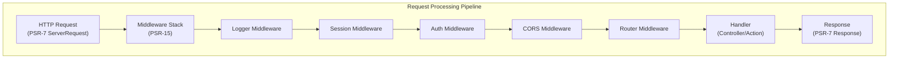

---
title：“ADR-005 - PSR-15 中间件模式”
description：“在XOOPS 4.0中采用PSR-15中间件的架构决策记录”
---

# ADR-005：PSR-15 XOOPS 4.0 的中间件模式

> 采用 PSR-15 HTTP 服务器请求处理程序（中间件）来改进请求处理管道。

:::警告[XOOPS 4.0 提案 - 2.5.x 中不可用]
本ADR描述了**XOOPS4.0**的建议架构。 PSR-15 中间件**在 XOOPS 2.5.x** 中不可用。当前 2.5.x 模区块使用具有 `mainfile.php` 引导程序的页面控制器模式。请参阅XOOPS当前请求生命周期的架构。
:::

---

## 状态

**提议** - 正在评估 XOOPS 4.0 版本

---

## 上下文

### 目前的方法

XOOPS 2.5 使用整体请求处理方法：

```php
// Current: Sequential processing
require_once 'mainfile.php';
// → Kernel initialization
// → User authentication
// → Module loading
// → Page rendering

// All in one flow, mixed concerns
```

### 当前方法的问题

1. **混合问题** - 身份验证、日志记录、路由全部交织在一起
2. **难以测试** - 难以对单个请求处理步骤进行单元测试
3. **难以扩展** - 模区块只能通过preload/events挂钩
4. **分离性差** - 请求处理逻辑分散在整个代码库中
5. **不可组合** - 无法轻松链接或重新排序处理步骤

### 什么是 PSR-15 中间件？

PSR-15 定义了 HTTP 中间件的标准接口：

```php
<?php
interface RequestHandlerInterface {
    public function handle(ServerRequestInterface $request): ResponseInterface;
}

interface MiddlewareInterface {
    public function process(
        ServerRequestInterface $request,
        RequestHandlerInterface $handler
    ): ResponseInterface;
}
```

**中间件链：**

```
Request
  ↓
[Logger] → logs request
  ↓
[Auth] → validates user session
  ↓
[CORS] → checks cross-origin
  ↓
[Router] → dispatches to handler
  ↓
[Handler] → generates response
  ↓
Response
```

---

## 决定

### 针对 XOOPS 4.0 采用 PSR-15 中间件堆栈

遵循 PSR-15 标准实现中间件-based请求处理管道。

### 架构概述



### 核心中间件组件

#### 1.应用中间件（核心层）

```php
<?php
declare(strict_types=1);

namespace XoopsCore;

use Psr\Http\Message\ResponseInterface;
use Psr\Http\Message\ServerRequestInterface;
use Psr\Http\Server\MiddlewareInterface;
use Psr\Http\Server\RequestHandlerInterface;

class SessionMiddleware implements MiddlewareInterface
{
    public function process(
        ServerRequestInterface $request,
        RequestHandlerInterface $handler
    ): ResponseInterface {
        // 1. Retrieve session (or start new)
        $sessionId = $request->getCookieParams()['PHPSESSID'] ?? null;
        $session = $this->sessionManager->load($sessionId);

        // 2. Attach session to request
        $request = $request->withAttribute('session', $session);

        // 3. Pass to next middleware
        $response = $handler->handle($request);

        // 4. Set session cookie if needed
        if ($session->isModified()) {
            $response = $response->withAddedHeader(
                'Set-Cookie',
                'PHPSESSID=' . $session->getId() . '; HttpOnly; SameSite=Strict'
            );
        }

        return $response;
    }
}
```

#### 2. 身份验证中间件

```php
<?php
class AuthMiddleware implements MiddlewareInterface
{
    public function process(
        ServerRequestInterface $request,
        RequestHandlerInterface $handler
    ): ResponseInterface {
        // Get session from previous middleware
        $session = $request->getAttribute('session');

        // Authenticate user from session
        $user = $this->authenticate($session);

        // Attach user to request
        $request = $request->withAttribute('user', $user);

        return $handler->handle($request);
    }

    private function authenticate(?Session $session): User
    {
        if ($session && $session->has('uid')) {
            return $this->userRepository->findById($session->get('uid'));
        }

        return new AnonymousUser();
    }
}
```

#### 3.授权中间件

```php
<?php
class AuthorizationMiddleware implements MiddlewareInterface
{
    public function __construct(private AuthorizationChecker $checker)
    {
    }

    public function process(
        ServerRequestInterface $request,
        RequestHandlerInterface $handler
    ): ResponseInterface {
        $user = $request->getAttribute('user');
        $route = $request->getAttribute('route');

        // Check if user has permission for this route
        if (!$this->checker->isGranted($user, $route)) {
            return new JsonResponse(
                ['error' => 'Unauthorized'],
                403
            );
        }

        return $handler->handle($request);
    }
}
```

#### 4. 模区块中间件

```php
<?php
// Modules can provide their own middleware
class PublisherAccessMiddleware implements MiddlewareInterface
{
    public function process(
        ServerRequestInterface $request,
        RequestHandlerInterface $handler
    ): ResponseInterface {
        $user = $request->getAttribute('user');

        // Module-specific access control
        if (!$user->hasPermission('publisher_view')) {
            return new HtmlResponse('Access denied', 403);
        }

        return $handler->handle($request);
    }
}
```

### 实现示例

```php
<?php
// bootstrap.php - Application setup

use Psr\Http\Message\ServerRequestInterface;
use Psr\Http\Server\RequestHandlerInterface;
use Xoops\Core\Middleware\{
    LoggerMiddleware,
    SessionMiddleware,
    AuthMiddleware,
    CorsMiddleware,
    ErrorHandlingMiddleware
};

// Create middleware pipeline
$middlewareStack = [
    // 1. Error handling (outermost)
    new ErrorHandlingMiddleware(),

    // 2. Logging
    new LoggerMiddleware($logger),

    // 3. CORS handling
    new CorsMiddleware($corsConfig),

    // 4. Session management
    new SessionMiddleware($sessionManager),

    // 5. Authentication
    new AuthMiddleware($userRepository),

    // 6. Authorization
    new AuthorizationMiddleware($authChecker),

    // 7. Routing and dispatching
    new RoutingMiddleware($router),

    // 8. Module middleware (dynamic)
    ...$this->loadModuleMiddleware(),
];

// Process request through middleware stack
$request = ServerRequestFactory::fromGlobals();
$dispatcher = new MiddlewareDispatcher($middlewareStack);
$response = $dispatcher->dispatch($request);

// Send response
http_response_code($response->getStatusCode());
foreach ($response->getHeaders() as $name => $values) {
    foreach ($values as $value) {
        header("$name: $value", false);
    }
}
echo $response->getBody();
```

### 模区块集成

模区块可以提供中间件：

```php
<?php
// Publisher module - xoops_version.php

$modversion['middleware'] = [
    'PublisherAccessMiddleware' => true,      // Auto-load
    'PublisherLogMiddleware' => true,
];

// Or custom:
$modversion['middleware_factory'] = function() {
    return [
        new PublisherCacheMiddleware(),
        new PublisherPermissionMiddleware(),
    ];
};
```

---

## 后果

### 积极影响

1. **关注点分离** - 每个中间件处理一项职责
2. **可测试性** - 易于对各个中间件组件进行单元测试
3. **可组合性** - 中间件可以混合和重新排序
4. **符合标准** - 使用 PSR-15 和 PSR-7 标准
5. **可扩展性** - 模区块可以轻松添加自定义中间件
6. **调试** - 通过管道清除请求流
7. **性能** - 可以优化特定的中间件层
8. **互操作性** - 可以使用第三-partyPSR-15中间件

### 负面影响

1. **学习曲线** - 开发人员必须了解PSR-15
2. **性能开销** - 管道中的更多函数调用
3. **复杂性** - 移动部件多于整体方法
4. **迁移工作** - 需要重构现有代码
5. **依赖项** - 需要 PSR-7 HTTP 库

### 风险和缓解措施

|风险|严重性 |缓解措施 |
|------|----------|------------|
|复杂的中间件链|中等|清晰的文档、示例 |
|性能下降 |中等|基准测试，优化热路径 |
|开发人员滥用 |中等|代码审查、最佳实践指南 |
|迁移重大变化 |高|弃用期，帮手|
|中间件订购问题|中等|清晰的依赖关系图 |

---

## 实施计划

### 第 1 阶段：基础（2026 年第 2 季度）

- [ ] 实现 PSR-7 HTTP 消息包装器
- [ ] 创建 MiddlewareDispatcher
- [ ] 实现核心中间件（会话、身份验证）
- [ ] 更新内核以使用中间件

### 第 2 阶段：整合（2026 年第 3 季度）

- [ ] 将现有功能迁移到中间件
- [ ] 添加模区块中间件支持
- [ ] 创建中间件测试实用程序
- [ ] 编写综合文档

### 第 3 阶段：迁移（2026 年第 4 季度）- [ ] 为旧代码提供兼容层
- [ ] 帮助模区块更新到新的中间件
- [ ] 性能优化
- [ ] 安全审核

### 第 4 阶段：发布（2027 年第一季度）

- [ ] XOOPS 4.0 版本，带中间件
- [ ] 弃用旧的 preload/hook 系统
- [ ] 社区反馈和更新

---

## 成功标准

- [ ] 所有核心功能迁移到中间件
- [ ] 中间件测试覆盖率超过 90%
- [ ] 带有示例的完整文档
- [ ] 性能与先前版本相差 10% 以内
- [ ] 模区块成功使用新的中间件系统
- [ ] 社区采用率 >80%

---

## 中间件最佳实践

### 做

- 集中中间件（单一责任）
- 使用不变性（创建新的request/response）
- 优雅地处理错误
- 文档依赖关系
- 添加类型提示
- 为中间件编写测试
- 使用标准PSR-15接口

### 不要

- 不要修改共享的request/response对象
- 不要直接访问全局变量
- 不要创建对中间件顺序的依赖
- 不要捕获所有异常
- 不要将业务逻辑与中间件混合在一起
- 不要让中间件做太多事情

---

## 示例

### 自定义中间件

```php
<?php
// Example: Rate limiting middleware

use Psr\Http\Message\ResponseInterface;
use Psr\Http\Message\ServerRequestInterface;
use Psr\Http\Server\MiddlewareInterface;
use Psr\Http\Server\RequestHandlerInterface;

class RateLimitMiddleware implements MiddlewareInterface
{
    public function __construct(
        private RateLimiter $limiter,
        private int $limit = 100,
        private int $window = 3600
    ) {
    }

    public function process(
        ServerRequestInterface $request,
        RequestHandlerInterface $handler
    ): ResponseInterface {
        $user = $request->getAttribute('user');
        $identifier = $user->getId() ?? $request->getClientIp();

        // Check rate limit
        $remaining = $this->limiter->check($identifier, $this->limit, $this->window);

        if ($remaining < 0) {
            return new JsonResponse(
                ['error' => 'Rate limit exceeded'],
                429
            );
        }

        // Add rate limit headers
        $response = $handler->handle($request);
        return $response
            ->withAddedHeader('X-RateLimit-Limit', (string)$this->limit)
            ->withAddedHeader('X-RateLimit-Remaining', (string)$remaining);
    }
}
```

---

## 相关决定

- ADR-001：模区块化架构 - 基础
- ADR-004：安全系统 - 使用中间件进行身份验证
- ADR-006：两个-Factor身份验证 - 可以是中间件

---

## 参考文献

### PSR 标准

- [PSR-7: HTTP Message Interface](https://www.php-fig.org/psr/psr-7/)
- [PSR-15: HTTP Server Request Handlers](https://www.php-fig.org/psr/psr-15/)

### 中间件框架

- [Slim Framework](https://www.slimframework.com/) - 中间件示例
- [Zend Expressive](https://docs.zendframework.com/zend-expressive/) - PSR-15 框架
- [Guzzle](https://docs.guzzlephp.org/) - HTTP 客户端中间件

### 工具

- [RelayPHP](https://relayphp.com/) - 中间件库
- [PSR-15 Middleware](https://github.com/middlewares) - 中间件集合

---

## 版本历史

|版本 |日期 |变化|
|---------|------|---------|
| 1.0.0 | 2024年1月28日 |初步建议|

---

#XOOPS #adr #psr-15 #middleware #architecture #psr-7