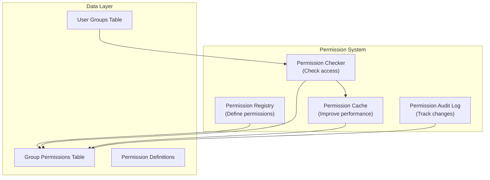

# ADR-006：模区块权限系统

> Fine-grained，XOOPS模区块的分层权限系统，可实现精细访问控制。

---

## 状态

**已接受** - 在 XOOPS 2.5.x 中实施并在 XOOPS 4.0 中扩展

---

## 上下文

### 问题陈述

XOOPS模区块需要灵活的权限控制，允许：

1. **模区块-level权限** - 用户可以访问此模区块吗？
2. **对象-level权限** - 用户可以访问该特定项目吗？
3. **操作-level权限** - 用户可以执行此操作吗？
4. **自定义权限** - 模区块可以定义自己的权限吗？

### 当前状态

XOOPS 2.5 使用 XOOPSGroupPermission 系统：

```php
<?php
$perm_handler = xoops_getHandler('groupperm');
$isAllowed = $perm_handler->checkRight(
    'modulename',
    'action',
    $itemId,
    $groupId
);
```

### 挑战

1. **复杂查询** - 权限检查需要数据库连接
2. **有限的层次结构** - 难以创建权限组
3. **较差的缓存** - 未内置-in权限缓存
4. **模区块变化** - 每个模区块实现不同
5. **性能** - 多个数据库查询进行权限检查

---

## 决定

### 实行分级权限系统

创建标准化的缓存权限系统，支持：

1. **层级权限** - 从父组继承
2. **角色-Based访问** - 将权限映射到角色（管理员、主持人、用户、访客）
3. **对象权限** - 每个项目的精细-grained控制
4. **缓存** - 缓存权限以减少查询
5. **自定义权限** - 模区块定义自己的权限
6. **审计跟踪** - 记录权限更改

### 权限层次结构

```
User
  └── Group 1 (Admin)
      └── Permission: admin_module
      └── Permission: edit_all_items
      └── Permission: delete_all_items
  └── Group 2 (Moderator)
      └── Permission: moderate_comments
      └── Permission: edit_own_items
  └── Group 3 (User)
      └── Permission: view_published_items
      └── Permission: edit_own_items
  └── Group 4 (Guest)
      └── Permission: view_published_items
```

### 架构



---

## 核心组件

### 1.权限定义

```php
<?php
// Module defines its permissions in xoops_version.php

$modversion['permissions'] = [
    [
        'name' => 'module_view',
        'description' => 'Can view module',
        'level' => 'module',
    ],
    [
        'name' => 'item_view',
        'description' => 'Can view items',
        'level' => 'item',
    ],
    [
        'name' => 'item_create',
        'description' => 'Can create items',
        'level' => 'item',
    ],
    [
        'name' => 'item_edit',
        'description' => 'Can edit items',
        'level' => 'item',
    ],
    [
        'name' => 'item_delete',
        'description' => 'Can delete items',
        'level' => 'item',
    ],
    [
        'name' => 'admin_manage',
        'description' => 'Can manage module',
        'level' => 'admin',
    ],
];

// Default permissions by group
$modversion['group_permissions'] = [
    // Admin group gets all permissions
    '1' => [
        'module_view' => 1,
        'item_view' => 1,
        'item_create' => 1,
        'item_edit' => 1,
        'item_delete' => 1,
        'admin_manage' => 1,
    ],
    // User group
    '3' => [
        'module_view' => 1,
        'item_view' => 1,
        'item_create' => 1,
        'item_edit' => 0,
        'item_delete' => 0,
        'admin_manage' => 0,
    ],
    // Guest group
    '4' => [
        'module_view' => 1,
        'item_view' => 1,
        'item_create' => 0,
        'item_edit' => 0,
        'item_delete' => 0,
        'admin_manage' => 0,
    ],
];
```

### 2.权限检查器

```php
<?php
declare(strict_types=1);

namespace XoopsCore\Permission;

class PermissionChecker
{
    private PermissionCache $cache;
    private PermissionRepository $repository;

    public function hasPermission(
        User $user,
        string $permissionName,
        ?int $itemId = null
    ): bool {
        // Check cache first
        $cacheKey = "perm_{$user->getId()}_{$permissionName}_{$itemId}";
        if ($this->cache->has($cacheKey)) {
            return $this->cache->get($cacheKey);
        }

        $hasPermission = false;

        // Check all user groups
        foreach ($user->getGroups() as $group) {
            if ($this->checkGroupPermission($group, $permissionName, $itemId)) {
                $hasPermission = true;
                break;
            }
        }

        // Cache result
        $this->cache->set($cacheKey, $hasPermission, 3600);

        // Log high-level access checks
        if ($hasPermission && $this->shouldAuditLog($permissionName)) {
            $this->auditLog('PERMISSION_CHECKED', [
                'user_id' => $user->getId(),
                'permission' => $permissionName,
                'item_id' => $itemId,
                'result' => 'ALLOWED',
            ]);
        }

        return $hasPermission;
    }

    private function checkGroupPermission(
        Group $group,
        string $permissionName,
        ?int $itemId = null
    ): bool {
        $sql = 'SELECT COUNT(*) FROM ' . $this->table . '
                WHERE groupid = ?
                AND permission = ?
                AND itemid = ?
                AND granted = 1';

        $stmt = $this->db->prepare($sql);
        $stmt->execute([$group->getId(), $permissionName, $itemId ?? 0]);

        return $stmt->fetchColumn() > 0;
    }
}
```

### 3. 权限级别

```php
<?php
// Different permission levels with different scopes

class PermissionLevel
{
    // Module-level: Affects entire module
    public const LEVEL_MODULE = 'module';

    // Admin-level: Admin panel access
    public const LEVEL_ADMIN = 'admin';

    // Item-level: Specific objects/items
    public const LEVEL_ITEM = 'item';

    // Field-level: Specific object fields
    public const LEVEL_FIELD = 'field';

    // Action-level: Specific actions/operations
    public const LEVEL_ACTION = 'action';
}
```

### 4.对象-Level权限

```php
<?php
// Fine-grained control for specific items

class Item extends XoopsObject
{
    /**
     * Check if user can view this item
     */
    public function canView(User $user): bool
    {
        // Public items anyone can view
        if ($this->getVar('status') === 'published') {
            return true;
        }

        // Owner can always view their items
        if ($this->getVar('user_id') === $user->getId()) {
            return true;
        }

        // Check group permissions
        $permChecker = xoops_getActiveModule()->getPermissionChecker();
        return $permChecker->hasPermission(
            $user,
            'item_view',
            $this->getVar('id')
        );
    }

    public function canEdit(User $user): bool
    {
        // Owner can edit their items
        if ($this->getVar('user_id') === $user->getId()) {
            return $permChecker->hasPermission($user, 'item_edit', $this->getVar('id'));
        }

        // Check if user can edit all items
        return $permChecker->hasPermission($user, 'item_edit_all', $this->getVar('id'));
    }

    public function canDelete(User $user): bool
    {
        return $permChecker->hasPermission($user, 'item_delete', $this->getVar('id'));
    }
}
```

### 5. 在控制器中的使用

```php
<?php
// Example: Article controller

class ArticleController
{
    private PermissionChecker $permChecker;

    public function view(int $id, User $user): Response
    {
        $article = $this->repository->find($id);

        // Check permission
        if (!$article->canView($user)) {
            throw new AccessDeniedException('Cannot view this article');
        }

        return new HtmlResponse($this->renderArticle($article));
    }

    public function edit(int $id, User $user): Response
    {
        $article = $this->repository->find($id);

        // Check permission
        if (!$article->canEdit($user)) {
            throw new AccessDeniedException('Cannot edit this article');
        }

        // Handle form submission
        if ($this->request->isMethod('POST')) {
            $article->setVar('title', $this->request->getPost('title'));
            $article->setVar('content', $this->request->getPost('content'));
            $this->repository->insert($article);

            $this->auditLog('ARTICLE_EDITED', ['id' => $id, 'user_id' => $user->getId()]);

            // Invalidate permission cache
            $this->permChecker->clearCache($user->getId());

            return new RedirectResponse('/article/' . $id);
        }

        return new HtmlResponse($this->renderForm($article));
    }

    public function delete(int $id, User $user): Response
    {
        $article = $this->repository->find($id);

        if (!$article->canDelete($user)) {
            throw new AccessDeniedException('Cannot delete this article');
        }

        $this->repository->delete($article);

        $this->auditLog('ARTICLE_DELETED', ['id' => $id, 'user_id' => $user->getId()]);

        // Invalidate cache
        $this->permChecker->clearCache($user->getId());

        return new JsonResponse(['success' => true]);
    }
}
```

---

## 后果

### 积极影响

1. **精细控制** - 精细-tuned权限管理
2. **标准化** - 跨模区块一致
3. **缓存** - 通过缓存提高性能
4. **可审核** - 跟踪谁更改了什么
5. **灵活** - 支持自定义权限
6. **可扩展** - 处理复杂的权限层次结构
7. **可测试** - 易于单元测试

### 负面影响

1. **复杂性** - 更多代码需要管理
2. **数据库开销** - 更多表和连接
3. **缓存失效** - 必须在更改时清除缓存
4. **学习曲线** - 开发人员必须了解系统
5. **性能** - 如果缓存配置不正确

### 风险和缓解措施

|风险|严重性 |缓解措施 |
|------|----------|------------|
|权限过于复杂|中等|良好的默认值、文档 |
|缓存陈旧数据 |高| TTL，智能失效 |
|性能回归|中等|基准测试、优化查询 |
|权限绕过 |高|安全审计、测试|

---

## 权限设计模式

### 模式 1：所有者-Based 权限

```php
<?php
// User can edit their own items but not others'

public function canEdit(User $user): bool
{
    // Owner can always edit
    if ($this->isOwner($user)) {
        return true;
    }

    // Check group permissions for editing others' items
    return $this->permChecker->hasPermission($user, 'edit_all_items');
}

private function isOwner(User $user): bool
{
    return $this->getVar('user_id') === $user->getId();
}
```

### 模式 2：状态-Based 权限

```php
<?php
// Different permissions based on status

public function canView(User $user): bool
{
    switch ($this->getVar('status')) {
        case 'published':
            // Anyone with module permission can view
            return $this->permChecker->hasPermission($user, 'item_view');

        case 'draft':
            // Only owner or admin can view
            return $this->isOwner($user) ||
                   $this->permChecker->hasPermission($user, 'admin_manage');

        case 'archived':
            // Only admin can view
            return $this->permChecker->hasPermission($user, 'admin_manage');

        default:
            return false;
    }
}
```

### 模式 3：角色-Based 权限

```php
<?php
// Check against specific roles

public function hasAdminRole(User $user): bool
{
    return $user->getGroups()->contains('admin_group');
}

public function hasModeratorRole(User $user): bool
{
    return $user->getGroups()->contains('moderator_group') ||
           $this->hasAdminRole($user);
}

public function canModerate(User $user): bool
{
    return $this->hasModeratorRole($user);
}
```

---

## 相关决定

- ADR-001：模区块化架构 - 模区块定义权限
- ADR-004：安全系统 - 安全基础
- ADR-005：中间件 - 可以强制执行权限

---

## 参考文献

### 权限模型

- [RBAC (Role-Based Access Control)](https://en.wikipedia.org/wiki/Role-based_access_control)
- [ABAC (Attribute-Based Access Control)](https://en.wikipedia.org/wiki/Attribute-based_access_control)
- [ACL (Access Control List)](https://en.wikipedia.org/wiki/Access-control_list)

### 实施

- [Symfony Security](https://symfony.com/doc/current/security.html)
- [Laravel Authorization](https://laravel.com/docs/authorization)

---

## 实施清单

- [ ] 定义标准权限级别
- [ ] 创建 PermissionChecker 类
- [ ] 实施缓存策略
- [ ] 添加审核日志记录
- [ ] 创建辅助函数
- [ ] 编写综合测试
- [ ] 开发者文档
- [ ] 更新所有模区块
- [ ] 性能优化
- [ ] 安全审查

---## 版本历史

|版本 |日期 |变化|
|---------|------|---------|
| 1.0.0 | 2024年1月28日 |初始文件 |

---

#XOOPS #adr #permissions #authorization #rbac #security