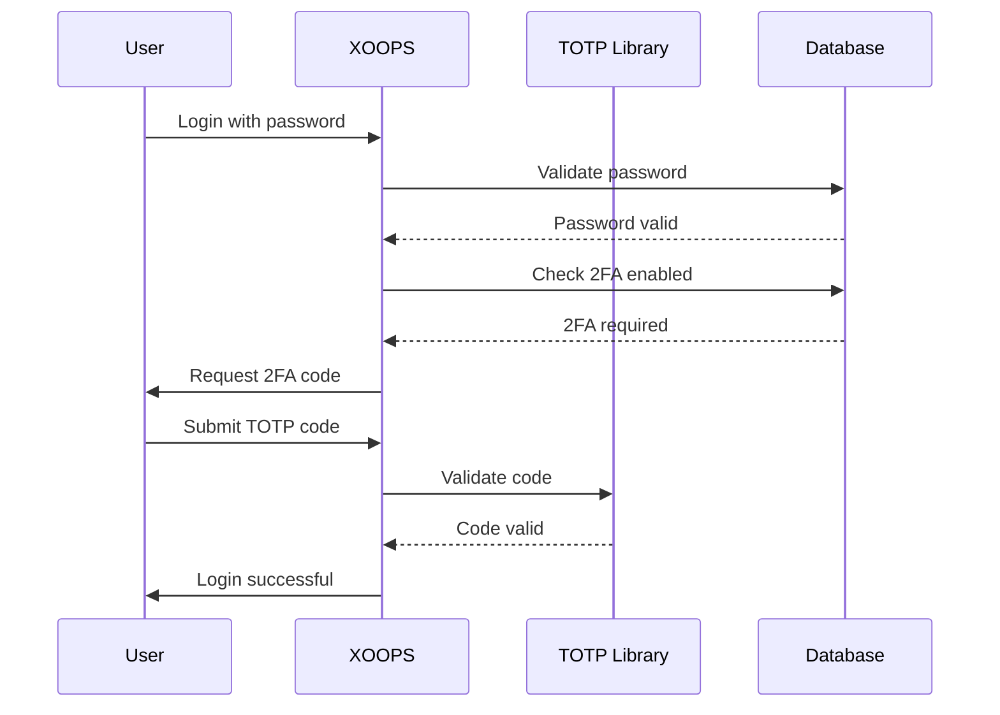

## 状态

提议

## 上下文

XOOPS 需要增强用户身份验证的安全性。两个-factor身份验证 (2FA) 提供了除密码之外的额外安全层，即使密码泄露也能保护帐户。

关键考虑因素：
- 向后兼容现有的身份验证
- 支持多种2FA方法
- 设置和登录期间的用户体验
- 丢失设备的恢复机制
- 与现有权限系统集成

## 决定

我们将实施TOTP（时间-based一-Time密码）作为主要 2FA 方法，并支持备份代码。

### 实施方法



### 数据库架构

```sql
CREATE TABLE `{PREFIX}_users_2fa` (
    `user_id` INT(11) NOT NULL,
    `secret` VARCHAR(32) NOT NULL,
    `enabled` TINYINT(1) DEFAULT 0,
    `backup_codes` TEXT,
    `last_used` INT(11),
    `created` INT(11) NOT NULL,
    PRIMARY KEY (`user_id`),
    FOREIGN KEY (`user_id`) REFERENCES `{PREFIX}_users`(`uid`)
);
```

### 服务接口

```php
interface TwoFactorAuthInterface
{
    public function enable(int $userId): TwoFactorSetup;
    public function disable(int $userId): void;
    public function verify(int $userId, string $code): bool;
    public function generateBackupCodes(int $userId): array;
    public function isEnabled(int $userId): bool;
}
```

### 中间件集成

```php
class TwoFactorMiddleware implements MiddlewareInterface
{
    public function process(
        ServerRequestInterface $request,
        RequestHandlerInterface $handler
    ): ResponseInterface {
        $session = $request->getAttribute('session');

        if ($session->has('pending_2fa_user_id')) {
            // User needs to complete 2FA
            if ($this->isVerificationRequest($request)) {
                return $handler->handle($request);
            }
            return new RedirectResponse('/2fa/verify');
        }

        return $handler->handle($request);
    }
}
```

## 后果

### 积极

- 显着提高账户安全性
- 行业-standardTOTP兼容性（Google Authenticator、Authy 等）
- 备份代码防止帐户锁定
- 根据-user可选 - 不强制采用
- PSR-15 中间件允许干净的集成

### 负面

- 额外的登录步骤影响用户体验
- 用户必须管理验证器应用程序
- 丢失的设备需要恢复过程
- 额外的数据库存储和查询
- 需要加密库依赖

### 迁移路径

1.添加2FA数据的数据库表
2. 实现具有库依赖的TOTP服务
3. 将中间件添加到认证链中
4. 创建设置和验证 UI
5. 管理员选项要求特定组进行 2FA

## 考虑的替代方案

### SMS-based OTP

被拒绝的原因是：
- SIM交换漏洞
- SMS网关的成本
- 电话号码验证复杂性
- 隐私问题

### 硬件安全密钥 (WebAuthn)

推迟到未来ADR：
- 更复杂的实现
- 历史上有限的浏览器支持
- 较高的用户成本
- 稍后可以与 TOTP 一起添加

### 电子邮件-based OTP

被拒绝的原因是：
- 电子邮件帐户泄露违背了目的
- 交付延迟影响用户体验
- 垃圾邮件过滤器问题

## 参考文献

- [RFC 6238 - TOTP](https://tools.ietf.org/html/rfc6238)
- [Google Authenticator Key Format](https://github.com/google/google-authenticator/wiki/Key-Uri-Format)
- ../../02-Core-Concepts/Security/Security-Best-Practices - 安全指南
- ../../02-Core-Concepts/Users-Permissions/Authentication - 身份验证系统文档