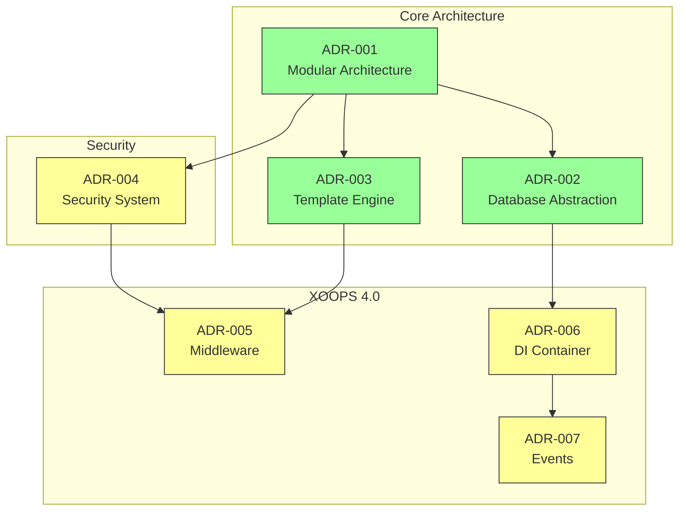
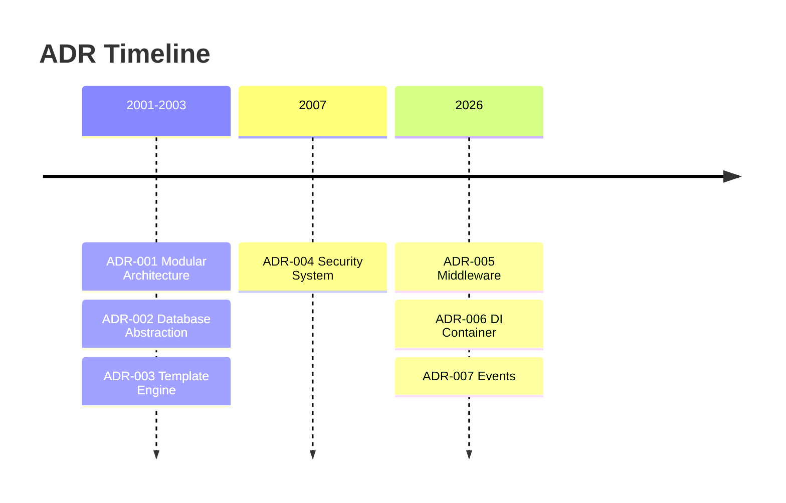

---
title：“ADR索引”
description：“XOOPS CMS的所有架构决策记录的索引”
---

# 📋 架构决策记录索引

> 塑造 XOOPS CMS 的架构决策的综合索引。

---

## 什么是 ADR？

架构决策记录 (ADR) 记录了 XOOPS 开发期间做出的重要架构决策。它们捕获每个选择的背景、决策和后果，为维护者和贡献者提供有价值的历史背景。

---

## ADR 状态图例

|状态 |意义|
|--------|---------|
| **提议** |正在讨论中，尚未接受 |
| **已接受** |决定已通过 |
| **已弃用** |不再推荐 |
| **取代** |替换为另一个 ADR |

---

## 当前 ADR

### 基本决策

| ADR|标题 |状态 |影响 |
|-----|--------|--------|--------|
| ADR-001 |模区块化架构|已接受 |核心|
| ADR-002 |对象-Oriented数据库访问|已接受 |核心|
| ADR-003 | Smarty模板引擎|已接受 |核心|

### 计划 ADR (XOOPS 4.0)

| ADR |标题 |状态 |影响 |
|-----|--------|--------|--------|
| ADR-004 |安全系统设计|提议|安全|
| ADR-005 | PSR-15 中间件 |提议|建筑|
| ADR-006 |依赖注入容器 |提议|建筑|
| ADR-007 |事件系统重新设计 |提议|建筑|

---

## ADR 关系



---

## 时间轴



---

## 创建新的 ADR

在提出新的架构决策时：

1. 复制ADR模板
2. 填写所有部分
3. 作为 Pull Request 提交
4. 在 GitHub 上讨论问题
5. 决定后更新状态

### ADR 模板结构

```markdown
# ADR-XXX: Title

## Status
Proposed | Accepted | Deprecated | Superseded

## Context
What is the issue motivating this decision?

## Decision
What is the change that we're proposing?

## Consequences
What becomes easier or harder as a result?

## Alternatives Considered
What other options were evaluated?
```

---

## 🔗 相关文档

- 核心概念
- 贡献指南
- XOOPS 4.0 路线图

---

#XOOPS #adr #architecture #index #decisions