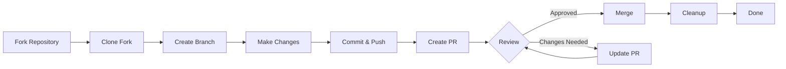

---
title：“贡献工作流程”
description：“为XOOPS项目做出贡献的步骤-by-step指南”
---

> 本指南将引导您完成为 XOOPS 做出贡献的完整过程，从初始设置到合并拉取请求。

---

## 先决条件

在开始贡献之前，请确保您拥有：

- **Git** 安装并配置
- **GitHub 帐户**（免费）
- **PHP 7.4+** 用于XOOPS 开发
- **Composer** 用于依赖管理
- Git 工作流程的基础知识
- 熟悉行为准则

---

## 步骤 1：分叉存储库

### 在 GitHub Web 界面上

1. 导航到存储库（例如，`XOOPS/XOOPSCore27`）
2. 单击顶部-right角的 **Fork** 按钮
3. 选择分叉位置（您的个人账户）
4.等待fork完成

### 为什么要分叉？

- 您可以使用自己的副本
- 维护者不需要管理许多分支
- 你可以完全控制你的叉子
- 拉取请求引用您的分叉和上游存储库

---

## 第 2 步：在本地克隆您的分叉

```bash
# Clone your fork (replace YOUR_USERNAME)
git clone https://github.com/YOUR_USERNAME/XoopsCore27.git
cd XoopsCore27

# Add upstream remote to track original repository
git remote add upstream https://github.com/XOOPS/XoopsCore27.git

# Verify remotes are set correctly
git remote -v
# origin    https://github.com/YOUR_USERNAME/XoopsCore27.git (fetch)
# origin    https://github.com/YOUR_USERNAME/XoopsCore27.git (push)
# upstream  https://github.com/XOOPS/XoopsCore27.git (fetch)
# upstream  https://github.com/XOOPS/XoopsCore27.git (nofetch)
```

---

## 第三步：搭建开发环境

### 安装依赖项

```bash
# Install Composer dependencies
composer install

# Install development dependencies
composer install --dev

# For module development
cd modules/mymodule
composer install
```

### 配置 Git

```bash
# Set your Git identity
git config user.name "Your Name"
git config user.email "your.email@example.com"

# Optional: Set global Git config
git config --global user.name "Your Name"
git config --global user.email "your.email@example.com"
```

### 运行测试

```bash
# Make sure tests pass in clean state
./vendor/bin/phpunit

# Run specific test suite
./vendor/bin/phpunit --testsuite unit
```

---

## 步骤 4：创建功能分支

### 分支命名约定

遵循以下模式：`<type>/<description>`

**类型：**
- `feature/` - 新功能
- `fix/` - 错误修复
- `docs/` - 仅文档
- `refactor/` - 代码重构
- `test/` - 测试补充
- `chore/` - 维护、工具

**示例：**
```bash
# Feature branch
git checkout -b feature/add-two-factor-auth

# Bug fix branch
git checkout -b fix/prevent-xss-in-forms

# Documentation branch
git checkout -b docs/update-api-guide

# Always branch from upstream/main (or develop)
git checkout -b feature/my-feature upstream/main
```

### 保持分支最新

```bash
# Before you start work, sync with upstream
git fetch upstream
git merge upstream/main

# Later, if upstream has changed
git fetch upstream
git rebase upstream/main
```

---

## 第 5 步：进行更改

### 开发实践

1. **按照 PHP 标准编写代码**
2. **为新功能编写测试**
3. **根据需要更新文档**
4. **运行 linter** 和代码格式化程序

### 代码质量检查

```bash
# Run all tests
./vendor/bin/phpunit

# Run with coverage
./vendor/bin/phpunit --coverage-html coverage/

# Run PHP CS Fixer
./vendor/bin/php-cs-fixer fix --dry-run

# Run PHPStan static analysis
./vendor/bin/phpstan analyse class/ src/
```

### 做出好的改变

```bash
# Check what you changed
git status
git diff

# Stage specific files
git add class/MyClass.php
git add tests/MyClassTest.php

# Or stage all changes
git add .

# Commit with descriptive message
git commit -m "feat(auth): add two-factor authentication support"
```

---

## 步骤 6：保持分支同步

在开发您的功能时，主分支可能会前进：

```bash
# Fetch latest changes from upstream
git fetch upstream

# Option A: Rebase (preferred for clean history)
git rebase upstream/main

# Option B: Merge (simpler but adds merge commits)
git merge upstream/main

# If conflicts occur, resolve them then:
git add .
git rebase --continue  # or git merge --continue
```

---

## 第 7 步：推送到你的叉子

```bash
# Push your branch to your fork
git push origin feature/my-feature

# On subsequent pushes
git push

# If you rebased, you might need force push (use carefully!)
git push --force-with-lease origin feature/my-feature
```

---

## 步骤 8：创建拉取请求

### 在 GitHub Web 界面上

1. 转到 GitHub 上的分支
2. 您将看到一条从您的分支创建 PR 的通知
3. 点击**“比较并拉取请求”**
4. 或者手动点击**“新拉取请求”**并选择您的分支

### PR 标题和描述

**标题格式：**
```
<type>(<scope>): <subject>
```

示例：
```
feat(auth): add two-factor authentication
fix(forms): prevent XSS in text input
docs: update installation guide
refactor(core): improve performance
```

**描述模板：**

```markdown
## Description
Brief explanation of what this PR does.

## Changes
- Changed X from A to B
- Added feature Y
- Fixed bug Z

## Type of Change
- [ ] New feature (adds new functionality)
- [ ] Bug fix (fixes an issue)
- [ ] Breaking change (API/behavior change)
- [ ] Documentation update

## Testing
- [ ] Added tests for new functionality
- [ ] All existing tests pass
- [ ] Manual testing performed

## Screenshots (if applicable)
Include before/after screenshots for UI changes.

## Related Issues
Closes #123
Related to #456

## Checklist
- [ ] Code follows style guidelines
- [ ] Self-reviewed own code
- [ ] Commented complex code
- [ ] Updated documentation
- [ ] No new warnings generated
- [ ] Tests pass locally
```

### 公关审查清单

提交之前，请确保：

- [ ] 代码遵循 PHP 标准
- [ ] 包含测试并通过
- [ ] 更新文档（如果需要）
- [ ] 无合并冲突
- [ ] 提交消息清晰
- [ ] 相关问题参考
- [ ] PR描述详细
- [ ] 无调试代码或控制台日志

---

## 步骤 9：回复反馈

### 代码审查期间

1. **仔细阅读评论** - 了解反馈
2. **提出问题** - 如果不清楚，请要求澄清
3. **讨论替代方案** - 尊重地辩论方法
4. **进行请求的更改** - 更新您的分支
5. **强制-push更新提交** - 如果重写历史记录

```bash
# Make changes
git add .
git commit --amend  # Modify last commit
git push --force-with-lease origin feature/my-feature

# Or add new commits
git commit -m "Address feedback on PR review"
git push origin feature/my-feature
```

### 期待迭代

- 大多数 PR 需要多轮审核
- 保持耐心和建设性
- 将反馈视为学习机会
- 维护者可能会建议重构

---

## 步骤 10：合并和清理

### 批准后

一旦维护者批准并合并：

1. **GitHub auto-merges**或维护者点击合并
2. **您的分支被删除**（通常是自动的）
3. **变化发生在上游**

### 本地清理

```bash
# Switch to main branch
git checkout main

# Update main with merged changes
git fetch upstream
git merge upstream/main

# Delete local feature branch
git branch -d feature/my-feature

# Delete from your fork (if not auto-deleted)
git push origin --delete feature/my-feature
```

---

## 工作流程图



---

## 常见场景

### 开始前同步

```bash
# Always start fresh
git fetch upstream
git checkout -b feature/new-thing upstream/main
```

### 添加更多提交

```bash
# Just push again
git add .
git commit -m "feat: additional changes"
git push origin feature/new-thing
```

### 修正错误

```bash
# Last commit has wrong message
git commit --amend -m "Correct message"
git push --force-with-lease

# Revert to previous state (careful!)
git reset --soft HEAD~1  # Keep changes
git reset --hard HEAD~1  # Discard changes
```

### 处理合并冲突

```bash
# Rebase and resolve conflicts
git fetch upstream
git rebase upstream/main

# Edit conflicted files to resolve
# Then continue
git add .
git rebase --continue
git push --force-with-lease
```

---

## 最佳实践

### 做- 让分支机构专注于单一问题
- 进行小的、合乎逻辑的提交
- 编写描述性提交消息
- 经常更新你的分支
- 推动前测试
- 文件变更
- 积极响应反馈

### 不要

- 直接在main/master分支机构工作
- 在一个 PR 中混合不相关的更改
- 提交生成的文件或node_modules
- PR 公开后强制推送（使用--force-with-lease）
- 忽略代码审查反馈
- 创建巨大的 PR（分解为较小的 PR）
- 提交敏感数据（API密钥、密码）

---

## 成功秘诀

### 沟通

- 开始工作前在问题中提出问题
- 寻求有关复杂变更的指导
- 讨论 PR 描述中的方法
- 及时回复反馈

### 遵循标准

- 审查PHP标准
- 检查问题报告指南
- 阅读贡献概述
- 遵循拉取请求指南

### 学习代码库

- 阅读现有的代码模式
- 研究类似的实现
- 了解架构
- 检查核心概念

---

## 相关文档

- 行为准则
- 拉取请求指南
- 问题报告
- PHP编码标准
- 贡献概述

---

#XOOPS #git #github #contributing #workflow #pull-request