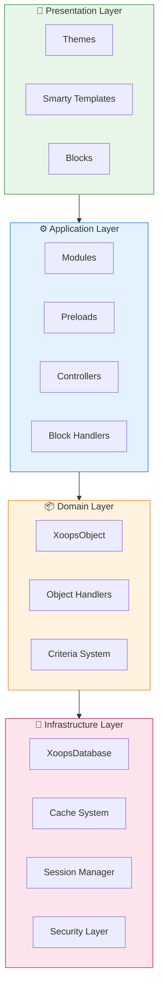
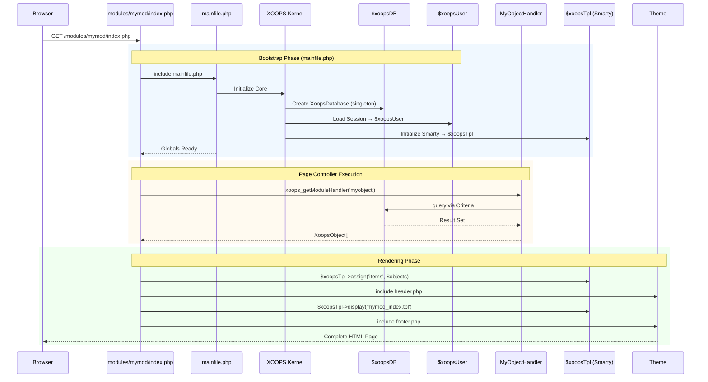

:::注意[关于本文档]
本页描述了适用于当前 (2.5.x) 和未来 (4.0.x) 版本的 XOOPS 的 **概念架构**。一些图表显示了分层设计愿景。

**版本-specific详细信息：**
- **XOOPS 2.5.x 今天：** 使用`mainfile.php`、全局变量（`$XOOPSDB`、`$XOOPSUser`）、预加载和处理程序模式
- **XOOPS 4.0 目标：** PSR-15 中间件、DI 容器、路由器 - 参见[Roadmap](../../07-XOOPS-4.0/XOOPS-4.0-Roadmap.md)
:::

本文档全面概述了XOOPS系统架构，解释了各个组件如何协同工作以创建灵活且可扩展的内容管理系统。

## 概述

XOOPS遵循模区块化架构，将关注点分为不同的层。该系统围绕几个核心原则构建：

- **模区块化**：功能被组织成独立的、可安装的模区块
- **可扩展性**：系统无需修改核心代码即可扩展
- **抽象**：数据库和表示层从业务逻辑中抽象出来
- **安全**：内置-in安全机制可防止常见漏洞

## 系统层



### 1. 表示层

表示层使用Smarty模板引擎处理用户界面渲染。

**关键组件：**
- **主题**：视觉样式和布局
- **Smarty模板**：动态内容呈现
- **区块**：可重复使用的内容小部件

### 2.应用层

应用层包含业务逻辑、控制器和模区块功能。

**关键组件：**
- **模区块**：自-contained功能包
- **处理程序**：数据操作类
- **预加载**：事件侦听器和挂钩

### 3. 领域层

领域层包含核心业务对象和规则。

**关键组件：**
- **XOOPSObject**：所有域对象的基类
- **处理程序**：CRUD 域对象的操作

### 4.基础设施层

基础设施层提供数据库访问和缓存等核心服务。

## 请求生命周期

了解请求生命周期对于有效的 XOOPS 开发至关重要。

### XOOPS 2.5.x 页面控制器流程

当前的 XOOPS 2.5.x 使用 **页面控制器** 模式，其中每个 PHP 文件处理自己的请求。全局变量（`$XOOPSDB`、`$XOOPSUser`、`$XOOPSTpl`等）在引导期间初始化，并在整个执行过程中可用。



### 2.5.x 中的关键全局变量

|全球|类型 |初始化|目的|
|--------|------|-------------|---------|
| `$XOOPSDB` | `XOOPSDatabase` |引导程序 |数据库连接（单例）|
| `$XOOPSUser` | `XOOPSUser\|null` |会话负载 |当前登录-in用户|
| `$XOOPSTpl`| `XOOPSTpl` |模板初始化 | Smarty模板引擎|
| `$XOOPSModule` | `XOOPSModule` |模区块负载|当前模区块上下文 |
| `$XOOPSConfig` | `array` |配置加载|系统配置|

:::注意[XOOPS 4.0 比较]
在 XOOPS 4.0 中，页面控制器模式被 **PSR-15 中间件管道** 和路由器-based 调度所取代。全局变量被依赖注入取代。有关迁移过程中的兼容性保证，请参阅[Hybrid Mode Contract](../../07-XOOPS-4.0/Specifications/Hybrid-Mode-Contract.md)。
:::

### 1.引导阶段

```php
// mainfile.php is the entry point
include_once XOOPS_ROOT_PATH . '/mainfile.php';

// Core initialization
$xoops = Xoops::getInstance();
$xoops->boot();
```

**步骤：**
1. 负载配置（`mainfile.php`）
2. 初始化自动加载器
3. 设置错误处理
4.建立数据库连接
5. 加载用户会话
6.初始化Smarty模板引擎

### 2. 路由阶段

```php
// Request routing to appropriate module
$module = $GLOBALS['xoopsModule'];
$controller = $module->getController();
$controller->dispatch($request);
```

**步骤：**
1.解析请求URL
2. 识别目标模区块
3. 加载模区块配置
4.检查权限
5. 路由到适当的处理程序

### 3.执行阶段

```php
// Controller execution
$data = $handler->getObjects($criteria);
$xoopsTpl->assign('items', $data);
```**步骤：**
1. 执行控制器逻辑
2. 与数据层交互
3. 流程业务规则
4. 准备视图数据

### 4. 渲染阶段

```php
// Template rendering
include XOOPS_ROOT_PATH . '/header.php';
$xoopsTpl->display('db:module_template.tpl');
include XOOPS_ROOT_PATH . '/footer.php';
```

**步骤：**
1.应用主题布局
2.渲染模区块模板
3. 处理区块
4. 输出响应

## 核心组件

### XOOPSObject

XOOPS中所有数据对象的基类。

```php
<?php
class MyModuleItem extends XoopsObject
{
    public function __construct()
    {
        $this->initVar('id', XOBJ_DTYPE_INT, null, false);
        $this->initVar('title', XOBJ_DTYPE_TXTBOX, '', true, 255);
        $this->initVar('content', XOBJ_DTYPE_TXTAREA, '', false);
        $this->initVar('created', XOBJ_DTYPE_INT, time(), false);
    }
}
```

**关键方法：**
- `initVar()` - 定义对象属性
- `getVar()` - 检索属性值
- `setVar()` - 设置属性值
- `assignVars()` - 从数组批量分配

### XOOPSPersistableObjectHandler

处理 XOOPSObject 实例的CRUD操作。

```php
<?php
class MyModuleItemHandler extends XoopsPersistableObjectHandler
{
    public function __construct(\XoopsDatabase $db)
    {
        parent::__construct($db, 'mymodule_items', 'MyModuleItem', 'id', 'title');
    }

    public function getActiveItems($limit = 10)
    {
        $criteria = new CriteriaCompo();
        $criteria->add(new Criteria('status', 1));
        $criteria->setSort('created');
        $criteria->setOrder('DESC');
        $criteria->setLimit($limit);

        return $this->getObjects($criteria);
    }
}
```

**关键方法：**
- `create()` - 创建新对象实例
- `get()` - 通过 ID 检索对象
- `insert()` - 将对象保存到数据库
- `delete()` - 从数据库中删除对象
- `getObjects()` - 检索多个对象
- `getCount()` - 计算匹配对象

### 模区块结构

每个 XOOPS 模区块都遵循标准目录结构：

```
modules/mymodule/
├── class/                  # PHP classes
│   ├── MyModuleItem.php
│   └── MyModuleItemHandler.php
├── include/                # Include files
│   ├── common.php
│   └── functions.php
├── templates/              # Smarty templates
│   ├── mymodule_index.tpl
│   └── mymodule_item.tpl
├── admin/                  # Admin area
│   ├── index.php
│   └── menu.php
├── language/               # Translations
│   └── english/
│       ├── main.php
│       └── modinfo.php
├── sql/                    # Database schema
│   └── mysql.sql
├── xoops_version.php       # Module info
├── index.php               # Module entry
└── header.php              # Module header
```

## 依赖注入容器

现代XOOPS开发可以利用依赖注入来获得更好的可测试性。

### 基本容器实现

```php
<?php
class XoopsDependencyContainer
{
    private array $services = [];

    public function register(string $name, callable $factory): void
    {
        $this->services[$name] = $factory;
    }

    public function resolve(string $name): mixed
    {
        if (!isset($this->services[$name])) {
            throw new \InvalidArgumentException("Service not found: $name");
        }

        $factory = $this->services[$name];

        if (is_callable($factory)) {
            return $factory($this);
        }

        return $factory;
    }

    public function has(string $name): bool
    {
        return isset($this->services[$name]);
    }
}
```

### PSR-11 兼容容器

```php
<?php
namespace Xmf\Di;

use Psr\Container\ContainerInterface;

class BasicContainer implements ContainerInterface
{
    protected array $definitions = [];

    public function set(string $id, mixed $value): void
    {
        $this->definitions[$id] = $value;
    }

    public function get(string $id): mixed
    {
        if (!$this->has($id)) {
            throw new \InvalidArgumentException("Service not found: $id");
        }

        $entry = $this->definitions[$id];

        if (is_callable($entry)) {
            return $entry($this);
        }

        return $entry;
    }

    public function has(string $id): bool
    {
        return isset($this->definitions[$id]);
    }
}
```

### 使用示例

```php
<?php
// Service registration
$container = new XoopsDependencyContainer();

$container->register('database', function () {
    return XoopsDatabaseFactory::getDatabaseConnection();
});

$container->register('userHandler', function ($c) {
    return new XoopsUserHandler($c->resolve('database'));
});

// Service resolution
$userHandler = $container->resolve('userHandler');
$user = $userHandler->get($userId);
```

## 扩展点

XOOPS提供了几种扩展机制：

### 1. 预加载

预加载允许模区块挂钩核心事件。

```php
<?php
// modules/mymodule/preloads/core.php
class MymoduleCorePreload extends XoopsPreloadItem
{
    public static function eventCoreHeaderEnd($args)
    {
        // Execute when header processing ends
    }

    public static function eventCoreFooterStart($args)
    {
        // Execute when footer processing starts
    }
}
```

### 2. 插件

插件扩展了模区块内的特定功能。

```php
<?php
// modules/mymodule/plugins/notify.php
class MymoduleNotifyPlugin
{
    public function onItemCreate($item)
    {
        // Send notification when item is created
    }
}
```

### 3. 过滤器

过滤器在数据通过系统时修改数据。

```php
<?php
// Content filter example
$myts = MyTextSanitizer::getInstance();
$content = $myts->displayTarea($rawContent, 1, 1, 1);
```

## 最佳实践

### 代码组织

1. **对新代码使用命名空间**：
   ```php
   namespace XoopsModules\MyModule;

   class Item extends \XoopsObject
   {
       // Implementation
   }
 
  ```

2. **遵循PSR-4自动加载**：
   ```json
   {
       "autoload": {
           "psr-4": {
               "XoopsModules\\MyModule\\": "class/"
           }
       }
   }
 
  ```

3. **单独关注**：
   - `class/`中的域逻辑
   - `templates/`中的演示
   - 模区块根目录中的控制器

### 性能

1. **使用缓存**进行昂贵的操作
2. **尽可能延迟加载**资源
3. **使用标准批处理最小化数据库查询**
4. **通过避免复杂的逻辑来优化模板**

### 安全

1. **使用`XMF\Request`验证所有输入**
2. **模板中的转义输出**
3. **使用准备好的语句**进行数据库查询
4. **敏感操作前检查权限**

## 相关文档

- [Design-Patterns](Design-Patterns.md) - XOOPS中使用的设计模式
- [Database Layer](../Database/Database-Layer.md) - 数据库抽象详细信息
- [Smarty Basics](../Templates/Smarty-Basics.md) - 模板系统文档
- [Security Best Practices](../Security/Security-Best-Practices.md) - 安全指南

---

#XOOPS#架构#核心#设计#系统-design