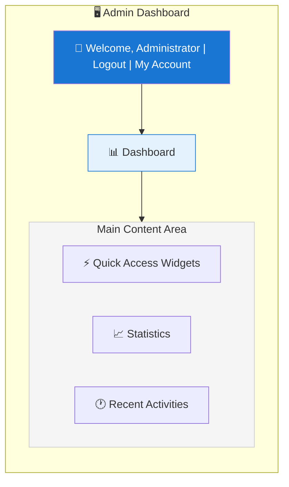
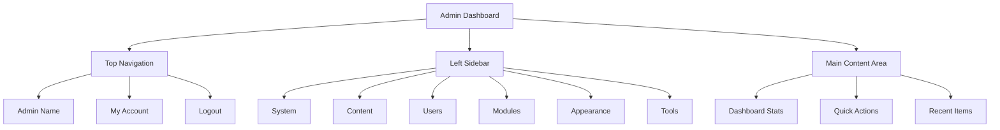

# XOOPS 管理面板概述

导航和使用XOOPS管理员仪表板的完整指南。

## 访问管理面板

### 管理员登录

打开浏览器并导航至：

```
http://your-domain.com/xoops/admin/
```

或者如果 XOOPS 位于根中：

```
http://your-domain.com/admin/
```

输入您的管理员凭据：

```
Username: [Your admin username]
Password: [Your admin password]
```

### 登录后

您将看到主管理仪表板：



## 管理面板布局



## 仪表板组件

### 顶部栏

顶部栏包含基本控件：

|元素|目的|
|---|---|
| **管理员徽标** |单击返回仪表板 |
| **欢迎辞** |显示登录的-in管理员名称|
| **我的帐户** |编辑管理员配置文件和密码 |
| **帮助** |访问文档 |
| **退出** |退出管理面板 |

### 左侧导航边栏

主菜单按功能组织：

```
├── System
│   ├── Dashboard
│   ├── Preferences
│   ├── Admin Users
│   ├── Groups
│   ├── Permissions
│   ├── Modules
│   └── Tools
├── Content
│   ├── Pages
│   ├── Categories
│   ├── Comments
│   └── Media Manager
├── Users
│   ├── Users
│   ├── User Requests
│   ├── Online Users
│   └── User Groups
├── Modules
│   ├── Modules
│   ├── Module Settings
│   └── Module Updates
├── Appearance
│   ├── Themes
│   ├── Templates
│   ├── Blocks
│   └── Images
└── Tools
    ├── Maintenance
    ├── Email
    ├── Statistics
    ├── Logs
    └── Backups
```

### 主要内容区

显示所选部分的信息和控件：

- 配置表格
- 带列表的数据表
- 图表和统计数据
- 快速操作按钮
- 帮助文本和工具提示

### 仪表板小部件

快速获取关键信息：

- **系统信息：** PHP版本、MySQL版本、XOOPS版本
- **快速统计：** 用户数、帖子总数、安装的模区块
- **最近活动：**最新登录、内容更改、错误
- **服务器状态：** CPU，内存、磁盘使用情况
- **通知：**系统警报、待更新

## 核心管理功能

### 系统管理

**位置：**系统>【各种选项】

#### 偏好设置

配置基本系统设置：

```
System > Preferences > [Settings Category]
```

类别：
- 常规设置（站点名称、时区）
- 用户设置（注册、个人资料）
- 电子邮件设置（SMTP配置）
- 缓存设置（缓存选项）
- URL设置（友好的URL）
- 元标签（SEO设置）

请参阅基本配置和系统设置。

#### 管理员用户

管理管理员帐户：

```
System > Admin Users
```

功能：
- 添加新管理员
- 编辑管理员配置文件
- 更改管理员密码
- 删除管理员帐户
- 设置管理员权限

### 内容管理

**位置：**内容>【多种选项】

#### Pages/Articles

管理网站内容：

```
Content > Pages (or your module)
```

功能：
- 创建新页面
- 编辑现有内容
- 删除页面
- Publish/unpublish
- 设置类别
- 管理修订

#### 类别

整理内容：

```
Content > Categories
```

功能：
- 创建类别层次结构
- 编辑类别
- 删除类别
- 分配到页面

#### 评论

中等用户评论：

```
Content > Comments
```

功能：
- 查看所有评论
- 批准评论
- 编辑评论
- 删除垃圾邮件
- 阻止评论者

### 用户管理

**位置：**用户 > [各种选项]

#### 用户

管理用户帐户：

```
Users > Users
```

功能：
- 查看所有用户
- 创建新用户
- 编辑用户个人资料
- 删除帐户
- 重置密码
- 更改用户状态
- 分配到组

#### 在线用户

监控活跃用户：

```
Users > Online Users
```

显示：
- 当前在线用户
- 最后活动时间
- IP地址
- 用户位置（如果配置）

#### 用户组

管理用户角色和权限：

```
Users > Groups
```

功能：
- 创建自定义组
- 设置群组权限
- 将用户分配到组
- 删除群组

### 模区块管理

**位置：**模区块 > [多种选项]

#### 模区块

安装和配置模区块：

```
Modules > Modules
```

功能：
- 查看已安装的模区块
- Enable/disable模区块
- 更新模区块
- 配置模区块设置
- 安装新模区块
- 查看模区块详细信息

#### 检查更新

```
Modules > Modules > Check for Updates
```

显示：
- 可用模区块更新
- 变更日志
- 下载和安装选项

### 外观管理

**位置：**外观>【多种选项】

#### 主题

管理网站主题：

```
Appearance > Themes
```功能：
- 查看已安装的主题
- 设置默认主题
- 上传新主题
- 删除主题
- 主题预览
- 主题配置

#### 块

管理内容块：

```
Appearance > Blocks
```

功能：
- 创建自定义块
- 编辑区块内容
- 在页面上排列块
- 设置块可见性
- 删除块
- 配置块缓存

#### 模板

管理模板（高级）：

```
Appearance > Templates
```

适合高级用户和开发人员。

### 系统工具

**位置：**系统 > 工具

#### 维护模式

维护期间阻止用户访问：

```
System > Maintenance Mode
```

配置：
- Enable/disable维护
- 自定义维护消息
- 允许的IP地址（用于测试）

#### 数据库管理

```
System > Database
```

功能：
- 检查数据库一致性
- 运行数据库更新
- 修理桌子
- 优化数据库
- 导出数据库结构

#### 活动日志

```
System > Logs
```

监控：
- 用户活动
- 行政行为
- 系统事件
- 错误日志

## 快速行动

可从仪表板访问的常见任务：

```
Quick Links:
├── Create New Page
├── Add New User
├── Create Content Block
├── Upload Image
├── Send Mass Email
├── Update All Modules
└── Clear Cache
```

## 管理面板键盘快捷键

快速导航：

|快捷方式 |行动|
|---|---|
| `Ctrl+H`|去帮忙 |
| `Ctrl+D` |转到仪表板|
| `Ctrl+Q` |快速搜索|
| `Ctrl+L` |退出 |

## 用户账户管理

### 我的帐户

访问您的管理员个人资料：

1.点击右上角“我的账户”
2.编辑个人资料信息：
   - 电子邮件地址
   - 真实姓名
   - 用户信息
   - 阿凡达

### 更改密码

更改您的管理员密码：

1. 前往**我的帐户**
2. 点击“更改密码”
3. 输入当前密码
4. 输入新密码（两次）
5. 点击“保存”

**安全提示：**
- 使用强密码（16 个以上字符）
- 包括大写、小写、数字、符号
- 每 90 天更改一次密码
- 切勿共享管理员凭据

### 注销

退出管理面板：

1. 点击右上角“退出”
2.您将被重定向到登录页面

## 管理面板统计

### 仪表板统计数据

网站指标快速概览：

|公制|价值|
|--------|--------|
|用户在线| 12 | 12
|用户总数 | 256 | 256
|帖子总数 | 1,234 | 1,234
|总评论 | 5,678 | 5,678
|模块总数 | 8 |

### 系统状态

服务器和性能信息：

|组件| Version/Value |
|------------|--------------|
| XOOPS版本| 11.2.5 |
| PHP版本| 8.2.x |
| MySQL版本| 8.0.x |
|服务器负载 | 0.45, 0.42 |
|正常运行时间 | 45 天 |

### 最近活动

最近事件的时间表：

```
12:45 - Admin login
12:30 - New user registered
12:15 - Page published
12:00 - Comment posted
11:45 - Module updated
```

## 通知系统

### 管理员警报

接收以下通知：

- 新用户注册
- 评论等待审核
- 登录尝试失败
- 系统错误
- 可用模块更新
- 数据库问题
- 磁盘空间警告

配置警报：

**系统 > 首选项 > 电子邮件设置**

```
Notify Admin on Registration: Yes
Notify Admin on Comments: Yes
Notify Admin on Errors: Yes
Alert Email: admin@your-domain.com
```

## 常见管理任务

### 创建一个新页面

1. 转到 **内容 > 页面**（或相关模块）
2. 点击“添加新页面”
3、填写：
   - 标题
   - 内容
   - 描述
   - 类别
   - 元数据
4. 点击“发布”

### 管理用户

1. 转到 **用户 > 用户**
2. 查看用户列表：
   - 用户名
   - 电子邮件
   - 注册日期
   - 最后登录
   - 状态

3. 单击用户名可以：
   - 编辑个人资料
   - 更改密码
   - 编辑群组
   - Block/unblock用户

### 配置模块

1. 转到 **模块 > 模块**
2. 在列表中查找模块
3. 单击模块名称
4. 单击“首选项”或“设置”
5. 配置模块选项
6. 保存更改

### 创建一个新块

1. 转到 **外观 > 块**
2. 点击“添加新区块”
3. 输入：
   - 块标题
   - 阻止内容（允许HTML）
   - 页面上的位置
   - 可见性（所有页面或特定页面）
   - 模块（如果适用）
4. 点击“提交”

## 管理面板帮助

### 内置-in文档

从管理面板访问帮助：

1. 单击顶部栏中的“帮助”按钮
2.当前页面的上下文-sensitive帮助
3. 文档链接
4. 常见问题

### 外部资源- XOOPS官方网站：https://xoops.org/
- 社区论坛：https://xoops.org/modules/newbb/
- 模块存储库：https://xoops.org/modules/repository/
- Bugs/Issues：https://github.com/XOOPS/XoopsCore/issues

## 自定义管理面板

### 管理主题

选择管理界面主题：

**系统>首选项>常规设置**

```
Admin Theme: [Select theme]
```

可用主题：
- 默认（浅色）
- 深色模式
- 自定义主题

### 仪表板定制

选择显示哪些小部件：

**仪表板>自定义**

选择：
- 系统信息
- 统计
- 最近的活动
- 快速链接
- 自定义小部件

## 管理面板权限

不同的管理员级别有不同的权限：

|角色 |能力|
|---|---|
| **网站管理员** |完全访问所有管理功能 |
| **管理员** |有限的管理功能|
| **主持人** |仅内容审核 |
| **编辑** |内容创作与编辑 |

管理权限：

**系统 > 权限**

## 管理面板的安全最佳实践

1. **强密码：** 使用16+字符的密码
2. **定期更改：** 每 90 天更改一次密码
3. **监控访问：**定期检查“管理员用户”日志
4. **限制访问：** 重命名管理文件夹以提高安全性
5. **使用 HTTPS:** 始终通过 HTTPS 访问管理员
6. **IP 白名单：** 限制管理员访问特定 IP
7. **定期注销：** 完成后注销
8. **浏览器安全：**定期清除浏览器缓存

请参阅安全配置。

## 管理面板故障排除

### 无法访问管理面板

**解决方案：**
1. 验证登录凭据
2.清除浏览器缓存和cookie
3.尝试不同的浏览器
4.检查admin文件夹路径是否正确
5.验证admin文件夹的文件权限
6. 检查主文件中的数据库连接。php

### 空白管理页面

**解决方案：**
```bash
# Check PHP errors
tail -f /var/log/apache2/error.log

# Enable debug mode temporarily
sed -i "s/define('XOOPS_DEBUG', 0)/define('XOOPS_DEBUG', 1)/" /var/www/html/xoops/mainfile.php

# Check file permissions
ls -la /var/www/html/xoops/admin/
```

### 缓慢的管理面板

**解决方案：**
1.清除缓存：**系统>工具>清除缓存**
2.优化数据库：**系统>数据库>优化**
3.检查服务器资源：`htop`
4. 查看 MySQL 中的慢查询

### 模区块未出现

**解决方案：**
1. 验证已安装的模区块：**模区块 > 模区块**
2. 检查模区块是否启用
3. 验证分配的权限
4. 检查模区块文件是否存在
5.查看错误日志

## 后续步骤

熟悉管理面板后：

1. 创建您的第一个页面
2. 设置用户组
3. 安装附加模区块
4. 配置基本设置
5. 实施安全

---

**标签：** #admin-panel #dashboard #navigation #getting-started

**相关文章：**
- ../Configuration/Basic-Configuration
- ../Configuration/System-Settings
- 创造-Your-First-Page
- 管理-Users
- 安装-Modules