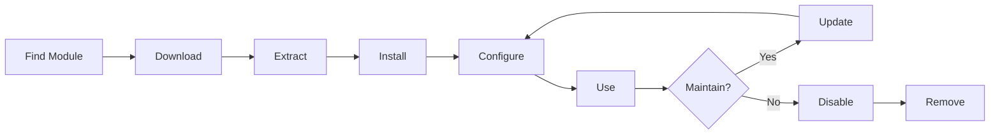

# 安装和管理XOOPS模区块

了解如何通过安装和配置模区块来扩展XOOPS功能。

## 了解XOOPS模区块

### 什么是模区块？

模区块是为 XOOPS 添加功能的扩展：

|类型 |目的|示例 |
|---|---|---|
| **内容** |管理特定内容类型 |新闻、博客、门票 |
| **社区** |用户互动 |论坛、评论、评论 |
| **电子商务** |销售产品 |商店、购物车、付款 |
| **媒体** |手柄files/images |画廊、下载、视频 |
| **实用程序** |工具和帮手|电子邮件、备份、分析 |

### 核心模区块与可选模区块

|模区块|类型 |包含 |可拆卸|
|---|---|---|---|
| **系统** |核心|是的 |没有 |
| **用户** |核心|是的 |没有 |
| **简介** |推荐|是的 |是的 |
| **PM（私人消息）** |推荐|是的 |是的 |
| **WF-Channel** |可选|经常|是的 |
| **新闻** |可选|没有 |是的 |
| **论坛** |可选|没有 |是的 |

## 模区块生命周期



## 查找模区块

### XOOPS 模区块存储库

官方XOOPS模区块存储库：

**访问：** https://XOOPS.org/modules/repository/

```
Directory > Modules > [Browse Categories]
```

按类别浏览：
- 内容管理
- 社区
- 电子商务
- 多媒体
- 发展
- 网站管理

### 评估模区块

安装前，请检查：

|标准|寻找什么 |
|---|---|
| **兼容性** |适用于您的 XOOPS 版本 |
| **评级** |良好的用户评论和评级|
| **更新** |最近维护 |
| **下载** |流行并广泛使用 |
| **要求** |与您的服务器兼容 |
| **权限证** | GPL 或类似的开源 |
| **支持** |活跃的开发者和社区 |

### 读取模区块信息

每个模区块列表显示：

```
Module Name: [Name]
Version: [X.X.X]
Requires: XOOPS [Version]
Author: [Name]
Last Update: [Date]
Downloads: [Number]
Rating: [Stars]
Description: [Brief description]
Compatibility: PHP [Version], MySQL [Version]
```

## 安装模区块

### 方法 1：管理面板安装

**第 1 步：访问模区块部分**

1. 登录管理面板
2. 导航至 **模区块 > 模区块**
3. 单击**“安装新模区块”**或**“浏览模区块”**

**第2步：上传模区块**

选项 A - 直接上传：
1. 点击**“选择文件”**
2. 从计算机中选择模区块.zip 文件
3. 点击**“上传”**

选项 B - URL 上传：
1.粘贴模区块URL
2. 点击**“下载并安装”**

**第 3 步：查看模区块信息**

```
Module Name: [Name shown]
Version: [Version]
Author: [Author info]
Description: [Full description]
Requirements: [PHP/MySQL versions]
```

检查并单击 **“继续安装”**

**第 4 步：选择安装类型**

```
☐ Fresh Install (New installation)
☐ Update (Upgrade existing)
☐ Delete Then Install (Replace existing)
```

选择适当的选项。

**步骤 5：确认安装**

审核最终确认：
```
Module will be installed to: /modules/modulename/
Database: xoops_db
Proceed? [Yes] [No]
```

单击**“是”**进行确认。

**第六步：安装完成**

```
Installation successful!

Module: [Module Name]
Version: [Version]
Tables created: [Number]
Files installed: [Number]

[Go to Module Settings]  [Return to Modules]
```

### 方法2：手动安装（高级）

对于手动安装或故障排除：

**第 1 步：下载模区块**

1.从存储库下载模区块.zip
2. 提取至`/var/www/html/XOOPS/modules/modulename/`

```bash
# Extract module
unzip module_name.zip
cp -r module_name /var/www/html/xoops/modules/

# Set permissions
chmod -R 755 /var/www/html/xoops/modules/module_name
```

**步骤 2：运行安装脚本**

```
Visit: http://your-domain.com/xoops/modules/module_name/admin/index.php?op=install
```

或者通过管理面板（系统 > 模区块 > 更新数据库）。

**步骤 3：验证安装**

1. 转到管理中的**模区块 > 模区块**
2. 在列表中查找您的模区块
3. 验证其显示为“Active”

## 模区块配置

### 访问模区块设置

1. 转到 **模区块 > 模区块**
2. 找到您的模区块
3. 单击模区块名称
4. 单击**“首选项”**或**“设置”**

### 通用模区块设置

大多数模区块提供：

```
Module Status: [Enabled/Disabled]
Display in Menu: [Yes/No]
Module Weight: [1-999] (display order)
Visible To Groups: [Checkboxes for user groups]
```

### 模区块-Specific选项

每个模区块都有独特的设置。示例：

**新闻模区块：**
```
Items Per Page: 10
Show Author: Yes
Allow Comments: Yes
Moderation Required: Yes
```

**论坛模区块：**
```
Topics Per Page: 20
Posts Per Page: 15
Maximum Attachment Size: 5MB
Enable Signatures: Yes
```

**图库模区块：**
```
Images Per Page: 12
Thumbnail Size: 150x150
Maximum Upload: 10MB
Watermark: Yes/No
```

查看模区块文档以了解特定选项。

### 保存配置

调整设置后：

1. 点击**“提交”**或**“保存”**
2. 您将看到确认信息：
 
  ```
   Settings saved successfully!
 
  ```

## 管理模区块区块

许多模区块创建“区块” - 小部件-like内容区域。

### 查看模区块区块1. 转到 **外观 > 区块**
2. 从模区块中查找区块
3. 大多数模区块显示“[模区块名称] - [区块描述]”

### 配置区块

1.点击区区块名称
2、调整：
   - 区块标题
   - 可见性（所有页面或特定页面）
   - 页面位置（左、中、右）
   - 可以看到的用户组
3. 点击**“提交”**

### 在主页上显示区块

1. 转到 **外观 > 区块**
2.找到你想要的区区块
3. 点击**“编辑”**
4. 设置：
   - **可见：** 选择组
   - **位置：** 选择列 (left/center/right)
   - **页面：** 主页或所有页面
5. 点击**“提交”**

## 安装特定模区块示例

### 安装新闻模区块

**适合：** 博客文章、公告

1.从存储库下载新闻模区块
2. 通过 **模区块 > 模区块 > 安装** 上传
3. 在 **模区块 > 新闻 > 首选项** 中配置：
   - 每页故事数：10
   - 允许评论：是
   - 发布前批准：是
4. 为最新消息创建区区块
5.开始发布故事！

### 安装论坛模区块

**适合：** 社区讨论

1.下载论坛模区块
2.通过管理面板安装
3.在模区块中创建论坛类别
4. 配置设置：
   - Topics/page：20
   - Posts/page：15
   - 启用审核：是
5.分配用户组权限
6. 为最新主题创建区区块

### 安装图库模区块

**适合：** 图像展示

1.下载图库模区块
2. 安装和配置
3. 创建相册
4. 上传图片
5.设置viewing/uploading的权限
6. 在网站上显示图库

## 更新模区块

### 检查更新

```
Admin Panel > Modules > Modules > Check for Updates
```

这表明：
- 可用模区块更新
- 当前版本与新版本
- Changelog/release注释

### 更新模区块

1. 转到 **模区块 > 模区块**
2. 单击具有可用更新的模区块
3. 单击**“更新”**按钮
4. 从安装类型中选择**“更新”**
5. 按照安装向导进行操作
6.模区块更新！

### 重要更新说明

更新前：

- [ ] 备份数据库
- [ ] 备份模区块文件
- [ ] 查看变更日志
- [ ] 首先在登台服务器上测试
- [ ] 注意任何自定义修改

更新后：
- [ ] 验证功能
- [ ] 检查模区块设置
- [ ] warnings/errors 的评论
- [ ] 清除缓存

## 模区块权限

### 分配用户组访问权限

控制哪些用户组可以访问模区块：

**位置：**系统 > 权限

对于每个模区块，配置：

```
Module: [Module Name]

Admin Access: [Select groups]
User Access: [Select groups]
Read Permission: [Groups allowed to view]
Write Permission: [Groups allowed to post]
Delete Permission: [Administrators only]
```

### 常见权限级别

```
Public Content (News, Pages):
├── Admin Access: Webmaster
├── User Access: All logged-in users
└── Read Permission: Everyone

Community Features (Forum, Comments):
├── Admin Access: Webmaster, Moderators
├── User Access: All logged-in users
└── Write Permission: All logged-in users

Admin Tools:
├── Admin Access: Webmaster only
└── User Access: Disabled
```

## 禁用和删除模区块

### 禁用模区块（保留文件）

保留模区块但从站点隐藏：

1. 转到 **模区块 > 模区块**
2. 查找模区块
3. 单击模区块名称
4. 单击**“禁用”**或将状态设置为非活动
5.模区块隐藏但数据保留

随时回复-enable：
1.点击模区块
2. 点击**“启用”**

### 完全删除模区块

删除模区块及其数据：

1. 转到 **模区块 > 模区块**
2. 查找模区块
3. 单击**“卸载”**或**“删除”**
4. 确认：“删除模区块和所有数据？”
5. 点击**“是”**确认

**警告：** 卸载会删除所有模区块数据！

### 卸载后重新安装

如果卸载模区块：
- 模区块文件已删除
- 数据库表已删除
- 所有数据丢失
- 必须重新安装才能再次使用
- 可以从备份恢复

## 模区块安装故障排除

### 安装后模区块未出现

**症状：** 模区块已列出，但在现场不可见

**解决方案：**
```
1. Check module is "Active" (Modules > Modules)
2. Enable module blocks (Appearance > Blocks)
3. Verify user permissions (System > Permissions)
4. Clear cache (System > Tools > Clear Cache)
5. Check .htaccess doesn't block module
```

### 安装错误：“表已存在”

**症状：** 模区块安装过程中出现错误

**解决方案：**
```
1. Module partially installed before
2. Try "Delete then Install" option
3. Or uninstall first, then install fresh
4. Check database for existing tables:
   mysql> SHOW TABLES LIKE 'xoops_module%';
```

### 模区块缺少依赖项

**症状：** 模区块无法安装 - 需要其他模区块

**解决方案：**
```
1. Note required modules from error message
2. Install required modules first
3. Then install the module
4. Install in correct order
```

### 访问模区块时出现空白页

**症状：** 模区块加载但不显示任何内容

**解决方案：**
```
1. Enable debug mode in mainfile.php:
   define('XOOPS_DEBUG', 1);

2. Check PHP error log:
   tail -f /var/log/php_errors.log

3. Verify file permissions:
   chmod -R 755 /var/www/html/xoops/modules/modulename

4. Check database connection in module config

5. Disable module and reinstall
```

### 模区块中断站点

**症状：** 安装模区块破坏网站

**解决方案：**
```
1. Disable the problematic module immediately:
   Admin > Modules > [Module] > Disable

2. Clear cache:
   rm -rf /var/www/html/xoops/cache/*
   rm -rf /var/www/html/xoops/templates_c/*

3. Restore from backup if needed

4. Check error logs for root cause

5. Contact module developer
```

## 模区块安全注意事项

### 仅从可信来源安装

```
✓ Official XOOPS Repository
✓ GitHub official XOOPS modules
✓ Trusted module developers
✗ Unknown websites
✗ Unverified sources
```

### 检查模区块权限安装后：

1. 检查模区块代码是否存在可疑活动
2.检查数据库表是否存在异常
3.监控文件变化
4. 保持模区块更新
5. 删除未使用的模区块

### 权限最佳实践

```
Module directory: 755 (readable, not writable by web server)
Module files: 644 (readable only)
Module data: Protected by database
```

## 模区块开发资源

### 学习模区块开发

- 官方文档：https://XOOPS.org/
- GitHub 存储库：https://github.com/XOOPS/
- 社区论坛：https://XOOPS.org/modules/newbb/
- 开发人员指南：可在文档文件夹中找到

## 模区块的最佳实践

1. **一次安装一个：** 监控冲突
2. **安装后测试：** 验证功能
3. **记录自定义配置：**记下您的设置
4. **保持更新：**及时安装模区块更新
5. **Remove Unused:** 删除不需要的模区块
6. **之前备份：** 安装前务必进行备份
7. **阅读文档：** 检查模区块说明
8. **加入社区：** 如果需要请寻求帮助

## 模区块安装清单

对于每个模区块安装：

- [ ] 研究并阅读评论
- [ ] 验证XOOPS版本兼容性
- [ ] 备份数据库和文件
- [ ] 下载最新版本
- [ ] 通过管理面板安装
- [ ] 配置设置
- [ ] Create/position区块
- [ ] 设置用户权限
- [ ] 测试功能
- [ ] 文档配置
- [ ] 更新时间表

## 后续步骤

安装模区块后：

1. 为模区块创建内容
2. 设置用户组
3. 探索管理功能
4.优化性能
5. 根据需要安装附加模区块

---

**标签：** #modules #installation #extension #management

**相关文章：**
- 管理员-Panel-Overview
- 管理-Users
- 创造-Your-First-Page
- ../Configuration/System-Settings