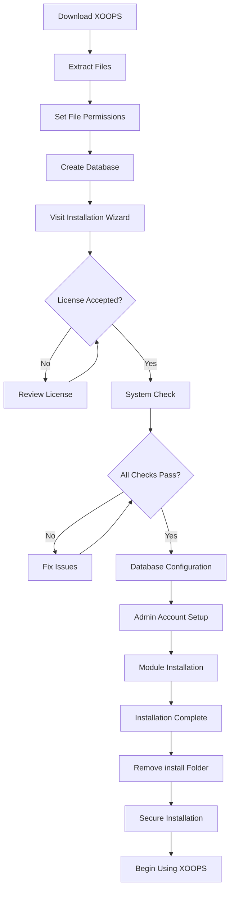

---
title：“完整安装指南”
description：“使用安装向导、安全强化和故障排除安装XOOPS的步骤-by-step指南”
---

# 完整的XOOPS安装指南

本指南提供了使用安装向导从头开始安装XOOPS的全面演练。

## 先决条件

在开始安装之前，请确保您拥有：

- 通过FTP或SSH访问您的网络服务器
- 管理员访问您的数据库服务器
- 已注册的域名
- 已验证服务器要求
- 可用的备份工具

## 安装过程



## 步骤-by-Step安装

### 第 1 步：下载XOOPS

从[https://XOOPS.org/](https://XOOPS.org/)下载最新版本：

```bash
# Using wget
wget https://xoops.org/download/xoops-2.5.8.zip

# Using curl
curl -O https://xoops.org/download/xoops-2.5.8.zip
```

### 第 2 步：提取文件

将 XOOPS 存档提取到您的网络根目录：

```bash
# Navigate to web root
cd /var/www/html

# Extract XOOPS
unzip xoops-2.5.8.zip

# Rename folder (optional, but recommended)
mv xoops-2.5.8 xoops
cd xoops
```

### 步骤 3：设置文件权限

为 XOOPS 目录设置适当的权限：

```bash
# Make directories writable (755 for dirs, 644 for files)
find . -type d -exec chmod 755 {} \;
find . -type f -exec chmod 644 {} \;

# Make specific directories writable by web server
chmod 777 uploads/
chmod 777 templates_c/
chmod 777 var/
chmod 777 cache/

# Secure mainfile.php after installation
chmod 644 mainfile.php
```

### 步骤 4：创建数据库

使用 MySQL 为 XOOPS 创建一个新数据库：

```sql
-- Create database
CREATE DATABASE xoops_db CHARACTER SET utf8mb4 COLLATE utf8mb4_unicode_ci;

-- Create user
CREATE USER 'xoops_user'@'localhost' IDENTIFIED BY 'secure_password_here';

-- Grant privileges
GRANT ALL PRIVILEGES ON xoops_db.* TO 'xoops_user'@'localhost';
FLUSH PRIVILEGES;
```

或者使用 phpMyAdmin：

1.登录phpMyAdmin
2. 单击“数据库”选项卡
3. 输入数据库名称：`XOOPS_db`
4. 选择“utf8mb4_unicode_ci”排序规则
5.点击“创建”
6.创建与数据库同名的用户
7.授予所有权限

### 步骤 5：运行安装向导

打开浏览器并导航至：

```
http://your-domain.com/xoops/install/
```

#### 系统检查阶段

该向导会检查您的服务器配置：

- PHP版本> = 5.6.0
- MySQL/MariaDB可用
- 必需的PHP扩展（GD、PDO等）
- 目录权限
- 数据库连接

**如果检查失败：**

有关解决方案，请参阅#Common-Installation-Issues部分。

#### 数据库配置

输入您的数据库凭据：

```
Database Host: localhost
Database Name: xoops_db
Database User: xoops_user
Database Password: [your_secure_password]
Table Prefix: xoops_
```

**重要说明：**
- 如果您的数据库主机与本地主机不同（例如远程服务器），请输入正确的主机名
- 如果在一个数据库中运行多个 XOOPS 实例，则表前缀会有所帮助
- 使用混合大小写、数字和符号的强密码

#### 管理员帐户设置

创建您的管理员帐户：

```
Admin Username: admin (or choose custom)
Admin Email: admin@your-domain.com
Admin Password: [strong_unique_password]
Confirm Password: [repeat_password]
```

**最佳实践：**
- 使用唯一的用户名，而不是“admin”
- 使用超过 16 个字符的密码
- 将凭据存储在安全的密码管理器中
- 切勿共享管理员凭据

#### 模区块安装

选择要安装的默认模区块：

- **系统模区块**（必需） - 核心XOOPS功能
- **用户模区块**（必需） - 用户管理
- **配置文件模区块**（推荐） - 用户配置文件
- **PM（私人消息）模区块**（推荐） - 内部消息传递
- **WF-Channel 模区块**（可选） - 内容管理

选择所有推荐的模区块以完成安装。

### 第 6 步：完成安装

完成所有步骤后，您将看到一个确认屏幕：

```
Installation Complete!

Your XOOPS installation is ready to use.
Admin Panel: http://your-domain.com/xoops/admin/
User Panel: http://your-domain.com/xoops/
```

### 步骤 7：保护您的安装

#### 删除安装文件夹

```bash
# Remove the install directory (CRITICAL for security)
rm -rf /var/www/html/xoops/install/

# Or rename it
mv /var/www/html/xoops/install/ /var/www/html/xoops/install.bak
```

**WARNING:** 切勿让安装文件夹在生产环境中可访问！

#### 保护主文件。php

```bash
# Make mainfile.php read-only
chmod 644 /var/www/html/xoops/mainfile.php

# Set ownership
chown www-data:www-data /var/www/html/xoops/mainfile.php
```

#### 设置适当的文件权限

```bash
# Recommended production permissions
find . -type f -name "*.php" -exec chmod 644 {} \;
find . -type d -exec chmod 755 {} \;

# Writable directories for web server
chmod 777 uploads/ var/ cache/ templates_c/
```

####启用HTTPS/SSL

在您的 Web 服务器（nginx 或 Apache）中配置SSL。

**对于阿帕奇：**
```apache
<VirtualHost *:443>
    ServerName your-domain.com
    DocumentRoot /var/www/html/xoops

    SSLEngine on
    SSLCertificateFile /etc/ssl/certs/your-cert.crt
    SSLCertificateKeyFile /etc/ssl/private/your-key.key

    # Force HTTPS redirect
    <IfModule mod_rewrite.c>
        RewriteEngine On
        RewriteCond %{HTTPS} off
        RewriteRule ^(.*)$ https://%{HTTP_HOST}%{REQUEST_URI} [L,R=301]
    </IfModule>
</VirtualHost>
```

##帖子-Installation配置

### 1. 访问管理面板

导航至：
```
http://your-domain.com/xoops/admin/
```

使用您的管理员凭据登录。

### 2. 配置基本设置

配置以下内容：

- 站点名称和描述
- 管理员电子邮件地址
- 时区和日期格式
- 搜索引擎优化

### 3.测试安装

- [ ] 访问主页
- [ ] 检查模区块负载
- [ ] 验证用户注册是否有效
- [ ] 测试管理面板功能
- [ ] 确认SSL/HTTPS作品

### 4. 计划备份

设置自动备份：

```bash
# Create backup script (backup.sh)
#!/bin/bash
DATE=$(date +%Y%m%d_%H%M%S)
BACKUP_DIR="/backups/xoops"
XOOPS_DIR="/var/www/html/xoops"

# Backup database
mysqldump -u xoops_user -p[password] xoops_db > $BACKUP_DIR/db_$DATE.sql

# Backup files
tar -czf $BACKUP_DIR/files_$DATE.tar.gz $XOOPS_DIR

echo "Backup completed: $DATE"
```

使用 cron 进行计划：
```bash
# Daily backup at 2 AM
0 2 * * * /usr/local/bin/backup.sh
```

## 常见安装问题

### 问题：权限被拒绝错误

**症状：** 上传或创建文件时“权限被拒绝”

**解决方案：**
```bash
# Check web server user
ps aux | grep apache  # For Apache
ps aux | grep nginx   # For Nginx

# Fix permissions (replace www-data with your web server user)
chown -R www-data:www-data /var/www/html/xoops
chmod -R 755 /var/www/html/xoops
chmod 777 uploads/ var/ cache/ templates_c/
```### 问题：数据库连接失败

**症状：**“无法连接到数据库服务器”

**解决方案：**
1. 在安装向导中验证数据库凭据
2. 检查MySQL/MariaDB是否正在运行：
   ```bash
   service mysql status  # or mariadb
 
  ```
3. 验证数据库是否存在：
   ```sql
   SHOW DATABASES;
 
  ```
4. 从命令行测试连接：
   ```bash
   mysql -h localhost -u xoops_user -p xoops_db
 
  ```

### 问题：空白屏幕

**症状：** 访问 XOOPS 显示空白页面

**解决方案：**
1.检查PHP错误日志：
   ```bash
   tail -f /var/log/apache2/error.log
 
  ```
2. 在主文件中启用调试模式。php：
   ```php
   define('XOOPS_DEBUG', 1);
 
  ```
3. 检查 mainfile.php 和配置文件的文件权限
4. 验证 PHP-MySQL 扩展是否已安装

### 问题：无法写入上传目录

**症状：** 上传功能失败，“无法写入上传/”

**解决方案：**
```bash
# Check current permissions
ls -la uploads/

# Fix permissions
chmod 777 uploads/
chown www-data:www-data uploads/

# For specific files
chmod 644 uploads/*
```

### 问题：PHP 扩展缺失

**症状：** 系统检查失败，缺少扩展名（GD、MySQL等）

**解决方案（Ubuntu/Debian）：**
```bash
# Install PHP GD library
apt-get install php-gd

# Install PHP MySQL support
apt-get install php-mysql

# Restart web server
systemctl restart apache2  # or nginx
```

**解决方案（CentOS/RHEL）：**
```bash
# Install PHP GD library
yum install php-gd

# Install PHP MySQL support
yum install php-mysql

# Restart web server
systemctl restart httpd
```

### 问题：安装过程缓慢

**症状：** 安装向导超时或运行速度非常慢

**解决方案：**
1. 在 php.ini 中增加 PHP 超时：
   ```ini
   max_execution_time = 300  # 5 minutes
 
  ```
2. 增加MySQL max_allowed_packet：
   ```sql
   SET GLOBAL max_allowed_packet = 256M;
 
  ```
3、检查服务器资源：
   ```bash
   free -h  # Check RAM
   df -h    # Check disk space
 
  ```

### 问题：管理面板无法访问

**症状：** 安装后无法访问管理面板

**解决方案：**
1. 验证数据库中是否存在管理员用户：
   ```sql
   SELECT * FROM xoops_users WHERE uid = 1;
 
  ```
2.清除浏览器缓存和cookie
3. 检查sessions文件夹是否可写：
   ```bash
   chmod 777 var/
 
  ```
4. 验证 htaccess 规则不会阻止管理员访问

## 验证清单

安装后，验证：

- [x] XOOPS主页正确加载
- [x] 管理面板可通过 /XOOPS/admin/ 访问
- [x] SSL/HTTPS正在工作
- [x] 安装文件夹已删除或无法访问
- [x] 文件权限是安全的（文件为 644，目录为 755）
- [x] 已安排数据库备份
- [x] 模区块加载没有错误
- [x] 用户注册系统正常工作
- [x] 文件上传功能有效
- [x] 电子邮件通知正确发送

## 后续步骤

安装完成后：

1.阅读基本配置指南
2. 保护您的安装
3. 探索管理面板
4. 安装附加模区块
5. 设置用户组和权限

---

**标签：** #installation #setup #getting-started #troubleshooting

**相关文章：**
- 服务器-Requirements
- 升级-XOOPS
- ../Configuration/Security-Configuration