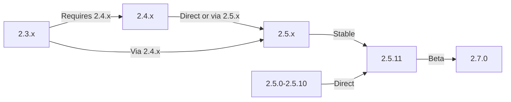

本指南涵盖将XOOPS从旧版本升级到最新版本，同时保留您的数据和自定义设置。

> **版本信息**
> - **稳定：** XOOPS 2.5.11
> - **测试版：** XOOPS 2.7.0（测试）
> - **未来：** XOOPS 4.0（正在开发中 - 请参阅路线图）

## Pre-Upgrade 清单

在开始升级之前，请验证：

- [ ] 当前 XOOPS 版本记录
- [ ] 确定目标 XOOPS 版本
- [ ] 完整系统备份完成
- [ ] 数据库备份已验证
- [ ] 记录已安装模区块列表
- [ ] 记录自定义修改
- [ ] 测试环境可用
- [ ] 检查升级路径（某些版本跳过中间版本）
- [ ] 服务器资源已验证（足够的磁盘空间、内存）
- [ ] 维护模式已启用

## 升级路径指南

根据当前版本不同的升级路径：



**重要：**永远不要跳过主要版本。如果从 2.3.x 升级，请先升级到 2.4.x，然后再升级到 2.5.x。

## 第 1 步：完成系统备份

### 数据库备份

使用mysqldump备份数据库：

```bash
# Full database backup
mysqldump -u xoops_user -p xoops_db > /backups/xoops_db_backup_$(date +%Y%m%d_%H%M%S).sql

# Compressed backup
mysqldump -u xoops_user -p xoops_db | gzip > /backups/xoops_db_backup_$(date +%Y%m%d_%H%M%S).sql.gz
```

或者使用 phpMyAdmin：

1. 选择您的XOOPS数据库
2. 单击“导出”选项卡
3. 选择“SQL”格式
4. 选择“另存为文件”
5. 单击“开始”

验证备份文件：

```bash
# Check backup size
ls -lh /backups/xoops_db_backup*.sql

# Verify backup integrity (uncompressed)
head -20 /backups/xoops_db_backup_*.sql

# Verify compressed backup
zcat /backups/xoops_db_backup_*.sql.gz | head -20
```

### 文件系统备份

备份所有XOOPS文件：

```bash
# Compressed file backup
tar -czf /backups/xoops_files_$(date +%Y%m%d_%H%M%S).tar.gz /var/www/html/xoops

# Uncompressed (faster, requires more disk space)
tar -cf /backups/xoops_files_$(date +%Y%m%d_%H%M%S).tar /var/www/html/xoops

# Show backup progress
tar -czf /backups/xoops_files_$(date +%Y%m%d_%H%M%S).tar.gz --verbose /var/www/html/xoops | tail
```

安全地存储备份：

```bash
# Secure backup storage
chmod 600 /backups/xoops_*
ls -lah /backups/

# Optional: Copy to remote storage
scp /backups/xoops_* user@backup-server:/secure/backups/
```

### 测试备份恢复

**CRITICAL:** 始终测试您的备份工作：

```bash
# Verify tar archive contents
tar -tzf /backups/xoops_files_*.tar.gz | head -20

# Extract to test location
mkdir /tmp/restore_test
cd /tmp/restore_test
tar -xzf /backups/xoops_files_*.tar.gz

# Verify key files exist
ls -la xoops/mainfile.php
ls -la xoops/install/
```

## 步骤 2：启用维护模式

阻止用户在升级期间访问该站点：

### 选项 1：XOOPS 管理面板

1. 登录管理面板
2. 进入系统 > 维护
3.启用“站点维护模式”
4. 设置维护信息
5. 保存

### 选项 2：手动维护模式

在 Web 根目录创建维护文件：

```html
<!-- /var/www/html/maintenance.html -->
<!DOCTYPE html>
<html>
<head>
    <title>Under Maintenance</title>
    <style>
        body { font-family: Arial; text-align: center; padding: 50px; }
        h1 { color: #333; }
        p { color: #666; margin: 20px 0; }
    </style>
</head>
<body>
    <h1>Site Under Maintenance</h1>
    <p>We're currently upgrading our site.</p>
    <p>Expected time: approximately 30 minutes.</p>
    <p>Thank you for your patience!</p>
</body>
</html>
```

配置 Apache 显示维护页面：

```apache
# In .htaccess or vhost config
ErrorDocument 503 /maintenance.html

# Redirect all traffic to maintenance page
<IfModule mod_rewrite.c>
    RewriteEngine On
    RewriteCond %{REMOTE_ADDR} !^192\.168\.1\.100$  # Your IP
    RewriteRule ^(.*)$ - [R=503,L]
</IfModule>
```

## 步骤 3：下载新版本

从官方网站下载XOOPS：

```bash
# Download latest version
cd /tmp
wget https://xoops.org/download/xoops-2.5.8.zip

# Verify checksum (if provided)
sha256sum xoops-2.5.8.zip
# Compare with official SHA256 hash

# Extract to temporary location
unzip xoops-2.5.8.zip
cd xoops-2.5.8
```

## 步骤 4：Pre-Upgrade 文件准备

### 识别自定义修改

检查自定义核心文件：

```bash
# Look for modified files (files with newer mtime)
find /var/www/html/xoops -type f -newer /var/www/html/xoops/install.php

# Check for custom themes
ls /var/www/html/xoops/themes/
# Note any custom themes

# Check for custom modules
ls /var/www/html/xoops/modules/
# Note any custom modules created by you
```

### 记录当前状态

创建升级报告：

```bash
cat > /tmp/upgrade_report.txt << EOF
=== XOOPS Upgrade Report ===
Date: $(date)
Current Version: 2.5.6
Target Version: 2.5.8

=== Installed Modules ===
$(ls /var/www/html/xoops/modules/)

=== Custom Modifications ===
[Document any custom theme or module modifications]

=== Themes ===
$(ls /var/www/html/xoops/themes/)

=== Plugin Status ===
[List any custom code modifications]

EOF
```

## 步骤 5：将新文件与当前安装合并

### 策略：保留自定义文件

替换XOOPS核心文件但保留：
- `mainfile.php`（您的数据库配置）
- `themes/`中的自定义主题
- `modules/`中的自定义模区块
- 用户在`uploads/`中上传
- `var/`中的站点数据

### 手动合并过程

```bash
# Set variables
XOOPS_OLD="/var/www/html/xoops"
XOOPS_NEW="/tmp/xoops-2.5.8"
BACKUP="/backups/pre-upgrade"

# Create pre-upgrade backup in place
mkdir -p $BACKUP
cp -r $XOOPS_OLD/* $BACKUP/

# Copy new files (but preserve sensitive files)
# Copy everything except protected directories
rsync -av --exclude='mainfile.php' \
    --exclude='modules/custom*' \
    --exclude='themes/custom*' \
    --exclude='uploads' \
    --exclude='var' \
    --exclude='cache' \
    --exclude='templates_c' \
    $XOOPS_NEW/ $XOOPS_OLD/

# Verify critical files preserved
ls -la $XOOPS_OLD/mainfile.php
```

### 使用升级。php（如果有）

某些 XOOPS 版本包含自动升级脚本：

```bash
# Copy new files with installer
cp -r /tmp/xoops-2.5.8/* /var/www/html/xoops/

# Run upgrade wizard
# Visit: http://your-domain.com/xoops/upgrade/
```

### 合并后的文件权限

恢复适当的权限：

```bash
# Set ownership
chown -R www-data:www-data /var/www/html/xoops

# Set directory permissions
find /var/www/html/xoops -type d -exec chmod 755 {} \;

# Set file permissions
find /var/www/html/xoops -type f -exec chmod 644 {} \;

# Make writable directories
chmod 777 /var/www/html/xoops/cache
chmod 777 /var/www/html/xoops/templates_c
chmod 777 /var/www/html/xoops/uploads
chmod 777 /var/www/html/xoops/var

# Secure mainfile.php
chmod 644 /var/www/html/xoops/mainfile.php
```

## 步骤 6：数据库迁移

### 查看数据库更改

检查 XOOPS 发行说明以了解数据库结构更改：

```bash
# Extract and review SQL migration files
find /tmp/xoops-2.5.8 -name "*.sql" -type f
# Document all .sql files found
```

### 运行数据库更新

### 选项 1：自动更新（如果可用）

使用管理面板：

1.登录管理员
2. 进入**系统 > 数据库**
3. 点击“检查更新”
4. 审核待处理的变更
5. 单击“应用更新”

### 选项 2：手动数据库更新

执行迁移SQL文件：

```bash
# Connect to database
mysql -u xoops_user -p xoops_db

# View pending changes (varies by version)
SELECT * FROM xoops_config WHERE conf_name LIKE '%version%';

# Run migration scripts manually if needed
SOURCE /tmp/xoops-2.5.8/migrate_2.5.6_to_2.5.8.sql;
```

### 数据库验证

更新后验证数据库完整性：

```sql
-- Check database consistency
REPAIR TABLE xoops_users;
OPTIMIZE TABLE xoops_users;

-- Verify key tables exist
SHOW TABLES LIKE 'xoops_%';

-- Check row counts (should increase or stay same)
SELECT COUNT(*) FROM xoops_users;
SELECT COUNT(*) FROM xoops_posts;
```

## 步骤 7：验证升级

### 主页检查

访问您的XOOPS主页：

```
http://your-domain.com/xoops/
```

预期：页面加载没有错误，显示正确

### 管理面板检查

访问管理员：

```
http://your-domain.com/xoops/admin/
```

验证：
- [ ] 管理面板加载
- [ ] 导航作品
- [ ] 仪表板正确显示
- [ ] 日志中没有数据库错误

### 模区块验证

检查已安装的模区块：

1. 转到管理中的**模区块 > 模区块**
2. 验证所有模区块是否仍然安装
3. 检查是否有任何错误消息
4. 启用所有被禁用的模区块

### 日志文件检查查看系统日志是否有错误：

```bash
# Check web server error log
tail -50 /var/log/apache2/error.log

# Check PHP error log
tail -50 /var/log/php_errors.log

# Check XOOPS system log (if available)
# In admin panel: System > Logs
```

### 测试核心功能

- [ ] 用户login/logout作品
- [ ] 用户注册工作
- [ ] 文件上传功能
- [ ] 发送电子邮件通知
- [ ] 搜索功能有效
- [ ] 管理功能可操作
- [ ] 模区块功能完好

## 步骤 8：发布-Upgrade 清理

### 删除临时文件

```bash
# Remove extraction directory
rm -rf /tmp/xoops-2.5.8

# Clear template cache (safe to delete)
rm -rf /var/www/html/xoops/templates_c/*

# Clear site cache
rm -rf /var/www/html/xoops/cache/*
```

### 删除维护模式

Re-enable网站正常访问：

```apache
# Remove maintenance mode redirect from .htaccess
# Or delete maintenance.html file
rm /var/www/html/maintenance.html
```

### 更新文档

更新您的升级说明：

```bash
# Document successful upgrade
cat >> /tmp/upgrade_report.txt << EOF

=== Upgrade Results ===
Status: SUCCESS
Upgrade Date: $(date)
New Version: 2.5.8
Duration: [time in minutes]

Post-Upgrade Tests:
- [x] Homepage loads
- [x] Admin panel accessible
- [x] Modules functional
- [x] User registration works
- [x] Database optimized

EOF
```

## 升级故障排除

### 问题：升级后白屏

**症状：** 主页不显示任何内容

**解决方案：**
```bash
# Check PHP errors
tail -f /var/log/apache2/error.log

# Enable debug mode temporarily
echo "define('XOOPS_DEBUG', 1);" >> /var/www/html/xoops/mainfile.php

# Check file permissions
ls -la /var/www/html/xoops/mainfile.php

# Restore from backup if needed
cp /backups/xoops_files_*.tar.gz /tmp/
cd /tmp && tar -xzf xoops_files_*.tar.gz
```

### 问题：数据库连接错误

**症状：** “无法连接到数据库”消息

**解决方案：**
```bash
# Verify database credentials in mainfile.php
grep -i "database\|host\|user" /var/www/html/xoops/mainfile.php

# Test connection
mysql -h localhost -u xoops_user -p xoops_db -e "SELECT 1"

# Check MySQL status
systemctl status mysql

# Verify database still exists
mysql -u xoops_user -p -e "SHOW DATABASES" | grep xoops
```

### 问题：管理面板无法访问

**症状：** 无法访问 /XOOPS/admin/

**解决方案：**
```bash
# Check .htaccess rules
cat /var/www/html/xoops/.htaccess

# Verify admin files exist
ls -la /var/www/html/xoops/admin/

# Check mod_rewrite enabled
apache2ctl -M | grep rewrite

# Restart web server
systemctl restart apache2
```

### 问题：模区块未加载

**症状：** 模区块显示错误或已停用

**解决方案：**
```bash
# Verify module files exist
ls /var/www/html/xoops/modules/

# Check module permissions
ls -la /var/www/html/xoops/modules/*/

# Check module configuration in database
mysql -u xoops_user -p xoops_db -e "SELECT * FROM xoops_modules WHERE module_status = 0"

# Reactivate modules in admin panel
# System > Modules > Click module > Update Status
```

### 问题：权限被拒绝错误

**症状：**上传或保存时“权限被拒绝”

**解决方案：**
```bash
# Check file ownership
ls -la /var/www/html/xoops/ | head -20

# Fix ownership
chown -R www-data:www-data /var/www/html/xoops

# Fix directory permissions
find /var/www/html/xoops -type d -exec chmod 755 {} \;

# Make cache/uploads writable
chmod 777 /var/www/html/xoops/cache
chmod 777 /var/www/html/xoops/templates_c
chmod 777 /var/www/html/xoops/uploads
chmod 777 /var/www/html/xoops/var
```

### 问题：页面加载缓慢

**症状：** 升级后页面加载速度非常慢

**解决方案：**
```bash
# Clear all caches
rm -rf /var/www/html/xoops/cache/*
rm -rf /var/www/html/xoops/templates_c/*

# Optimize database
mysql -u xoops_user -p xoops_db << EOF
OPTIMIZE TABLE xoops_users;
OPTIMIZE TABLE xoops_posts;
OPTIMIZE TABLE xoops_config;
ANALYZE TABLE xoops_users;
EOF

# Check PHP error log for warnings
grep -i "deprecated\|warning" /var/log/php_errors.log | tail -20

# Increase PHP memory/execution time temporarily
# Edit php.ini:
memory_limit = 256M
max_execution_time = 300
```

## 回滚过程

如果升级严重失败，请从备份恢复：

### 恢复数据库

```bash
# Restore from backup
mysql -u xoops_user -p xoops_db < /backups/xoops_db_backup_YYYYMMDD_HHMMSS.sql

# Or from compressed backup
gunzip < /backups/xoops_db_backup_YYYYMMDD_HHMMSS.sql.gz | mysql -u xoops_user -p xoops_db

# Verify restoration
mysql -u xoops_user -p xoops_db -e "SELECT COUNT(*) FROM xoops_users"
```

### 恢复文件系统

```bash
# Stop web server
systemctl stop apache2

# Remove current installation
rm -rf /var/www/html/xoops/*

# Extract backup
cd /var/www/html
tar -xzf /backups/xoops_files_YYYYMMDD_HHMMSS.tar.gz

# Fix permissions
chown -R www-data:www-data xoops/
find xoops -type d -exec chmod 755 {} \;
find xoops -type f -exec chmod 644 {} \;
chmod 777 xoops/cache xoops/templates_c xoops/uploads xoops/var

# Start web server
systemctl start apache2

# Verify restoration
# Visit http://your-domain.com/xoops/
```

## 升级验证清单

升级完成后，验证：

- [ ] XOOPS版本更新（检查管理>系统信息）
- [ ] 主页加载没有错误
- [ ] 所有模区块功能正常
- [ ] 用户登录有效
- [ ] 可访问管理面板
- [ ] 文件上传工作
- [ ] 电子邮件通知功能
- [ ] 数据库完整性已验证
- [ ] 文件权限正确
- [ ] 维护模式已删除
- [ ] 备份受到保护并经过测试
- [ ] 性能可接受
- [ ] SSL/HTTPS 工作
- [ ] 日志中没有错误消息

## 后续步骤

升级成功后：

1. 将所有自定义模区块更新到最新版本
2. 查看已弃用功能的发行说明
3.考虑优化性能
4.更新安全设置
5.彻底测试所有功能
6. 确保备份文件安全

---

**标签：** #升级#维护#备份#数据库-migration

**相关文章：**
- ../../06-Publisher-Module/User-Guide/Installation
- 服务器-Requirements
- ../Configuration/Basic-Configuration
- ../Configuration/Security-Configuration