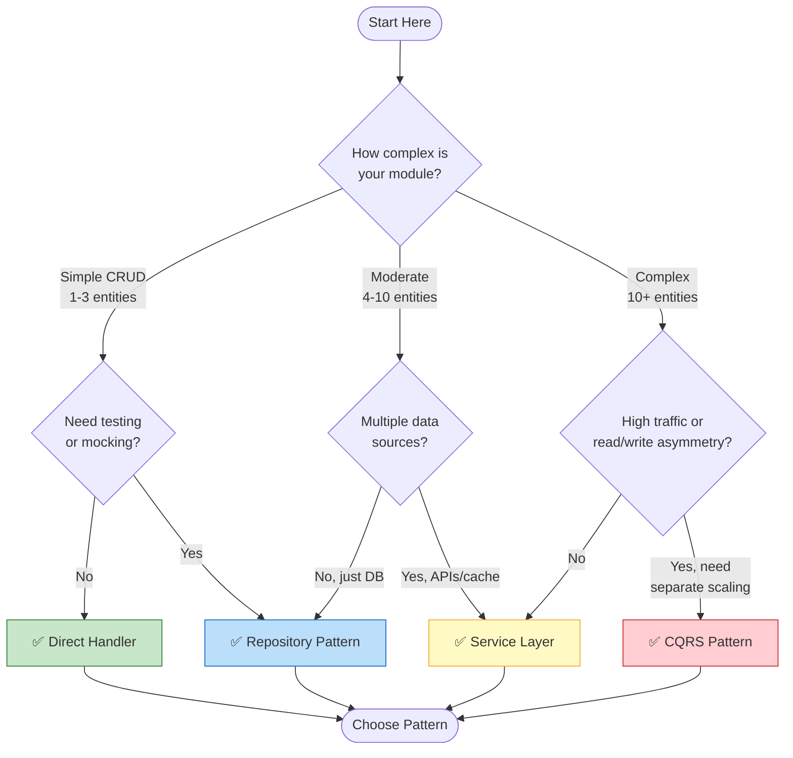
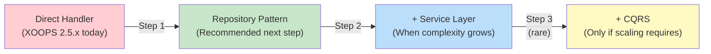

---
title：“选择数据访问模式”
description：“为XOOPS模区块选择正确数据访问模式的决策树”
---

<span class="version-badge version-25x">2.5.x ✅</span> <span class="version-badge version-40x">4.0.x ✅</span>

> **我应该使用哪种模式？** 此决策树可帮助您在直接处理程序、存储库模式、服务层和CQRS之间进行选择。

---

## 快速决策树



---

## 模式比较

|标准|直接处理程序 |存储库 |服务层 | CQRS|
|----------|----------------|------------|---------------|-----|
| **复杂性** | ⭐ | ⭐⭐ | ⭐⭐⭐ | ⭐⭐⭐⭐⭐ |
| **可测试性** | ❌ 硬 | ✅ 好 | ✅ 太棒了 | ✅ 太棒了 |
| **灵活性** | ❌低| ✅ 中等 | ✅ 高 | ✅ 非常高 |
| **XOOPS2.5.x** | ✅ 本地人 | ✅ 作品 | ✅ 作品 | ⚠️ 复杂 |
| **XOOPS4.0** | ⚠️ 已弃用 | ✅ 推荐 | ✅ 推荐 | ✅ 用于规模 |
| **团队规模** | 1 开发人员 | 1-3 名开发人员 | 2-5 名开发人员 | 5+ 开发人员 |
| **维护** | ❌更高 | ✅ 中等 | ✅ 降低| ⚠️需要专业知识|

---

## 何时使用每种模式

### ✅ 直接处理程序 (`XOOPSPersistableObjectHandler`)

**最适合：** 简单模区块、快速原型、学习XOOPS

```php
// Simple and direct - good for small modules
$handler = xoops_getModuleHandler('article', 'news');
$articles = $handler->getObjects(new Criteria('status', 1));
```

**在以下情况下选择此选项：**
- 使用 1-3 个数据库表构建一个简单模区块
- 创建快速原型
- 你是唯一的开发人员，不需要测试
- 模区块不会显着增长

**限制：**
- 难以进行单元测试（全局依赖）
- 与XOOPS数据库层紧密耦合
- 业务逻辑往往会泄漏到控制器中

---

### ✅ 存储库模式

**最适合：** 大多数模区块、需要可测试性的团队

```php
// Abstraction allows mocking for tests
interface ArticleRepositoryInterface {
    public function findPublished(): array;
    public function save(Article $article): void;
}

class XoopsArticleRepository implements ArticleRepositoryInterface {
    private $handler;

    public function __construct() {
        $this->handler = xoops_getModuleHandler('article', 'news');
    }

    public function findPublished(): array {
        return $this->handler->getObjects(new Criteria('status', 1));
    }
}
```

**在以下情况下选择此选项：**
- 你想编写单元测试
- 您稍后可能会更改数据源（DB → API）
- 与 2+ 开发人员合作
- 构建分发模区块

**升级路径：** 这是 XOOPS 4.0 准备的推荐模式。

---

### ✅ 服务层

**最适合：** 具有复杂业务逻辑的模区块

```php
// Service coordinates multiple repositories and contains business rules
class ArticlePublicationService {
    public function __construct(
        private ArticleRepositoryInterface $articles,
        private NotificationServiceInterface $notifications,
        private CacheInterface $cache
    ) {}

    public function publish(int $articleId): void {
        $article = $this->articles->find($articleId);
        $article->setStatus('published');
        $article->setPublishedAt(new DateTime());

        $this->articles->save($article);
        $this->notifications->notifySubscribers($article);
        $this->cache->invalidate("article:{$articleId}");
    }
}
```

**在以下情况下选择此选项：**
- 操作跨越多个数据源
- 业务规则复杂
- 你需要交易管理
- 应用程序的多个部分执行相同的操作

**升级路径：** 与存储库结合以获得强大的架构。

---

### ⚠️ CQRS（命令查询职责分离）

**最适合：** 具有 read/write 不对称性的高-scale 模区块

```php
// Commands modify state
class PublishArticleCommand {
    public function __construct(
        public readonly int $articleId,
        public readonly int $publisherId
    ) {}
}

// Queries read state (can use denormalized read models)
class GetPublishedArticlesQuery {
    public function __construct(
        public readonly int $limit = 10
    ) {}
}
```

**在以下情况下选择此选项：**
- 读取次数远远多于写入次数（100:1 或更多）
- 读取与写入需要不同的缩放
- 复杂的reporting/analytics要求
- 事件溯源将使您的领域受益

**警告：** CQRS 显着增加了复杂性。大多数XOOPS模区块不需要它。

---

## 推荐的升级路径



### 第 1 步：将处理程序包装到存储库中（2-4 小时）

1. 创建满足您的数据访问需求的接口
2.使用现有的handler来实现
3. 注入存储库而不是直接调用`XOOPS_getModuleHandler()`

### 步骤 2：根据需要添加服务层（1-2 天）

1.当业务逻辑出现在控制器中时，提取到一个Service
2.服务使用存储库，而不是直接使用处理程序
3.控制器变薄（路由→服务→响应）

### 步骤 3：仅当（罕见）时才考虑 CQRS

1.每天有数百万次阅读
2. 读写模型明显不同
3.您需要事件溯源来进行审计跟踪
4. 您拥有一支在CQRS方面经验丰富的团队

---

## 快速参考卡

|问题 |回答 |
|----------|--------|
| **“我只需要save/load数据”** |直接处理程序 |
| **“我想编写测试”** |存储库模式|
| **“我有复杂的业务规则”** |服务层 |
| **“我需要单独缩放读取”** | CQRS |
| **“我正在准备 XOOPS 4.0”** |存储库+服务层|

---

## 相关文档

- [Repository Pattern Guide](Patterns/Repository-Pattern.md)
- [Service Layer Pattern Guide](Patterns/Service-Layer-Pattern.md)
- [CQRS Pattern Guide](../07-XOOPS-4.0/Implementation-Guides/CQRS-Pattern-Guide.md) *（高级）*
- [Hybrid Mode Contract](../07-XOOPS-4.0/Specifications/Hybrid-Mode-Contract.md)

---#模式#数据-access #决策-tree #最佳-practices #XOOPS