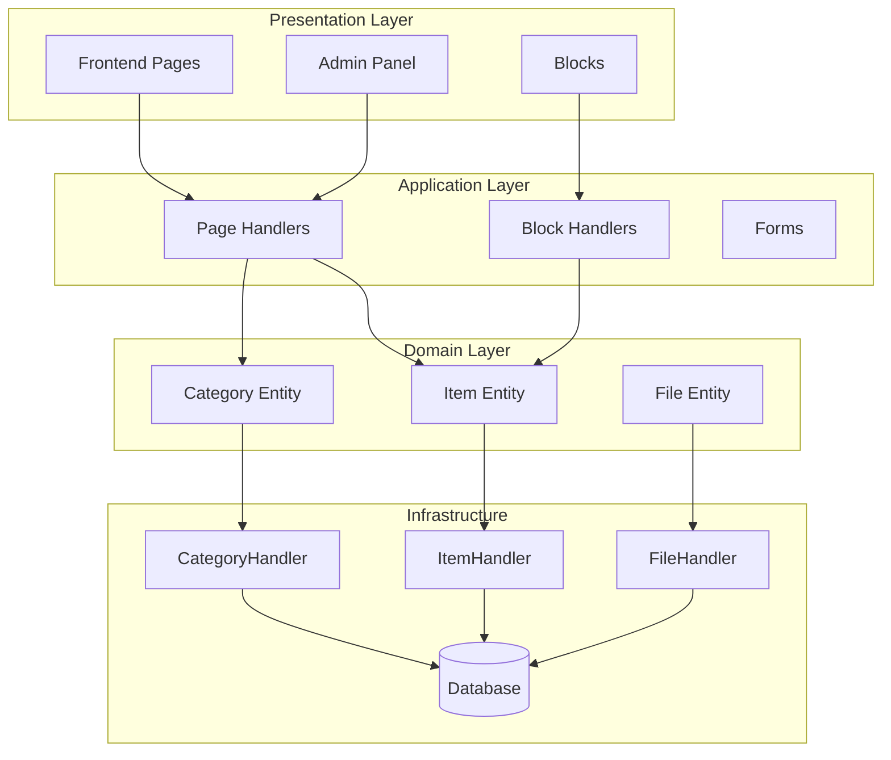
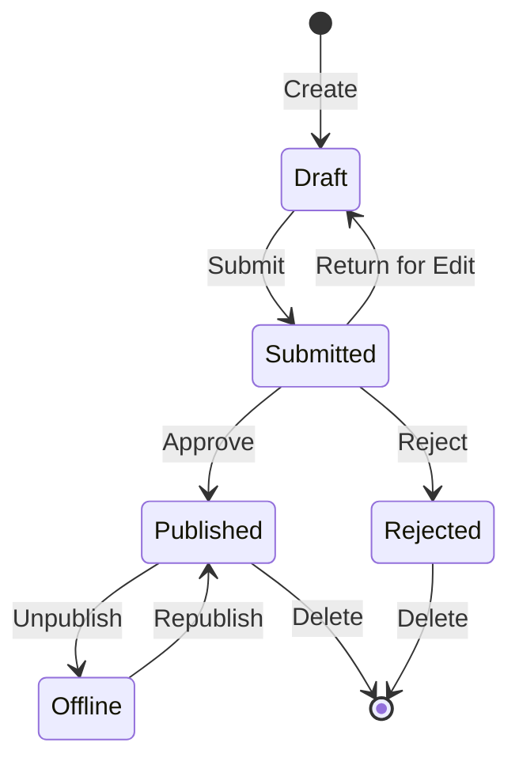

## 概述

本文档提供了 Publisher 模区块架构、模式和实现细节的技术分析。将此作为参考来了解生产-qualityXOOPS模区块的结构。

## 架构概述



## 目录结构

```
publisher/
├── admin/
│   ├── index.php           # Admin dashboard
│   ├── item.php            # Article management
│   ├── category.php        # Category management
│   ├── permission.php      # Permissions
│   ├── file.php            # File manager
│   └── menu.php            # Admin menu
├── assets/
│   ├── css/
│   ├── js/
│   └── images/
├── class/
│   ├── Category.php        # Category entity
│   ├── CategoryHandler.php # Category data access
│   ├── Item.php            # Article entity
│   ├── ItemHandler.php     # Article data access
│   ├── File.php            # File attachment
│   ├── FileHandler.php     # File data access
│   ├── Form/               # Form classes
│   ├── Common/             # Utilities
│   └── Helper.php          # Module helper
├── include/
│   ├── common.php          # Initialization
│   ├── functions.php       # Utility functions
│   ├── oninstall.php       # Install hooks
│   ├── onupdate.php        # Update hooks
│   └── search.php          # Search integration
├── language/
├── templates/
├── sql/
└── xoops_version.php
```

## 实体分析

### 项目（文章）实体

```php
class Item extends \XoopsObject
{
    // Fields
    public function initVar(): void
    {
        $this->initVar('itemid', XOBJ_DTYPE_INT, null, false);
        $this->initVar('categoryid', XOBJ_DTYPE_INT, 0, false);
        $this->initVar('title', XOBJ_DTYPE_TXTBOX, '', true);
        $this->initVar('subtitle', XOBJ_DTYPE_TXTBOX, '');
        $this->initVar('summary', XOBJ_DTYPE_TXTAREA, '');
        $this->initVar('body', XOBJ_DTYPE_TXTAREA, '', true);
        $this->initVar('uid', XOBJ_DTYPE_INT, 0);
        $this->initVar('status', XOBJ_DTYPE_INT, 0);
        $this->initVar('datesub', XOBJ_DTYPE_INT, time());
        // ... more fields
    }

    // Business methods
    public function isPublished(): bool
    {
        return $this->getVar('status') == _PUBLISHER_STATUS_PUBLISHED;
    }

    public function canEdit(int $userId): bool
    {
        return $this->getVar('uid') == $userId
            || $this->isAdmin($userId);
    }
}
```

### 处理程序模式

```php
class ItemHandler extends \XoopsPersistableObjectHandler
{
    public function __construct(\XoopsDatabase $db)
    {
        parent::__construct(
            $db,
            'publisher_items',
            Item::class,
            'itemid',
            'title'
        );
    }

    public function getPublishedItems(int $limit = 10): array
    {
        $criteria = new \CriteriaCompo();
        $criteria->add(new \Criteria('status', _PUBLISHER_STATUS_PUBLISHED));
        $criteria->setSort('datesub');
        $criteria->setOrder('DESC');
        $criteria->setLimit($limit);

        return $this->getObjects($criteria);
    }
}
```

## 权限系统

### 权限类型

|权限 |描述 |
|------------|-------------|
| `publisher_view` |查看category/articles |
| `publisher_submit` |提交新文章 |
| `publisher_approve` |自动-approve提交|
| `publisher_moderate` |审核未决文章 |
| `publisher_global` |全局模区块权限|

### 权限检查

```php
class PermissionHandler
{
    public function isGranted(string $permission, int $categoryId): bool
    {
        $userId = $GLOBALS['xoopsUser']?->uid() ?? 0;
        $groups = $this->getUserGroups($userId);

        return $this->grouppermHandler->checkRight(
            $permission,
            $categoryId,
            $groups,
            $this->helper->getModule()->mid()
        );
    }
}
```

## 工作流程状态



## 模板结构

### 前端模板

|模板|目的|
|----------|---------|
| `publisher_index.tpl` |模区块主页 |
| `publisher_item.tpl`|单篇 |
| `publisher_category.tpl` |类别列表 |
| `publisher_submit.tpl`|提交表格 |
| `publisher_search.tpl`|搜索结果 |

### 区块模板

|模板|目的|
|----------|---------|
| `publisher_block_latest.tpl` |最近的文章 |
| `publisher_block_spotlight.tpl` |专题文章 |
| `publisher_block_category.tpl` |类别菜单 |

## 使用的关键模式

1. **Handler Pattern** - 数据访问封装
2. **值对象** - 状态常量
3. **模板方法** - 表单生成
4. **策略** - 不同的显示模式
5. **观察者** - 事件通知

## 模区块开发经验教训

1. 使用 XOOPSPersistableObjectHandler 进行 CRUD
2. 实施细化权限
3. 将表示与逻辑分开
4. 使用 Criteria 进行查询
5.支持多种内容状态
6. 与XOOPS通知系统集成

## 相关文档

- 创建-Articles - 文章管理
- 管理-Categories - 类别系统
- 权限-Setup - 权限配置
- Developer-Guide/Hooks-and-Events - 扩展点