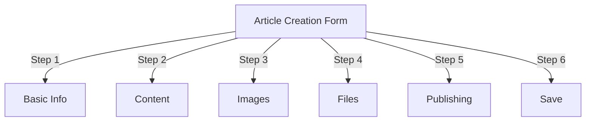
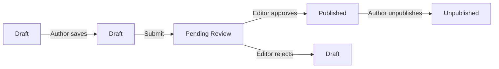
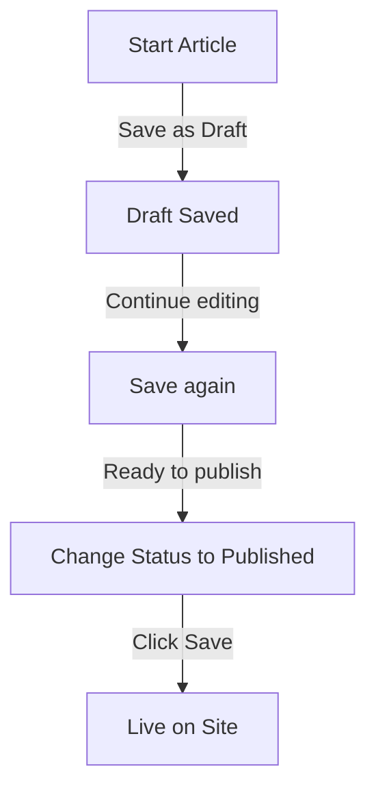

# 在 Publisher 中创建文章

> 步骤-by-step 在发布者模区块中创建、编辑、格式化和发布文章的指南。

---

## 访问文章管理

### 管理面板导航

```
Admin Panel
└── Modules
    └── Publisher
        └── Articles
            ├── Create New
            ├── Edit
            ├── Delete
            └── Publish
```

### 最快路径

1. 以**管理员**身份登录
2. 单击管理栏中的**模区块**
3. 找到**发布者**
4. 单击 **管理员** 链接
5. 单击左侧菜单中的**文章**
6. 单击“**添加文章**”按钮

---

## 文章创建表格

### 基本信息

创建新文章时，请填写以下部分：



---

## 步骤一：基本信息

### 必填字段

#### 文章标题

```
Field: Title
Type: Text input (required)
Max length: 255 characters
Example: "Top 5 Tips for Better Photography"
```

**指南：**
- 描述性和具体性
- 包含 SEO 的关键字
- 避免ALLCAPS
- 保持在 60 个字符以下以获得最佳显示效果

#### 选择类别

```
Field: Category
Type: Dropdown (required)
Options: List of created categories
Example: Photography > Tutorials
```

**提示：**
- 可用的父类别和子类别
- 选择最相关的类别
- 每篇文章只有一个类别
- 可以稍后更改

#### 文章副标题（可选）

```
Field: Subtitle
Type: Text input (optional)
Max length: 255 characters
Example: "Learn photography fundamentals in 5 easy steps"
```

**用于：**
- 摘要标题
- 预告片文字
- 扩展标题

### 文章描述

#### 简短描述

```
Field: Short Description
Type: Textarea (optional)
Max length: 500 characters
```

**目的：**
- 文章预览文本
- 显示在类别列表中
- 用于搜索结果
- SEO的元描述

**示例：**
```
"Discover essential photography techniques that will transform your photos
from ordinary to extraordinary. This comprehensive guide covers composition,
lighting, and exposure settings."
```

#### 完整内容

```
Field: Article Body
Type: WYSIWYG Editor (required)
Max length: Unlimited
Format: HTML
```

主要文章内容区具有富文本编辑功能。

---

## 步骤 2：格式化内容

### 使用WYSIWYG编辑器

#### 文本格式

```
Bold:           Ctrl+B or click [B] button
Italic:         Ctrl+I or click [I] button
Underline:      Ctrl+U or click [U] button
Strikethrough:  Alt+Shift+D or click [S] button
Subscript:      Ctrl+, (comma)
Superscript:    Ctrl+. (period)
```

#### 标题结构

创建正确的文档层次结构：

```html
<h1>Article Title</h1>      <!-- Use once at top -->
<h2>Main Section</h2>        <!-- For major sections -->
<h3>Subsection</h3>          <!-- For subtopics -->
<h4>Sub-subsection</h4>      <!-- For details -->
```

**在编辑器中：**
- 单击 **格式** 下拉菜单
- 选择标题级别 (H1-H6)
- 输入您的标题

#### 列表

**无序列表（项目符号）：**

```markdown
• Point one
• Point two
• Point three
```

编辑器中的步骤：
1. 点击【≡】项目符号列表按钮
2. 键入每个点
3. 按 Enter 进入下一项
4. 按两次退格键结束列表

**有序列表（编号）：**

```markdown
1. First step
2. Second step
3. Third step
```

编辑器中的步骤：
1. 单击[1.]编号列表按钮
2. 键入每个项目
3. 按 Enter 进入下一步
4. 按两次退格键结束

**嵌套列表：**

```markdown
1. Main point
   a. Sub-point
   b. Sub-point
2. Next point
```

步骤：
1. 创建第一个列表
2. 按 Tab 键缩进
3. 创建嵌套项目
4. 按 Shift+Tab 减少缩进

#### 链接

**添加超链接：**

1. 选择要链接的文本
2. 单击 **[🔗] 链接** 按钮
3. 输入URL：`https://example.com`
4. 可选：添加title/target
5. 单击“**插入链接**”

**删除链接：**

1. 在链接文本内单击
2. 单击 **[🔗] 删除链接** 按钮

#### 代码和报价

**区块引用：**

```
"This is an important quote from an expert"
- Attribution
```

步骤：
1. 输入引用文本
2. 单击**[❝]区块引用**按钮
3. 文本缩进并设置样式

**代码区块：**

```python
def hello_world():
    print("Hello, World!")
```

步骤：
1. 点击**格式→代码**
2.粘贴代码
3. 选择语言（可选）
4. 代码显示语法高亮

---

## 步骤 3：添加图像

### 特色图片（英雄图片）

```
Field: Featured Image / Main Image
Type: Image upload
Format: JPG, PNG, GIF, WebP
Max size: 5 MB
Recommended: 600x400 px
```

**上传：**

1. 点击**上传图片**按钮
2.从电脑中选择图像
3. Crop/resize（如果需要）
4. 单击“**使用此图像**”

**图像放置：**
- 显示在文章顶部
- 用于类别列表
- 显示在档案中
- 用于社交分享

### 内嵌图像

在文章文本中插入图像：

1. 将光标置于编辑器中图像应放置的位置
2. 单击工具栏中的 **[🖼️] 图片** 按钮
3. 选择上传选项：
   - 上传新图片
   - 从图库中选择
   - 输入图片URL
4. 配置：
 
  ```
   Image Size:
   - Width: 300-600 px
   - Height: Auto (maintains ratio)
   - Alignment: Left/Center/Right
 
  ```
5. 单击“**插入图像**”

**将文本环绕图像：**

插入后在编辑器中：

```html
<!-- Image floats left, text wraps around -->

```

### 图片库

创建多-image画廊：

1. 单击 **图库** 按钮（如果有）
2. 上传多张图片：
   - 单击：添加一个
   - 拖放：添加多个
3. 拖动排列顺序
4.为每个图像设置标题
5. 单击**创建图库**

---

## 步骤 4：附加文件

### 添加文件附件

```
Field: File Attachments
Type: File upload (multiple allowed)
Supported: PDF, DOC, XLS, ZIP, etc.
Max per file: 10 MB
Max per article: 5 files
```

**附上：**1. 单击“**添加文件**”按钮
2.从电脑中选择文件
3. 可选：添加文件描述
4. 单击“**附加文件**”
5. 对多个文件重复此操作

**文件示例：**
- PDF指南
- Excel 电子表格
- Word文档
- ZIP档案
- 源代码

### 管理附加文件

**编辑文件：**

1. 单击文件名
2. 编辑说明
3. 单击**保存**

**删除文件：**

1.在列表中查找文件
2. 单击**[×]删除**图标
3. 确认删除

---

## 步骤 5：发布和状态

### 文章状态

```
Field: Status
Type: Dropdown
Options:
  - Draft: Not published, only author sees
  - Pending: Waiting for approval
  - Published: Live on site
  - Archived: Old content
  - Unpublished: Was published, now hidden
```

**状态工作流程：**



### 发布选项

#### 立即发布

```
Status: Published
Start Date: Today (auto-filled)
End Date: (leave blank for no expiration)
```

#### 稍后安排

```
Status: Scheduled
Start Date: Future date/time
Example: February 15, 2024 at 9:00 AM
```

文章将在指定时间自动发布。

#### 设置过期时间

```
Enable Expiration: Yes
Expiration Date: Future date
Action: Archive/Hide/Delete
Example: April 1, 2024 (article auto-archives)
```

### 可见性选项

```yaml
Show Article:
  - Display on front page: Yes/No
  - Show in category: Yes/No
  - Include in search: Yes/No
  - Include in recent articles: Yes/No

Featured Article:
  - Mark as featured: Yes/No
  - Featured section position: (number)
```

---

## 步骤 6：SEO 和元数据

### SEO 设置

```
Field: SEO Settings (Expand section)
```

#### 元描述

```
Field: Meta Description
Type: Text (160 characters recommended)
Used by: Search engines, social media

Example:
"Learn photography fundamentals in 5 easy steps.
Discover composition, lighting, and exposure techniques."
```

#### 元关键字

```
Field: Meta Keywords
Type: Comma-separated list
Max: 5-10 keywords

Example: Photography, Tutorial, Composition, Lighting, Exposure
```

#### URL 蛞蝓

```
Field: URL Slug (auto-generated from title)
Type: Text
Format: lowercase, hyphens, no spaces

Auto: "top-5-tips-for-better-photography"
Edit: Change before publishing
```

#### 开放图标签

文章信息中的自动-generated：
- 标题
- 描述
- 特色图片
- 文章URL
- 出版日期

由 Facebook、LinkedIn、WhatsApp 等使用。

---

## 步骤7：评论与互动

### 评论设置

```yaml
Allow Comments:
  - Enable: Yes/No
  - Default: Inherit from preferences
  - Override: Specific to this article

Moderate Comments:
  - Require approval: Yes/No
  - Default: Inherit from preferences
```

### 评级设置

```yaml
Allow Ratings:
  - Enable: Yes/No
  - Scale: 5 stars (default)
  - Show average: Yes/No
  - Show count: Yes/No
```

---

## 步骤 8：高级选项

### 作者及署名

```
Field: Author
Type: Dropdown
Default: Current user
Options: All users with author permission

Display:
  - Show author name: Yes/No
  - Show author bio: Yes/No
  - Show author avatar: Yes/No
```

### 编辑锁

```
Field: Edit Lock
Purpose: Prevent accidental changes

Lock Article:
  - Locked: Yes/No
  - Lock reason: "Final version"
  - Unlock date: (optional)
```

### 修订历史

文章的汽车-saved版本：

```
View Revisions:
  - Click "Revision History"
  - Shows all saved versions
  - Compare versions
  - Restore previous version
```

---

## 保存和发布

### 保存工作流程



### 保存文章

**汽车-save:**
- 每 60 秒触发一次
- 自动保存为草稿
- 显示“上次保存：2 分钟前”

**手动保存：**
- 单击**保存并继续**继续编辑
- 单击**保存并查看**以查看已发布的版本
- 单击 **保存** 保存并关闭

### 发表文章

1.设置**状态**：已发布
2. 设置**开始日期**：现在（或未来日期）
3. 单击“**保存**”或“**发布**”
4. 出现确认信息
5. 文章已上线（或预定）

---

## 编辑现有文章

### 访问文章编辑器

1. 转到**管理→发布者→文章**
2.在列表中查找文章
3. 单击 **编辑** icon/button
4. 做出改变
5. 单击**保存**

### 批量编辑

一次编辑多篇文章：

```
1. Go to Articles list
2. Select articles (checkboxes)
3. Choose "Bulk Edit" from dropdown
4. Change selected field
5. Click "Update All"

Available for:
  - Status
  - Category
  - Featured (Yes/No)
  - Author
```

### 预览文章

发布前：

1. 单击**预览**按钮
2. 读者将看到的视图
3.检查格式
4. 测试链接
5.返回编辑器进行调整

---

## 文章管理

### 查看所有文章

**文章列表视图：**

```
Admin → Publisher → Articles

Columns:
  - Title
  - Category
  - Author
  - Status
  - Created date
  - Modified date
  - Actions (Edit, Delete, Preview)

Sorting:
  - By title (A-Z)
  - By date (newest/oldest)
  - By status (Published/Draft)
  - By category
```

### 过滤文章

```
Filter Options:
  - By category
  - By status
  - By author
  - By date range
  - Search by title

Example: Show all "Draft" articles by "John" in "News" category
```

### 删除文章

**软删除（推荐）：**

1.更改**状态**：未发布
2. 单击**保存**
3.文章隐藏但不删除
4. 可以稍后恢复

**硬删除：**

1. 在列表中选择文章
2. 单击**删除**按钮
3. 确认删除
4.文章永久删除

---

## 内容最佳实践

### 撰写高质量文章

```
Structure:
  ✓ Compelling title
  ✓ Clear subtitle/description
  ✓ Engaging opening paragraph
  ✓ Logical sections with headers
  ✓ Supporting visuals
  ✓ Conclusion/summary
  ✓ Call-to-action

Length:
  - Blog posts: 500-2000 words
  - News: 300-800 words
  - Guides: 2000-5000 words
  - Minimum: 300 words
```

### SEO 优化

```
Title Optimization:
  ✓ Include primary keyword
  ✓ Keep under 60 characters
  ✓ Put keyword near beginning
  ✓ Be descriptive and specific

Content Optimization:
  ✓ Use headings (H1, H2, H3)
  ✓ Include keyword in heading
  ✓ Use bold for important terms
  ✓ Add descriptive links
  ✓ Include images with alt text

Meta Description:
  ✓ Include primary keyword
  ✓ 155-160 characters
  ✓ Action-oriented
  ✓ Unique per article
```

### 格式化提示

```
Readability:
  ✓ Short paragraphs (2-4 sentences)
  ✓ Bullet points for lists
  ✓ Subheadings every 300 words
  ✓ Generous whitespace
  ✓ Line breaks between sections

Visual Appeal:
  ✓ Featured image at top
  ✓ Inline images in content
  ✓ Alt text on all images
  ✓ Code blocks for technical
  ✓ Blockquotes for emphasis
```

---

## 键盘快捷键

### 编辑器快捷键

```
Bold:               Ctrl+B
Italic:             Ctrl+I
Underline:          Ctrl+U
Link:               Ctrl+K
Save Draft:         Ctrl+S
```

### 文本快捷方式

```
-- →  (dash to em dash)
... → … (three dots to ellipsis)
(c) → © (copyright)
(r) → ® (registered)
(tm) → ™ (trademark)
```

---

## 常见任务

### 复制文章

1.打开文章
2. 单击“**复制**”或“**克隆**”按钮
3. 文章复制为草稿
4. 编辑标题和内容
5. 发布

### 日程文章

1. 创建文章
2. 设置**开始日期**：未来date/time
3.设置**状态**：已发布
4. 单击“**保存**”
5.文章自动发布

### 批量发布

1. 创建文章草稿
2. 设置发布日期
3. 文章在预定时间自动-publish
4. 从“预定”视图进行监控

### 在类别之间移动

1.编辑文章
2.更改**类别**下拉列表
3. 单击**保存**
4.文章出现在新类别中

---

## 故障排除

### 问题：无法保存文章

**解决方案：**
```
1. Check form for required fields
2. Verify category is selected
3. Check PHP memory limit
4. Try saving as draft first
5. Clear browser cache
```

### 问题：图像不显示

**解决方案：**
```
1. Verify image upload succeeded
2. Check image file format (JPG, PNG)
3. Verify image path in database
4. Check upload directory permissions
5. Try re-uploading image
```

### 问题：编辑器工具栏未显示

**解决方案：**
```
1. Clear browser cache
2. Try different browser
3. Disable browser extensions
4. Check JavaScript console for errors
5. Verify editor plugin installed
```

### 问题：文章未发布

**解决方案：**
```
1. Verify Status = "Published"
2. Check Start Date is today or earlier
3. Verify permissions allow publishing
4. Check category is published
5. Clear module cache
```

---## 相关指南

- 配置指南
- 品类管理
- 权限设置
- 自定义模板

---

## 后续步骤

- 创建您的第一篇文章
- 设置类别
- 配置权限
- 审核模板定制

---

#publisher #articles #content #creation #formatting #editing #XOOPS