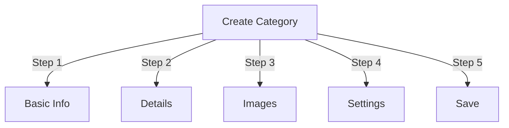

# 在 Publisher 中管理类别

> 在发布者模区块中创建、组织层次结构和管理类别的完整指南。

---

## 类别基础知识

### 什么是类别？

类别将文章组织成逻辑组：

```
Example Structure:

  News (Main Category)
    ├── Technology
    ├── Sports
    └── Entertainment

  Tutorials (Main Category)
    ├── Photography
    │   ├── Basics
    │   └── Advanced
    └── Writing
        └── Blogging
```

### 良好品类结构的好处

```
✓ Better user navigation
✓ Organized content
✓ Improved SEO
✓ Easier content management
✓ Better editorial workflow
```

---

## 访问类别管理

### 管理面板导航

```
Admin Panel
└── Modules
    └── Publisher
        └── Categories
            ├── Create New
            ├── Edit
            ├── Delete
            ├── Permissions
            └── Organize
```

### 快速访问

1. 以**管理员**身份登录
2. 转到**管理→模区块**
3. 单击**发布者 → 管理**
4. 单击左侧菜单中的**类别**

---

## 创建类别

### 类别创建表



### 第 1 步：基本信息

#### 类别名称

```
Field: Category Name
Type: Text input (required)
Max length: 100 characters
Uniqueness: Should be unique
Example: "Photography"
```

**指南：**
- 描述性和单数或复数一致
- 正确大写
- 避免特殊字符
- 保持合理的长度

#### 类别说明

```
Field: Description
Type: Textarea (optional)
Max length: 500 characters
Used in: Category listing pages, category blocks
```

**目的：**
- 解释类别内容
- 出现在类别文章上方
- 帮助用户了解范围
- 用于SEO元描述

**示例：**
```
"Photography tips, tutorials, and inspiration for
all skill levels. From composition basics to advanced
lighting techniques, master your craft."
```

### 第 2 步：父类别

#### 创建层次结构

```
Field: Parent Category
Type: Dropdown
Options: None (root), or existing categories
```

**层次结构示例：**

```
Flat Structure:
  News
  Tutorials
  Reviews

Nested Structure:
  News
    Technology
    Business
    Sports
  Tutorials
    Photography
      Basics
      Advanced
    Writing
```

**创建子类别：**

1. 单击 **父类别** 下拉列表
2. 选择父项（例如“新闻”）
3.填写类别名称
4. 保存
5. 新类别显示为子类别

### 第 3 步：分类图片

#### 上传类别图片

```
Field: Category Image
Type: Image upload (optional)
Format: JPG, PNG, GIF, WebP
Max size: 5 MB
Recommended: 300x200 px (or your theme size)
```

**上传：**

1. 点击**上传图片**按钮
2.从电脑中选择图像
3. Crop/resize（如果需要）
4. 单击“**使用此图像**”

**使用地点：**
- 类别列表页面
- 类别区块标题
- 面包屑（某些主题）
- 社交媒体分享

### 步骤 4：类别设置

#### 显示设置

```yaml
Status:
  - Enabled: Yes/No
  - Hidden: Yes/No (hidden from menus, still accessible)

Display Options:
  - Show description: Yes/No
  - Show image: Yes/No
  - Show article count: Yes/No
  - Show subcategories: Yes/No

Layout:
  - Items per page: 10-50
  - Display order: Date/Title/Author
  - Display direction: Ascending/Descending
```

#### 类别权限

```yaml
Who Can View:
  - Anonymous: Yes/No
  - Registered: Yes/No
  - Specific groups: Configure per group

Who Can Submit:
  - Registered: Yes/No
  - Specific groups: Configure per group
  - Author must have: "submit articles" permission
```

### 步骤 5：SEO 设置

#### 元标签

```
Field: Meta Description
Type: Text (160 characters)
Purpose: Search engine description

Field: Meta Keywords
Type: Comma-separated list
Example: photography, tutorials, tips, techniques
```

#### URL 配置

```
Field: URL Slug
Type: Text
Auto-generated from category name
Example: "photography" from "Photography"
Can be customized before saving
```

### 保存类别

1. 填写所有必填字段：
   - 类别名称 ✓
   - 描述（推荐）
2. 可选：上传图片，设置SEO
3. 单击**保存类别**
4. 出现确认信息
5. 类别现已可用

---

## 类别层次结构

### 创建嵌套结构

```
Step-by-step example: Create News → Technology subcategory

1. Go to Categories admin
2. Click "Add Category"
3. Name: "News"
4. Parent: (leave blank - this is root)
5. Save
6. Click "Add Category" again
7. Name: "Technology"
8. Parent: "News" (select from dropdown)
9. Save
```

### 查看层次结构树

```
Categories view shows tree structure:

📁 News
  📄 Technology
  📄 Sports
  📄 Entertainment
📁 Tutorials
  📄 Photography
    📄 Basics
    📄 Advanced
  📄 Writing
```

单击展开箭头至 show/hide 子类别。

### 重新组织类别

#### 移动类别

1. 进入分类列表
2. 单击类别上的“**编辑**”
3. 更改**父类别**
4. 单击“**保存**”
5.类别移至新位置

#### 重新排序类别

如果可用，请使用拖动-and-drop：

1. 进入分类列表
2. 单击并拖动类别
3. 下降到新位置
4.订单自动保存

#### 删除类别

**选项 1：软删除（隐藏）**

1. 编辑类别
2. 设置**状态**：禁用
3. 单击**保存**
4.类别隐藏但未删除

**选项 2：硬删除**

1. 进入分类列表
2. 单击类别上的**删除**
3. 选择文章的操作：
 
  ```
   ☐ Move articles to parent category
   ☐ Move articles to root (News)
   ☐ Delete all articles in category
 
  ```
4. 确认删除

---

## 类别操作

### 编辑类别

1. 转到 **管理 → 发布者 → 类别**
2. 单击类别上的“**编辑**”
3.修改字段：
   - 姓名
   - 描述
   - 家长类别
   - 图片
   - 设置
4. 单击“**保存**”

### 编辑类别权限

1. 前往类别
2. 单击类别上的**权限**（或单击类别然后单击权限）
3. 配置组：

```
For each group:
  ☐ View articles in this category
  ☐ Submit articles to this category
  ☐ Edit own articles
  ☐ Edit all articles
  ☐ Approve/Moderate articles
  ☐ Manage category
```

4. 单击**保存权限**

### 设置类别图片

**上传新图片：**

1. 编辑类别
2. 单击“**更改图像**”
3.上传或选择图片
4.Crop/resize
5. 单击“**使用图像**”
6. 单击**保存类别**

**删除图像：**

1. 编辑类别
2. 单击“**删除图像**”（如果有）
3. 单击**保存类别**

---

## 类别权限

### 权限矩阵

```
                 Anonymous  Registered  Editor  Admin
View category        ✓         ✓         ✓       ✓
Submit article       ✗         ✓         ✓       ✓
Edit own article     ✗         ✓         ✓       ✓
Edit all articles    ✗         ✗         ✓       ✓
Moderate articles    ✗         ✗         ✓       ✓
Manage category      ✗         ✗         ✗       ✓
```

### 设置类别-Level权限

#### 每-Category访问控制1. 转到**类别**列表
2. 选择类别
3. 单击**权限**
4. 对于每个组，选择权限：

```
Example: News category
  Anonymous:   View only
  Registered:  Submit articles
  Editors:     Approve articles
  Admins:      Full control
```

5. 单击**保存**

#### 字段-Level 权限

控制用户可以see/edit的表单字段：

```
Example: Limit field visibility for Registered users

Registered users can see/edit:
  ✓ Title
  ✓ Description
  ✓ Content
  ✗ Author (auto-set to current user)
  ✗ Scheduled date (only editors)
  ✗ Featured (only admins)
```

**配置于：**
- 类别权限
- 查找“现场可见性”部分

---

## 类别的最佳实践

### 类别结构

```
✓ Keep hierarchy 2-3 levels deep
✗ Don't create too many top-level categories
✗ Don't create categories with one article

✓ Use consistent naming (plural or singular)
✗ Don't use vague names ("Stuff", "Other")

✓ Create categories for articles that exist
✗ Don't create empty categories in advance
```

### 命名指南

```
Good names:
  "Photography"
  "Web Development"
  "Travel Tips"
  "Business News"

Avoid:
  "Articles" (too vague)
  "Content" (redundant)
  "News&Updates" (inconsistent)
  "PHOTOGRAPHY STUFF" (formatting)
```

### 组织技巧

```
By Topic:
  News
    Technology
    Sports
    Entertainment

By Type:
  Tutorials
    Video
    Text
    Interactive

By Audience:
  For Beginners
  For Experts
  Case Studies

Geographic:
  North America
    United States
    Canada
  Europe
```

---

## 类别区块

### 发布者类别区块

在您的网站上显示类别列表：

1. 进入**管理→区区块**
2. 查找**发布者 - 类别**
3. 单击“**编辑**”
4. 配置：

```
Block Title: "News Categories"
Show subcategories: Yes/No
Show article count: Yes/No
Height: (pixels or auto)
```

5. 单击**保存**

### 类别文章区块

显示特定类别的最新文章：

1. 进入**管理→区区块**
2. 查找**发布者 - 类别文章**
3. 单击“**编辑**”
4. 选择：

```
Category: News (or specific category)
Number of articles: 5
Show images: Yes/No
Show description: Yes/No
```

5. 单击**保存**

---

## 品类分析

### 查看类别统计数据

来自类别管理员：

```
Each category shows:
  - Total articles: 45
  - Published: 42
  - Draft: 2
  - Pending approval: 1
  - Total views: 5,234
  - Latest article: 2 hours ago
```

### 查看类别流量

如果启用分析：

1.点击类别名称
2. 单击“**统计**”选项卡
3.查看：
   - 页面浏览量
   - 热门文章
   - 流量趋势
   - 使用的搜索词

---

## 类别模板

### 自定义类别显示

如果使用自定义模板，每个类别都可以覆盖：

```
publisher_category.tpl
  ├── Category header
  ├── Category description
  ├── Category image
  ├── Article listing
  └── Pagination
```

**定制：**

1.复制模板文件
2.修改HTML/CSS
3.在管理中分配类别
4.类别使用自定义模板

---

## 常见任务

### 创建新闻层次结构

```
Admin → Publisher → Categories
1. Create "News" (parent)
2. Create "Technology" (parent: News)
3. Create "Sports" (parent: News)
4. Create "Entertainment" (parent: News)
```

### 在类别之间移动文章

1. 进入**文章**管理
2. 选择文章（复选框）
3. 从批量操作下拉列表中选择**“更改类别”**
4. 选择新类别
5. 单击**全部更新**

### 隐藏类别而不删除

1. 编辑类别
2. 设置**状态**：Disabled/Hidden
3. 保存
4. 菜单中未显示类别（仍可通过URL访问）

### 为草稿创建类别

```
Best Practice:

Create "In Review" category
  ├── Purpose: Articles awaiting approval
  ├── Permissions: Hidden from public
  ├── Only admins/editors can see
  ├── Move articles here until approved
  └── Move to "News" when published
```

---

## Import/Export 类别

### 导出类别

如果可用：

1. 转到**类别**管理
2. 单击**导出**
3. 选择格式：CSV/JSON/XML
4.下载文件
5. 备份已保存

### 导入类别

如果可用：

1. 准备类别文件
2. 转到**类别**管理
3. 单击**导入**
4.上传文件
5. 选择更新策略：
   - 仅创建新的
   - 更新现有的
   - 全部替换
6. 单击“**导入**”

---

## 疑难解答类别

### 问题：子类别未显示

**解决方案：**
```
1. Verify parent category status is "Enabled"
2. Check permissions allow viewing
3. Verify subcategories have status "Enabled"
4. Clear cache: Admin → Tools → Clear Cache
5. Check theme shows subcategories
```

### 问题：无法删除类别

**解决方案：**
```
1. Category must have no articles
2. Move or delete articles first:
   Admin → Articles
   Select articles in category
   Change category to another
3. Then delete empty category
4. Or choose "move articles" option when deleting
```

### 问题：类别图像未显示

**解决方案：**
```
1. Verify image uploaded successfully
2. Check image file format (JPG, PNG)
3. Verify upload directory permissions
4. Check theme displays category images
5. Try re-uploading image
6. Clear browser cache
```

### 问题：权限未生效

**解决方案：**
```
1. Check group permissions in Category
2. Check global Publisher permissions
3. Check user belongs to configured group
4. Clear session cache
5. Log out and log back in
6. Check permission modules installed
```

---

## 类别最佳实践清单

部署类别之前：

- [ ] 层次结构为 2-3 级深
- [ ] 每个类别有 5 篇以上文章
- [ ] 类别名称一致
- [ ] 权限合适
- [ ] 分类图片优化
- [ ] 描述完整
- [ ] SEO元数据已填写
- [ ] URL 友好
- [ ] 前面测试的类别-end
- [ ] 文档已更新

---

## 相关指南

- 文章创作
- 权限管理
- 模区块配置
- 安装指南

---

## 后续步骤

- 在类别中创建文章
- 配置权限
- 使用自定义模板进行自定义

---

#publisher #categories #organization #hierarchy #management #XOOPS