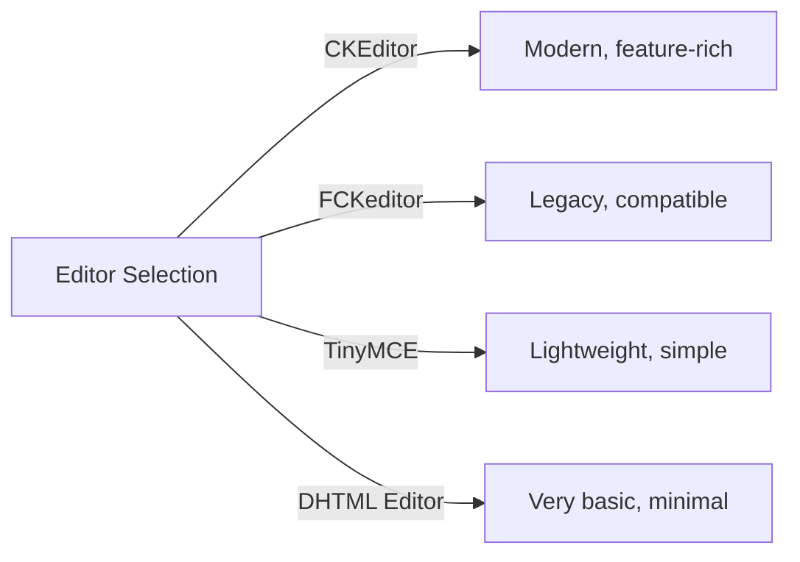
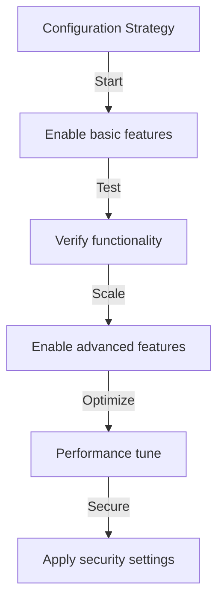

---
title：“发布者 - 基本配置”
description：“发布者模区块设置和首选项配置指南”
---

# 发布者基本配置

> 为您的 XOOPS 安装配置 Publisher 模区块设置、首选项和常规选项。

---

## 访问配置

### 管理面板导航

```
XOOPS Admin Panel
└── Modules
    └── Publisher
        ├── Preferences
        ├── Settings
        └── Configuration
```

1. 以**管理员**身份登录
2. 进入**管理面板→模区块**
3.找到**Publisher**模区块
4. 单击 **首选项** 或 **管理** 链接

---

## 常规设置

### 访问配置

```
Admin Panel → Modules → Publisher
```

单击 **齿轮图标** 或 **设置** 以获取以下选项：

#### 显示选项

|设置|选项|默认 |描述 |
|--------|---------|---------|------------|
| **每页项目** | 5-50 | 10 | 10列表中显示的文章 |
| **显示面包屑** | Yes/No|是的 |导航轨迹显示|
| **使用分页** | Yes/No |是的 |对长列表进行分页 |
| **显示日期** | Yes/No |是的 |显示文章日期 |
| **显示类别** | Yes/No |是的 |显示文章类别 |
| **显示作者** | Yes/No|是的 |显示文章作者 |
| **显示视图** | Yes/No |是的 |显示文章浏览次数 |

**配置示例：**

```yaml
Items Per Page: 15
Show Breadcrumb: Yes
Use Paging: Yes
Show Date: Yes
Show Category: Yes
Show Author: Yes
Show Views: Yes
```

#### 作者选项

|设置|默认 |描述 |
|---------|---------|-------------|
| **显示作者姓名** |是的 |显示真实姓名或用户名 |
| **使用用户名** |没有 |显示用户名而不是姓名 |
| **显示作者电子邮件** |没有 |显示作者联系电子邮件 |
| **显示作者头像** |是的 |显示用户头像 |

---

## 编辑器配置

### 选择WYSIWYG编辑器

Publisher 支持多个编辑器：

#### 可用的编辑器



### CKEditor（推荐）

**最适合：** 大多数用户、现代浏览器、完整功能

1. 转到**首选项**
2.设置**编辑器**：CKEditor
3. 配置选项：

```
Editor: CKEditor 4.x
Toolbar: Full
Height: 400px
Width: 100%
Remove plugins: []
Add plugins: [mathjax, codesnippet]
```

### FCK编辑器

**最适合：** 兼容性、旧系统

```
Editor: FCKeditor
Toolbar: Default
Custom config: (optional)
```

### 小MCE

**最适合：** 占用空间最小，基本编辑

```
Editor: TinyMCE
Plugins: [paste, table, link, image]
Toolbar: minimal
```

---

## 文件和上传设置

### 配置上传目录

```
Admin → Publisher → Preferences → Upload Settings
```

#### 文件类型设置

```yaml
Allowed File Types:
  Images:
    - jpg
    - jpeg
    - gif
    - png
    - webp
  Documents:
    - pdf
    - doc
    - docx
    - xls
    - xlsx
    - ppt
    - pptx
  Archives:
    - zip
    - rar
    - 7z
  Media:
    - mp3
    - mp4
    - webm
    - mov
```

#### 文件大小限制

|文件类型 |最大尺寸 |笔记|
|------------|----------|--------|
| **图像** | 5 MB |每个图像文件 |
| **文件** | 10 MB | PDF, Office 文件 |
| **媒体** | 50 MB | Video/audio 文件 |
| **所有文件** | 100 MB |每次上传总计 |

**配置：**

```
Max Image Upload Size: 5 MB
Max Document Upload Size: 10 MB
Max Media Upload Size: 50 MB
Total Upload Size: 100 MB
Max Files per Article: 5
```

### 调整图像大小

发布商自动-resizes图像以保持一致性：

```yaml
Thumbnail Size:
  Width: 150
  Height: 150
  Mode: Crop/Resize

Category Image Size:
  Width: 300
  Height: 200
  Mode: Resize

Article Featured Image:
  Width: 600
  Height: 400
  Mode: Resize
```

---

## 评论与互动设置

### 评论配置

```
Preferences → Comments Section
```

#### 评论选项

```yaml
Allow Comments:
  - Enabled: Yes/No
  - Default: Yes
  - Per-article override: Yes

Comment Moderation:
  - Moderate comments: Yes/No
  - Moderate guest comments only: Yes/No
  - Spam filter: Enabled
  - Max comments per day: (unlimited)

Comment Display:
  - Display format: Threaded/Flat
  - Comments per page: 10
  - Date format: Full date/Time ago
  - Show comment count: Yes/No
```

### 评级配置

```yaml
Allow Ratings:
  - Enabled: Yes/No
  - Default: Yes
  - Per-article override: Yes

Rating Options:
  - Rating scale: 5 stars (default)
  - Allow user to rate own: No
  - Show average rating: Yes
  - Show rating count: Yes
```

---

## SEO 和 URL 设置

### 搜索引擎优化

```
Preferences → SEO Settings
```

#### URL 配置

```yaml
SEO URLs:
  - Enabled: No (set to Yes for SEO URLs)
  - URL rewriting: None/Apache mod_rewrite/IIS rewrite

URL Format:
  - Category: /category/news
  - Article: /article/welcome-to-site
  - Archive: /archive/2024/01

Meta Description:
  - Auto-generate: Yes
  - Max length: 160 characters

Meta Keywords:
  - Auto-generate: Yes
  - From: Article tags, title
```

### 启用 SEO URL（高级）

**先决条件：**
- Apache 启用了`mod_rewrite`
- `.htaccess`支持已启用

**配置步骤：**

1. 转到 **首选项 → SEO 设置**
2. 设置**SEO URL**：是
3.设置**URL重写**：Apache mod_rewrite
4. 验证 Publisher 文件夹中是否存在 `.htaccess` 文件

**.htaccess 配置：**

```apache
<IfModule mod_rewrite.c>
    RewriteEngine On
    RewriteBase /modules/publisher/

    # Category rewrites
    RewriteRule ^category/([0-9]+)-(.*)\.html$ index.php?op=showcategory&categoryid=$1 [L,QSA]

    # Article rewrites
    RewriteRule ^article/([0-9]+)-(.*)\.html$ index.php?op=showitem&itemid=$1 [L,QSA]

    # Archive rewrites
    RewriteRule ^archive/([0-9]+)/([0-9]+)/$ index.php?op=archive&year=$1&month=$2 [L,QSA]
</IfModule>
```

---

## 缓存和性能

### 缓存配置

```
Preferences → Cache Settings
```

```yaml
Enable Caching:
  - Enabled: Yes
  - Cache type: File (or Memcache)

Cache Lifetime:
  - Category lists: 3600 seconds (1 hour)
  - Article lists: 1800 seconds (30 minutes)
  - Single article: 7200 seconds (2 hours)
  - Recent articles block: 900 seconds (15 minutes)

Cache Clear:
  - Manual clear: Available in admin
  - Auto-clear on article save: Yes
  - Clear on category change: Yes
```

### 清除缓存

**手动缓存清除：**

1. 转到**管理→发布者→工具**
2. 单击**清除缓存**
3. 选择要清除的缓存类型：
   - [ ] 类别缓存
   - [ ] 文章缓存
   - [ ] 区块缓存
   - [ ] 所有缓存
4. 单击**清除所选**

**命令行：**

```bash
# Clear all Publisher cache
php /path/to/xoops/admin/cache_manage.php publisher

# Or directly delete cache files
rm -rf /path/to/xoops/var/cache/publisher/*
```

---

## 通知和工作流程

### 电子邮件通知

```
Preferences → Notifications
```

```yaml
Notify Admin on New Article:
  - Enabled: Yes
  - Recipient: Admin email
  - Include summary: Yes

Notify Moderators:
  - Enabled: Yes
  - On new submission: Yes
  - On pending articles: Yes

Notify Author:
  - On approval: Yes
  - On rejection: Yes
  - On comment: No (optional)
```

### 提交工作流程

```yaml
Require Approval:
  - Enabled: Yes
  - Editor approval: Yes
  - Admin approval: No

Draft Save:
  - Auto-save interval: 60 seconds
  - Save local versions: Yes
  - Revision history: Last 5 versions
```

---

## 内容设置

### 发布默认值

```
Preferences → Content Settings
```

```yaml
Default Article Status:
  - Draft/Published: Draft
  - Featured by default: No
  - Auto-publish time: None

Default Visibility:
  - Public/Private: Public
  - Show on front page: Yes
  - Show in categories: Yes

Scheduled Publishing:
  - Enabled: Yes
  - Allow per-article: Yes

Content Expiration:
  - Enabled: No
  - Auto-archive old: No
  - Archive after days: (unlimited)
```

### WYSIWYG 内容选项

```yaml
Allow HTML:
  - In articles: Yes
  - In comments: No

Allow Embedded Media:
  - Videos (iframe): Yes
  - Images: Yes
  - Plugins: No

Content Filtering:
  - Strip tags: No
  - XSS filter: Yes (recommended)
```

---

## 搜索引擎设置

### 配置搜索集成

```
Preferences → Search Settings
```

```yaml
Enable Article Indexing:
  - Include in site search: Yes
  - Index type: Full text/Title only

Search Options:
  - Search in titles: Yes
  - Search in content: Yes
  - Search in comments: Yes

Meta Tags:
  - Auto generate: Yes
  - OG tags (social): Yes
  - Twitter cards: Yes
```

---

## 高级设置

### 调试模式（仅限开发）
```
Preferences → Advanced
```

```yaml
Debug Mode:
  - Enabled: No (only for development!)

Development Features:
  - Show SQL queries: No
  - Log errors: Yes
  - Error email: admin@example.com
```

### 数据库优化

```
Admin → Tools → Optimize Database
```

```bash
# Manual optimization
mysql> OPTIMIZE TABLE publisher_items;
mysql> OPTIMIZE TABLE publisher_categories;
mysql> OPTIMIZE TABLE publisher_comments;
```

---

## 模区块定制

### 主题模板

```
Preferences → Display → Templates
```

选择模板集：
- 默认
- 经典
- 现代
- 黑暗
- 定制

每个模板控制：
- 文章布局
- 类别列表
- 档案展示
- 评论显示

---

## 配置提示

### 最佳实践



1. **从简单开始** - 首先启用核心功能
2. **测试每个更改** - 在继续之前进行验证
3. **启用缓存** - 提高性能
4. **首先备份** - 在进行重大更改之前导出设置
5. **监控日志** - 定期检查错误日志

### 性能优化

```yaml
For Better Performance:
  - Enable caching: Yes
  - Cache lifetime: 3600 seconds
  - Limit items per page: 10-15
  - Compress images: Yes
  - Minify CSS/JS: Yes (if available)
```

### 安全强化

```yaml
For Better Security:
  - Moderate comments: Yes
  - Disable HTML in comments: Yes
  - XSS filtering: Yes
  - File type whitelist: Strict
  - Max upload size: Reasonable limit
```

---

## Export/Import 设置

### 备份配置

```
Admin → Tools → Export Settings
```

**备份当前配置：**

1. 单击**导出配置**
2. 保存下载的`.cfg`文件
3. 存放在安全的地方

**恢复：**

1. 单击**导入配置**
2. 选择`.cfg`文件
3. 单击“**恢复**”

---

## 相关配置指南

- 品类管理
- 文章创作
- 权限配置
- 安装指南

---

## 故障排除配置

### 设置无法保存

**解决方案：**
1.检查`/var/config/`的目录权限
2. 验证PHP写入权限
3. 检查 PHP 错误日志中的问题
4.清除浏览器缓存并重试

### 编辑器未出现

**解决方案：**
1.验证编辑器插件是否安装
2.检查XOOPS编辑器配置
3.尝试不同的编辑器选项
4. 检查浏览器控制台是否有 JavaScript 错误

### 性能问题

**解决方案：**
1.启用缓存
2. 减少每页的项目
3. 压缩图像
4.检查数据库优化
5.查看慢查询日志

---

## 后续步骤

- 配置组权限
- 创建您的第一篇文章
- 设置类别
- 查看自定义模板

---

#publisher #configuration #preferences #settings #XOOPS