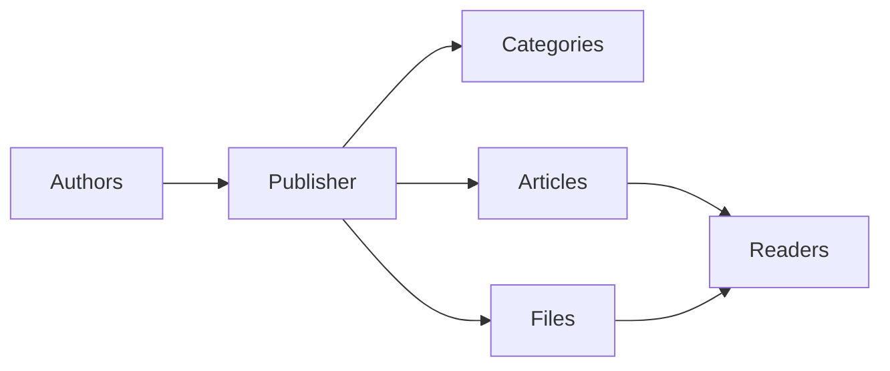
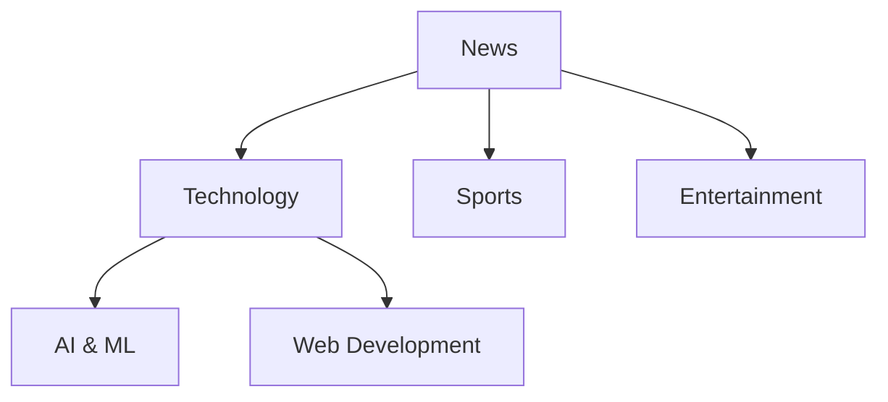
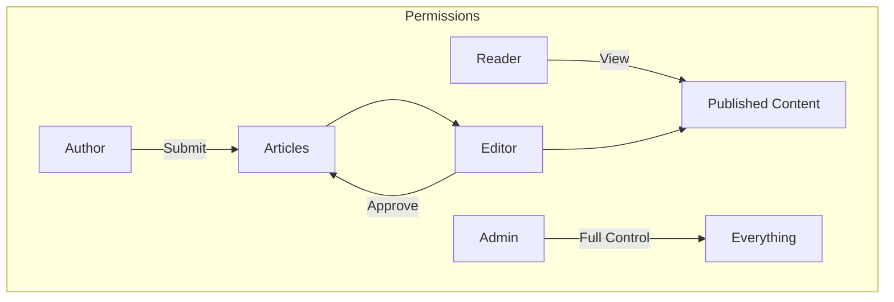
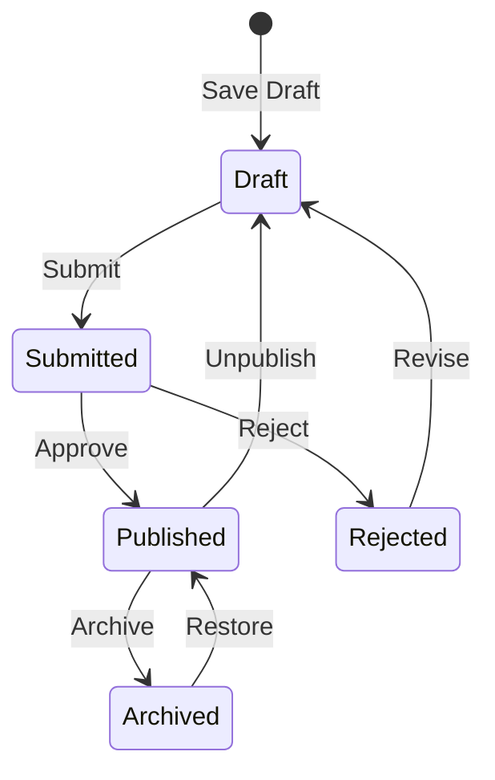

---
title：“发布者 - 入门”
description：“XOOPS发布者模区块快速入门指南”
---

# 发布者入门

> 设置和使用 Publisher news/blog 模区块的步骤-by-step 指南。

---

## 什么是发布者？

Publisher 是 XOOPS 的首要内容管理模区块，设计用于：

- **新闻网站** - 发布类别文章
- **博客** - 个人或多人-author博客``
- **文档** - 有组织的知识库
- **内容门户** - 混合媒体内容



---

## 快速设置

### 第 1 步：安装 Publisher

1.从[GitHub](https://github.com/XOOPSModules25x/publisher)下载
2.上传至`modules/publisher/`
3. 转到管理→模区块→安装

### 第 2 步：创建类别



1. 管理 → 发布者 → 类别
2. 点击“添加类别”
3、填写：
   - **名称**：类别名称
   - **描述**：该类别包含什么
   - **图像**：可选类别图像
4. 设置权限（谁可以submit/view）
5. 保存

### 步骤 3：配置设置

1. 管理 → 发布者 → 首选项
2. 配置关键设置：

|设置|推荐|描述 |
|---------|-------------|----------|
|每页项目 | 10-20 | 10-20索引文章 |
|编辑| TinyMCE/CKEditor |富文本编辑器 |
|允许评分 |是的 |读者反馈|
|允许评论 |是的 |讨论 |
|汽车-approve |没有 |编辑控制|

### 第 4 步：创建您的第一篇文章

1. 主菜单→发布者→提交文章
2. 填写表格：
   - **标题**：文章标题
   - **类别**：它所属的地方
   - **摘要**：简短描述
   - **正文**：完整的文章内容
3. 添加可选元素：
   - 特色图片
   - 文件附件
   - SEO设置
4. 提交审核或发布

---

## 用户角色



### 读者
- 查看已发表的文章
- 评分和评论
- 搜索内容

### 作者
- 提交新文章
- 编辑自己的文章
- 附加文件

### 编辑器
- Approve/reject提交
- 编辑任何文章
- 管理类别

### 管理员
- 全模区块控制
- 配置设置
- 管理权限

---

## 写文章

### 文章编辑

```
┌─────────────────────────────────────────────────────┐
│ Title: [Your Article Title                        ] │
├─────────────────────────────────────────────────────┤
│ Category: [Select Category          ▼]              │
├─────────────────────────────────────────────────────┤
│ Summary:                                            │
│ ┌─────────────────────────────────────────────────┐ │
│ │ Brief description shown in listings...          │ │
│ └─────────────────────────────────────────────────┘ │
├─────────────────────────────────────────────────────┤
│ Body:                                               │
│ ┌─────────────────────────────────────────────────┐ │
│ │ [B] [I] [U] [Link] [Image] [Code]               │ │
│ ├─────────────────────────────────────────────────┤ │
│ │                                                  │ │
│ │ Full article content goes here...               │ │
│ │                                                  │ │
│ └─────────────────────────────────────────────────┘ │
├─────────────────────────────────────────────────────┤
│ [Submit] [Preview] [Save Draft]                     │
└─────────────────────────────────────────────────────┘
```

### 最佳实践

1. **引人注目的标题** - 清晰、引人入胜的标题
2. **好的摘要** - 吸引读者点击
3. **结构化内容** - 使用标题、列表、图像
4. **正确分类** - 帮助读者找到内容
5. **SEO优化** - 标题和内容中的关键词

---

## 管理内容

### 文章状态流程



### 状态说明

|状态 |描述 |
|--------|-------------|
|草稿|工作进行中|
|已提交 |等待审核 |
|发表 |现场直播 |
|已过期 |过期日期 |
|被拒绝 |需要修改|
|存档 |从列表中删除 |

---

## 导航

### 访问发布者

- **主菜单** → Publisher
- **直接URL**：`yoursite.com/modules/publisher/`

### 关键页面

|页 | URL |目的|
|------|-----|---------|
|索引 | `/modules/publisher/` |文章列表 |
|类别 | `/modules/publisher/category.php?id=X` |分类文章 |
|文章| `/modules/publisher/item.php?itemid=X` |单篇 |
|提交 | `/modules/publisher/submit.php` |新文章 |
|搜索 | `/modules/publisher/search.php`|查找文章 |

---

## 区块

Publisher 为您的网站提供了几个区块：

### 最近的文章
显示最新发表的文章

### 类别菜单
按类别导航

### 热门文章
浏览次数最多的内容

### 随机文章
展示随机内容

### 聚光灯
精选文章

---

## 相关文档

- 创建和编辑文章
- 管理类别
- 扩展发布者

---

#XOOPS#发布者#用户-guide#获取-started#cms