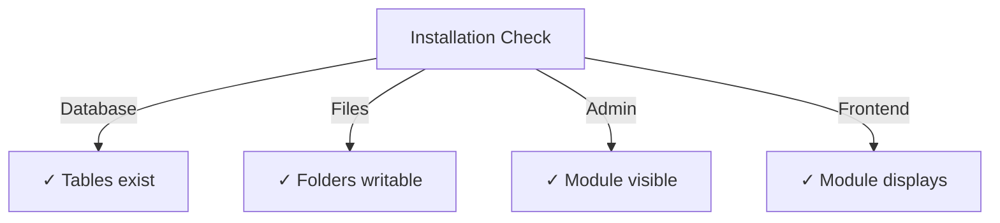

# 发布者安装指南

> 安装和配置 XOOPS CMS 的发布者模区块的完整说明。

---

## 系统要求

### 最低要求

|要求 |版本 |笔记|
|------------|---------|--------|
| XOOPS | 2.5.10+ |核心CMS平台|
| PHP | 7.1+ | PHP 8.x 推荐 |
| MySQL | 5.7+ |数据库服务器|
|网络服务器| Apache/Nginx |具有重写支持 |

### PHP 扩展

```
- PDO (PHP Data Objects)
- pdo_mysql or mysqli
- mb_string (multibyte strings)
- curl (for external content)
- json
- gd (image processing)
```

### 磁盘空间

- **模区块文件**：~5 MB
- **缓存目录**：建议 50+ MB
- **上传目录**：根据内容需要

---

## Pre-Installation 清单

在安装 Publisher 之前，请验证：

- [ ] XOOPS核心已安装并运行
- [ ] 管理员帐户具有模区块管理权限
- [ ] 数据库备份已创建
- [ ] 文件权限允许对 `/modules/` 目录进行写访问
- [ ] PHP 内存限制至少为 128 MB
- [ ] 文件上传大小限制适当（最小 10 MB）

---

## 安装步骤

### 第 1 步：下载 Publisher

#### 选项 A：来自 GitHub（推荐）

```bash
# Navigate to modules directory
cd /path/to/xoops/htdocs/modules/

# Clone the repository
git clone https://github.com/XoopsModules25x/publisher.git

# Verify download
ls -la publisher/
```

#### 选项 B：手动下载

1.访问[GitHub Publisher Releases](https://github.com/XOOPSModules25x/publisher/releases)
2.下载最新的`.zip`文件
3. 提取至`modules/publisher/`

### 步骤 2：设置文件权限

```bash
# Set proper ownership
chown -R www-data:www-data /path/to/xoops/htdocs/modules/publisher

# Set directory permissions (755)
find publisher -type d -exec chmod 755 {} \;

# Set file permissions (644)
find publisher -type f -exec chmod 644 {} \;

# Make scripts executable
chmod 755 publisher/admin/index.php
chmod 755 publisher/index.php
```

### 第 3 步：通过 XOOPS 管理员安装

1. 以管理员身份登录**XOOPS管理面板**
2. 导航至 **系统 → 模区块**
3. 单击“**安装模区块**”
4. 在列表中找到**发布者**
5. 单击“**安装**”按钮
6.等待安装完成（显示已创建的数据库表）

```
Installation Progress:
✓ Tables created
✓ Configuration initialized
✓ Permissions set
✓ Cache cleared
Installation Complete!
```

---

## 初始设置

### 第 1 步：访问发布者管理

1. 进入**管理面板→模区块**
2.找到**Publisher**模区块
3. 单击 **管理员** 链接
4. 您现在处于发布者管理中

### 第 2 步：配置模区块首选项

1. 单击左侧菜单中的**首选项**
2. 配置基本设置：

```
General Settings:
- Editor: Select your WYSIWYG editor
- Items per page: 10
- Show breadcrumb: Yes
- Allow comments: Yes
- Allow ratings: Yes

SEO Settings:
- SEO URLs: No (enable later if needed)
- URL rewriting: None

Upload Settings:
- Max upload size: 5 MB
- Allowed file types: jpg, png, gif, pdf, doc, docx
```

3. 单击“**保存设置**”

### 步骤 3：创建第一个类别

1. 单击左侧菜单中的**类别**
2. 单击“**添加类别**”
3. 填写表格：

```
Category Name: News
Description: Latest news and updates
Image: (optional) Upload category image
Parent Category: (leave blank for top-level)
Status: Enabled
```

4. 单击**保存类别**

### 步骤 4：验证安装

检查这些指标：



#### 数据库检查

```bash
mysql -u xoops_user -p xoops_database
mysql> SHOW TABLES LIKE 'publisher%';

# Should show tables:
# - publisher_categories
# - publisher_items
# - publisher_comments
# - publisher_files
```

#### 正面-End 检查

1. 访问您的XOOPS主页
2. 查找 **Publisher** 或 **News** 区块
3.应该显示最近的文章

---

## 安装后配置

### 编辑选择

Publisher 支持多个 WYSIWYG 编辑器：

|编辑|优点 |缺点 |
|--------|------|------|
| FCK编辑器 |功能-rich |更老、更大 |
| CK编辑器|现代标准|配置复杂度|
|小MCE |轻量化|功能有限 |
| DHTML编辑|基本 |非常基础|

**更改编辑器：**

1. 转到**首选项**
2. 滚动到 **编辑器** 设置
3. 从下拉列表中选择
4.保存并测试

### 上传目录设置

```bash
# Create upload directories
mkdir -p /path/to/xoops/uploads/publisher/
mkdir -p /path/to/xoops/uploads/publisher/categories/
mkdir -p /path/to/xoops/uploads/publisher/images/
mkdir -p /path/to/xoops/uploads/publisher/files/

# Set permissions
chmod 755 /path/to/xoops/uploads/publisher/
chmod 755 /path/to/xoops/uploads/publisher/*
```

### 配置图像大小

在首选项中，设置缩略图大小：

```
Category image size: 300 x 200 px
Article image size: 600 x 400 px
Thumbnail size: 150 x 100 px
```

---

## 帖子-Installation 步骤

### 1.设置群组权限

1. 转到管理菜单中的**权限**
2. 配置组的访问权限：
   - 匿名：仅供查看
   - 注册用户：提交文章
   - 编辑：Approve/edit文章
   - 管理员：完全访问权限

### 2.配置模区块可见性

1. 转到 XOOPS 管理中的 **区区块**
2. 查找发布者区块：
   - Publisher - 最新文章
   - Publisher - 类别
   - Publisher - 档案馆
3. 配置每页的区块可见性

### 3.导入测试内容（可选）

为了进行测试，导入示例文章：

1. 转到 **发布者管理 → 导入**
2. 选择**示例内容**
3. 单击**导入**

### 4. 启用 SEO URL（可选）

对于搜索-friendly URL：1. 转到**首选项**
2. 设置**SEO URL**：是
3.启用**.htaccess**重写
4. 验证 Publisher 文件夹中是否存在 `.htaccess` 文件

```apache
# .htaccess example
<IfModule mod_rewrite.c>
    RewriteEngine On
    RewriteBase /modules/publisher/
    RewriteRule ^category/([0-9]+)-(.*)\.html$ index.php?op=showcategory&categoryid=$1 [L]
    RewriteRule ^article/([0-9]+)-(.*)\.html$ index.php?op=showitem&itemid=$1 [L]
</IfModule>
```

---

## 安装疑难解答

### 问题：模区块未出现在管理中

**解决方案：**
```bash
# Check file permissions
ls -la /path/to/xoops/modules/publisher/

# Check xoops_version.php exists
ls /path/to/xoops/modules/publisher/xoops_version.php

# Verify PHP syntax
php -l /path/to/xoops/modules/publisher/xoops_version.php
```

### 问题：数据库表未创建

**解决方案：**
1. 检查MySQL用户是否拥有CREATE TABLE权限
2、查看数据库错误日志：
   ```bash
   mysql> SHOW WARNINGS;
 
  ```
3. 手动导入SQL：
   ```bash
   mysql -u user -p database < modules/publisher/sql/mysql.sql
 
  ```

### 问题：文件上传失败

**解决方案：**
```bash
# Check directory exists and is writable
stat /path/to/xoops/uploads/publisher/

# Fix permissions
chmod 777 /path/to/xoops/uploads/publisher/

# Verify PHP settings
php -i | grep upload_max_filesize
```

### 问题：“找不到页面”错误

**解决方案：**
1. 检查`.htaccess`文件是否存在
2. 验证 Apache `mod_rewrite` 已启用：
   ```bash
   a2enmod rewrite
   systemctl restart apache2
 
  ```
3. 检查 Apache 配置中的`AllowOverride All`

---

## 从以前的版本升级

### 从发布者 1.x 到 2.x

1. **备份当前安装：**
   ```bash
   cp -r modules/publisher/ modules/publisher-backup/
   mysqldump -u user -p database > publisher-backup.sql
 
  ```

2. **下载 Publisher 2.x**

3. **覆盖文件：**
   ```bash
   rm -rf modules/publisher/
   unzip publisher-2.0.zip -d modules/
 
  ```

4. **运行更新：**
   - 转到**管理→发布者→更新**
   - 单击**更新数据库**
   - 等待完成

5. **验证：**
   - 检查所有文章是否正确显示
   - 验证权限是否完好
   - 测试文件上传

---

## 安全考虑

### 文件权限

```
- Core files: 644 (readable by web server)
- Directories: 755 (browseable by web server)
- Upload directories: 755 or 777
- Config files: 600 (not readable by web)
```

### 禁用对敏感文件的直接访问

在上传目录中创建`.htaccess`：

```apache
<FilesMatch "\.(php|phtml|php3|php4|php5|phtml)$">
    Deny from all
</FilesMatch>
```

### 数据库安全

```bash
# Use strong password
ALTER USER 'publisher_user'@'localhost' IDENTIFIED BY 'strong_password_here';

# Grant minimal permissions
GRANT SELECT, INSERT, UPDATE, DELETE ON publisher_db.* TO 'publisher_user'@'localhost';
FLUSH PRIVILEGES;
```

---

## 验证清单

安装后，验证：

- [ ] 模区块出现在管理模区块列表中
- [ ] 可以访问发布者管理部分
- [ ] 可以创建类别
- [ ] 可以创建文章
- [ ] 文章显示在前面-end
- [ ] 文件上传工作
- [ ] 图像正确显示
- [ ] 权限已正确应用
- [ ] 已创建数据库表
- [ ] 缓存目录可写

---

## 后续步骤

安装成功后：

1.阅读基础配置指南
2. 创建你的第一篇文章
3. 设置群组权限
4. 审查品类管理

---

## 支持和资源

- **GitHub 问题**：[Publisher Issues](https://github.com/XOOPSModules25x/publisher/issues)
- **XOOPS论坛**：[Community Support](https://www.XOOPS.org/modules/newbb/)
- **GitHub 维基**：[Installation Help](https://github.com/XOOPSModules25x/publisher/wiki)

---

#publisher #installation #setup #XOOPS #module #configuration