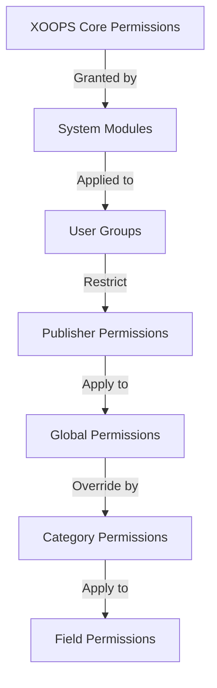

# 发布者权限设置

> 在 Publisher 中配置组权限、访问控制和管理用户访问的完整指南。

---

## 权限基础知识

### 什么是权限？

权限控制不同用户组可以在 Publisher 中执行的操作：

```
Who can:
  - View articles
  - Submit articles
  - Edit articles
  - Approve articles
  - Manage categories
  - Configure settings
```

### 权限级别

```
Anonymous
  └── View published articles only

Registered Users
  ├── View articles
  ├── Submit articles (pending approval)
  └── Edit own articles

Editors/Moderators
  ├── All registered permissions
  ├── Approve articles
  ├── Edit all articles
  └── Manage some categories

Administrators
  └── Full access to everything
```

---

## 访问权限管理

### 导航到权限

```
Admin Panel
└── Modules
    └── Publisher
        ├── Permissions
        ├── Category Permissions
        └── Group Management
```

### 快速访问

1. 以**管理员**身份登录
2. 转到**管理→模区块**
3. 单击**发布者 → 管理**
4. 单击左侧菜单中的**权限**

---

## 全局权限

### 模区块-Level 权限

控制对 Publisher 模区块和功能的访问：

```
Permissions configuration view:
┌─────────────────────────────────────┐
│ Permission             │ Anon │ Reg │ Editor │ Admin │
├────────────────────────┼──────┼─────┼────────┼───────┤
│ View articles          │  ✓   │  ✓  │   ✓    │  ✓   │
│ Submit articles        │  ✗   │  ✓  │   ✓    │  ✓   │
│ Edit own articles      │  ✗   │  ✓  │   ✓    │  ✓   │
│ Edit all articles      │  ✗   │  ✗  │   ✓    │  ✓   │
│ Approve articles       │  ✗   │  ✗  │   ✓    │  ✓   │
│ Manage categories      │  ✗   │  ✗  │   ✗    │  ✓   │
│ Access admin panel     │  ✗   │  ✗  │   ✓    │  ✓   │
└─────────────────────────────────────┘
```

### 权限说明

|权限 |用户 |效果|
|------------|--------|--------|
| **查看文章** |所有团体 |可以看到前面发表的文章-end|
| **提交文章** |注册+ |可以创建新文章（待批准）|
| **编辑自己的文章** |注册+ |可以edit/delete自己的文章|
| **编辑所有文章** |编辑+ |可以编辑任何用户的文章 |
| **删除自己的文章** |注册+ |可以删除自己未发表的文章|
| **删除所有文章** |编辑+ |可以删除任何文章 |
| **批准文章** |编辑+ |可以发布待处理的文章 |
| **管理类别** |管理员|创建、编辑、删除类别 |
| **管理员访问权限** |编辑+ |访问管理界面 |

---

## 配置全局权限

### 第1步：访问权限设置

1. 转到**管理→模区块**
2. 找到**发布者**
3. 单击“**权限**”（或单击“管理”链接，然后单击“权限”）
4.你看到权限矩阵

### 第2步：设置组权限

对于每个组，配置他们可以执行的操作：

#### 匿名用户

```yaml
Anonymous Group Permissions:
  View articles: ✓ YES
  Submit articles: ✗ NO
  Edit articles: ✗ NO
  Delete articles: ✗ NO
  Approve articles: ✗ NO
  Manage categories: ✗ NO
  Admin access: ✗ NO

Result: Anonymous users can only view published content
```

#### 注册用户

```yaml
Registered Group Permissions:
  View articles: ✓ YES
  Submit articles: ✓ YES (with approval required)
  Edit own articles: ✓ YES
  Edit all articles: ✗ NO
  Delete own articles: ✓ YES (drafts only)
  Delete all articles: ✗ NO
  Approve articles: ✗ NO
  Manage categories: ✗ NO
  Admin access: ✗ NO

Result: Registered users can contribute content after approval
```

#### 编辑组

```yaml
Editors Group Permissions:
  View articles: ✓ YES
  Submit articles: ✓ YES
  Edit own articles: ✓ YES
  Edit all articles: ✓ YES
  Delete own articles: ✓ YES
  Delete all articles: ✓ YES
  Approve articles: ✓ YES
  Manage categories: ✓ LIMITED
  Admin access: ✓ YES
  Configure settings: ✗ NO

Result: Editors manage content but not settings
```

#### 管理员

```yaml
Admins Group Permissions:
  ✓ FULL ACCESS to all features

  - All editor permissions
  - Manage all categories
  - Configure all settings
  - Manage permissions
  - Install/uninstall
```

### 步骤 3：保存权限

1.配置各组的权限
2. 选中允许的操作的复选框
3. 取消选中拒绝操作的复选框
4. 单击**保存权限**
5. 出现确认信息

---

## 类别-Level 权限

### 设置类别访问

控制谁可以view/submit到特定类别：

```
Admin → Publisher → Categories
→ Select category → Permissions
```

### 类别权限矩阵

```
                 Anonymous  Registered  Editor  Admin
View category        ✓         ✓         ✓       ✓
Submit to category   ✗         ✓         ✓       ✓
Edit own in category ✗         ✓         ✓       ✓
Edit all in category ✗         ✗         ✓       ✓
Approve in category  ✗         ✗         ✓       ✓
Manage category      ✗         ✗         ✗       ✓
```

### 配置类别权限

1. 转到**类别**管理
2. 查找类别
3. 单击“**权限**”按钮
4. 对于每个组，选择：
   - [ ] 查看该类别
   - [ ] 提交文章
   - [ ] 编辑自己的文章
   - [ ] 编辑所有文章
   - [ ] 批准文章
   - [ ] 管理类别
5. 单击**保存**

### 类别权限示例

#### 公共新闻类

```
Anonymous: View only
Registered: View + Submit (pending approval)
Editors: Approve + Edit
Admins: Full control
```

#### 内部更新类别

```
Anonymous: No access
Registered: View only
Editors: Submit + Approve
Admins: Full control
```

#### 访客博客类别

```
Anonymous: View only
Registered: Submit (pending approval)
Editors: Approve
Admins: Full control
```

---

## 字段-Level 权限

### 控制表单字段可见性

限制用户可以使用哪些表单字段see/edit：

```
Admin → Publisher → Permissions → Fields
```

### 字段选项

```yaml
Visible Fields for Registered Users:
  ✓ Title
  ✓ Description
  ✓ Content (body)
  ✓ Featured image
  ✓ Category
  ✓ Tags
  ✗ Author (auto-set)
  ✗ Publication date (editors only)
  ✗ Scheduled date (editors only)
  ✗ Featured flag (editors only)
  ✗ Permissions (admins only)
```

### 示例

#### 注册的有限提交

注册用户看到的选项较少：

```
Available fields:
  - Title ✓
  - Description ✓
  - Content ✓
  - Featured image ✓
  - Category ✓

Hidden fields:
  - Author (auto-current user)
  - Publication date (editors decide)
  - Scheduled date (admins only)
  - Featured status (editors choose)
```

#### 编辑完整表格

编辑者可以看到所有选项：

```
Available fields:
  - All basic fields
  - All metadata
  - Author selection ✓
  - Publication date/time ✓
  - Scheduled date ✓
  - Featured status ✓
  - Expiration date ✓
  - Permissions ✓
```

---

## 用户组配置

### 创建自定义组

1. 转到 **管理 → 用户 → 组**
2. 单击“**创建组**”
3. 输入群组详细信息：

```
Group Name: "Community Bloggers"
Group Description: "Users who contribute blog content"
Type: Regular group
```

4. 单击**保存组**
5. 返回发布者权限
6.为新组设置权限

### 组示例

```
Suggested Groups for Publisher:

Group: Contributors
  - Regular members who submit articles
  - Can edit own articles
  - Cannot approve articles

Group: Reviewers
  - Can see submitted articles
  - Can approve/reject articles
  - Cannot delete others' articles

Group: Editors
  - Can edit any article
  - Can approve articles
  - Can moderate comments
  - Can manage some categories

Group: Publishers
  - Can edit any article
  - Can publish directly (no approval)
  - Can manage all categories
  - Can configure settings
```

---

## 权限层次结构

### 权限流程



### 权限继承

```
Base: Global module permissions
  ↓
Category: Overrides for specific categories
  ↓
Field: Further restricts available fields
  ↓
User: Has permission if ALL levels allow
```

**示例：**

```
User wants to edit article:
1. User group must have "edit articles" permission (global)
2. Category must allow editing (category level)
3. Field restrictions must allow (if applicable)
4. User must be author OR editor (for own vs all)

If ANY level denies → Permission denied
```

---

## 审批工作流程权限

### 配置提交批准

控制文章是否需要批准：

```
Admin → Publisher → Preferences → Workflow
```

#### 批准选项

```yaml
Submission Workflow:
  Require Approval: Yes

  For Registered Users:
    - New articles: Draft (pending approval)
    - Editors must approve
    - User can edit while pending
    - After approval: User can still edit

  For Editors:
    - New articles: Publish directly (optional)
    - Skip approval queue
    - Or always require approval
```

#### 按组配置

1. 进入偏好设置
2.找到“提交工作流程”
3. 对于每个组，设置：

```
Group: Registered Users
  Require approval: ✓ YES
  Default status: Draft
  Can modify while pending: ✓ YES

Group: Editors
  Require approval: ✗ NO
  Default status: Published
  Can modify published: ✓ YES
```

4. 单击“**保存**”

---## 审核文章

### 批准待处理的文章

对于具有“批准文章”权限的用户：

1. 转到**管理→发布者→文章**
2. 按 **状态** 筛选：待处理
3.点击文章查看
4.检查内容质量
5.设置**状态**：已发布
6. 可选：添加编辑注释
7. 单击“**保存**”

### 拒绝文章

如果文章不符合标准：

1.打开文章
2. 设置**状态**：草稿
3. 添加拒绝原因（在评论或电子邮件中）
4. 单击“**保存**”
5. 向作者发送消息解释拒绝原因

### 适度评论

如果审核评论：

1. 转到**管理→发布者→评论**
2. 按 **状态** 筛选：待处理
3.审核评论
4. 选项：
   - 批准：点击**批准**
   - 拒绝：点击**删除**
   - 编辑：点击**编辑**，修复，保存
5. 单击**保存**

---

## 管理用户访问

### 查看用户组

查看哪些用户属于组：

```
Admin → Users → User Groups

For each user:
  - Primary group (one)
  - Secondary groups (multiple)

Permissions apply from all groups (union)
```

### 将用户添加到组

1. 转到**管理→用户**
2. 查找用户
3. 单击“**编辑**”
4. 在**组**下，选中要添加的组
5. 单击**保存**

### 更改用户权限

对于个人用户（如果支持）：

1. 进入用户管理
2. 查找用户
3. 单击“**编辑**”
4. 寻找个人权限覆盖
5.根据需要配置
6. 单击“**保存**”

---

## 常见权限场景

### 场景 1：打开博客

允许任何人提交：

```
Anonymous: View
Registered: Submit, edit own, delete own
Editors: Approve, edit all, delete all
Admins: Full control

Result: Open community blog
```

### 场景 2：受监管的新闻网站

严格的审批流程：

```
Anonymous: View only
Registered: Cannot submit
Editors: Submit, approve others
Admins: Full control

Result: Only approved professionals publish
```

### 场景 3：员工博客

员工可以贡献：

```
Create group: "Staff"
Anonymous: View
Registered: View only (non-staff)
Staff: Submit, edit own, publish directly
Admins: Full control

Result: Staff-authored blog
```

### 场景 4：使用不同编辑器的多个-Category

不同类别的不同编辑器：

```
News category:
  Editors group A: Full control

Reviews category:
  Editors group B: Full control

Tutorials category:
  Editors group C: Full control

Result: Decentralized editorial control
```

---

## 权限测试

### 验证权限工作

1.在各组中创建测试用户
2. 以每个测试用户身份登录
3. 尝试：
   - 查看文章
   - 提交文章（如果允许，应创建草稿）
   - 编辑文章（自己的和其他人的）
   - 删除文章
   - 访问管理面板
   - 访问类别

4. 验证结果与预期权限匹配

### 常见测试用例

```
Test Case 1: Anonymous user
  [ ] Can view published articles: ✓
  [ ] Cannot submit articles: ✓
  [ ] Cannot access admin: ✓

Test Case 2: Registered user
  [ ] Can submit articles: ✓
  [ ] Articles go to Draft: ✓
  [ ] Can edit own article: ✓
  [ ] Cannot edit others: ✓
  [ ] Cannot access admin: ✓

Test Case 3: Editor
  [ ] Can approve articles: ✓
  [ ] Can edit any article: ✓
  [ ] Can access admin: ✓
  [ ] Cannot delete all: ✓ (or ✓ if allowed)

Test Case 4: Admin
  [ ] Can do everything: ✓
```

---

## 权限疑难解答

### 问题：用户无法提交文章

**检查：**
```
1. User group has "submit articles" permission
   Admin → Publisher → Permissions

2. User belongs to allowed group
   Admin → Users → Edit user → Groups

3. Category allows submission from user's group
   Admin → Publisher → Categories → Permissions

4. User is registered (not anonymous)
```

**解决方案：**
```bash
1. Verify registered user group has submission permission
2. Add user to appropriate group
3. Check category permissions
4. Clear user session cache
```

### 问题：编辑无法批准文章

**检查：**
```
1. Editor group has "approve articles" permission
2. Articles exist with "Pending" status
3. Editor is in correct group
4. Category allows approval from editor's group
```

**解决方案：**
```bash
1. Go to Permissions, check "approve articles" is checked for editor group
2. Create test article, set to Draft
3. Try to approve as editor
4. Check error messages in system log
```

### 问题：可以看到文章但无法访问类别

**检查：**
```
1. Category is not disabled/hidden
2. Category permissions allow viewing
3. User's group is permitted to view category
4. Category is published
```

**解决方案：**
```bash
1. Go to Categories, check category status is "Enabled"
2. Check category permissions are set
3. Add user's group to category view permission
```

### 问题：权限已更改但未生效

**解决方案：**
```bash
1. Clear cache: Admin → Tools → Clear Cache
2. Clear session: Logout and login again
3. Check system log for errors
4. Verify permissions actually saved
5. Try different browser/incognito window
```

---

## 权限备份与导出

### 导出权限

某些系统允许导出：

1. 转到**管理→发布者→工具**
2. 单击**导出权限**
3. 保存`.xml`或`.json`文件
4.保留作为备份

### 导入权限

从备份恢复：

1. 转到**管理→发布者→工具**
2. 单击**导入权限**
3.选择备份文件
4.审查变更
5. 单击**导入**

---

## 最佳实践

### 权限配置清单

- [ ] 决定用户组
- [ ] 为组分配清晰的名称
- [ ] 为每个组设置基本权限
- [ ] 测试各个权限级别
- [ ] 文档权限结构
- [ ] 创建审批工作流程
- [ ] 对编辑进行适度培训
- [ ] 监控权限使用情况
- [ ] 每季度审查一次权限
- [ ] 备份权限设置

### 安全最佳实践

```
✓ Principle of Least Privilege
  - Grant minimum necessary permissions

✓ Role-Based Access
  - Use groups for roles (editor, moderator, etc)

✓ Audit Permissions
  - Review who has what access

✓ Separate Duties
  - Submitter, approver, publisher are different

✓ Regular Review
  - Check permissions quarterly
  - Remove access when users leave
  - Update for new requirements
```

---

## 相关指南

- 创建文章
- 管理类别
- 基本配置
- 安装

---

## 后续步骤

- 为您的工作流程设置权限
- 创建具有适当权限的文章
- 配置类别的权限
- 培训用户文章创建

---

#publisher #permissions #groups #access-control #security #moderation #XOOPS