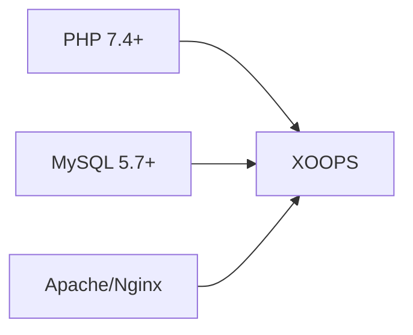
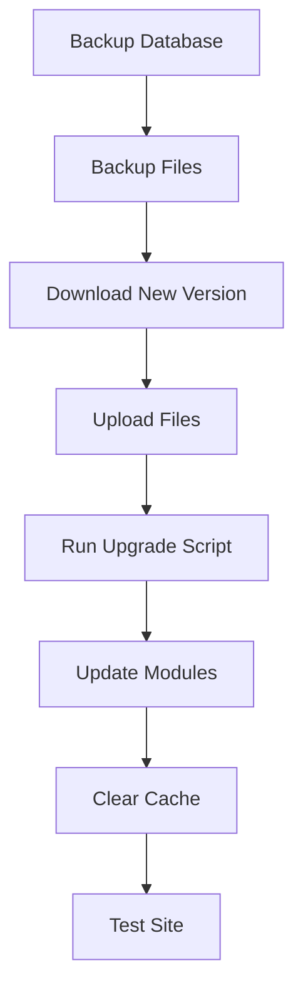

---
title：“安装FAQ”
description：“有关XOOPS安装的常见问题”
---

> 有关安装 XOOPS 的常见问题和解答。

---

## 前-Installation

### 问：最低服务器要求是什么？

**A：** XOOPS 2.5.x 要求：
- PHP 7.4 或更高版本（推荐PHP 8.x）
- MySQL 5.7+ 或 MariaDB 10.3+
- Apache 与 mod_rewrite 或 Nginx
- 至少 64MB PHP 内存限制（建议 128MB+）



### 问：我可以在共享主机上安装XOOPS吗？

**答：** 是的，XOOPS 适用于大多数符合要求的共享主机。检查您的主机是否提供：
- PHP 具有所需的扩展（mysqli、gd、curl、json、mbstring）
- MySQL数据库访问
- 文件上传功能
- .htaccess 支持（适用于 Apache）

### 问：需要哪些 PHP 扩展？

**答：** 所需的扩展：
- `mysqli` - 数据库连接
- `gd` - 图像处理
- `json` - JSON 处理
- `mbstring` - 多字节字符串支持

推荐：
- `curl` - 外部API 呼叫
- `zip` - 模区块安装
- `intl` - 国际化

---

## 安装过程

### 问：安装向导显示空白页

**答：** 这通常是 PHP 错误。尝试：

1. 暂时启用错误显示：
```php
// Add to htdocs/install/index.php at the top
error_reporting(E_ALL);
ini_set('display_errors', 1);
```

2.检查PHP错误日志
3.验证PHP版本兼容性
4. 确保加载所有必需的扩展

### 问：我收到“无法写入主文件。php”

**A:** 安装前设置写入权限：

```bash
chmod 666 mainfile.php
# After installation, secure it:
chmod 444 mainfile.php
```

### 问：未创建数据库表

**答：** 检查：

1. MySQL用户拥有CREATE TABLE权限：
```sql
GRANT ALL PRIVILEGES ON xoopsdb.* TO 'xoopsuser'@'localhost';
FLUSH PRIVILEGES;
```

2.数据库存在：
```sql
CREATE DATABASE xoopsdb CHARACTER SET utf8mb4 COLLATE utf8mb4_unicode_ci;
```

3. 向导中的凭据匹配数据库设置

### 问：安装完成但站点显示错误

**答：** 常见帖子-installation修复：

1. 删除或重命名安装目录：
```bash
mv htdocs/install htdocs/install.bak
```

2.设置适当的权限：
```bash
chmod -R 755 htdocs/
chmod -R 777 xoops_data/
chmod 444 mainfile.php
```

3.清除缓存：
```bash
rm -rf xoops_data/caches/smarty_cache/*
rm -rf xoops_data/caches/smarty_compile/*
```

---

## 配置

### 问：配置文件在哪里？

**答：** 主要配置位于 XOOPS 根目录中的 `mainfile.php` 中。按键设置：

```php
define('XOOPS_ROOT_PATH', '/path/to/htdocs');
define('XOOPS_VAR_PATH', '/path/to/xoops_data');
define('XOOPS_URL', 'https://yoursite.com');
define('XOOPS_DB_HOST', 'localhost');
define('XOOPS_DB_USER', 'username');
define('XOOPS_DB_PASS', 'password');
define('XOOPS_DB_NAME', 'database');
define('XOOPS_DB_PREFIX', 'xoops');
```

### 问：如何更改网站URL？

**答：** 编辑`mainfile.php`：

```php
define('XOOPS_URL', 'https://newdomain.com');
```

然后清除缓存并更新数据库中的所有硬编码 URL。

### 问：如何将XOOPS移至其他目录？

**答：**

1. 将文件移动到新位置
2. 更新`mainfile.php`中的路径：
```php
define('XOOPS_ROOT_PATH', '/new/path/to/htdocs');
define('XOOPS_VAR_PATH', '/new/path/to/xoops_data');
```
3. 如果需要更新数据库
4.清除所有缓存

---

## 升级

### 问：如何升级XOOPS？

**答：**



1. **备份所有内容**（数据库+文件）
2. 下载新的XOOPS版本
3.上传文件（不要覆盖`mainfile.php`）
4. 运行 `htdocs/upgrade/`（如果提供）
5.通过管理面板更新模区块
6.清除所有缓存
7. 彻底测试

### 问：升级时可以跳过版本吗？

**答：** 一般不会。按顺序升级主要版本，以确保数据库迁移正确运行。查看发行说明以获取具体指导。

### 问：升级后我的模区块停止工作

**答：**

1. 检查模区块与新XOOPS版本的兼容性
2.更新模区块到最新版本
3.重新生成模板：管理→系统→维护→模板
4.清除所有缓存
5. 检查PHP错误日志中的具体错误

---

## 故障排除

### 问：我忘记了管理员密码

**A:** 通过数据库重置：

```sql
-- Generate new password hash
UPDATE xoops_users
SET pass = MD5('newpassword')
WHERE uname = 'admin';
```

或者，如果配置了电子邮件，请使用密码重置功能。

### 问：安装后网站速度很慢

**答：**

1. 在管理 → 系统 → 首选项中启用缓存
2.优化数据库：
```sql
OPTIMIZE TABLE xoops_session;
OPTIMIZE TABLE xoops_online;
```
3. 在调试模式下检查慢查询
4. 启用PHP OpCache

### 问：图片/CSS未加载

**答：**

1.检查文件权限（文件为644，目录为755）
2. 验证 `XOOPS_URL` 中的 `mainfile.php` 是否正确
3.检查.htaccess是否存在重写冲突
4. 检查浏览器控制台是否有 404 错误

---## 相关文档

- 安装指南
- 基本配置
- 死亡白屏

---

#XOOPS #faq #installation #troubleshooting