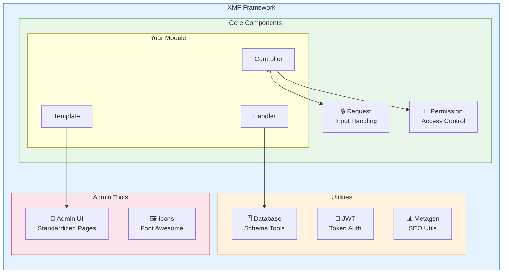
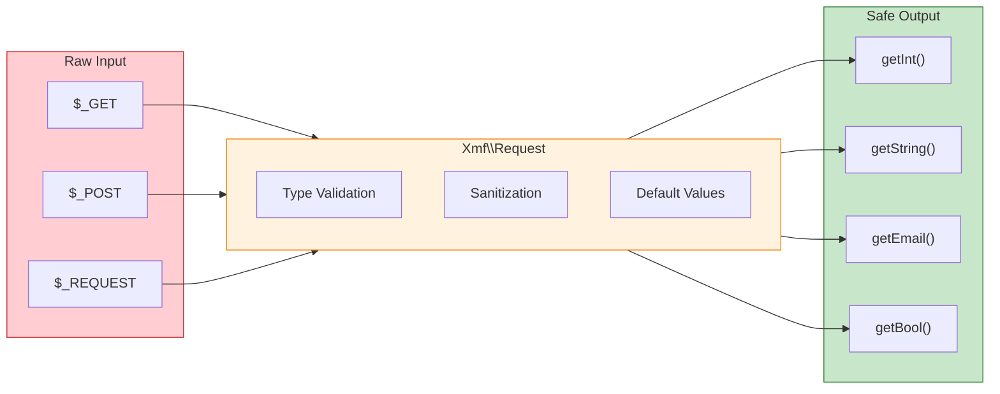

---
title：“XMF框架”
description：“XOOPS模区块框架 - 用于现代XOOPS模区块开发的综合库”
---

<span class="version-badge version-25x">2.5.x ✅</span> <span class="version-badge version-40x">4.0.x ✅</span>

:::tip[通往现代的桥梁XOOPS]
XMF 适用于 **XOOPS 2.5.x 和 XOOPS 4.0.x**。这是当今在为 XOOPS 4.0 做准备时对模区块进行现代化改造的推荐方法。 XMF 提供 PSR-4 自动加载、命名空间和平滑过渡的帮助程序。
:::

**XOOPS 模区块框架 (XMF)** 是一个功能强大的库，旨在简化和标准化XOOPS 模区块开发。 XMF 提供了现代的 PHP 实践，包括命名空间、自动加载和一套全面的帮助程序类，可减少样板代码并提高可维护性。

## XMF 是什么？

XMF 是类和实用程序的集合，提供：

- **现代PHP支持** - PSR-4自动加载的完整命名空间支持
- **请求处理** - 安全输入验证和清理
- **模区块助手** - 简化对模区块配置和对象的访问
- **权限系统** - 轻松-to-use权限管理
- **数据库实用程序** - 架构迁移和表管理工具
- **JWT 支持** - JSON 用于安全身份验证的 Web 令牌实施
- **元数据生成** - SEO 和内容提取实用程序
- **管理界面** - 标准化模区块管理页面

### XMF 组件概述



## 主要特点

### 命名空间和自动加载

所有 XMF 类都驻留在 `XMF` 命名空间中。类在引用时会自动加载 - 无需包含手册。

```php
use Xmf\Request;
use Xmf\Module\Helper;

// Classes load automatically when used
$input = Request::getString('input', '');
$helper = Helper::getHelper('mymodule');
```

### 安全请求处理

[Request class](../05-XMF-Framework/Basics/XMF-Request.md)提供对HTTP请求数据的类型-safe访问，并内置-in清理：



```php
use Xmf\Request;

$id = Request::getInt('id', 0);
$name = Request::getString('name', '');
$email = Request::getEmail('email', '');
```

### 模区块助手系统

[Module Helper](../05-XMF-Framework/Basics/XMF-Module-Helper.md)提供对模区块-related功能的便捷访问：

```php
$helper = \Xmf\Module\Helper::getHelper('mymodule');

// Access module configuration
$configValue = $helper->getConfig('setting_name', 'default');

// Get module object
$module = $helper->getModule();

// Access handlers
$handler = $helper->getHandler('items');
```

### 权限管理

[Permission-Helper](../05-XMF-Framework/Recipes/Permission-Helper.md) 简化了 XOOPS 权限处理：

```php
$permHelper = new \Xmf\Module\Helper\Permission();

// Check user permission
if ($permHelper->checkPermission('view', $itemId)) {
    // User has permission
}
```

## 文档结构

### 基础知识

- [Getting-Started-with-XMF](../05-XMF-Framework/Basics/Getting-Started-with-XMF.md) - 安装和基本使用
- [XMF-Request](../05-XMF-Framework/Basics/XMF-Request.md) - 请求处理和输入验证
- [XMF-Module-Helper](../05-XMF-Framework/Basics/XMF-Module-Helper.md) - 模区块助手类的使用

### 食谱

- [Permission-Helper](../05-XMF-Framework/Recipes/Permission-Helper.md) - 使用权限
- [Module-Admin-Pages](../05-XMF-Framework/Recipes/Module-Admin-Pages.md) - 创建标准化管理界面

### 参考

- [JWT](../05-XMF-Framework/Reference/JWT.md) - JSON Web 令牌实施
- [Database](../05-XMF-Framework/Reference/Database.md) - 数据库实用程序和模式管理
- [Metagen](Reference/Metagen.md) - 元数据和SEO实用程序

## 要求

- XOOPS2.5.8 或更高版本
- PHP 7.2 或更高版本（推荐PHP 8.x）

## 安装

XMF 包含在 XOOPS 2.5.8 及更高版本中。对于早期版本或手动安装：

1. 从 XOOPS 存储库下载 XMF 软件包
2.解压到您的XOOPS`/class/xmf/`目录
3. 自动加载器会自动处理类加载

## 快速入门示例

以下是显示常见 XMF 使用模式的完整示例：

```php
<?php
use Xmf\Request;
use Xmf\Module\Helper;
use Xmf\Module\Helper\Permission;

// Get module helper
$helper = Helper::getHelper('mymodule');

// Get configuration values
$itemsPerPage = $helper->getConfig('items_per_page', 10);

// Handle request input
$op = Request::getCmd('op', 'list');
$id = Request::getInt('id', 0);

// Check permissions
$permHelper = new Permission();
if (!$permHelper->checkPermission('view', $id)) {
    redirect_header('index.php', 3, 'Access denied');
}

// Process based on operation
switch ($op) {
    case 'view':
        $handler = $helper->getHandler('items');
        $item = $handler->get($id);
        // ... display item
        break;
    case 'list':
    default:
        // ... list items
        break;
}
```

## 资源

- [XMF GitHub Repository](https://github.com/XOOPS/XMF)
- [XOOPS Project Website](https://XOOPS.org)

---

#xmf #XOOPS #框架#php #模区块-development