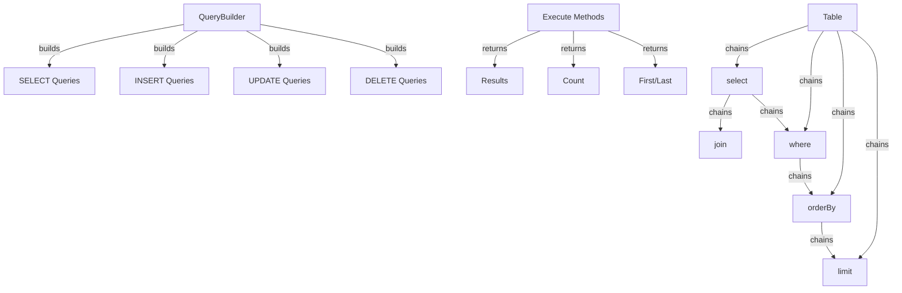

XOOPS 查詢產生器提供現代流暢的介面來構建 SQL 查詢。它有助於防止 SQL 注入、改進可讀性，並為多個資料庫系統提供資料庫抽象化。

## 查詢產生器架構



## QueryBuilder 類別

主要查詢產生器類別，具有流暢介面。

### 類別概述

```php
namespace Xoops\Database;

class QueryBuilder
{
    protected string $table = '';
    protected string $type = 'SELECT';
    protected array $selects = [];
    protected array $joins = [];
    protected array $wheres = [];
    protected array $orders = [];
    protected int $limit = 0;
    protected int $offset = 0;
    protected array $bindings = [];
}
```

### 靜態方法

#### table

為表格建立新查詢產生器。

```php
public static function table(string $table): QueryBuilder
```

**參數：**

| 參數 | 型別 | 描述 |
|-----------|------|-------------|
| `$table` | string | 表格名稱（具有或不具有首碼） |

**傳回值：** `QueryBuilder` - 查詢產生器實例

**範例：**
```php
$query = QueryBuilder::table('users');
$query = QueryBuilder::table('xoops_users'); // With prefix
```

## SELECT 查詢

### select

指定要選擇的欄位。

```php
public function select(...$columns): self
```

**參數：**

| 參數 | 型別 | 描述 |
|-----------|------|-------------|
| `...$columns` | array | 欄位名稱或運算式 |

**傳回值：** `self` - 用於方法鏈式 

**範例：**
```php
// Simple select
QueryBuilder::table('users')
    ->select('id', 'username', 'email')
    ->get();

// Select with aliases
QueryBuilder::table('users')
    ->select('id as user_id', 'username as name')
    ->get();

// Select all columns
QueryBuilder::table('users')
    ->select('*')
    ->get();

// Select with expressions
QueryBuilder::table('orders')
    ->select('id', 'COUNT(*) as total_items')
    ->groupBy('id')
    ->get();
```

### where

添加 WHERE 條件。

```php
public function where(string $column, string $operator = '=', mixed $value = null): self
```

**參數：**

| 參數 | 型別 | 描述 |
|-----------|------|-------------|
| `$column` | string | 欄位名稱 |
| `$operator` | string | 比較運算子 |
| `$value` | mixed | 要比較的值 |

**傳回值：** `self` - 用於方法鏈式

**運算子：**

| 運算子 | 描述 | 範例 |
|----------|-------------|---------|
| `=` | 等於 | `->where('status', '=', 'active')` |
| `!=` or `<>` | 不等於 | `->where('status', '!=', 'deleted')` |
| `>` | 大於 | `->where('price', '>', 100)` |
| `<` | 小於 | `->where('price', '<', 100)` |
| `>=` | 大於或等於 | `->where('age', '>=', 18)` |
| `<=` | 小於或等於 | `->where('age', '<=', 65)` |
| `LIKE` | 模式匹配 | `->where('name', 'LIKE', '%john%')` |
| `IN` | 在清單中 | `->where('status', 'IN', ['active', 'pending'])` |
| `NOT IN` | 不在清單中 | `->where('id', 'NOT IN', [1, 2, 3])` |
| `BETWEEN` | 範圍 | `->where('age', 'BETWEEN', [18, 65])` |
| `IS NULL` | 為空 | `->where('deleted_at', 'IS NULL')` |
| `IS NOT NULL` | 不為空 | `->where('deleted_at', 'IS NOT NULL')` |

**範例：**
```php
// Single condition
QueryBuilder::table('users')
    ->select('*')
    ->where('status', '=', 'active')
    ->get();

// Multiple conditions (AND)
QueryBuilder::table('users')
    ->select('*')
    ->where('status', '=', 'active')
    ->where('age', '>=', 18)
    ->get();

// IN operator
QueryBuilder::table('products')
    ->select('*')
    ->where('category_id', 'IN', [1, 2, 3])
    ->get();

// LIKE operator
QueryBuilder::table('users')
    ->select('*')
    ->where('email', 'LIKE', '%@example.com')
    ->get();

// NULL check
QueryBuilder::table('users')
    ->select('*')
    ->where('deleted_at', 'IS NULL')
    ->get();
```

### orWhere

添加 OR 條件。

```php
public function orWhere(string $column, string $operator = '=', mixed $value = null): self
```

**範例：**
```php
QueryBuilder::table('users')
    ->select('*')
    ->where('status', '=', 'active')
    ->orWhere('premium', '=', 1)
    ->get();
    // SELECT * FROM users WHERE status = 'active' OR premium = 1
```

### whereIn / whereNotIn

IN/NOT IN 的便捷方法。

```php
public function whereIn(string $column, array $values): self
public function whereNotIn(string $column, array $values): self
```

**範例：**
```php
QueryBuilder::table('posts')
    ->select('*')
    ->whereIn('status', ['published', 'scheduled'])
    ->get();

QueryBuilder::table('comments')
    ->select('*')
    ->whereNotIn('spam_score', [8, 9, 10])
    ->get();
```

### whereNull / whereNotNull

NULL 檢查的便捷方法。

```php
public function whereNull(string $column): self
public function whereNotNull(string $column): self
```

**範例：**
```php
QueryBuilder::table('users')
    ->select('*')
    ->whereNotNull('verified_at')
    ->get();
```

### whereBetween

檢查值是否在兩個值之間。

```php
public function whereBetween(string $column, array $values): self
```

**範例：**
```php
QueryBuilder::table('products')
    ->select('*')
    ->whereBetween('price', [10, 100])
    ->get();

QueryBuilder::table('orders')
    ->select('*')
    ->whereBetween('created_at', ['2024-01-01', '2024-12-31'])
    ->get();
```

### join

添加 INNER JOIN。

```php
public function join(
    string $table,
    string $first,
    string $operator = '=',
    string $second = null
): self
```

**範例：**
```php
QueryBuilder::table('posts')
    ->select('posts.*', 'users.username', 'categories.name')
    ->join('users', 'posts.user_id', '=', 'users.id')
    ->join('categories', 'posts.category_id', '=', 'categories.id')
    ->where('posts.published', '=', 1)
    ->get();
```

### leftJoin / rightJoin

替代 join 型別。

```php
public function leftJoin(
    string $table,
    string $first,
    string $operator = '=',
    string $second = null
): self

public function rightJoin(
    string $table,
    string $first,
    string $operator = '=',
    string $second = null
): self
```

**範例：**
```php
QueryBuilder::table('users')
    ->select('users.*', 'COUNT(posts.id) as post_count')
    ->leftJoin('posts', 'users.id', '=', 'posts.user_id')
    ->groupBy('users.id')
    ->get();
```

### groupBy

按欄位分組結果。

```php
public function groupBy(...$columns): self
```

**範例：**
```php
QueryBuilder::table('orders')
    ->select('user_id', 'COUNT(*) as order_count', 'SUM(total) as total_spent')
    ->groupBy('user_id')
    ->get();

QueryBuilder::table('sales')
    ->select('department', 'region', 'SUM(amount) as total')
    ->groupBy('department', 'region')
    ->get();
```

### having

添加 HAVING 條件。

```php
public function having(string $column, string $operator = '=', mixed $value = null): self
```

**範例：**
```php
QueryBuilder::table('orders')
    ->select('user_id', 'COUNT(*) as order_count')
    ->groupBy('user_id')
    ->having('order_count', '>', 5)
    ->get();
```

### orderBy

排序結果。

```php
public function orderBy(string $column, string $direction = 'ASC'): self
```

**參數：**

| 參數 | 型別 | 描述 |
|-----------|------|-------------|
| `$column` | string | 排序的欄位 |
| `$direction` | string | `ASC` 或 `DESC` |

**範例：**
```php
// Single order
QueryBuilder::table('users')
    ->select('*')
    ->orderBy('created_at', 'DESC')
    ->get();

// Multiple orders
QueryBuilder::table('posts')
    ->select('*')
    ->orderBy('category_id', 'ASC')
    ->orderBy('created_at', 'DESC')
    ->get();

// Random order
QueryBuilder::table('quotes')
    ->select('*')
    ->orderBy('RAND()')
    ->get();
```

### limit / offset

限制和偏移結果。

```php
public function limit(int $limit): self
public function offset(int $offset): self
```

**範例：**
```php
// Simple limit
QueryBuilder::table('posts')
    ->select('*')
    ->limit(10)
    ->get();

// Pagination
$page = 2;
$perPage = 20;
$offset = ($page - 1) * $perPage;

QueryBuilder::table('posts')
    ->select('*')
    ->limit($perPage)
    ->offset($offset)
    ->get();
```

## 執行方法

### get

執行查詢並傳回所有結果。

```php
public function get(): array
```

**傳回值：** `array` - 結果列的陣列

**範例：**
```php
$users = QueryBuilder::table('users')
    ->select('id', 'username', 'email')
    ->where('status', '=', 'active')
    ->orderBy('username')
    ->get();

foreach ($users as $user) {
    echo $user['username'] . ' (' . $user['email'] . ')' . "\n";
}
```

### first

取得第一個結果。

```php
public function first(): ?array
```

**傳回值：** `?array` - 第一列或 null

**範例：**
```php
$user = QueryBuilder::table('users')
    ->select('*')
    ->where('id', '=', 123)
    ->first();

if ($user) {
    echo 'Found: ' . $user['username'];
}
```

### last

取得最後一個結果。

```php
public function last(): ?array
```

**範例：**
```php
$latestPost = QueryBuilder::table('posts')
    ->select('*')
    ->orderBy('created_at', 'DESC')
    ->last();
```

### count

取得結果的計數。

```php
public function count(): int
```

**傳回值：** `int` - 列數

**範例：**
```php
$activeUsers = QueryBuilder::table('users')
    ->where('status', '=', 'active')
    ->count();

echo "Active users: $activeUsers";
```

### exists

檢查查詢是否傳回任何結果。

```php
public function exists(): bool
```

**傳回值：** `bool` - 如果存在結果則為 true

**範例：**
```php
if (QueryBuilder::table('users')->where('email', '=', 'test@example.com')->exists()) {
    echo 'User already exists';
}
```

### aggregate

取得聚合值。

```php
public function aggregate(string $function, string $column): mixed
```

**範例：**
```php
$maxPrice = QueryBuilder::table('products')
    ->aggregate('MAX', 'price');

$avgAge = QueryBuilder::table('users')
    ->aggregate('AVG', 'age');

$totalSales = QueryBuilder::table('orders')
    ->aggregate('SUM', 'total');
```

## INSERT 查詢

### insert

插入列。

```php
public function insert(array $values): bool
```

**範例：**
```php
QueryBuilder::table('users')->insert([
    'username' => 'john',
    'email' => 'john@example.com',
    'password' => password_hash('secret', PASSWORD_BCRYPT),
    'created_at' => date('Y-m-d H:i:s')
]);
```

### insertMany

插入多列。

```php
public function insertMany(array $rows): bool
```

**範例：**
```php
QueryBuilder::table('log_entries')->insertMany([
    ['action' => 'login', 'user_id' => 1, 'timestamp' => time()],
    ['action' => 'logout', 'user_id' => 2, 'timestamp' => time()],
    ['action' => 'update', 'user_id' => 3, 'timestamp' => time()]
]);
```

## UPDATE 查詢

### update

更新列。

```php
public function update(array $values): int
```

**傳回值：** `int` - 受影響的列數

**範例：**
```php
// Update single user
QueryBuilder::table('users')
    ->where('id', '=', 123)
    ->update([
        'email' => 'newemail@example.com',
        'updated_at' => date('Y-m-d H:i:s')
    ]);

// Update multiple rows
QueryBuilder::table('posts')
    ->where('status', '=', 'draft')
    ->where('created_at', '<', date('Y-m-d', strtotime('-30 days')))
    ->update([
        'status' => 'archived'
    ]);
```

### increment / decrement

遞增或遞減欄位。

```php
public function increment(string $column, int $amount = 1): int
public function decrement(string $column, int $amount = 1): int
```

**範例：**
```php
// Increment view count
QueryBuilder::table('posts')
    ->where('id', '=', 123)
    ->increment('views');

// Decrement stock
QueryBuilder::table('products')
    ->where('id', '=', 456)
    ->decrement('stock', 5);
```

## DELETE 查詢

### delete

刪除列。

```php
public function delete(): int
```

**傳回值：** `int` - 刪除的列數

**範例：**
```php
// Delete single record
QueryBuilder::table('comments')
    ->where('id', '=', 789)
    ->delete();

// Delete multiple records
QueryBuilder::table('log_entries')
    ->where('created_at', '<', date('Y-m-d', strtotime('-30 days')))
    ->delete();
```

### truncate

從表格中刪除所有列。

```php
public function truncate(): bool
```

**範例：**
```php
// Clear all sessions
QueryBuilder::table('sessions')->truncate();
```

## 進階功能

### 原始運算式

```php
QueryBuilder::table('products')
    ->select('id', 'name', QueryBuilder::raw('price * quantity as total'))
    ->get();
```

### 子查詢

```php
$recentPostIds = QueryBuilder::table('posts')
    ->select('id')
    ->where('created_at', '>', date('Y-m-d', strtotime('-7 days')))
    ->toSql();

$comments = QueryBuilder::table('comments')
    ->select('*')
    ->whereIn('post_id', $recentPostIds)
    ->get();
```

### 取得 SQL

```php
public function toSql(): string
```

**範例：**
```php
$sql = QueryBuilder::table('users')
    ->select('id', 'username')
    ->where('status', '=', 'active')
    ->toSql();

echo $sql;
// SELECT id, username FROM xoops_users WHERE status = ?
```

## 完整範例

### 具有 Joins 的複雜 Select

```php
<?php
/**
 * Get posts with author and category info
 */

$posts = QueryBuilder::table('posts')
    ->select(
        'posts.id',
        'posts.title',
        'posts.content',
        'posts.created_at',
        'users.username as author',
        'categories.name as category'
    )
    ->join('users', 'posts.user_id', '=', 'users.id')
    ->join('categories', 'posts.category_id', '=', 'categories.id')
    ->where('posts.published', '=', 1)
    ->orderBy('posts.created_at', 'DESC')
    ->limit(10)
    ->get();

foreach ($posts as $post) {
    echo '<article>';
    echo '<h2>' . htmlspecialchars($post['title']) . '</h2>';
    echo '<p class="meta">By ' . htmlspecialchars($post['author']) . ' in ' . htmlspecialchars($post['category']) . '</p>';
    echo '<p>' . htmlspecialchars($post['content']) . '</p>';
    echo '</article>';
}
```

### 使用 QueryBuilder 的分頁

```php
<?php
/**
 * Paginated results
 */

$page = isset($_GET['page']) ? (int)$_GET['page'] : 1;
$perPage = 20;
$offset = ($page - 1) * $perPage;

// Get total count
$total = QueryBuilder::table('articles')
    ->where('status', '=', 'published')
    ->count();

// Get page results
$articles = QueryBuilder::table('articles')
    ->select('*')
    ->where('status', '=', 'published')
    ->orderBy('created_at', 'DESC')
    ->limit($perPage)
    ->offset($offset)
    ->get();

// Calculate pagination
$pages = ceil($total / $perPage);

// Display results
foreach ($articles as $article) {
    echo '<div class="article">' . htmlspecialchars($article['title']) . '</div>';
}

// Display pagination links
if ($pages > 1) {
    echo '<nav class="pagination">';
    for ($i = 1; $i <= $pages; $i++) {
        if ($i == $page) {
            echo '<span class="current">' . $i . '</span>';
        } else {
            echo '<a href="?page=' . $i . '">' . $i . '</a>';
        }
    }
    echo '</nav>';
}
```

### 使用聚合的資料分析

```php
<?php
/**
 * Sales analysis
 */

// Total sales by region
$regionSales = QueryBuilder::table('orders')
    ->select('region', QueryBuilder::raw('SUM(total) as total_sales'), QueryBuilder::raw('COUNT(*) as order_count'))
    ->groupBy('region')
    ->orderBy('total_sales', 'DESC')
    ->get();

foreach ($regionSales as $region) {
    echo $region['region'] . ': $' . number_format($region['total_sales'], 2) . ' (' . $region['order_count'] . ' orders)' . "\n";
}

// Average order value
$avgOrderValue = QueryBuilder::table('orders')
    ->aggregate('AVG', 'total');

echo 'Average order value: $' . number_format($avgOrderValue, 2);
```

## 最佳實踐

1. **使用參數化查詢** - QueryBuilder 自動處理參數繫結
2. **鏈式方法** - 利用流暢介面實現可讀的程式碼
3. **測試 SQL 輸出** - 使用 `toSql()` 驗證產生的查詢
4. **使用索引** - 確保經常查詢的欄位已編制索引
5. **限制結果** - 始終對大型資料集使用 `limit()`
6. **使用聚合** - 讓資料庫執行計數/求和而不是 PHP
7. **逃脫輸出** - 始終使用 `htmlspecialchars()` 逃脫顯示的資料
8. **索引效能** - 監視緩慢查詢並相應地進行最佳化

## 相關文件

- XoopsDatabase - 資料庫層和連線
- Criteria - 舊版 Criteria 型查詢系統
- ../Core/XoopsObject - 資料物件持久化
- ../Module/Module-System - 模組資料庫操作

---

*另請參閱：[XOOPS 資料庫 API](https://github.com/XOOPS/XoopsCore27/tree/master/htdocs/class)*
