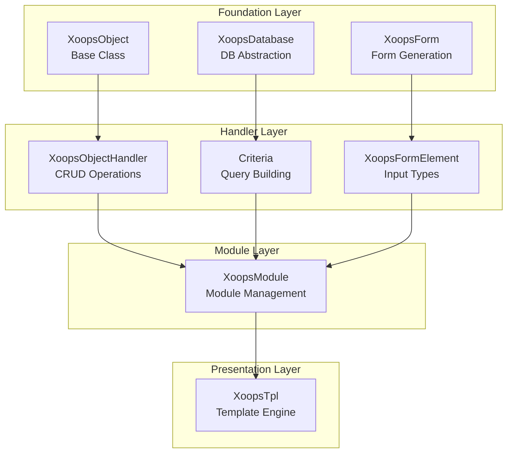
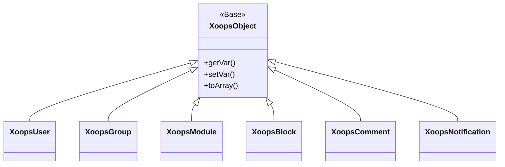
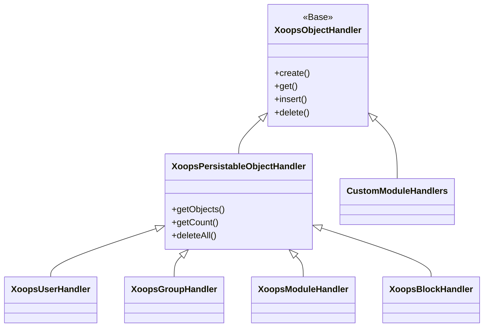
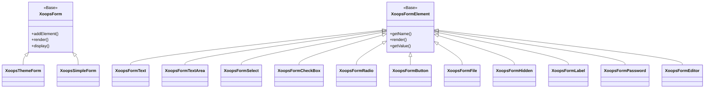

歡迎來到全面的 XOOPS API 參考文件。本部分提供 XOOPS 內容管理系統的所有核心類別、方法和系統的詳細文件。

## 概述

XOOPS API 分為多個主要子系統，每個子系統負責 CMS 功能的特定方面。了解這些 API 對於開發 XOOPS 的模組、主題和擴充功能至關重要。

## API 部分

### 核心類別

所有其他 XOOPS 元件構建的基礎類別。

| 文件 | 描述 |
|--------------|-------------|
| XoopsObject | 所有 XOOPS 中資料物件的基礎類別 |
| XoopsObjectHandler | CRUD 操作的處理程式模式 |

### 資料庫層

資料庫抽象和查詢構建公用程式。

| 文件 | 描述 |
|--------------|-------------|
| XoopsDatabase | 資料庫抽象層 |
| Criteria System | 查詢條件和條件 |
| QueryBuilder | 現代流暢的查詢構建 |

### 表單系統

HTML 表單生成和驗證。

| 文件 | 描述 |
|--------------|-------------|
| XoopsForm | 表單容器和呈現 |
| Form Elements | 所有可用的表單元素類型 |

### 核心類別

核心系統元件和服務。

| 文件 | 描述 |
|--------------|-------------|
| Kernel Classes | 系統核心和核心元件 |

### 模組系統

模組管理和生命週期。

| 文件 | 描述 |
|--------------|-------------|
| Module System | 模組載入、安裝和管理 |

### 範本系統

Smarty 範本整合。

| 文件 | 描述 |
|--------------|-------------|
| Template System | Smarty 整合和範本管理 |

### 使用者系統

使用者管理和身份驗證。

| 文件 | 描述 |
|--------------|-------------|
| User System | 使用者帳户、群組和權限 |

## 架構概述



## 類別階層

### 物件模型



### 處理程式模型



### 表單模型



## 設計模式

XOOPS API 實現了幾種眾所周知的設計模式：

### 單例模式
用於全域服務（如資料庫連線和容器實例）。

```php
$db = XoopsDatabase::getInstance();
$container = XoopsContainer::getInstance();
```

### 工廠模式
物件處理程式一致地建立網域物件。

```php
$handler = xoops_getHandler('user');
$user = $handler->create();
```

### 複合模式
表單包含多個表單元素；條件可以包含嵌套條件。

```php
$criteria = new CriteriaCompo();
$criteria->add(new Criteria('status', 1));
$criteria->add(new CriteriaCompo(...)); // Nested
```

### 觀察者模式
事件系統允許模組之間的鬆散耦合。

```php
$dispatcher->addListener('module.news.article_published', $callback);
```

## 快速開始範例

### 建立和保存物件

```php
// Get the handler
$handler = xoops_getHandler('user');

// Create a new object
$user = $handler->create();
$user->setVar('uname', 'newuser');
$user->setVar('email', 'user@example.com');

// Save to database
$handler->insert($user);
```

### 使用條件進行查詢

```php
// Build criteria
$criteria = new CriteriaCompo();
$criteria->add(new Criteria('level', 0, '>'));
$criteria->setSort('uname');
$criteria->setOrder('ASC');
$criteria->setLimit(10);

// Get objects
$handler = xoops_getHandler('user');
$users = $handler->getObjects($criteria);
```

### 建立表單

```php
$form = new XoopsThemeForm('User Profile', 'userform', 'save.php', 'post', true);
$form->addElement(new XoopsFormText('Username', 'uname', 50, 255, $user->getVar('uname')));
$form->addElement(new XoopsFormTextArea('Bio', 'bio', $user->getVar('bio')));
$form->addElement(new XoopsFormButton('', 'submit', _SUBMIT, 'submit'));
echo $form->render();
```

## API 約定

### 命名約定

| 型別 | 約定 | 範例 |
|------|-----------|---------|
| Classes | PascalCase | `XoopsUser`, `CriteriaCompo` |
| Methods | camelCase | `getVar()`, `setVar()` |
| Properties | camelCase (protected) | `$_vars`, `$_handler` |
| Constants | UPPER_SNAKE_CASE | `XOBJ_DTYPE_INT` |
| Database Tables | snake_case | `users`, `groups_users_link` |

### 資料型別

XOOPS 為物件變數定義標準資料型別：

| 常數 | 型別 | 描述 |
|----------|------|-------------|
| `XOBJ_DTYPE_TXTBOX` | String | 文字輸入（消毒） |
| `XOBJ_DTYPE_TXTAREA` | String | 文字區域內容 |
| `XOBJ_DTYPE_INT` | Integer | 數值 |
| `XOBJ_DTYPE_URL` | String | URL 驗證 |
| `XOBJ_DTYPE_EMAIL` | String | 電子郵件驗證 |
| `XOBJ_DTYPE_ARRAY` | Array | 序列化陣列 |
| `XOBJ_DTYPE_OTHER` | Mixed | 自訂處理 |
| `XOBJ_DTYPE_SOURCE` | String | 原始程式碼（最少消毒） |
| `XOBJ_DTYPE_STIME` | Integer | 短時間戳 |
| `XOBJ_DTYPE_MTIME` | Integer | 中等時間戳 |
| `XOBJ_DTYPE_LTIME` | Integer | 長時間戳 |

## 認證方法

API 支援多種認證方法：

### API 金鑰認證
```
X-API-Key: your-api-key
```

### OAuth Bearer Token
```
Authorization: Bearer your-oauth-token
```

### 工作階段型認證
使用登入時的現有 XOOPS 工作階段。

## REST API 端點

啟用 REST API 時：

| 端點 | 方法 | 描述 |
|----------|--------|-------------|
| `/api.php/rest/users` | GET | 列出使用者 |
| `/api.php/rest/users/{id}` | GET | 按 ID 取得使用者 |
| `/api.php/rest/users` | POST | 建立使用者 |
| `/api.php/rest/users/{id}` | PUT | 更新使用者 |
| `/api.php/rest/users/{id}` | DELETE | 刪除使用者 |
| `/api.php/rest/modules` | GET | 列出模組 |

## 相關文件

- Module Development Guide
- Theme Development Guide
- System Configuration
- Security Best Practices

## 版本歷史

| 版本 | 變更 |
|---------|---------|
| 2.5.11 | 目前穩定版本 |
| 2.5.10 | 新增 GraphQL API 支援 |
| 2.5.9 | 增強 Criteria 系統 |
| 2.5.8 | PSR-4 自動載入支援 |

---

*本文件是 XOOPS 知識庫的一部分。如需最新更新，請造訪 [XOOPS GitHub 儲存庫](https://github.com/XOOPS)。*
