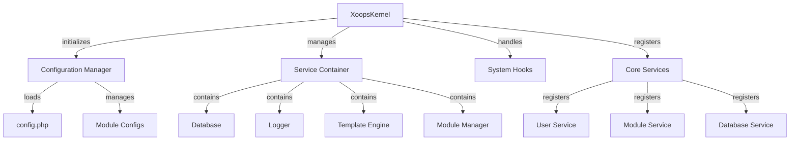

XOOPS 核心為啟動系統、管理設定、處理系統事件和提供核心公用程式提供基礎框架。這些類別形成 XOOPS 應用程式的骨幹。

## 系統架構



## XoopsKernel 類別

初始化並管理 XOOPS 系統的主要核心類別。

### 類別概述

```php
namespace Xoops;

class XoopsKernel
{
    private static ?XoopsKernel $instance = null;
    protected ServiceContainer $services;
    protected ConfigurationManager $config;
    protected array $modules = [];
    protected bool $isLoaded = false;
}
```

### 建構函式

```php
private function __construct()
```

私有建構函式強制執行單例模式。

### getInstance

檢索單例核心實例。

```php
public static function getInstance(): XoopsKernel
```

**傳回值：** `XoopsKernel` - 單例核心實例

**範例：**
```php
$kernel = XoopsKernel::getInstance();
```

### 啟動過程

核心啟動過程遵循以下步驟：

1. **初始化** - 設定錯誤處理程式、定義常數
2. **設定** - 載入設定檔
3. **服務註冊** - 註冊核心服務
4. **模組偵測** - 掃描並識別活動模組
5. **資料庫初始化** - 連接到資料庫
6. **清理** - 為請求處理做準備

```php
public function boot(): void
```

**範例：**
```php
$kernel = XoopsKernel::getInstance();
$kernel->boot();
```

### 服務容器方法

#### registerService

在服務容器中註冊服務。

```php
public function registerService(
    string $name,
    callable|object $definition
): void
```

**參數：**

| 參數 | 型別 | 描述 |
|-----------|------|-------------|
| `$name` | string | 服務識別碼 |
| `$definition` | callable\|object | 服務工廠或實例 |

**範例：**
```php
$kernel->registerService('custom.handler', function($c) {
    return new CustomHandler();
});
```

#### getService

檢索已註冊的服務。

```php
public function getService(string $name): mixed
```

**參數：**

| 參數 | 型別 | 描述 |
|-----------|------|-------------|
| `$name` | string | 服務識別碼 |

**傳回值：** `mixed` - 要求的服務

**範例：**
```php
$database = $kernel->getService('database');
$logger = $kernel->getService('logger');
```

#### hasService

檢查服務是否已註冊。

```php
public function hasService(string $name): bool
```

**範例：**
```php
if ($kernel->hasService('cache')) {
    $cache = $kernel->getService('cache');
}
```

## 設定管理員

管理應用程式設定和模組設定。

### 類別概述

```php
namespace Xoops\Core;

class ConfigurationManager
{
    protected array $config = [];
    protected array $defaults = [];
    protected string $configPath;
}
```

### 方法

#### load

從檔案或陣列載入設定。

```php
public function load(string|array $source): void
```

**參數：**

| 參數 | 型別 | 描述 |
|-----------|------|-------------|
| `$source` | string\|array | 設定檔路徑或陣列 |

**範例：**
```php
$config = $kernel->getService('config');
$config->load(XOOPS_ROOT_PATH . '/include/config.php');
$config->load(['sitename' => 'My Site', 'admin_email' => 'admin@example.com']);
```

#### get

檢索設定值。

```php
public function get(string $key, mixed $default = null): mixed
```

**參數：**

| 參數 | 型別 | 描述 |
|-----------|------|-------------|
| `$key` | string | 設定鍵（點符號） |
| `$default` | mixed | 如果找不到則為預設值 |

**傳回值：** `mixed` - 設定值

**範例：**
```php
$siteName = $config->get('sitename');
$adminEmail = $config->get('admin.email', 'admin@example.com');
```

#### set

設定設定值。

```php
public function set(string $key, mixed $value): void
```

**參數：**

| 參數 | 型別 | 描述 |
|-----------|------|-------------|
| `$key` | string | 設定鍵 |
| `$value` | mixed | 設定值 |

**範例：**
```php
$config->set('sitename', 'New Site Name');
$config->set('features.cache_enabled', true);
```

#### getModuleConfig

取得特定模組的設定。

```php
public function getModuleConfig(
    string $moduleName
): array
```

**參數：**

| 參數 | 型別 | 描述 |
|-----------|------|-------------|
| `$moduleName` | string | 模組目錄名稱 |

**傳回值：** `array` - 模組設定陣列

**範例：**
```php
$publisherConfig = $config->getModuleConfig('publisher');
```

## 系統掛鉤

系統掛鉤允許模組和外掛程式在應用程式生命週期的特定點執行程式碼。

### HookManager 類別

```php
namespace Xoops\Core;

class HookManager
{
    protected array $hooks = [];
    protected array $listeners = [];
}
```

### 方法

#### addHook

註冊掛鉤點。

```php
public function addHook(string $name): void
```

**參數：**

| 參數 | 型別 | 描述 |
|-----------|------|-------------|
| `$name` | string | 掛鉤識別碼 |

**範例：**
```php
$hooks = $kernel->getService('hooks');
$hooks->addHook('system.startup');
$hooks->addHook('user.login');
$hooks->addHook('module.install');
```

#### listen

將接聽程式附加到掛鉤。

```php
public function listen(
    string $hookName,
    callable $callback,
    int $priority = 10
): void
```

**參數：**

| 參數 | 型別 | 描述 |
|-----------|------|-------------|
| `$hookName` | string | 掛鉤識別碼 |
| `$callback` | callable | 要執行的函式 |
| `$priority` | int | 執行優先權（較高的優先執行） |

**範例：**
```php
$hooks->listen('user.login', function($user) {
    error_log('User ' . $user->uname . ' logged in');
}, 10);

$hooks->listen('module.install', function($module) {
    // Custom module installation logic
    echo "Installing " . $module->getName();
}, 5);
```

#### trigger

執行掛鉤的所有接聽程式。

```php
public function trigger(
    string $hookName,
    mixed $arguments = null
): array
```

**參數：**

| 參數 | 型別 | 描述 |
|-----------|------|-------------|
| `$hookName` | string | 掛鉤識別碼 |
| `$arguments` | mixed | 要傳遞給接聽程式的資料 |

**傳回值：** `array` - 所有接聽程式的結果

**範例：**
```php
$results = $hooks->trigger('system.startup');
$results = $hooks->trigger('user.created', $newUser);
```

## 核心服務概述

核心在啟動期間註冊幾個核心服務：

| 服務 | 類別 | 目的 |
|---------|-------|---------|
| `database` | XoopsDatabase | 資料庫抽象層 |
| `config` | ConfigurationManager | 設定管理 |
| `logger` | Logger | 應用程式記錄 |
| `template` | XoopsTpl | 範本引擎 |
| `user` | UserManager | 使用者管理服務 |
| `module` | ModuleManager | 模組管理 |
| `cache` | CacheManager | 快取層 |
| `hooks` | HookManager | 系統事件掛鉤 |

## 完整使用範例

```php
<?php
/**
 * Custom module boot process utilizing kernel
 */

// Get kernel instance
$kernel = XoopsKernel::getInstance();

// Boot the system
$kernel->boot();

// Get services
$config = $kernel->getService('config');
$database = $kernel->getService('database');
$logger = $kernel->getService('logger');
$hooks = $kernel->getService('hooks');

// Access configuration
$siteName = $config->get('sitename');
$adminEmail = $config->get('admin.email');

// Register module-specific hooks
$hooks->listen('user.login', function($user) {
    // Log user login
    $logger->info('User login: ' . $user->uname);

    // Track in database
    $database->query(
        'INSERT INTO ' . $database->prefix('event_log') .
        ' (type, user_id, message, timestamp) VALUES (?, ?, ?, ?)',
        ['login', $user->uid(), 'User login', time()]
    );
});

$hooks->listen('module.install', function($module) {
    $logger->info('Module installed: ' . $module->getName());
});

// Trigger hooks
$hooks->trigger('system.startup');

// Use database service
$result = $database->query(
    'SELECT * FROM ' . $database->prefix('users') .
    ' LIMIT 10'
);

while ($row = $database->fetchArray($result)) {
    echo "User: " . htmlspecialchars($row['uname']) . "\n";
}

// Register custom service
$kernel->registerService('custom.repository', function($c) {
    return new CustomRepository($c->getService('database'));
});

// Later access custom service
$repo = $kernel->getService('custom.repository');
```

## 核心常數

核心在啟動期間定義幾個重要常數：

```php
// System paths
define('XOOPS_ROOT_PATH', '/var/www/xoops');
define('XOOPS_HTDOCS_PATH', XOOPS_ROOT_PATH . '/htdocs');
define('XOOPS_MODULES_PATH', XOOPS_ROOT_PATH . '/htdocs/modules');
define('XOOPS_THEMES_PATH', XOOPS_ROOT_PATH . '/htdocs/themes');

// Web paths
define('XOOPS_URL', 'http://example.com');
define('XOOPS_HTDOCS_URL', XOOPS_URL . '/htdocs');

// Database
define('XOOPS_DB_PREFIX', 'xoops_');
```

## 錯誤處理

核心在啟動期間設定錯誤處理程式：

```php
// Set custom error handler
set_error_handler(function($errno, $errstr, $errfile, $errline) {
    $kernel->getService('logger')->error(
        "Error: $errstr in $errfile:$errline"
    );
});

// Set exception handler
set_exception_handler(function($exception) {
    $kernel->getService('logger')->critical(
        "Exception: " . $exception->getMessage()
    );
});
```

## 最佳實踐

1. **單次啟動** - 在應用程式啟動期間僅呼叫 `boot()` 一次
2. **使用服務容器** - 透過核心註冊和檢索服務
3. **盡早處理掛鉤** - 在觸發掛鉤之前註冊掛鉤接聽程式
4. **記錄重要事件** - 使用記錄器服務進行偵錯
5. **快取設定** - 載入設定一次並重複使用
6. **錯誤處理** - 在處理請求之前始終設定錯誤處理程式

## 相關文件

- ../Module/Module-System - 模組系統和生命週期
- ../Template/Template-System - 範本引擎整合
- ../User/User-System - 使用者身份驗證和管理
- ../Database/XoopsDatabase - 資料庫層

---

*另請參閱：[XOOPS 核心原始程式碼](https://github.com/XOOPS/XoopsCore27/tree/master/htdocs/class)*
