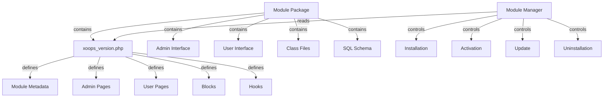

XOOPS 模組系統為開發、安裝、管理和擴充模組功能提供完整的框架。模組是自包含的套件，可使用額外功能和功能擴充 XOOPS。

## 模組架構



## 模組結構

標準 XOOPS 模組目錄結構：

```
mymodule/
├── xoops_version.php          # Module manifest and configuration
├── admin.php                  # Admin main page
├── index.php                  # User main page
├── admin/                     # Admin pages directory
│   ├── main.php
│   ├── manage.php
│   └── settings.php
├── class/                     # Module classes
│   ├── Handler/
│   │   ├── ItemHandler.php
│   │   └── CategoryHandler.php
│   └── Objects/
│       ├── Item.php
│       └── Category.php
├── sql/                       # Database schemas
│   ├── mysql.sql
│   └── postgres.sql
├── include/                   # Include files
│   ├── common.inc.php
│   └── functions.php
├── templates/                 # Module templates
│   ├── admin/
│   │   └── main.tpl
│   └── user/
│       ├── index.tpl
│       └── item.tpl
├── blocks/                    # Module blocks
│   └── blocks.php
├── tests/                     # Unit tests
├── language/                  # Language files
│   ├── english/
│   │   └── main.php
│   └── spanish/
│       └── main.php
└── docs/                      # Documentation
```

## XoopsModule 類別

XoopsModule 類別代表已安裝的 XOOPS 模組。

### 類別概述

```php
namespace Xoops\Core\Module;

class XoopsModule extends XoopsObject
{
    protected int $moduleid = 0;
    protected string $name = '';
    protected string $dirname = '';
    protected string $version = '';
    protected string $description = '';
    protected array $config = [];
    protected array $blocks = [];
    protected array $adminPages = [];
    protected array $userPages = [];
}
```

### 屬性

| 屬性 | 型別 | 描述 |
|----------|------|-------------|
| `$moduleid` | int | 唯一模組 ID |
| `$name` | string | 模組顯示名稱 |
| `$dirname` | string | 模組目錄名稱 |
| `$version` | string | 目前模組版本 |
| `$description` | string | 模組描述 |
| `$config` | array | 模組設定 |
| `$blocks` | array | 模組區塊 |
| `$adminPages` | array | 管理面板頁面 |
| `$userPages` | array | 使用者面向頁面 |

### 建構函式

```php
public function __construct()
```

建立新的模組實例並初始化變數。

### 核心方法

#### getName

取得模組的顯示名稱。

```php
public function getName(): string
```

**傳回值：** `string` - 模組顯示名稱

#### getDirname

取得模組的目錄名稱。

```php
public function getDirname(): string
```

**傳回值：** `string` - 模組目錄名稱

#### getVersion

取得目前的模組版本。

```php
public function getVersion(): string
```

**傳回值：** `string` - 版本字串

#### getDescription

取得模組描述。

```php
public function getDescription(): string
```

**傳回值：** `string` - 模組描述

#### getConfig

檢索模組設定。

```php
public function getConfig(string $key = null): mixed
```

**參數：**

| 參數 | 型別 | 描述 |
|-----------|------|-------------|
| `$key` | string | 設定鍵（全部為 null） |

**傳回值：** `mixed` - 設定值或陣列

---

*另請參閱：[XOOPS 模組文件](https://github.com/XOOPS)*
