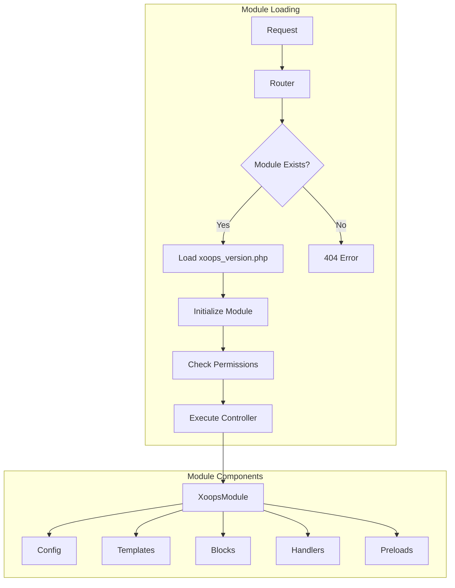
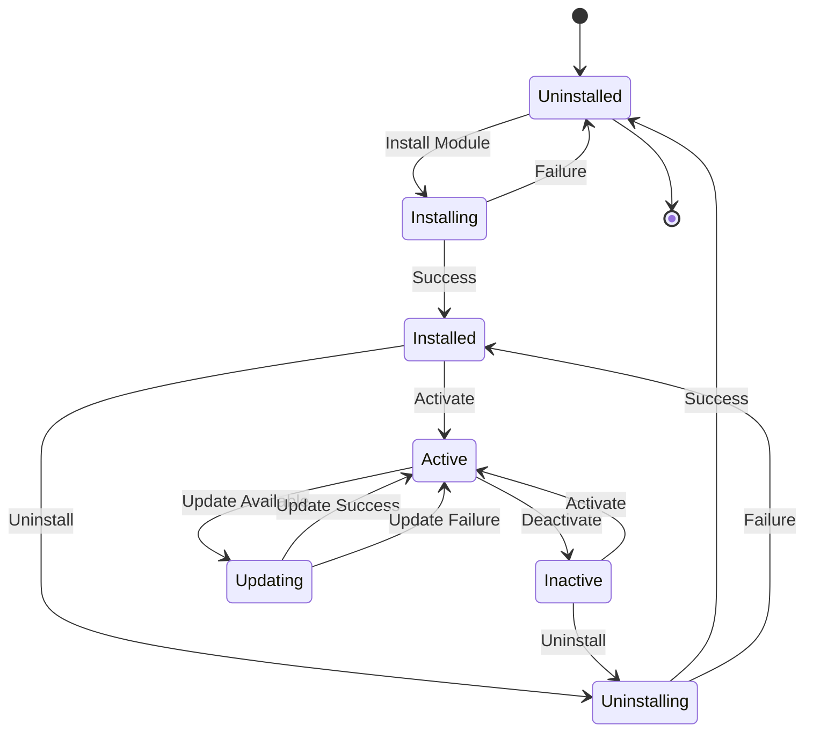

> XOOPS 模組系統的完整 API 文件。

---

## 模組系統架構



---

## XoopsModule 類別

### 類別定義

```php
class XoopsModule extends XoopsObject
{
    // Properties
    public $modinfo;      // Module info array
    public $adminmenu;    // Admin menu items

    // Methods
    public function __construct();
    public function loadInfo(string $dirname, bool $verbose = true): bool;
    public function getInfo(string $name = null): mixed;
    public function setInfo(string $name, mixed $value): bool;
    public function mainLink(): string;
    public function subLink(): string;
    public function loadAdminMenu(): void;
    public function getAdminMenu(): array;
    public function loadConfig(): bool;
    public function getConfig(string $name = null): mixed;
}
```

### 屬性

| 屬性 | 型別 | 描述 |
|----------|------|-------------|
| `mid` | int | 模組 ID |
| `name` | string | 顯示名稱 |
| `version` | string | 版本號 |
| `dirname` | string | 目錄名稱 |
| `isactive` | int | 活動狀態 (0/1) |
| `hasmain` | int | 有主要區域 |
| `hasadmin` | int | 有管理區域 |
| `hassearch` | int | 有搜尋功能 |
| `hasconfig` | int | 有設定 |
| `hascomments` | int | 有評論 |
| `hasnotification` | int | 有通知 |

### 關鍵方法

```php
// Get module instance
$module = $GLOBALS['xoopsModule'];

// Or load by dirname
$moduleHandler = xoops_getHandler('module');
$module = $moduleHandler->getByDirname('mymodule');

// Get module info
$version = $module->getVar('version');
$name = $module->getVar('name');
$dirname = $module->getVar('dirname');

// Get module config
$config = $module->getConfig();
$specificConfig = $module->getConfig('items_per_page');

// Check if module has feature
$hasAdmin = $module->getVar('hasadmin');
$hasSearch = $module->getVar('hassearch');

// Get module path
$modulePath = XOOPS_ROOT_PATH . '/modules/' . $module->getVar('dirname');
$moduleUrl = XOOPS_URL . '/modules/' . $module->getVar('dirname');
```

---

## XoopsModuleHandler

### 類別定義

```php
class XoopsModuleHandler extends XoopsPersistableObjectHandler
{
    public function create(bool $isNew = true): XoopsModule;
    public function get(int $id): ?XoopsModule;
    public function getByDirname(string $dirname): ?XoopsModule;
    public function insert(XoopsObject $module, bool $force = false): bool;
    public function delete(XoopsObject $module, bool $force = false): bool;
    public function getList(?CriteriaElement $criteria = null): array;
    public function getObjects(?CriteriaElement $criteria = null): array;
}
```

### 使用範例

```php
// Get handler
$moduleHandler = xoops_getHandler('module');

// Get all active modules
$criteria = new Criteria('isactive', 1);
$activeModules = $moduleHandler->getObjects($criteria);

// Get module by dirname
$publisherModule = $moduleHandler->getByDirname('publisher');

// Get modules with admin
$criteria = new CriteriaCompo();
$criteria->add(new Criteria('isactive', 1));
$criteria->add(new Criteria('hasadmin', 1));
$adminModules = $moduleHandler->getObjects($criteria);

// Check if module is installed
$module = $moduleHandler->getByDirname('mymodule');
if ($module && $module->getVar('isactive')) {
    // Module is installed and active
}
```

---

## 模組生命週期



---

## xoops_version.php 結構

```php
<?php
// Module metadata
$modversion['name']        = _MI_MYMODULE_NAME;
$modversion['version']     = '1.0.0';
$modversion['description'] = _MI_MYMODULE_DESC;
$modversion['author']      = 'Your Name';
$modversion['credits']     = 'XOOPS Community';
$modversion['license']     = 'GPL 2.0+';
$modversion['license_url'] = 'https://www.gnu.org/licenses/gpl-2.0.html';
$modversion['image']       = 'assets/images/logo.png';
$modversion['dirname']     = basename(__DIR__);

// Requirements
$modversion['min_php']     = '7.4';
$modversion['min_xoops']   = '2.5.10';
```

---

*另請參閱：[XOOPS 原始程式碼](https://github.com/XOOPS)*
