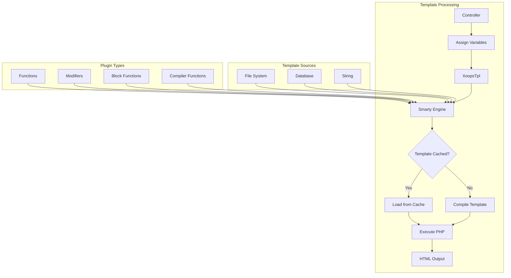

> XOOPS 中 Smarty 範本的完整 API 文件。

---

## 範本引擎架構



---

## XoopsTpl 類別

### 初始化

```php
// Global template object
global $xoopsTpl;

// Or get new instance
$tpl = new XoopsTpl();

// Available in modules
$GLOBALS['xoopsTpl']->assign('myvar', $value);
```

### 核心方法

| 方法 | 參數 | 描述 |
|--------|------------|-------------|
| `assign` | `string $name, mixed $value` | 將變數指派給範本 |
| `assignByRef` | `string $name, mixed &$value` | 按參考指派 |
| `append` | `string $name, mixed $value, bool $merge = false` | 附加到陣列變數 |
| `display` | `string $template` | 呈現和輸出範本 |
| `fetch` | `string $template` | 呈現和傳回範本 |
| `clearAssign` | `string $name` | 清除指派的變數 |
| `clearAllAssign` | - | 清除所有變數 |
| `getTemplateVars` | `string $name = null` | 取得指派的變數 |
| `templateExists` | `string $template` | 檢查範本是否存在 |
| `isCached` | `string $template` | 檢查範本是否已快取 |
| `clearCache` | `string $template = null` | 清除範本快取 |

### 變數指派

```php
// Simple assignment
$xoopsTpl->assign('title', 'My Page Title');
$xoopsTpl->assign('count', 42);
$xoopsTpl->assign('is_admin', true);

// Array assignment
$xoopsTpl->assign('items', [
    ['id' => 1, 'name' => 'Item 1'],
    ['id' => 2, 'name' => 'Item 2'],
]);

// Object assignment
$xoopsTpl->assign('user', $xoopsUser);

// Multiple assignments
$xoopsTpl->assign([
    'title' => 'My Title',
    'content' => 'My Content',
    'author' => 'John Doe'
]);

// Append to array
$xoopsTpl->append('items', ['id' => 3, 'name' => 'Item 3']);
```

### 範本載入

```php
// From database (compiled)
$xoopsTpl->display('db:mymodule_index.tpl');

// From file system
$xoopsTpl->display('file:' . XOOPS_ROOT_PATH . '/modules/mymodule/templates/custom.tpl');

// Fetch without output
$html = $xoopsTpl->fetch('db:mymodule_item.tpl');

// From string
$template = '<h1>{$title}</h1><p>{$content}</p>';
$html = $xoopsTpl->fetch('string:' . $template);
```

---

## Smarty 語法參考

### 變數

```smarty
{* Simple variable *}
<{$title}>

{* Array access *}
<{$item.name}>
<{$item['name']}>

{* Object property *}
<{$user->name}>
<{$user->getVar('uname')}>

{* Config variable *}
<{$xoops_sitename}>

{* Constant *}
<{$smarty.const._MD_MYMODULE_TITLE}>

{* Server variables *}
<{$smarty.server.REQUEST_URI}>
<{$smarty.get.id}>
<{$smarty.post.name}>
```

### 修飾符

```smarty
{* String modifiers *}
<{$title|upper}>
<{$title|lower}>
<{$title|capitalize}>
<{$title|truncate:50:"..."}>
<{$content|strip_tags}>
<{$content|nl2br}>
<{$text|escape:'html'}>
<{$text|escape:'url'}>

{* Date formatting *}
<{$timestamp|date_format:"%Y-%m-%d"}>
<{$timestamp|date_format:"%B %e, %Y"}>

{* Number formatting *}
<{$price|number_format:2:".":","}>

{* Default value *}
<{$optional|default:"N/A"}>

{* Chained modifiers *}
<{$title|strip_tags|truncate:50|escape}>

{* Count array *}
<{$items|@count}>
```

### 控制結構

```smarty
{* If/else *}
<{if $is_admin}>
    <p>Admin content</p>
<{elseif $is_moderator}>
    <p>Moderator content</p>
<{else}>
    <p>User content</p>
<{/if}>

{* Foreach loop *}
<{foreach from=$items item=item key=key}>
    <li><{$key}>: <{$item.name}></li>
<{/foreach}>

{* Foreach with properties *}
<{foreach from=$items item=item name=itemLoop}>
    <{if $smarty.foreach.itemLoop.first}>
        <ul>
    <{/if}>
```

---

*另請參閱：[Smarty 官方文件](https://www.smarty.net)*
