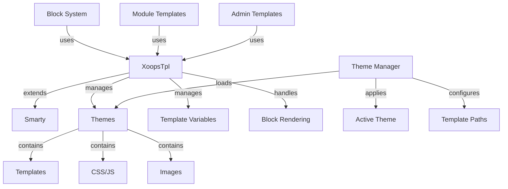

XOOPS 範本系統構建在功能強大的 Smarty 範本引擎之上，提供靈活且可擴充的方式來分離展示邏輯和商業邏輯。它管理主題、範本呈現、變數指派和動態內容產生。

## 範本架構



## XoopsTpl 類別

擴充 Smarty 的主要範本引擎類別。

### 類別概述

```php
namespace Xoops\Core;

class XoopsTpl extends Smarty
{
    protected array $vars = [];
    protected string $currentTheme = '';
    protected array $blocks = [];
    protected bool $isAdmin = false;
}
```

### 擴充 Smarty

```php
use Xoops\Core\XoopsTpl;

class XoopsTpl extends Smarty
{
    private static ?XoopsTpl $instance = null;

    private function __construct()
    {
        parent::__construct();
        $this->configureDirectories();
        $this->registerPlugins();
    }

    public static function getInstance(): XoopsTpl
    {
        if (!isset(self::$instance)) {
            self::$instance = new self();
        }
        return self::$instance;
    }
}
```

### 核心方法

#### getInstance

取得單例範本實例。

```php
public static function getInstance(): XoopsTpl
```

**傳回值：** `XoopsTpl` - 單例實例

**範例：**
```php
$xoopsTpl = XoopsTpl::getInstance();
```

#### assign

將變數指派給範本。

```php
public function assign(
    string|array $tplVar,
    mixed $value = null
): void
```

---

*另請參閱：[XOOPS 範本文件](https://github.com/XOOPS)*
