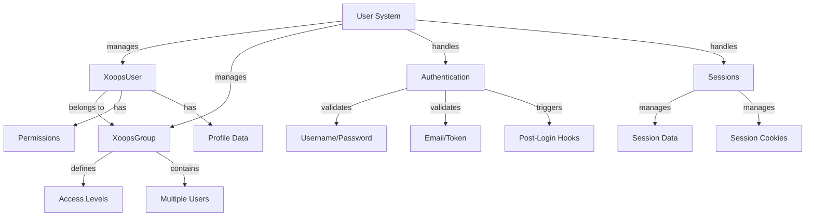

XOOPS 使用者系統管理使用者帳戶、身份驗證、授權、群組成員資格和工作階段管理。它為保護應用程式和控制使用者存取提供了堅實的框架。

## 使用者系統架構



## XoopsUser 類別

代表使用者帳戶的主要使用者物件類別。

### 類別概述

```php
namespace Xoops\Core\User;

class XoopsUser extends XoopsObject
{
    protected int $uid = 0;
    protected string $uname = '';
    protected string $email = '';
    protected string $pass = '';
    protected int $uregdate = 0;
    protected int $ulevel = 0;
    protected array $groups = [];
    protected array $permissions = [];
}
```

### 建構函式

```php
public function __construct(int $uid = null)
```

建立新使用者物件，可選擇按 ID 從資料庫載入。

**參數：**

| 參數 | 型別 | 描述 |
|-----------|------|-------------|
| `$uid` | int | 要載入的使用者 ID（選擇性） |

**範例：**
```php
// Create new user
$user = new XoopsUser();

// Load existing user
$user = new XoopsUser(123);
```

### 核心屬性

| 屬性 | 型別 | 描述 |
|----------|------|-------------|
| `uid` | int | 使用者 ID |
| `uname` | string | 使用者名稱 |
| `email` | string | 電子郵件地址 |
| `pass` | string | 密碼雜湊 |
| `uregdate` | int | 註冊時間戳 |
| `ulevel` | int | 使用者等級 (9=管理員, 1=使用者) |
| `groups` | array | 群組 ID |
| `permissions` | array | 權限旗標 |

### 核心方法

#### getID / getUid

取得使用者的 ID。

```php
public function getID(): int
public function getUid(): int  // Alias
```

---

*另請參閱：[XOOPS 使用者文件](https://github.com/XOOPS)*
