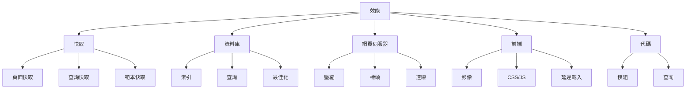

# XOOPS 效能最佳化

最大化 XOOPS 速度和效率的完整指南。

## 效能最佳化概述



## 快取組態

快取是改善效能的最快方式。

### 頁面級快取

在 XOOPS 中啟用完整頁面快取：

**管理面板 > System > Preferences > Cache Settings**

```
啟用快取：是
快取類型：檔案快取（或 APCu/Memcache）
快取壽命：3600 秒（1 小時）
快取模組清單：是
快取組態：是
快取搜尋結果：是
```

### 基於檔案的快取

組態檔案快取位置：

```bash
# 在網路根目錄外建立快取目錄（更安全）
mkdir -p /var/cache/xoops
chown www-data:www-data /var/cache/xoops
chmod 755 /var/cache/xoops

# 編輯 mainfile.php
define('XOOPS_CACHE_PATH', '/var/cache/xoops/');
```

### APCu 快取

APCu 提供記憶體內快取（非常快）：

```bash
# 安裝 APCu
apt-get install php-apcu

# 驗證安裝
php -m | grep apcu

# 在 php.ini 中組態
apc.enabled = 1
apc.memory_size = 128M
apc.ttl = 0
apc.user_ttl = 3600
apc.shm_size = 128
```

在 XOOPS 中啟用：

**管理面板 > System > Preferences > Cache Settings**

```
快取類型：APCu
```

### Memcache/Redis 快取

適用於高流量網站的分散式快取：

**安裝 Memcache：**

```bash
# 安裝 Memcache 伺服器
apt-get install memcached

# 啟動服務
systemctl start memcached
systemctl enable memcached

# 驗證執行中
netstat -tlnp | grep memcached
# 應顯示在連接埠 11211 上偵聽
```

**在 XOOPS 中組態：**

編輯 mainfile.php：

```php
// Memcache 組態
define('XOOPS_CACHE_TYPE', 'memcache');
define('XOOPS_CACHE_HOST', 'localhost');
define('XOOPS_CACHE_PORT', 11211);
define('XOOPS_CACHE_TIMEOUT', 0);
```

或在管理面板中：

```
快取類型：Memcache
Memcache 主機：localhost:11211
```

### 範本快取

編譯並快取 XOOPS 範本：

```bash
# 確保 templates_c 可寫入
chmod 777 /var/www/html/xoops/templates_c/

# 清除舊的快取範本
rm -rf /var/www/html/xoops/templates_c/*
```

在佈景主題中組態：

```html
<!-- 在佈景主題 xoops_version.php 中 -->
{smarty.const.XOOPS_VAR_PATH|constant}
<{$xoops_meta}>

<!-- 範本使用快取 -->
{cache}
    [快取的內容在此]
{/cache}
```

## 資料庫最佳化

### 新增資料庫索引

適當索引的資料庫查詢速度要快得多。

```sql
-- 檢查目前的索引
SHOW INDEXES FROM xoops_users;

-- 常見要新增的索引
ALTER TABLE xoops_users ADD INDEX idx_uname (uname);
ALTER TABLE xoops_users ADD INDEX idx_email (email);
ALTER TABLE xoops_users ADD INDEX idx_uid_active (uid, user_actkey);

-- 將索引新增到貼文/內容表格
ALTER TABLE xoops_posts ADD INDEX idx_post_published (post_published);
ALTER TABLE xoops_posts ADD INDEX idx_post_uid (post_uid);
ALTER TABLE xoops_posts ADD INDEX idx_post_created (post_created);

-- 驗證索引已建立
SHOW INDEXES FROM xoops_users\G
```

### 最佳化表格

定期表格最佳化改善效能：

```sql
-- 最佳化所有表格
OPTIMIZE TABLE xoops_users;
OPTIMIZE TABLE xoops_posts;
OPTIMIZE TABLE xoops_config;
OPTIMIZE TABLE xoops_comments;

-- 或一次全部最佳化
REPAIR TABLE xoops_users;
OPTIMIZE TABLE xoops_users;
REPAIR TABLE xoops_posts;
OPTIMIZE TABLE xoops_posts;
```

建立自動化最佳化指令碼：

```bash
#!/bin/bash
# 資料庫最佳化指令碼

echo "最佳化 XOOPS 資料庫..."

mysql -u xoops_user -p xoops_db << EOF
-- 最佳化所有表格
OPTIMIZE TABLE xoops_users;
OPTIMIZE TABLE xoops_posts;
OPTIMIZE TABLE xoops_config;
OPTIMIZE TABLE xoops_comments;
OPTIMIZE TABLE xoops_users_online;

-- 顯示資料庫大小
SELECT table_schema,
       ROUND(SUM(data_length + index_length) / 1024 / 1024, 2) as total_mb
FROM information_schema.tables
WHERE table_schema = 'xoops_db'
GROUP BY table_schema;
EOF

echo "資料庫最佳化已完成！"
```

使用 cron 進行排程：

```bash
# 每週最佳化
crontab -e
# 新增：0 3 * * 0 /usr/local/bin/optimize-xoops-db.sh
```

### 查詢最佳化

檢視慢查詢：

```sql
-- 啟用慢查詢日誌
SET GLOBAL slow_query_log = 'ON';
SET GLOBAL long_query_time = 2;

-- 檢視慢查詢
SELECT * FROM mysql.slow_log;

-- 或檢查慢日誌檔案
tail -100 /var/log/mysql/slow.log
```

常見最佳化技巧：

```php
// 緩慢 - 避免在迴圈中進行不必要的查詢
foreach ($users as $user) {
    $profile = getUserProfile($user['uid']);  // 迴圈中的查詢！
    echo $profile['name'];
}

// 快速 - 一次取得所有資料
$profiles = getAllUserProfiles($user_ids);
foreach ($users as $user) {
    echo $profiles[$user['uid']]['name'];
}
```

### 增加緩衝池

為更好的快取設定 MySQL：

編輯 `/etc/mysql/mysql.conf.d/mysqld.cnf`：

```ini
# InnoDB 緩衝池（系統 RAM 的 50-80%）
innodb_buffer_pool_size = 1G

# 查詢快取（選用，在 MySQL 5.7+ 中可禁用）
query_cache_size = 64M
query_cache_type = 1

# 最大連線數
max_connections = 500

# 最大允許的封包
max_allowed_packet = 256M

# 連線逾時
connect_timeout = 10
```

重新啟動 MySQL：

```bash
systemctl restart mysql
```

## 網頁伺服器最佳化

### 啟用 Gzip 壓縮

壓縮回應以減少頻寬：

**Apache 組態：**

```apache
<IfModule mod_deflate.c>
    AddOutputFilterByType DEFLATE text/html text/plain text/xml text/css text/javascript application/javascript application/json

    # 不要壓縮影像和已壓縮的檔案
    SetEnvIfNoCase Request_URI \.(jpg|jpeg|png|gif|zip|gzip)$ no-gzip dont-vary

    # 記錄壓縮的回應
    DeflateBufferSize 8096
</IfModule>
```

**Nginx 組態：**

```nginx
gzip on;
gzip_types text/html text/plain text/css text/javascript application/javascript application/json;
gzip_min_length 1000;
gzip_vary on;
gzip_comp_level 6;

# 不要壓縮已壓縮的格式
gzip_disable "msie6";
```

驗證壓縮：

```bash
# 檢查回應是否已壓縮
curl -I -H "Accept-Encoding: gzip" http://your-domain.com/xoops/

# 應顯示：
# Content-Encoding: gzip
```

### 瀏覽器快取標頭

為靜態資產設定快取過期：

**Apache：**

```apache
<IfModule mod_expires.c>
    ExpiresActive On

    # 快取影像 30 天
    ExpiresByType image/jpeg "access plus 30 days"
    ExpiresByType image/gif "access plus 30 days"
    ExpiresByType image/png "access plus 30 days"
    ExpiresByType image/svg+xml "access plus 30 days"

    # 快取 CSS/JS 30 天
    ExpiresByType text/css "access plus 30 days"
    ExpiresByType application/javascript "access plus 30 days"
    ExpiresByType text/javascript "access plus 30 days"

    # 快取字型 1 年
    ExpiresByType font/eot "access plus 1 year"
    ExpiresByType font/ttf "access plus 1 year"
    ExpiresByType font/woff "access plus 1 year"
    ExpiresByType font/woff2 "access plus 1 year"

    # 不要快取 HTML
    ExpiresByType text/html "access plus 1 hour"
</IfModule>
```

**Nginx：**

```nginx
location ~* \.(jpg|jpeg|png|gif|ico|svg|woff|woff2|ttf|eot)$ {
    expires 30d;
    add_header Cache-Control "public, immutable";
}

location ~* \.(css|js)$ {
    expires 30d;
    add_header Cache-Control "public";
}

location ~ \.html$ {
    expires 1h;
    add_header Cache-Control "public";
}
```

### 連線保活

啟用持續的 HTTP 連線：

**Apache：**

```apache
<IfModule mod_http.c>
    KeepAlive On
    KeepAliveTimeout 15
    MaxKeepAliveRequests 100
</IfModule>
```

**Nginx：**

```nginx
keepalive_timeout 15s;
keepalive_requests 100;
```

## 前端最佳化

### 最佳化影像

減少影像檔案大小：

```bash
# 批次壓縮 JPEG 影像
for img in *.jpg; do
    convert "$img" -quality 85 "optimized_$img"
done

# 批次壓縮 PNG 影像
for img in *.png; do
    optipng -o2 "$img"
done

# 或使用 imagemin CLI
npm install -g imagemin-cli
imagemin images/ --out-dir=images-optimized
```

### 縮小 CSS 和 JavaScript

減少 CSS/JS 檔案大小：

**使用 Node.js 工具：**

```bash
# 安裝縮小工具
npm install -g uglify-js clean-css-cli

# 縮小 JavaScript
uglifyjs script.js -o script.min.js

# 縮小 CSS
cleancss style.css -o style.min.css
```

**使用線上工具：**
- CSS 縮小工具：https://cssminifier.com/
- JavaScript 縮小工具：https://www.minifycode.com/javascript-minifier/

### 延遲載入影像

僅在需要時載入影像：

```html
<!-- 新增 loading="lazy" 屬性 -->


<!-- 或對較舊的瀏覽器使用 JavaScript 庫 -->


<script src="https://cdnjs.cloudflare.com/ajax/libs/vanilla-lazyload/17.1.2/lazyload.min.js"></script>
<script>
    var lazyLoad = new LazyLoad({
        elements_selector: ".lazy"
    });
</script>
```

### 減少呈現阻礙資源

策略性地載入 CSS/JS：

```html
<!-- 內嵌關鍵 CSS -->
<style>
    /* 折疊上方的關鍵樣式 */
</style>

<!-- 延遲非關鍵 CSS -->
<link rel="stylesheet" href="style.css" media="print" onload="this.media='all'">

<!-- 延遲 JavaScript -->
<script src="script.js" defer></script>

<!-- 或為非關鍵指令碼使用 async -->
<script src="analytics.js" async></script>
```

## CDN 整合

使用內容傳遞網路來加快全球存取速度。

### 受歡迎的 CDN

| CDN | 成本 | 功能 |
|---|---|---|
| Cloudflare | 免費/付費 | DDoS、DNS、快取、分析 |
| AWS CloudFront | 付費 | 高效能、全球 |
| Bunny CDN | 經濟實惠 | 儲存、影片、快取 |
| jsDelivr | 免費 | JavaScript 庫 |
| cdnjs | 免費 | 受歡迎的庫 |

### Cloudflare 設定

1. 在 https://www.cloudflare.com/ 註冊
2. 新增您的網域
3. 用 Cloudflare 的名稱伺服器更新
4. 啟用快取選項：
   - 快取級別：積極
   - 快取所有內容：開啟
   - 瀏覽器快取 TTL：1 個月

5. 在 XOOPS 中，更新您的網域以使用 Cloudflare DNS

### 在 XOOPS 中組態 CDN

更新影像 URL 為 CDN：

編輯佈景主題範本：

```html
<!-- 原始 -->


<!-- 使用 CDN -->

```

或在 PHP 中設定：

```php
// 在 mainfile.php 或組態中
define('XOOPS_CDN_URL', 'https://cdn.your-domain.com');

// 在範本中

```

## 效能監視

### PageSpeed Insights 測試

測試您的網站效能：

1. 瀏覽 Google PageSpeed Insights：https://pagespeed.web.dev/
2. 輸入您的 XOOPS URL
3. 檢視建議
4. 實施建議的改進

### 伺服器效能監視

監視即時伺服器指標：

```bash
# 安裝監視工具
apt-get install htop iotop nethogs

# 監視 CPU 和記憶體
htop

# 監視磁碟 I/O
iotop

# 監視網路
nethogs
```

### PHP 效能分析

識別緩慢的 PHP 代碼：

```php
<?php
// 使用 Xdebug 進行分析
xdebug_start_trace('profile');

// 您的代碼在此
$result = someExpensiveFunction();

xdebug_stop_trace();
?>
```

### MySQL 查詢監視

追蹤慢查詢：

```bash
# 啟用查詢日誌
mysql -u root -p

SET GLOBAL general_log = 'ON';
SET GLOBAL log_output = 'FILE';
SET GLOBAL general_log_file = '/var/log/mysql/query.log';

# 檢視慢查詢
tail -f /var/log/mysql/slow.log

# 使用 EXPLAIN 分析查詢
EXPLAIN SELECT * FROM xoops_users WHERE uid = 1\G
```

## 效能最佳化檢查清單

實施這些以獲得最佳效能：

- [ ] **快取：** 啟用檔案/APCu/Memcache 快取
- [ ] **資料庫：** 新增索引、最佳化表格
- [ ] **壓縮：** 啟用 Gzip 壓縮
- [ ] **瀏覽器快取：** 設定快取標頭
- [ ] **影像：** 最佳化和壓縮
- [ ] **CSS/JS：** 縮小檔案
- [ ] **延遲載入：** 為影像實施
- [ ] **CDN：** 用於靜態資產
- [ ] **保活：** 啟用持續連線
- [ ] **模組：** 停用未使用的模組
- [ ] **佈景主題：** 使用輕量級的最佳化佈景主題
- [ ] **監視：** 追蹤效能指標
- [ ] **定期維護：** 清除快取、最佳化 DB

## 效能最佳化指令碼

自動化最佳化：

```bash
#!/bin/bash
# 效能最佳化指令碼

echo "=== XOOPS 效能最佳化 ==="

# 清除快取
echo "清除快取..."
rm -rf /var/www/html/xoops/cache/*
rm -rf /var/www/html/xoops/templates_c/*

# 最佳化資料庫
echo "最佳化資料庫..."
mysql -u xoops_user -p xoops_db << EOF
OPTIMIZE TABLE xoops_users;
OPTIMIZE TABLE xoops_posts;
OPTIMIZE TABLE xoops_config;
OPTIMIZE TABLE xoops_comments;
EOF

# 檢查檔案權限
echo "驗證檔案權限..."
find /var/www/html/xoops -type f -exec chmod 644 {} \;
find /var/www/html/xoops -type d -exec chmod 755 {} \;
chmod 777 /var/www/html/xoops/cache
chmod 777 /var/www/html/xoops/templates_c
chmod 777 /var/www/html/xoops/uploads
chmod 777 /var/www/html/xoops/var

# 產生效能報告
echo "效能最佳化已完成！"
echo ""
echo "後續步驟："
echo "1. 在 https://pagespeed.web.dev/ 測試網站"
echo "2. 在管理面板中監視效能"
echo "3. 考慮為靜態資產使用 CDN"
echo "4. 在 MySQL 中檢視慢查詢"
```

## 優化前後指標

追蹤改進：

```
最佳化前：
- 頁面載入時間：3.5 秒
- 資料庫查詢：45
- 快取命中率：0%
- 資料庫大小：250MB

最佳化後：
- 頁面載入時間：0.8 秒（快 77%）
- 資料庫查詢：8（已快取）
- 快取命中率：85%
- 資料庫大小：120MB（已最佳化）
```

## 後續步驟

1. 檢視基本組態
2. 確保安全措施
3. 實施快取
4. 使用工具監視效能
5. 根據指標進行調整

---

**標籤：** #performance #optimization #caching #database #cdn

**相關文章：**
- ../../06-Publisher-Module/User-Guide/Basic-Configuration
- System-Settings
- Security-Configuration
- ../Installation/Server-Requirements
